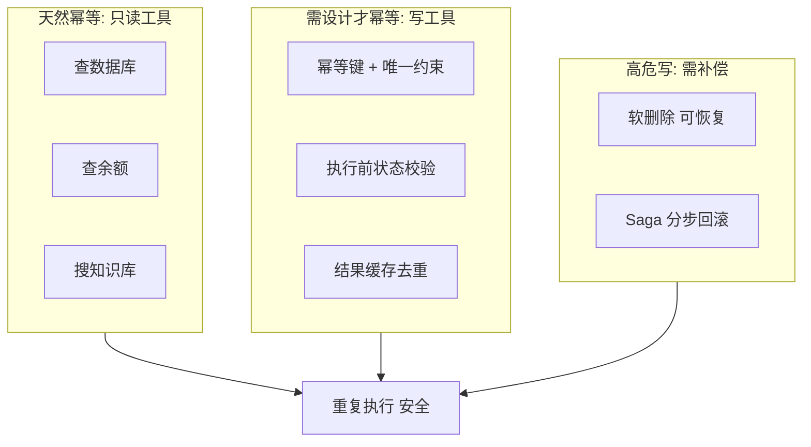

# 工具幂等性与副作用控制：防止重复执行的工程手段


> **一句话**：幂等性=电梯按钮原则——同一操作执行N次结果相同；用幂等键+数据库唯一约束+结果缓存防止Agent重试造成重复副作用，键由应用层生成而非LLM。

## 一、原理速览

**幂等性（Idempotency）**：一个操作 f 满足 `f(f(x)) = f(x)`，做了再做一次结果和只做一次一样。读操作天然幂等，写操作要**设计**才幂等。

### Agent 重复执行四大来源

1. **网络超时**：工具执行成功了但回复丢失，重试触发再执行一次
2. **框架默认重试**：LangGraph 默认 3 次指数退避重试
3. **ReAct 重新走**：模型推理绕回同一步，同一写工具被再调一次
4. **人工重放**：HITL 审批时将 Agent 从早先状态重启

### 四种工程手段

| 手段 | 类比 | 适用场景 |
|------|------|---------|
| **幂等键 + 数据库唯一约束** | 办事取号 + 系统查重 | 写操作/新建记录（最硬核） |
| **结果缓存** | 同一问题答案直接递回 | 只读工具 |
| **执行前状态校验** | 办手续前先查"办过没" | 更新已有记录（靠版本号/状态字段） |
| **软删除 + Saga 补偿** | 打删除标记不真删 | 高危跨系统多步操作 |



**关键原则**：唯一约束必须在**数据库层**，不能只靠应用层 if 判断——并发重试下两线程可能同时通过"存在吗"检查。幂等键由**应用层**在拼 prompt 前生成并贯穿重试，绝不能由 LLM 生成（LLM 每次重试可能编出不同 ID）。

**副作用控制三件套**：⑦识别副作用 → ⑱分级+审计 → ⑲幂等防重复。

## 二、代码实现

```python
# 四种工程手段：幂等键+唯一约束 / 结果缓存 / 执行前状态校验 / 软删除

import hashlib
import json
import time
import functools
from typing import Callable, Any


# ============================================================

def generate_operation_id(
    session_id: str,
    tool_name: str,
    params: dict,
) -> str:
    """生成稳定的幂等键（Operation ID）

    Scope = session_id + 工具名 + 参数指纹
    相同输入 → 相同 ID，不同输入 → 不同 ID
    """
    params_fingerprint = json.dumps(params, sort_keys=True, ensure_ascii=False)
    raw = f"{session_id}:{tool_name}:{params_fingerprint}"
    return hashlib.sha256(raw.encode()).hexdigest()


# ============================================================

class IdempotencyStore:
    """幂等去重存储 —— 模拟数据库唯一约束"""

    def __init__(self):
        self._store: dict[str, dict] = {}
        self._processed_keys: set[str] = set()

    def try_insert(self, operation_id: str, result: dict) -> bool:
        if operation_id in self._processed_keys:
            return False
        self._processed_keys.add(operation_id)
        self._store[operation_id] = {
            "result": result,
            "executed_at": time.time(),
            "status": "completed",
        }
        return True

    def get_result(self, operation_id: str) -> dict | None:
        entry = self._store.get(operation_id)
        if entry and entry["status"] == "completed":
            return entry["result"]
        return None

    def is_duplicate(self, operation_id: str) -> bool:
        return operation_id in self._processed_keys


# ============================================================

def idempotent_tool(
    store: IdempotencyStore,
    tool_name: str,
    session_id: str,
) -> Callable:
    def decorator(fn: Callable) -> Callable:
        @functools.wraps(fn)
        def wrapper(*args, **kwargs) -> dict:
            params = {"args": args, "kwargs": kwargs}
            op_id = generate_operation_id(session_id, tool_name, params)

            if store.is_duplicate(op_id):
                cached = store.get_result(op_id)
                print(f"[幂等命中] 操作 {op_id[:12]}... 已执行过，返回缓存")
                return {
                    "status": "idempotent_hit",
                    "operation_id": op_id,
                    "cached_result": cached,
                }

            print(f"[首次执行] 操作 {op_id[:12]}... 执行中")
            result = fn(*args, **kwargs)
            store.try_insert(op_id, result)

            return {
                "status": "executed",
                "operation_id": op_id,
                "result": result,
            }

        return wrapper

    return decorator


# ============================================================

class ResultCache:
    """只读工具的结果缓存 —— 会话内去重"""

    def __init__(self, ttl_seconds: float = 300.0):
        self._cache: dict[str, tuple[float, Any]] = {}
        self.ttl = ttl_seconds

    def _make_key(self, tool_name: str, params: dict) -> str:
        params_str = json.dumps(params, sort_keys=True, ensure_ascii=False)
        return hashlib.md5(f"{tool_name}:{params_str}".encode()).hexdigest()

    def get(self, tool_name: str, params: dict) -> Any | None:
        key = self._make_key(tool_name, params)
        if key in self._cache:
            cached_at, value = self._cache[key]
            if time.time() - cached_at < self.ttl:
                print(f"[缓存命中] {tool_name} (已缓存 {time.time()-cached_at:.0f}s)")
                return value
            del self._cache[key]
        return None

    def set(self, tool_name: str, params: dict, result: Any) -> None:
        key = self._make_key(tool_name, params)
        self._cache[key] = (time.time(), result)


# ============================================================

class StateValidator:
    """执行前状态校验 —— Check-before-act"""

    def __init__(self):
        self._order_states: dict[str, dict] = {
            "A1001": {"status": "paid", "version": 3, "amount": 299},
            "A1002": {"status": "shipped", "version": 5, "amount": 150},
            "A1003": {"status": "refunded", "version": 2, "amount": 89},
        }

    def validate_before_action(
        self, order_id: str, expected_status: str, expected_version: int
    ) -> tuple[bool, str]:
        current = self._order_states.get(order_id)
        if current is None:
            return False, f"订单 {order_id} 不存在"
        if current["status"] != expected_status:
            return False, (
                f"订单 {order_id} 当前状态为 '{current['status']}'，"
                f"不允许对 '{expected_status}' 状态的预期操作"
            )
        if current["version"] != expected_version:
            return False, (
                f"订单 {order_id} 版本不匹配：期望 v{expected_version}，"
                f"实际 v{current['version']}（可能已被其他请求修改）"
            )
        return True, "校验通过"


# ============================================================

class SoftDeleteStore:
    """软删除实现 —— 删除不真删，打"已删"标记"""

    def __init__(self):
        self._records: dict[str, dict] = {
            "doc_001": {"title": "Q3 财报", "content": "机密数据...", "deleted": False},
            "doc_002": {"title": "员工手册", "content": "规章制度...", "deleted": False},
        }

    def soft_delete(self, record_id: str) -> dict:
        if record_id not in self._records:
            return {"status": "error", "message": f"记录 {record_id} 不存在"}
        if self._records[record_id].get("deleted"):
            return {"status": "idempotent_hit", "message": f"记录 {record_id} 已被删除"}

        self._records[record_id]["deleted"] = True
        self._records[record_id]["deleted_at"] = time.strftime("%Y-%m-%dT%H:%M:%S")
        return {"status": "deleted", "record_id": record_id}

    def restore(self, record_id: str) -> dict:
        if record_id not in self._records:
            return {"status": "error", "message": f"记录 {record_id} 不存在"}
        record = self._records[record_id]
        if not record.get("deleted"):
            return {"status": "error", "message": f"记录 {record_id} 未被删除"}
        record["deleted"] = False
        record.pop("deleted_at", None)
        record["restored_at"] = time.strftime("%Y-%m-%dT%H:%M:%S")
        return {"status": "restored", "record_id": record_id}


# ============================================================

if __name__ == "__main__":
    idempotency_store = IdempotencyStore()
    result_cache = ResultCache(ttl_seconds=60)
    state_validator = StateValidator()
    soft_delete_store = SoftDeleteStore()

    # 演示 1：幂等键 + 去重
    print("=" * 50)
    print("1. 幂等键 + 去重演示")
    session = "sess_abc123"

    @idempotent_tool(idempotency_store, "refund", session)
    def process_refund(order_id: str, amount: float) -> dict:
        return {"order_id": order_id, "amount": amount, "refund_id": "RF_001"}

    r1 = process_refund("A1001", 299.0)
    print(f"  第1次: {r1['status']}, op_id={r1['operation_id'][:12]}...")
    r2 = process_refund("A1001", 299.0)
    print(f"  第2次: {r2['status']} (幂等去重)")

    # 演示 2：结果缓存
    print("\n2. 结果缓存演示（只读工具去重）")
    def search_knowledge(query: str) -> list[str]:
        print(f"    [实际调用] 搜索: {query}")
        return ["结果1: Transformer 论文", "结果2: Attention 机制"]

    params = {"query": "什么是 Transformer"}
    cached = result_cache.get("search_kb", params)
    if cached is None:
        result = search_knowledge(**params)
        result_cache.set("search_kb", params, result)
        print(f"  首次查询: {result}")
    cached2 = result_cache.get("search_kb", params)
    if cached2 is not None:
        print(f"  缓存命中: {cached2} (未实际调用)")

    # 演示 3：执行前状态校验
    print("\n3. 执行前状态校验演示")
    allowed, reason = state_validator.validate_before_action(
        "A1003", expected_status="paid", expected_version=1
    )
    print(f"  A1003 退款校验: {'通过' if allowed else '拒绝'} → {reason}")
    allowed, reason = state_validator.validate_before_action(
        "A1001", expected_status="paid", expected_version=3
    )
    print(f"  A1001 退款校验: {'通过' if allowed else '拒绝'} → {reason}")

    # 演示 4：软删除 + 恢复
    print("\n4. 软删除 + 恢复演示")
    sd_result = soft_delete_store.soft_delete("doc_001")
    print(f"  删除 doc_001: {sd_result['status']}")
    sd_dup = soft_delete_store.soft_delete("doc_001")
    print(f"  再次删除 doc_001: {sd_dup['status']} ({sd_dup['message']})")
    restore_result = soft_delete_store.restore("doc_001")
    print(f"  恢复 doc_001: {restore_result['status']}")
```


## 速记卡（面试闪卡）

**Q1：一句话讲清「工具幂等性与副作用控制：防止重复执行的工程手段」到底是什么？**
A：幂等性=电梯按钮原则：同一操作执行多次结果不变；用幂等键+唯一约束+结果缓存，挡住 Agent 重试造成的重复副作用。

**Q2：幂等性到底是什么？ —— 怎么理解？**
A：像取号机：同一个业务取同一个号，系统查到号已办过就直接递回旧结果，不会重复办。英文全称 Idempotency（幂等性），满足 f(f(x))=f(x)，读操作天生幂等、写操作要设计。

**Q3：为什么唯一约束要在数据库层？ —— 怎么理解？**
A：像银行柜台双人复核不能只靠自己心想"办过没"——两个柜员同时来查都可能觉得自己没办过。唯一约束落库，并发重试下谁也绕不过。英文全称 Unique Constraint（唯一约束）。

**Q4：幂等键为什么不能让 LLM 生成？ —— 怎么理解？**
A：LLM 每次重试像喝了忘忧水，可能编出不同 ID，同一操作变成不同号就失去去重意义。所以键要在拼 prompt 前由应用层用 session+工具名+参数指纹生成。英文全称 Operation ID（操作标识）。

**Q5：副作用控制还有哪几招？ —— 怎么理解？**
A：只读工具用结果缓存直接递回；更新已有记录靠执行前状态校验（版本号/状态字段）；高危跨系统操作用软删除+ Saga 补偿可回滚。英文全称 Saga Pattern（萨迦补偿事务模式）。

**Q6：核心速记主线有哪些？**
- 四大来源：超时重试、框架默认重试、ReAct 绕回、人工重放
- 硬核手段：幂等键 + 数据库唯一约束（写操作）
- 只读手段：结果缓存去重
- 高危手段：软删除 + Saga 补偿可恢复

**口诀**
A：幂等就像取号机，
同号只办一回；
唯一约束落库里，
键由你来 LLM 别理。

## 相关链接


---
→ [[技术学习路线图#Agent 架构（核心）]]
