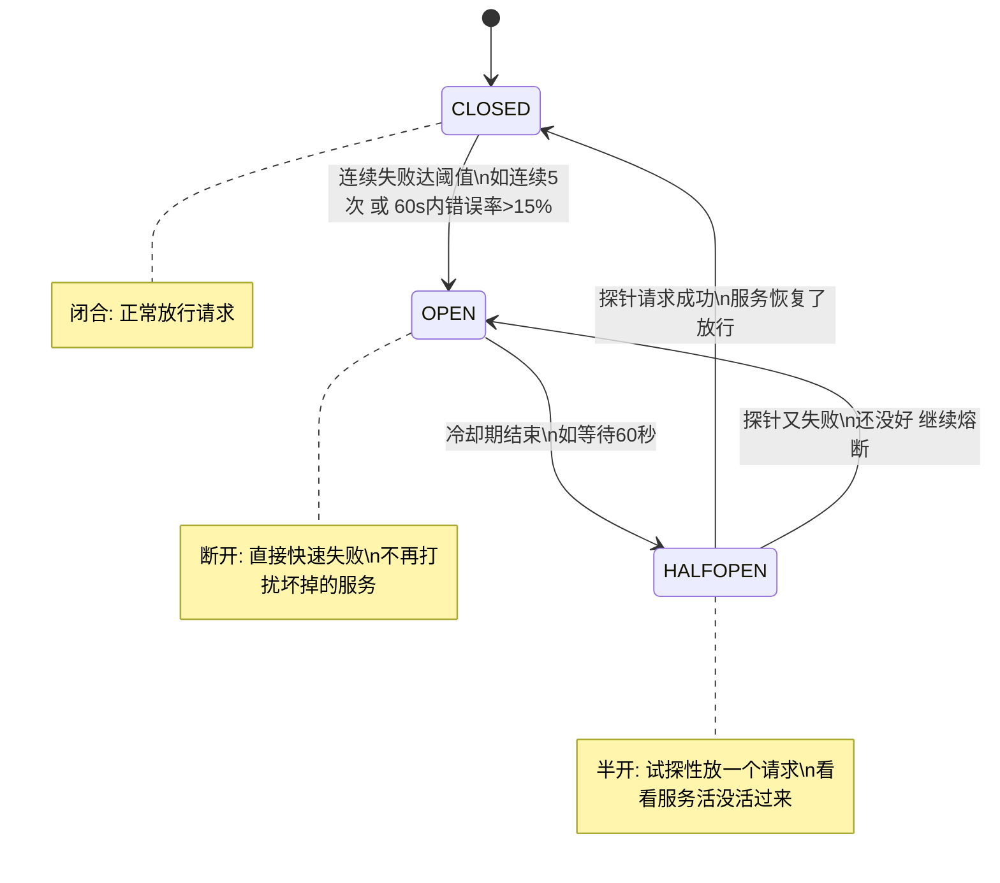

# 熔断模式（Circuit Breaker）：连续失败快速拒绝 + 半开重试

> **一句话**：熔断器是 Agent 韧性的第二道防线——当检测到服务持续故障时立即「跳闸」快速失败，避免雪崩，冷却后试探性恢复。

---

## 一、为什么光有重试不够？

重试治的是「偶发瞬态故障」——网络偶尔抖一下、API 偶尔限流，等一两秒重试就好了。

但如果对方服务是**真宕机了**（持续故障），还一遍遍重试只会：

1. **让用户干等** —— 每次重试等 1s→2s→4s，用户眼睁睁看着转圈
2. **雪上加霜** —— 把已经半死的服务彻底压垮
3. **自 DDoS** —— 多 Agent 并行时几十个实例同时重试 = 自己打自己

> [!tip] **一句话区分重试和熔断：**
> 重试治「抖动」，熔断治「宕机」。重试是「我再试试」，熔断是「别试了，它死了」。

---

## 二、熔断器原理：三态状态机

熔断器名字来自家里的「保险丝/空气开关」：电流过大自动断电，保护整条线路。

它是一个经典的**三态状态机**（源自 Martin Fowler）：



### 三种状态大白话解释

| 状态 | 含义 | 行为 |
|:----|:----|:-----|
| **CLOSED（闭合）** | 正常状态 | 请求照常放行，计数器记录失败次数 |
| **OPEN（断开）** | 熔断跳闸 | 所有请求立即返回失败（Fail-Fast），不再等待 |
| **HALF-OPEN（半开）** | 试探恢复 | 冷却后放一个探针请求，成功→CLOSED，失败→继续 OPEN |

### 关键参数

```python
CIRCUIT_BREAKER_CONFIG = {
    "failure_threshold": 5,       # 连续失败 N 次 → OPEN
    "error_rate_threshold": 0.15, # 或 60s 内错误率 >15% → OPEN
    "cooldown_seconds": 60,       # OPEN 持续 N 秒 → HALF-OPEN
    "half_open_max_requests": 1,  # HALF-OPEN 状态下最多放 1 个探针
}
```

---

## 三、Agent 专属进阶：分层多熔断器

传统熔断器是「一个服务一个」。但 Agent 同时调一堆东西——搜索工具、向量库、多个大模型、代码沙箱……每个的「正常故障率」天差地别：

| 组件 | 正常故障率 | 熔断阈值怎么设 |
|:----|:----------|:-------------|
| 开放网页搜索 | 5-8% | 宽松（如 15%） |
| 向量库检索 | 0.1% | 严格（如 1%） |
| LLM API 调用 | 1-3% | 中等（如 5%） |
| 代码沙箱执行 | 0.5% | 严格（如 2%） |

> [!note] **2026 最佳实践：分层多熔断器（per-tool / per-provider）**
> 给每个工具、每个模型供应商单独装一个熔断器，各自按自己的基线设阈值。
> 一个搜索工具挂了，不该连累整个 Agent。
>
> 来源：appscale.blog《Agent-Level Circuit Breakers》, 2026

---

## 四、代码实现：用 aiobreaker 实现熔断

```python
import aiobreaker
from aiobreaker import CircuitBreaker, CircuitBreakerError

# 配置熔断器
llm_breaker = CircuitBreaker(
    fail_max=5,                  # 连续 5 次失败 → OPEN
    timeout_duration=60,         # 冷却 60 秒
    reset_timeout=30,            # HALF-OPEN 状态持续 30 秒
    exclude=[ValueError],        # ValueError 不计入失败（业务错误不熔断）
)

# 用熔断器包裹 LLM 调用
async def call_llm_with_breaker(prompt: str) -> str:
    try:
        result = await llm_breaker.call_async(
            call_llm_api, prompt  # 实际调用 LLM
        )
        return result
    except CircuitBreakerError:
        # 熔断中：快速失败，走降级
        return fallback_response("LLM 服务暂时不可用，请稍后重试")
    except Exception as e:
        # 其他异常
        raise

# 另一种方式：用装饰器
@aiobreaker.breaker(fail_max=3, timeout_duration=30)
async def call_llm_api(prompt: str) -> str:
    # 实际调用 LLM
    ...
```

### 关键设计决策

```python
# ❌ 不要这样：把所有异常都计入熔断
cb = CircuitBreaker(fail_max=5)  # 默认捕获所有异常

# ✅ 要这样：排除业务异常
cb = CircuitBreaker(
    fail_max=5,
    exclude=[ValueError, TypeError],  # 这些是 LLM 能自己纠正的
)
```

> [!tip] **什么异常不计入熔断？**
> 只把「系统错误」（网络超时、500、连接拒绝）计为熔断失败。
> 「业务错误」（参数不合法、查无结果）不计入——这些是 LLM 能自己纠正的。


## 速记卡（面试闪卡）
**Q1：一句话讲清「熔断模式（Circuit Breaker）：连续失败快速拒绝 + 半开重试」到底是什么？**
A：熔断器是 Agent 韧性的第二道防线——检测到服务持续故障时立即「跳闸」快速失败，避免雪崩，冷却后再试探性恢复。

**Q2：一、为什么光有重试不够？——怎么理解？**
A：一句话区分：重试治「抖动」，熔断治「宕机」。重试治的是偶发瞬态故障（网络偶尔抖、API 偶尔限流，等一两秒就好）；但如果对方是真宕机（持续故障），还一遍遍重试只会：让用户干等（每次 1s→2s→4s 看着转圈）、雪上加霜（把半死的服务彻底压垮）、自 DDoS（多 Agent 并行几十个实例同时重试 = 自己打自己）。

**Q3：二、熔断器原理：三态状态机——怎么理解？**
A：名字来自家里的保险丝/空气开关——电流过大自动断电保护整条线路。它是经典三态状态机（源自 Martin Fowler）：CLOSED（闭合，正常放行、计数器记失败）、OPEN（断开，所有请求立即失败 Fail-Fast 不再等）、HALF-OPEN（半开，冷却后放一个探针请求，成功→CLOSED、失败→继续 OPEN）。关键参数：连续失败 5 次或 60s 内错误率 >15% → OPEN；OPEN 持续 60s → HALF-OPEN；半开最多放 1 个探针。

**Q4：三、Agent 专属进阶：分层多熔断器——怎么理解？**
A：传统熔断器「一个服务一个」，但 Agent 同时调搜索、向量库、多个大模型、代码沙箱，各自正常故障率天差地别。2026 最佳实践（appscale.blog）是分层多熔断器（per-tool / per-provider）：给每个工具、每个供应商单独装一个，各自按基线设阈值——搜索宽松（15%）、向量库严格（1%）、LLM 中等（5%）、代码沙箱严格（2%）。一个搜索挂了，不该连累整个 Agent。

**Q5：四、代码实现：用 aiobreaker——怎么理解？**
A：aiobreaker 的 CircuitBreaker 配 fail_max（连续失败次数）、timeout_duration（冷却秒）、reset_timeout（半开持续）。关键设计：只把「系统错误」（网络超时、500、连接拒绝）计入熔断失败，「业务错误」（参数不合法、查无结果，LLM 能自己纠正的）用 exclude=[ValueError, TypeError] 排除——否则正常业务异常也会误熔断。熔断中捕获 CircuitBreakerError 走降级（fallback）而不是硬崩。

**Q6：核心速记主线有哪些？**
A：一、为什么光重试不够（重试治抖动、熔断治宕机）、二、三态状态机（CLOSED/OPEN/HALF-OPEN + 关键参数）、三、分层多熔断器（per-tool/per-provider 各自基线）、四、代码实现（aiobreaker + 排除业务异常）。

**口诀**
A：重试治抖动，熔断治宕机；
三态状态机，开断半开替；
分层装熔断，各设各基线；
业务错别计，系统错才断。

## 相关链接

- 目录：[[00-AI]]
- 上一篇：[[28-降级路径（Degradation）：某环节失败→回退到次优但可用方案]]
- 下一篇：[[30-Fallback兜底值设计]]
- 系列：[[27-指数退避重试：ExponentialBackoff+Jitter]]

---
→ [[技术学习路线图#Agent 韧性工程]]
