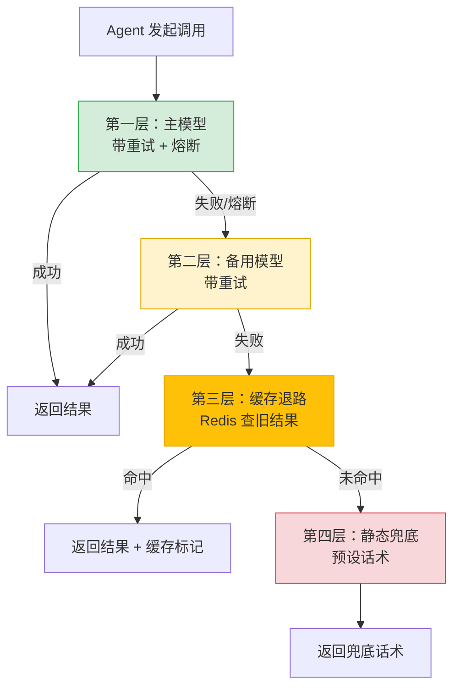

---

title: "Fallback 兜底值设计：NON_RETRYABLE 异常分类 + 默认返回值"

tags:

  - 技术学习

  - ai

  - agent

  - 韧性工程

created: "2026-07-21"

---

# Fallback 兜底值设计：NON_RETRYABLE 异常分类 + 默认返回值

> **一句话**：Fallback（备援/退路）是 Agent 韧性的第三道防线——主力方案不行时自动切到备用方案，确保比赛不中断。

---

## 一、什么是 Fallback？

**Fallback**（读「否-拔克」，直译「回退、退路」）= 主力方案不行时，**自动切到备用方案**。就像主力前锋受伤，教练立刻换替补上场，比赛不中断。

对比前三道防线的关系：

| 防线 | 机制 | 治什么 | 一句话 |

|:----|:----|:------|:------|

| 第一层 | 重试 Retry | 偶发瞬态故障 | 挂了再拨，但要退避+抖动 |

| 第二层 | 熔断 Circuit Breaker | 持续性故障 | 跳闸快速失败，别硬刚死马 |

| **第三层** | **Fallback 备援** | **供应商级故障** | **换替补上场，比赛不中断** |

| 第四层 | 优雅降级 | 全线崩溃 | 给个凑合结果，绝不白屏 |

---

## 二、Agent 中最典型的三种 Fallback
### 2.1 多模型退路（最常见）

主模型（如 DeepSeek）挂了/限流了 → 自动换成备用模型（如通义千问、Claude）。

因为「一段回答」这个产物是可互换的，换谁答都行：

```python

from typing import Optional

import openai

class ModelFallback:

    """多模型退路：主模型失败 → 自动切备用模型"""

    def __init__(self):

        self.models = [

            {"name": "deepseek-v4-pro", "base_url": "https://api.deepseek.com"},

            {"name": "qwen-max",       "base_url": "https://dashscope.aliyuncs.com"},

            {"name": "claude-3-haiku", "base_url": "https://api.anthropic.com"},

        ]

        self.current_index = 0

    async def chat(self, messages: list[dict]) -> Optional[str]:

        """按优先级依次尝试各个模型"""

        errors = []

        for i in range(self.current_index, len(self.models)):

            model = self.models[i]

            try:

                client = openai.AsyncOpenAI(

                    api_key=self._get_key(model["name"]),

                    base_url=model["base_url"],

                    timeout=30.0,

                )

                resp = await client.chat.completions.create(

                    model=model["name"],

                    messages=messages,

                )

                # 成功：更新 current_index，下次优先用同一模型

                self.current_index = i

                return resp.choices[0].message.content

            except Exception as e:

                errors.append(f"{model['name']}: {str(e)}")

                continue  # 尝试下一个

        # 所有模型都失败 → 落到静态兜底

        return None  # 由调用方决定静态话术

    def _get_key(self, model_name: str) -> str:

        """根据模型名获取 API Key"""

        key_map = {

            "deepseek": os.getenv("DEEPSEEK_API_KEY"),

            "qwen":     os.getenv("DASHSCOPE_API_KEY"),

            "claude":   os.getenv("ANTHROPIC_API_KEY"),

        }

        for prefix, key in key_map.items():

            if model_name.startswith(prefix):

                return key

        raise ValueError(f"Unknown model: {model_name}")

```

> [!tip] **成功率提升数据**

> 单模型可用率假设 99%，三模型串行退路 = 1 - 0.01³ ≈ **99.9999%**（六个 9）。

### 2.2 缓存退路

实时检索失败 → 返回之前缓存过的、语义相近的旧答案：

```python

class CacheFallback:

    """缓存退路：实时检索失败时返回缓存结果"""

    def __init__(self, redis_client):

        self.redis = redis_client

        self.ttl = 3600  # 缓存 1 小时

    async def get_with_fallback(self, query: str, fetch_fn: callable) -> str:

        # 先查缓存

        cache_key = f"rag:result:{hash(query)}"

        cached = await self.redis.get(cache_key)

        if cached:

            return cached

        try:

            # 实时检索

            result = await fetch_fn(query)

            await self.redis.setex(cache_key, self.ttl, result)

            return result

        except Exception:

            # 检索失败：如果有缓存旧结果，返回旧结果

            old = await self.redis.get(f"rag:old:{hash(query)}")

            if old:

                return old + "\n\n（⚠️ 检索服务异常，返回缓存数据）"

            # 连旧缓存都没有 → 静态兜底

            return "服务暂时不可用，请稍后重试。"

    async def warm_cache(self, query: str, result: str):

        """主动预热缓存：每次成功检索都存一份到 old 键"""

        await self.redis.setex(f"rag:old:{hash(query)}", 86400, result)

```

### 2.3 静态兜底（最后保底）

连缓存都没有时，返回一句预设的「兜底话术」：

```python

# 分场景的静态兜底消息

FALLBACK_MESSAGES = {

    "llm_unavailable": "AI 服务暂时繁忙，请稍后重试。",

    "search_failed": "暂时无法检索到相关信息，请换个问法试试。",

    "rate_limited": "请求太频繁，请稍后再试。",

    "internal_error": "系统内部错误，我们已记录并会尽快修复。",

    "default": "服务暂时不可用，请稍后重试。",

}

```

> [!note] **静态兜底的原则**

> 不给用户画饼（不要「我们马上就好」），不暴露技术细节（不要「Connection refused」），保持礼貌。

---

## 三、NON_RETRYABLE 异常分类

不是所有异常都该重试。在重试/熔断/Fallback 之前，先把异常分为两大类：

### 异常分类矩阵

| 类别 | 是什么 | 例子 | 处理方式 |

|:----|:------|:-----|:--------|

| **RETRYABLE**（可重试） | 临时性、瞬态故障 | 网络超时、503、限流 429 | → 重试 → 熔断 → Fallback |

| **NON_RETRYABLE**（不可重试） | 持久性、逻辑错误 | 参数不合法、鉴权失败、模型不存在 | → 立即报错，不重试 |

```python

import enum

class RetryableError(Exception):

    """可重试异常：网络超时、服务暂时不可用等"""

    ...

class NonRetryableError(Exception):

    """不可重试异常：参数错误、鉴权失败等"""

    ...

# 异常分类器

RETRYABLE_EXCEPTIONS = (

    TimeoutError,

    ConnectionError,

    ConnectionRefusedError,

    ConnectionResetError,

)

NON_RETRYABLE_EXCEPTIONS = (

    ValueError,        # 参数不合法

    TypeError,         # 类型错误

    KeyError,          # Key 不存在

    AuthenticationError,  # 鉴权失败

    ModelNotFoundError,   # 模型不存在

)

def classify_error(exc: Exception) -> str:

    """分类异常 → 决定走哪条路"""

    if isinstance(exc, RETRYABLE_EXCEPTIONS):

        return "RETRYABLE"     # → 重试 → 熔断 → Fallback

    elif isinstance(exc, NON_RETRYABLE_EXCEPTIONS):

        return "NON_RETRYABLE" # → 立即报错，不改

    else:

        return "UNKNOWN"       # → 默认可重试（安全侧）

```

### 为什么必须区分？

```python

# ❌ 错误：重试不可重试的异常

def retry_llm_call(prompt: str):

    for attempt in range(3):

        try:

            return call_llm(prompt)

        except ValueError as e:

            # ValueError 表示参数有问题，重试 100 次也没用！

            time.sleep(1)  # 白等

    return fallback()

# ✅ 正确：NON_RETRYABLE 直接抛出

def retry_llm_call(prompt: str):

    for attempt in range(3):

        try:

            return call_llm(prompt)

        except NonRetryableError:

            raise  # 不可重试，直接抛

        except RetryableError:

            if attempt == 2:

                return fallback()

            time.sleep(2 ** attempt)

```

---

## 四、综合 Fallback 策略：三明治模式



```python

async def robust_llm_call(prompt: str) -> str:

    """

    三明治 Fallback 模式：

    第一层：主模型（带重试+熔断）

    第二层：备用模型（带重试）

    第三层：缓存退路

    第四层：静态兜底

    """

    exceptions = []

    # 第一层：主模型

    try:

        return await call_primary_model(prompt)

    except Exception as e:

        exceptions.append(f"primary: {e}")

    # 第二层：备用模型

    try:

        return await call_fallback_model(prompt)

    except Exception as e:

        exceptions.append(f"fallback: {e}")

    # 第三层：缓存

    cached = await get_cached_response(prompt)

    if cached:

        return cached + "\n\n（⚠️ 基于缓存数据）"

    # 第四层：静态兜底

    logger.warning(f"All fallbacks failed: {exceptions}")

    return FALLBACK_MESSAGES["llm_unavailable"]

```

## 速记卡（面试闪卡）

**Q1：一句话讲清「Fallback 兜底值设计：NON_RETRYABLE 异常分类 + 默认返回值」到底是什么？**

A：Fallback 是 Agent 的退路防线：主力方案挂了就自动切备用，保证服务不中断。

**Q2：一、什么是 Fallback？ —— 怎么理解？**

A：就像足球主力前锋受伤，教练立刻换替补上场，比赛不中断。Fallback（备援）是韧性的第三道防线，主力失败即切备用方案（Fallback Strategy）。

**Q3：二、三种典型 Fallback —— 怎么理解？**

A：像家里备着三套钥匙：主模型挂了换备用模型，检索挂了用旧缓存，全挂了念预设话术。多模型退路把可用率从 99% 提到六个 9（Failover）。

**Q4：三、NON_RETRYABLE 异常分类 —— 怎么理解？**

A：像急诊分诊：网络超时（可重试）先抢救，参数错了（不可重试）直接报错别瞎等。先分类异常决定走重试还是立刻抛错（Retryable vs Non-retryable）。

**Q5：四、三明治综合策略 —— 怎么理解？**

A：像四层汉堡：主模型→备用模型→缓存→静态兜底，层层垫底绝不白屏。把退路叠成纵深防御，最坏也有一句礼貌话术（Graceful Degradation）。

**Q6：核心速记主线有哪些？**

- Fallback 是 Agent 韧性第三道防线，主力失败即切备用

- 三种退路：多模型、缓存、静态兜底话术

- 先分 NON_RETRYABLE，不可重试的异常别傻重试

- 三明治模式层层兜底，保证服务不白屏

**口诀**

A：Fallback 是退路，

备援换替补；

异常先分诊，

兜底不白屏。

## 相关链接

- 目录：[[00-AI]]

- 上一篇：[[29-熔断模式-CircuitBreaker]]

- 下一篇：[[31-短期记忆：当前任务轨迹+工具结果缓存]]

- 系列：[[27-指数退避重试：ExponentialBackoff+Jitter]]、[[28-降级路径（Degradation）：某环节失败→回退到次优但可用方案|降级路径]]

---

→ [[技术学习路线图#Agent 韧性工程]]

