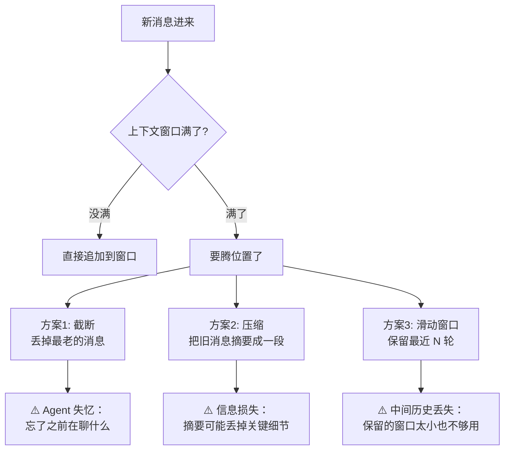

# 短期记忆：当前任务轨迹 + 工具结果缓存

> **一句话**：短期记忆是 Agent 的"工作台面"——当前对话的所有消息、推理步骤、工具返回结果都暂存在上下文窗口中，支撑 Agent 知道「刚才发生了什么」，但窗口满了就得清理。

---

## 一、什么是短期记忆？

把 Agent 想象成**一个正在做菜的人**：

- 他面前有一张**操作台**（上下文窗口），上面摆着菜谱（System Prompt）、食材清单（用户目标）、刚才切的菜（工具返回结果）
- 操作台就这么大，摆不下了就得把不用的挪走
- 菜做完，操作台清空——下次做新菜又是从头开始

**短期记忆 = 当前会话的上下文窗口（Context Window）**。它存着：

| 内容 | 例子 | 占多少 |
|:----|:----|:------|
| System Prompt | "你是一个简历分析助手..." | 固定几百 token |
| 用户消息历史 | Q1: "分析我的简历" Q2: "那我的项目经验呢？" | 逐轮增长 |
| 推理步骤（Thought） | "我需要先调用 read_resume 工具..." | 每步几十到几百 token |
| 工具调用与返回 | `analyze_resume()` → 返回 500 字分析 | **最占地方的** |
| 用户目标与约束 | "用中文回答，不超过 200 字" | 少量 |

---

## 二、上下文窗口限制：满了会怎样？

每个 LLM 都有**上下文窗口上限（Context Window Limit）**——能同时"看到"的最大 token 数：

| 模型 | 上下文窗口 | 实际可用（系统+控制开销后） |
|:----|:----------|:-------------------------|
| DeepSeek V3 | 128K | ~120K |
| GPT-4o | 128K | ~120K |
| Claude 4 | 200K | ~190K |
| Gemini 2.5 Pro | 1M | ~950K |

**窗口满了之后**，你有三种选择——但每种都有代价：



> [!tip] **上下文窗口并不是越大越好**
> 1. 窗口越大，推理越慢、越贵（自注意力是 O(n²)）
> 2. LLM 对「窗口中间」的信息注意力衰减（Lost in the Middle 效应）
> 3. 垃圾塞多了，回复质量反而下降

---

## 三、LangGraph MemorySaver：短期记忆的落盘机制

你项目中用的是 **LangGraph 的 MemorySaver**——它是把 Agent 的「当前状态」快照存到内存里，支撑多步推理时「回看历史步骤」。

### 它解决什么问题？

没有 MemorySaver 的时候，Agent 每步推理都是**金鱼记忆**：执行完 Tool A 回来，已经忘了为什么要调 Tool A。

```python
from langgraph.checkpoint.memory import MemorySaver
from langgraph.graph import StateGraph

# 1. 创建 checkpointer（短期记忆持久化）
checkpointer = MemorySaver()

# 2. 编译 Graph 时挂载
graph = StateGraph(AgentState)
graph.add_node("analyze", analyze_resume)
graph.add_node("rerank", rerank_results)
# ... 更多节点
app = graph.compile(checkpointer=checkpointer)

# 3. 每次调用指定 thread_id（会话隔离）
result = app.invoke(
    {"query": "分析我的 Python 经验"},
    config={"configurable": {"thread_id": "user_session_001"}}
)
# checkpointer 自动保存了本次调用的状态快照
# 下次同一 thread_id 继续，Agent 能「记住」之前做了什么
```

### MemorySaver 的核心行为

| 功能 | 说明 |
|:----|:----|
| `put()` | 每步执行完，自动把状态写入内存 |
| `get()` | 下一步开始时，读出上一步状态 |
| `thread_id` 隔离 | 不同会话互不干扰 |
| `get_state()` | 调试时查看任意时间点的状态快照 |

```python
# 查看某次会话的状态
state = app.get_state(
    config={"configurable": {"thread_id": "user_session_001"}}
)
print(state.values)  # 当前状态的所有字段
print(state.next)    # 下一步要执行的节点
```

---

## 四、工具结果缓存：省 Token 的实用技巧

**问题场景**：Agent 在多步推理中，同一个工具被调了两次，参数一模一样。第二次调用纯属浪费——既耗时又烧 Token（还要把结果再塞一次进上下文）。

**解决方案**：在短期记忆层加一层**工具结果缓存**。

```python
import hashlib
import json
from functools import wraps
from typing import Any, Callable, Dict

class ToolResultCache:
    """工具结果缓存：同一会话内，相同参数的工具调用只执行一次"""
    
    def __init__(self):
        self._cache: Dict[str, Any] = {}  # hash → 结果
    
    def _make_key(self, tool_name: str, args: dict) -> str:
        """生成缓存键：工具名 + 参数哈希"""
        raw = json.dumps({"tool": tool_name, "args": args}, sort_keys=True)
        return hashlib.md5(raw.encode()).hexdigest()
    
    def get(self, tool_name: str, args: dict) -> Any | None:
        """查缓存"""
        key = self._make_key(tool_name, args)
        return self._cache.get(key)
    
    def set(self, tool_name: str, args: dict, result: Any):
        """写缓存"""
        key = self._make_key(tool_name, args)
        self._cache[key] = result
    
    def clear(self):
        """会话结束清空缓存"""
        self._cache.clear()


# 用装饰器包装工具调用
cache = ToolResultCache()

def cached_tool(tool_func: Callable) -> Callable:
    """装饰器：工具调用自动缓存"""
    @wraps(tool_func)
    def wrapper(*args, **kwargs):
        tool_name = tool_func.__name__
        
        # 先查缓存
        cached_result = cache.get(tool_name, 
            {"args": args, "kwargs": kwargs})
        if cached_result is not None:
            print(f"[CACHE HIT] {tool_name} → 跳过执行，省 Token")
            return cached_result
        
        # 缓存未命中 → 执行
        result = tool_func(*args, **kwargs)
        cache.set(tool_name, 
            {"args": args, "kwargs": kwargs}, result)
        return result
    
    return wrapper


# 使用示例
@cached_tool
def read_file(path: str) -> str:
    """读文件（假设耗时 0.5s，返回 2000 字符）"""
    with open(path, "r") as f:
        return f.read()

# 第一次调用：真读文件
content = read_file("/data/resume.txt")  # 实际 I/O

# 第二次调用：命中缓存，直接返回
content = read_file("/data/resume.txt")  # [CACHE HIT] 0ms

# 不同参数：不会命中缓存
other = read_file("/data/other.txt")     # 实际 I/O
```


## 
> ▶ 对应原理：[[28-Agent记忆基础与状态管理|28-Agent记忆基础与状态管理]]

相关链接

- 目录：[[00-AI]]
- 下一篇：[[32-长期记忆：跨会话用户偏好、历史持久化]]
- 系列：[[30-Fallback兜底值设计]]
- 项目实践：[[项目实战/ai-resume笔记/01_技术研读/03_LangGraph状态机#Checkpoint 机制|ai-resume: LangGraph状态机]]
- 理论基础：[[15-Agent架构与工具调用|Agent 四要素：LLM+工具+记忆+规划]]

---
→ [[技术学习清单#记忆与上下文]]

## 速记卡（面试闪卡）

**Q1：一句话讲清「短期记忆：当前任务轨迹 + 工具结果缓存」到底是什么？**
A：把 Agent 想象成**一个正在做菜的人**：
他面前有一张**操作台**（上下文窗口），上面摆着菜谱（System Prompt）、食材清单（用户目标）、刚才切的菜（工具返回结果）
操作台就这么大，摆不下了就得把不用的挪走
菜做完，操作台清空——下次做新菜又是从头开始
**短期记忆 = 当前会话的上下文窗口（Context Window）**。

**Q2：一、什么是短期记忆？ —— 怎么理解？**
A：把 Agent 想象成**一个正在做菜的人**：
他面前有一张**操作台**（上下文窗口），上面摆着菜谱（System Prompt）、食材清单（用户目标）、刚才切的菜（工具返回结果）
操作台就这么大，摆不下了就得把不用的挪走
菜做完，操作台清空——下次做新菜又是从头开始
**短期记忆 = 当前会话的上下文窗口（Context Window）**。

**Q3：二、上下文窗口限制：满了会怎样？ —— 怎么理解？**
A：每个 LLM 都有**上下文窗口上限（Context Window Limit）**——能同时"看到"的最大 token 数：
| 模型 | 上下文窗口 | 实际可用（系统+控制开销后） |
|:----|:----------|:-------------------------|
| DeepSeek V3 | 128K | ~120K |
| GPT-4o | 128K | ~120K |

**Q4：三、LangGraph MemorySaver：短期记忆的落盘机制 —— 怎么理解？**
A：你项目中用的是 **LangGraph 的 MemorySaver**——它是把 Agent 的「当前状态」快照存到内存里，支撑多步推理时「回看历史步骤」。
没有 MemorySaver 的时候，Agent 每步推理都是**金鱼记忆**：执行完 Tool A 回来，已经忘了为什么要调 Tool A。

**Q5：四、工具结果缓存：省 Token 的实用技巧 —— 怎么理解？**
A：**问题场景**：Agent 在多步推理中，同一个工具被调了两次，参数一模一样。第二次调用纯属浪费——既耗时又烧 Token（还要把结果再塞一次进上下文）。
**解决方案**：在短期记忆层加一层**工具结果缓存**。

**Q6：核心速记主线有哪些？**
A：抓住这几根：一、什么是短期记忆？、二、上下文窗口限制：满了会怎样？、三、LangGraph MemorySaver：短期记忆的落盘机制、四、工具结果缓存：省 Token 的实用技巧、。

