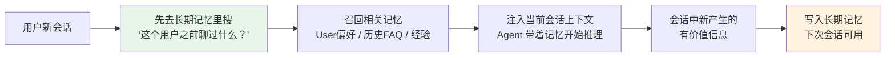

# 长期记忆：跨会话用户偏好、历史持久化

> **一句话**：长期记忆是 Agent 的"笔记本"——把用户偏好、历史经验、关键事实存到外部持久化存储（向量数据库），跨会话不丢失，下次启动还能「记得你」。

---

## 一、什么是长期记忆？

短期记忆像**便签贴**——记着刚才聊了什么，会话结束就扔了。长期记忆像**笔记本**——写下来的东西，下次翻开还在。

| 对比维度 | 短期记忆 | 长期记忆 |
|:----|:----|:----|
| 存在哪里 | LLM 上下文窗口 | 向量数据库 / 关系数据库 / 文件 |
| 存活多久 | 当前会话结束即消失 | 持久化，跨会话保留 |
| 容量 | 受上下文窗口限制（128K-1M token） | 近乎无限 |
| 访问方式 | 直接在窗口里读 | 需要通过「召回」检索 |
| 典型用途 | 记当前任务轨迹 | 记用户偏好、历史经验 |
| 类比 | 便签贴 | 笔记本 |



---

## 二、向量数据库为什么适合做长期记忆？

长期记忆的核心操作是「搜」而不是「查」——**语义搜索**（"找个类似的问题"）比精确匹配（"找 key=张三"）更常用。向量数据库天然适合这个场景。

### 为什么不用普通数据库？

```python
# ❌ 关系数据库：只能精确匹配
SELECT * FROM memories WHERE user_query = "分析我的Python经验"
# → 用户下次问 "评估我的Python能力" 就查不到了

# ✅ 向量数据库：语义相似
results = chroma_collection.query(
    query_embeddings=embed("评估我的Python能力"),
    n_results=3
)
# → 能找到 "分析我的Python经验" 因为两个 query 语义接近
```

---

## 三、代码实现：ChromaDB 做长期记忆存储

下面实现一个完整的「存记忆 + 召回记忆」系统：

```python
import chromadb
from chromadb.utils import embedding_functions
from datetime import datetime
from typing import Optional

class LongTermMemory:
    """基于 ChromaDB 的长期记忆系统"""
    
    def __init__(self, collection_name: str = "agent_memory"):
        # 初始化 Chroma 客户端（持久化模式）
        self.client = chromadb.PersistentClient(
            path="./agent_memory_db"  # 数据存磁盘，重启不丢
        )
        
        # 嵌入函数：把文本变成向量
        self.embed_fn = embedding_functions.DefaultEmbeddingFunction()
        
        # 每个用户独立 collection（隐私隔离）
        self.collection = self.client.get_or_create_collection(
            name=collection_name,
            embedding_function=self.embed_fn,
            metadata={"description": "Agent 长期记忆"}
        )
    
    def remember(
        self,
        user_id: str,
        content: str,
        memory_type: str = "interaction",  # 交互记忆
        importance: float = 0.5,            # 重要性 0-1
    ) -> str:
        """
        存入一条记忆。
        
        参数：
        - user_id: 用户 ID（隔离不同用户的记忆）
        - content: 记忆内容（自由文本）
        - memory_type: 类型（interaction / preference / experience）
        - importance: 重要性评分，越高越不容易被清理
        """
        memory_id = f"{user_id}_{datetime.now().timestamp()}"
        
        self.collection.add(
            ids=[memory_id],
            documents=[content],
            metadatas=[{
                "user_id": user_id,
                "type": memory_type,
                "importance": importance,
                "timestamp": datetime.now().isoformat(),
            }],
        )
        return memory_id
    
    def recall(
        self,
        user_id: str,
        query: str,
        n_results: int = 5,
        memory_type: Optional[str] = None,
    ) -> list[dict]:
        """
        召回最相关的 N 条记忆。
        
        参数：
        - user_id: 只搜这个用户的记忆
        - query: 搜索文本（语义匹配）
        - n_results: 返回几条
        - memory_type: 可选过滤（如只要 preference）
        """
        # 构建元数据过滤条件
        where_filter = {"user_id": user_id}
        if memory_type:
            where_filter["type"] = memory_type
        
        results = self.collection.query(
            query_texts=[query],
            n_results=n_results,
            where=where_filter,
        )
        
        # 整理返回格式
        memories = []
        if results["ids"] and results["ids"][0]:
            for i, doc_id in enumerate(results["ids"][0]):
                memories.append({
                    "id": doc_id,
                    "content": results["documents"][0][i],
                    "metadata": results["metadatas"][0][i],
                    "distance": results["distances"][0][i]
                        if results.get("distances") else None,
                })
        return memories
    
    def forget(self, memory_id: str):
        """删除一条记忆"""
        self.collection.delete(ids=[memory_id])
    
    def consolidate(self, user_id: str):
        """
        记忆整理：合并相似记忆、清理过时的。
        （实际场景可能需要更复杂的合并逻辑）
        """
        # 获取用户所有记忆
        all_memories = self.collection.get(
            where={"user_id": user_id}
        )
        print(f"用户 {user_id} 共有 {len(all_memories['ids'])} 条记忆")


# ========== 使用示例 ==========
memory = LongTermMemory(collection_name="user_memory")

# 存入偏好
memory.remember(
    user_id="user_123",
    content="用户偏好简短回答，不要超过 200 字",
    memory_type="preference",
    importance=0.9,
)

# 存入交互历史
memory.remember(
    user_id="user_123",
    content="用户上次问过"Python 后端开发"的简历分析，\
重点关注 FastAPI 和 PostgreSQL 经验",
    memory_type="interaction",
    importance=0.6,
)

# 新会话开始时召回记忆
memories = memory.recall(
    user_id="user_123",
    query="用户的回答风格偏好和简历分析历史",
    n_results=5,
)
for m in memories:
    print(f"[{m['metadata']['type']}] {m['content']}")
```

---

## 四、用户偏好持久化设计

用户偏好（Preferences）是长期记忆里最重要的一类——它直接影响 Agent 的**行为方式**，而不是知识内容。

### 偏好的三层结构

```python
from dataclasses import dataclass, field
from typing import Optional

@dataclass
class UserPreference:
    """用户偏好数据结构"""
    user_id: str
    
    # 第一层：显式偏好（用户明确说过）
    explicit: dict = field(default_factory=lambda: {
        "language": "zh",           # 回答语言
        "max_length": 200,          # 最长字数
        "detail_level": "concise",  # 详细程度：concise / normal / detailed
        "code_style": "pythonic",   # 代码风格
    })
    
    # 第二层：隐式偏好（从行为中推断）
    inferred: dict = field(default_factory=lambda: {
        "skip_greeting": True,      # 跳过寒暄（用户总是直接问问题）
        "prefer_table": True,       # 偏好表格而非长段落
        "domain_focus": ["Python", "简历", "Agent"],
    })
    
    # 第三层：会话级覆盖（仅本次会话有效，不持久化）
    session_override: dict = field(default_factory=dict)


class PreferenceManager:
    """偏好管理：从长期记忆读写用户偏好"""
    
    def __init__(self, memory: LongTermMemory):
        self.memory = memory
    
    def save_preferences(self, user_id: str, prefs: UserPreference):
        """把偏好写入长期记忆"""
        # 只持久化 explicit + inferred，不存 session_override
        content = json.dumps({
            "explicit": prefs.explicit,
            "inferred": prefs.inferred,
        }, ensure_ascii=False)
        
        self.memory.remember(
            user_id=user_id,
            content=content,
            memory_type="preference",
            importance=0.9,  # 偏好很重要，不容丢失
        )
    
    def load_preferences(self, user_id: str) -> UserPreference:
        """从长期记忆中加载偏好"""
        memories = self.memory.recall(
            user_id=user_id,
            query="用户偏好设置",
            memory_type="preference",
            n_results=3,
        )
        
        prefs = UserPreference(user_id=user_id)
        for m in memories:
            try:
                data = json.loads(m["content"])
                prefs.explicit.update(data.get("explicit", {}))
                prefs.inferred.update(data.get("inferred", {}))
            except json.JSONDecodeError:
                continue
        
        return prefs
```

---

## 五、记忆的写入时机：什么值得记住？

不是所有交互都值得写入长期记忆。需要一个**写入判断标准**：

| 场景 | 值得记吗？ | 原因 |
|:----|:---------|:----|
| 用户说"以后都用英文回答" | 值得（preference） | 明确的偏好变更 |
| 用户连续三次打断回答 | 值得（inferred） | 行为模式，推断偏好 |
| Agent 某个策略效果特别好 | 值得（experience） | 可复用的经验 |
| 普通一问一答 | 不值得 | 无长期价值 |
| 工具调用失败的报错堆栈 | 不值得 | Bug 改了就失效了 |

```python
def should_remember(interaction: dict) -> tuple[bool, str]:
    """
    判断一条交互是否值得写入长期记忆。
    返回 (是否值得, 原因)
    """
    # 规则1：显式偏好声明
    preference_keywords = ["以后", "每次都", "不要", "偏好", "喜欢"]
    if any(kw in interaction["user_message"] for kw in preference_keywords):
        return True, "用户显式声明了偏好"
    
    # 规则2：Agent 策略成功（用户反馈积极）
    if interaction.get("user_feedback") == "positive":
        return True, "策略有效，可复用"
    
    # 规则3：普通交互——只记 summary，不记原文
    if interaction.get("token_count", 0) > 2000:
        return True, "长交互，值得做摘要存储"
    
    # 默认不值得
    return False, "普通交互，无长期价值"
```


## 
> ▶ 对应原理：[[38-记忆系统三层架构-存储介质与生命周期|38-记忆系统三层架构-存储介质与生命周期]]

相关链接

- 目录：[[00-AI]]
- 上一篇：[[31-短期记忆：当前任务轨迹 + 工具结果缓存]]
- 下一篇：[[33-上下文治理：多轮任务上下文越来越长的处理策略]]
- 项目实践：[[项目实战/ai-resume笔记/01_技术研读/03_LangGraph状态机#Checkpoint 机制|ai-resume: LangGraph状态机]]
- 理论基础：[[15-Agent架构与工具调用|Agent 四要素：LLM+工具+记忆+规划]]
- 基础依赖：[[05-Chroma向量数据库安装入库检索]]

---
→ [[技术学习清单#记忆与上下文]]

## 速记卡（面试闪卡）

**Q1：一句话讲清「长期记忆：跨会话用户偏好、历史持久化」到底是什么？**
A：短期记忆像**便签贴**——记着刚才聊了什么，会话结束就扔了。长期记忆像**笔记本**——写下来的东西，下次翻开还在。
| 对比维度 | 短期记忆 | 长期记忆 |
|:----|:----|:----|
| 存在哪里 | LLM 上下文窗口 | 向量数据库 / 关系数据库 / 文件 |
| 存活多久 | 当前会话结束即消失 | 持久化，跨会话保留 |

**Q2：一、什么是长期记忆？ —— 怎么理解？**
A：短期记忆像**便签贴**——记着刚才聊了什么，会话结束就扔了。长期记忆像**笔记本**——写下来的东西，下次翻开还在。
| 对比维度 | 短期记忆 | 长期记忆 |
|:----|:----|:----|
| 存在哪里 | LLM 上下文窗口 | 向量数据库 / 关系数据库 / 文件 |
| 存活多久 | 当前会话结束即消失 | 持久化，跨会话保留 |
| 容量 | 受上下文窗口限制（128K-1M token） | 近乎无限 |

**Q3：二、向量数据库为什么适合做长期记忆？ —— 怎么理解？**
A：长期记忆的核心操作是「搜」而不是「查」——**语义搜索**（"找个类似的问题"）比精确匹配（"找 key=张三"）更常用。向量数据库天然适合这个场景。
---

**Q4：三、代码实现：ChromaDB 做长期记忆存储 —— 怎么理解？**
A：下面实现一个完整的「存记忆 + 召回记忆」系统：
---

**Q5：四、用户偏好持久化设计 —— 怎么理解？**
A：用户偏好（Preferences）是长期记忆里最重要的一类——它直接影响 Agent 的**行为方式**，而不是知识内容。
---

**Q6：核心速记主线有哪些？**
A：抓住这几根：一、什么是长期记忆？、二、向量数据库为什么适合做长期记忆？、三、代码实现：ChromaDB 做长期记忆存储、四、用户偏好持久化设计、五、记忆的写入时机：什么值得记住？、。

