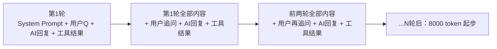
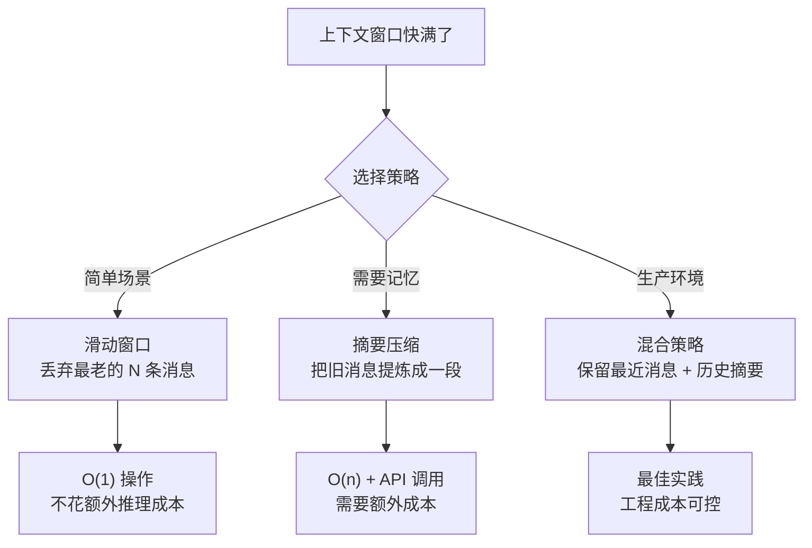

---

title: "上下文治理：多轮任务上下文越来越长的处理策略"

tags:

  - 技术学习

  - ai

  - agent

  - 记忆与上下文

created: "2026-07-21"

---

# 上下文治理：多轮任务上下文越来越长的处理策略

> **一句话**：上下文治理就是当对话越来越长、窗口快塞爆时，用滑动窗口、摘要压缩或混合策略「挤掉不重要的、保留关键的」——像整理冰箱，过期食材扔掉，重要食材换个保鲜盒装。

---

## 一、为什么上下文会「膨胀」？

多轮 Agent 对话是一个**叠加累积**的过程。每轮任务都在上一次对话的尾巴上追加新的内容，而不是覆盖。



每一轮新增的内容包括：

| 增长来源 | 每轮大概占多少 | 说明 |

|:----|:----|:----|

| System Prompt | 200-500 token | 固定，不变 |

| 用户消息 | 50-2000 token | 看用户输入多少 |

| AI 回复 | 300-3000 token | 取决于任务复杂度 |

| 工具调用参数 | 50-300 token | JSON schema 描述 |

| 工具返回结果 | 500-10000 token | **最大的膨胀源** --- 读文件、搜索结果等 |

| 思考推理（Thought） | 100-500 token | ReAct 循环的中间步骤 |

**按每轮平均 2000 token 算，20 轮就是 40000 token。** 对于 128K 窗口看起来不多，但实际面向用户的场景中，一次工具调用可能返回 5000-20000 token（比如读一个代码库的目录结构），几轮下来窗口就吃紧了。

---

## 二、三大治理策略
### 策略对比一览

| 策略 | 做法 | 优点 | 缺点 | 适合场景 |

|:----|:----|:----|:----|:----|

| **滑动窗口** | 只保留最近 N 轮对话 | 简单粗暴，零额外推理成本 | 老信息永久丢失 | 短期任务，不需要历史上下文 |

| **摘要压缩** | 把旧消息喂给 LLM 生成摘要 | 保留关键语义 | 摘要可能丢失细节；额外 API 调用 | 长任务，需要记住「之前做了什么」 |

| **混合策略** | 滑动窗口 + 定期摘要 | 兼顾效率和记忆 | 实现复杂，需要调参数 | 生产级 Agent |



---

## 三、滑动窗口（Sliding Window）实现

最简单直接：超出窗口大小的老消息直接丢弃。

```python

class SlidingWindowManager:

    """滑动窗口：只保留最近 N 条消息"""

    def __init__(self, max_messages: int = 20):

        self.max_messages = max_messages

        self.messages: list[dict] = []

    def add(self, message: dict) -> None:

        """添加新消息，超出上限自动丢弃最老的"""

        self.messages.append(message)

        if len(self.messages) > self.max_messages:

            removed = self.messages.pop(0)

            print(f"[WINDOW] 丢弃旧消息: {removed.get('role')} "

                  f"({len(removed.get('content', ''))} 字符)")

    def get_context(self) -> list[dict]:

        """获取当前窗口的消息列表，喂给 LLM"""

        return self.messages.copy()

    def estimate_tokens(self) -> int:

        """粗略估算窗口内的 token 数"""

        total_chars = sum(

            len(m.get("content", "")) for m in self.messages

        )

        return total_chars // 3  # 粗略：3 字符 ≈ 1 token（中文更准）

```

### 滑动窗口的问题：把头也丢了

窗口不管内容重要性，最早的消息和最重要的 System Prompt 一律待遇。改进版：

```python

class PinnedWindowManager(SlidingWindowManager):

    """带「钉子」的滑动窗口：System Prompt 永远不丢"""

    def __init__(self, max_messages: int = 20):

        super().__init__(max_messages)

        self.pinned: list[dict] = []  # 不会被丢弃的钉子消息

    def pin(self, message: dict) -> None:

        """把一条消息钉住（如 System Prompt / 关键用户偏好）"""

        self.pinned.append(message)

    def get_context(self) -> list[dict]:

        """返回：钉子消息 + 最近的普通消息"""

        return self.pinned + self.messages.copy()

    def add(self, message: dict) -> None:

        """钉子消息占用窗口容量，普通消息的空间变小了"""

        pin_count = len(self.pinned)

        effective_max = max(1, self.max_messages - pin_count)

        self.messages.append(message)

        while len(self.messages) > effective_max:

            self.messages.pop(0)

```

---

## 四、摘要压缩（Summary Compression）实现

不是直接丢掉老消息，而是把它们压缩成一段「执行摘要」。

```python

from typing import Callable, Optional

class SummaryCompressor:

    """摘要压缩：把老消息提炼成一段摘要"""

    def __init__(

        self,

        llm_summarize: Callable[[str], str],  # LLM 摘要函数

        compress_trigger_pct: float = 0.7,     # 窗口占用 70% 时触发压缩

    ):

        self.llm_summarize = llm_summarize

        self.compress_trigger_pct = compress_trigger_pct

        self.summary: str = ""                 # 累积摘要

        self.messages: list[dict] = []

        self.total_tokens: int = 0

    def add(self, message: dict) -> None:

        """添加消息，窗口快满时自动触发压缩"""

        self.messages.append(message)

        msg_tokens = len(message.get("content", "")) // 3

        self.total_tokens += msg_tokens

        if self._should_compress():

            self._compress_oldest_half()

    def _should_compress(self) -> bool:

        """判断是否需要压缩"""

        max_tokens = 120000  # 假设 128K 窗口，预留 8K

        return self.total_tokens > max_tokens * self.compress_trigger_pct

    def _compress_oldest_half(self) -> None:

        """把最老的一半消息压缩成摘要"""

        split_point = len(self.messages) // 2

        old_messages = self.messages[:split_point]

        self.messages = self.messages[split_point:]

        # 拼接成一段文本让 LLM 做摘要

        old_text = "\n".join(

            f"[{m['role']}]: {m['content']}"

            for m in old_messages

        )

        prompt = f"""将以下对话历史压缩为 200 字以内的结构化摘要，保留：

1. 用户的核心目标和偏好

2. 已完成的步骤和关键结果

3. 进行中的未完成事项

对话历史：

{old_text}

摘要："""

        new_summary = self.llm_summarize(prompt)

        # 合并到累积摘要

        if self.summary:

            self.summary = self.llm_summarize(

                f"合并以下两段摘要为一段连贯总结：\n"

                f"摘要1: {self.summary}\n摘要2: {new_summary}"

            )

        else:

            self.summary = new_summary

        # 重算 token

        self.total_tokens = sum(

            len(m.get("content", "")) for m in self.messages

        ) // 3 + len(self.summary) // 3

    def get_context(self) -> list[dict]:

        """构建上下文：摘要（system） + 最近消息"""

        context = []

        if self.summary:

            context.append({

                "role": "system",

                "content": f"[历史对话摘要]\n{self.summary}"

            })

        context.extend(self.messages)

        return context

```

---

## 五、混合策略：生产环境最实用

把滑动窗口和摘要压缩结合起来——这是 LangChain 的 `ConversationSummaryBufferMemory` 和类似实现的核心思路。

```python

class HybridContextManager:

    """

    混合上下文管理器：

    - 保留最近 N 轮完整消息（滑动窗口部分）

    - 对 N 轮之前的内容做摘要压缩

    - 给 LLM 的最终上下文 = 摘要 + 最近消息

    """

    def __init__(

        self,

        llm_summarize: Callable[[str], str],

        recent_rounds: int = 5,       # 保留最近 5 轮完整对话

        compress_threshold: int = 10,  # 超过 10 轮触发摘要

    ):

        self.llm_summarize = llm_summarize

        self.recent_rounds = recent_rounds

        self.compress_threshold = compress_threshold

        self.all_messages: list[dict] = []

        self.rolling_summary: str = ""

        self.round_count: int = 0

    def add_round(self, user_msg: dict, assistant_msg: dict) -> None:

        """添加一轮对话（用户消息 + AI 消息）"""

        self.all_messages.append(user_msg)

        self.all_messages.append(assistant_msg)

        self.round_count += 1

        # 超过阈值时触发压缩

        if self.round_count > self.compress_threshold:

            self._compress()

    def _compress(self) -> None:

        """对超过保留轮数的消息做增量压缩"""

        keep_from = max(0, len(self.all_messages) - self.recent_rounds * 2)

        old_messages = self.all_messages[:keep_from]

        self.all_messages = self.all_messages[keep_from:]

        if not old_messages:

            return

        old_text = "\n".join(

            f"[{m['role']}]: {m.get('content', '')[:500]}"  # 截断过长内容

            for m in old_messages

        )

        new_chunk_summary = self.llm_summarize(

            f"用 100 字以内总结这段对话的关键信息（做了什么事、产出什么）：\n{old_text}"

        )

        if self.rolling_summary:

            # 合并到已有摘要

            self.rolling_summary = self.llm_summarize(

                f"将以下两段摘要合成一段连贯的 200 字以内总结：\n"

                f"已有摘要: {self.rolling_summary}\n"

                f"新增内容: {new_chunk_summary}"

            )

        else:

            self.rolling_summary = new_chunk_summary

        print(f"[COMPRESS] 压缩了 {len(old_messages)} 条消息，当前摘要 {len(self.rolling_summary)} 字")

    def build_context(self) -> list[dict]:

        """构建给 LLM 的最终上下文"""

        context = []

        if self.rolling_summary:

            context.append({

                "role": "system",

                "content": f"[历史上下文摘要，下文会引用到]\n{self.rolling_summary}"

            })

        context.extend(self.all_messages)

        return context

    def get_stats(self) -> dict:

        """查看上下文治理的统计信息"""

        recent_tokens = sum(

            len(m.get("content", "")) for m in self.all_messages

        ) // 3

        return {

            "total_rounds": self.round_count,

            "recent_messages": len(self.all_messages),

            "summary_length": len(self.rolling_summary),

            "recent_tokens_est": recent_tokens,

            "total_context_est": recent_tokens + len(self.rolling_summary) // 3,

        }

```

## 速记卡（面试闪卡）

**Q1：一句话讲清「上下文治理：多轮任务上下文越来越长的处理策略」到底是什么？**

A：上下文治理就是当对话越来越长、窗口快塞爆时，用滑动窗口、摘要压缩或混合策略「挤掉不重要的、保留关键的」——像整理冰箱，过期食材扔掉，重要食材换个保鲜盒装。

**Q2：一、为什么上下文会「膨胀」？ —— 怎么理解？**

A：多轮 Agent 对话是一个**叠加累积**的过程。每轮任务都在上一次对话的尾巴上追加新的内容，而不是覆盖。 每一轮新增的内容包括： System Prompt：200-500 token，固定，不变；用户消息：50-2000 token，看用户输入多少；AI 回复：300-3000 token，取决于任务复杂度；工具调用参数：50-300 token，JSON schema 描述；

**Q3：二、三大治理策略 —— 怎么理解？**

A：**滑动窗口**：只保留最近 N 轮对话，简单粗暴，零额外推理成本，老信息永久丢失，短期任务，不需要历史上下文；**摘要压缩**：把旧消息喂给 LLM 生成摘要，保留关键语义，摘要可能丢失细节；额外 API 调用，长任务，需要记住「之前做了什么」；**混合策略**：滑动窗口 + 定期摘要，兼顾效率和记忆，实现复杂，需要调参数，生产级 Agent。

**Q4：三、滑动窗口（Sliding Window）实现 —— 怎么理解？**

A：最简单直接：超出窗口大小的老消息直接丢弃。 窗口不管内容重要性，最早的消息和最重要的 System Prompt 一律待遇。

**Q5：四、摘要压缩（Summary Compression）实现 —— 怎么理解？**

A：不是直接丢掉老消息，而是把它们压缩成一段「执行摘要」。

**Q6：核心速记主线有哪些？**

A：抓住这几根：一、为什么上下文会「膨胀」？、二、三大治理策略、三、滑动窗口（Sliding Window）实现、四、摘要压缩（Summary Compression）实现、五、混合策略：生产环境最实用

**口诀**

A：上下文治理：为什么上下文会「膨胀」？先想；

三大治理策略配滑动窗口（Sliding Window）实现，

摘要压缩（Summary Compression）实现不能忘，

面试对答底气壮。

## 相关链接

- 目录：[[00-AI]]

- 上一篇：[[32-长期记忆：跨会话用户偏好、历史持久化]]

- 下一篇：[[34-上下文压缩：任务摘要-文件摘要-过程笔记]]

- 理论基础：[[15-Agent架构与工具调用|Agent 四要素：LLM+工具+记忆+规划]]

---

→ [[技术学习路线图#记忆与上下文]]

