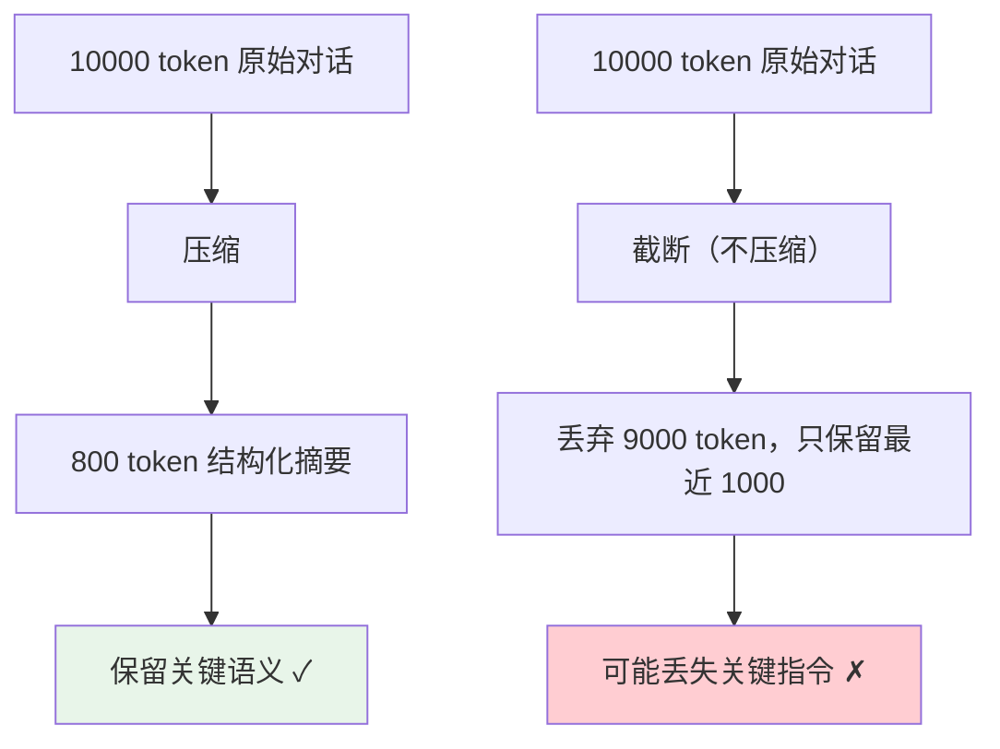

# 上下文压缩：任务摘要 - 文件摘要 - 过程笔记

> **一句话**：上下文压缩不是在上下文窗口里「减少字数」，而是用结构化摘要把冗余信息提炼成可检索、可回溯、不丢失关键信息的压缩态——做完一道菜，不是扔掉菜谱，而是把关键步骤抄到自己的小本本上。

---

## 一、为什么需要压缩？以及为什么不能随便压？

压缩的目标不是「删掉更多内容」，而是**提高信息的信噪比**。同样 1000 token 的空间，原始对话可能只有 10% 的关键信息，而一段好的摘要可以达到 80%。



> [!warning] **压缩最大的风险：信息丢失**
> 好的压缩像「脱水蔬菜」——营养还在，体积小了；差的压缩像「扔菜」——把关键信息扔了还不自知。所以压缩后的**验证**和压缩本身同等重要。

---

## 二、三种压缩形态

| 压缩类型 | 压缩对象 | 保留什么 | 适用时机 |
|:----|:----|:----|:----|
| **任务摘要** | 当前任务的执行轨迹 | 目标、已完成步骤、当前进度、关键决策 | 窗口达到阈值时触发 |
| **文件摘要** | 被读取的外部文件/资源 | 文件用途、关键函数、入口逻辑、依赖关系 | 读取文件后立即生成 |
| **过程笔记** | 推理中的洞察和教训 | 踩过的坑、有效的策略、放弃的方案 | 任务间歇时主动记录 |

### 类比：三种笔记的差别

```text
任务摘要 = "今天这道红烧肉，焯水→炒糖色→加酱油→小火炖了40分钟，出锅前大火收汁"
文件摘要 = "这本食谱第三章讲的是川菜的麻辣调味，核心调料是花椒+豆瓣酱+干辣椒"
过程笔记 = "下次记住：炒糖色火不能太大，冒烟就苦了；炖肉40分钟刚好不烂不柴"
```

---

## 三、任务摘要（Task Summary）

任务摘要是把 Agent 执行的轨迹压缩成结构化总结，让 Agent 在上下文窗口紧张时能「回头看自己在干什么」。

```python
from dataclasses import dataclass, field, asdict
from typing import Optional

@dataclass
class TaskSummary:
    """任务摘要数据结构"""
    goal: str                          # 用户最初的目标
    progress: str                      # 当前进度（"已完成3/5步"）
    completed_steps: list[str] = field(default_factory=list)
    pending_steps: list[str] = field(default_factory=list)
    key_findings: list[str] = field(default_factory=list)
    errors_encountered: list[str] = field(default_factory=list)
    decisions_made: list[str] = field(default_factory=list)
    
    def to_prompt_snippet(self) -> str:
        """转成注入 LLM 上下文的一段文本"""
        parts = [
            f"## 任务目标\n{self.goal}",
            f"## 当前进度\n{self.progress}",
        ]
        if self.completed_steps:
            parts.append("## 已完成步骤\n" + "\n".join(f"- {s}" for s in self.completed_steps))
        if self.pending_steps:
            parts.append("## 待完成任务\n" + "\n".join(f"- {s}" for s in self.pending_steps))
        if self.key_findings:
            parts.append("## 关键发现\n" + "\n".join(f"- {s}" for s in self.key_findings))
        if self.errors_encountered:
            parts.append("## 遇到过的错误（不要再踩）\n" + "\n".join(f"- {s}" for s in self.errors_encountered))
        if self.decisions_made:
            parts.append("## 已做决策\n" + "\n".join(f"- {s}" for s in self.decisions_made))
        return "\n\n".join(parts)


# ========== LLM 驱动的摘要生成 ==========

TASK_SUMMARY_PROMPT = """你是一个执行摘要专家。根据以下 Agent 执行记录，生成结构化摘要。

## 要求
1. 目标：用户到底想干什么？（一句话）
2. 进度：完成到什么程度了？（如"3/5 步骤完成"）
3. 已完成步骤：每步用 15 字以内概括
4. 待完成步骤：还差什么没做？
5. 关键发现：执行中发现了什么重要信息？
6. 遇到的错误：踩了什么坑？（最多列 3 条，无则省略）
7. 已做决策：做了什么关键决策？

## 输出格式（JSON）
```json
{
    "goal": "...",
    "progress": "...",
    "completed_steps": [...],
    "pending_steps": [...],
    "key_findings": [...],
    "errors_encountered": [...],
    "decisions_made": [...]
}
```text

## 执行记录
{execution_log}
"""

def generate_task_summary(
    execution_log: str,
    llm_call: callable,  # 实际项目里换成你的 LLM 调用函数
) -> TaskSummary:
    """把执行日志压缩成结构化任务摘要"""
    prompt = TASK_SUMMARY_PROMPT.format(execution_log=execution_log)
    response = llm_call(prompt)
    # 解析 JSON 响应
    data = json.loads(response)
    return TaskSummary(**data)
```

---

## 四、文件摘要（File Summary）

Agent 读取外部文件时，如果把整个文件内容塞进上下文，窗口消耗极快。文件摘要把「读文件」变成「读摘要」，省下大量空间。

```python
@dataclass
class FileSummary:
    """文件摘要"""
    file_path: str
    purpose: str                      # 这个文件是干什么的
    key_exports: list[str] = field(default_factory=list)  # 核心函数/类
    dependencies: list[str] = field(default_factory=list)  # 依赖什么
    entry_points: list[str] = field(default_factory=list)  # 入口逻辑
    notes: str = ""                   # 补充说明
    
    def to_context_block(self) -> str:
        """生成一个紧凑的上下文块，替代原始文件内容"""
        lines = [
            f"[文件摘要] {self.file_path}",
            f"用途: {self.purpose}",
        ]
        if self.key_exports:
            lines.append(f"核心导出: {', '.join(self.key_exports)}")
        if self.entry_points:
            lines.append(f"入口逻辑: {', '.join(self.entry_points)}")
        if self.dependencies:
            lines.append(f"依赖: {', '.join(self.dependencies)}")
        if self.notes:
            lines.append(f"备注: {self.notes}")
        return "\n".join(lines)


FILE_SUMMARY_PROMPT = """你是一个代码分析专家。用最简洁的语言总结以下文件。

## 要求
- purpose（一句话）：这个文件的核心职责
- key_exports（最多 5 个）：最需要关注的核心函数/类/模块
- dependencies：依赖的外部模块（看 import 语句，只列最重要的 3-5 个）
- entry_points：外部调用的入口点（public API、exports、main 函数等）
- notes：代码风格、设计模式、或任何不寻常的地方（可选，不超过 2 句）

## 文件内容
文件路径: {file_path}
```
{file_content}
```text

## 输出格式（JSON）
```json
{{
    "purpose": "...",
    "key_exports": [...],
    "dependencies": [...],
    "entry_points": [...],
    "notes": "..."
}}
```text
"""

def summarize_file(file_path: str, file_content: str, llm_call: callable) -> FileSummary:
    """把文件内容压缩成结构化的文件摘要"""
    prompt = FILE_SUMMARY_PROMPT.format(
        file_path=file_path,
        file_content=file_content[:8000]  # 截断过长的文件
    )
    response = llm_call(prompt)
    data = json.loads(response)
    return FileSummary(file_path=file_path, **data)
```

---

## 五、过程笔记（Process Notes）

过程笔记是 Agent **自己写给自己的备忘录**——在推理过程中主动记录「刚才这个思路不行，为什么」「发现了一个有用的模式」等洞察，帮助后续推理不走弯路。

```python
@dataclass
class ProcessNote:
    """过程笔记"""
    step_id: int
    timestamp: str
    note_type: str   # insight / dead_end / pattern / decision / todo
    content: str
    
    def to_context_line(self) -> str:
        """转成一行笔记，可以密集排列"""
        emoji_map = {
            "insight": "[发现]",
            "dead_end": "[死路]",
            "pattern": "[模式]",
            "decision": "[决策]",
            "todo": "[待办]",
        }
        prefix = emoji_map.get(self.note_type, "[笔记]")
        return f"{prefix} Step{self.step_id}: {self.content}"


class ProcessNotebook:
    """过程笔记本：Agent 边推理边记录"""
    
    def __init__(self, max_notes: int = 20):
        self.notes: list[ProcessNote] = []
        self.max_notes = max_notes
        self.step_counter: int = 0
    
    def record(self, note_type: str, content: str):
        """记录一条笔记"""
        self.step_counter += 1
        self.notes.append(ProcessNote(
            step_id=self.step_counter,
            timestamp=datetime.now().isoformat(),
            note_type=note_type,
            content=content,
        ))
        
        # 笔记太多了也做一次压缩
        if len(self.notes) > self.max_notes:
            self._compact()
    
    def _compact(self):
        """把老笔记压缩合并"""
        old_notes = self.notes[:-10]  # 保留最近 10 条
        self.notes = self.notes[-10:]
        
        summary_lines = []
        for note in old_notes:
            summary_lines.append(note.to_context_line())
        
        # 在笔记最前面插入一条合并摘要
        self.notes.insert(0, ProcessNote(
            step_id=0,
            timestamp=datetime.now().isoformat(),
            note_type="insight",
            content=f"历史笔记摘要: {'; '.join(summary_lines[-5:])}",
        ))
    
    def get_context_block(self) -> str:
        """生成给 LLM 注入的笔记块"""
        if not self.notes:
            return ""
        lines = ["## 推理过程笔记"]
        for note in self.notes:
            lines.append(note.to_context_line())
        return "\n".join(lines)


# ========== 使用示例 ==========
notebook = ProcessNotebook()

# Agent 在推理过程中记录
notebook.record("dead_end", "正则匹配报错，改用 AST 解析更可靠")
notebook.record("insight", "用户偏好：每个回答结尾要一个可操作建议")
notebook.record("pattern", "tool_read_file 返回超过 5000 字符时，一定要做文件摘要")
notebook.record("decision", "放弃方案A（递归遍历），改方案B（BFS + 缓存）")

print(notebook.get_context_block())
```

---

## 六、压缩质量校验：怎么知道没压坏？

这是压缩中最容易被忽视的一环。**压完了不等于压对了**。

```python
def validate_summary(
    original: str,
    summary: str,
    key_entities: list[str],  # 必须出现在摘要中的关键实体
    llm_call: callable,
) -> dict:
    """
    校验摘要质量：确保压缩没有破坏关键信息。
    
    返回：{passed: bool, issues: list[str], score: float}
    """
    issues = []
    
    # 校验1：关键实体是否都在摘要或原始文本中？
    for entity in key_entities:
        if entity not in summary and entity not in original:
            issues.append(f"关键实体丢失: {entity}")
    
    # 校验2：用 LLM 做关键事实一致性检查
    consistency_prompt = f"""检查以下摘要是否与原文的关键事实一致。
列出摘要中与原文矛盾的陈述（没有就回答"无矛盾"）。

原文（截取）:
{original[:3000]}

摘要:
{summary}

矛盾之处（若有）："""
    
    consistency_check = llm_call(consistency_prompt)
    if "无矛盾" not in consistency_check:
        issues.append(f"事实矛盾: {consistency_check}")
    
    # 校验3：检查压缩比是否合理
    original_chars = len(original)
    summary_chars = len(summary)
    ratio = summary_chars / max(original_chars, 1)
    
    if ratio > 0.8:
        issues.append(f"压缩比过高 ({ratio:.1%})，几乎没有压缩效果")
    elif ratio < 0.01:
        issues.append(f"压缩比过低 ({ratio:.1%})，可能过度压缩")
    
    passed = len(issues) == 0
    return {
        "passed": passed,
        "issues": issues,
        "compression_ratio": ratio,
        "score": 1.0 - len(issues) * 0.25,  # 简单评分
    }
```

### 校验的三个维度

| 校验维度 | 方法 | 防什么 |
|:----|:----|:----|
| **实体完整性** | 检查关键实体（人名/变量名/数字）是否还在 | 防止把核心信息压没了 |
| **事实一致性** | LLM 检查摘要与原文事实是否矛盾 | 防止「张冠李戴」 |
| **压缩比合理性** | 摘要字数 / 原文字数 | 防止压了等于没压，或压太狠 |

---

## 七、过度压缩的风险与护栏

压缩不是越狠越好。下面列出过度压缩的常见后果和护栏：

| 风险 | 表现 | 护栏 |
|:----|:----|:----|
| **数字精度丢失** | "85.32%" → "大约八成" | 数字类实体加入 `key_entities` 白名单 |
| **否定语义翻转** | "不要删主分支" → "删主分支" | 否定句禁止压缩，原文保留 |
| **因果链断裂** | 只记「做了什么」，忘了「为什么做」 | 任务摘要中 `decisions_made` 必须包含原因 |
| **累积误差** | 多次摘要叠加后与原意越来越远 | 设置最大压缩代数（如最多摘要两次） |

```python
# 否定句保护
def protect_negation(text: str) -> list[str]:
    """识别否定句，返回不应被压缩的关键句"""
    negation_patterns = ["不要", "禁止", "不能", "严禁", "勿", "不可", "千万别"]
    protected = []
    for sentence in text.split("。"):
        if any(p in sentence for p in negation_patterns):
            protected.append(sentence.strip())
    return protected

# 最大压缩代数限制
class GuardedCompressor:
    def __init__(self, max_generations: int = 2):
        self.max_generations = max_generations
        self.generation_count: dict[str, int] = {}
    
    def compress(self, content_id: str, content: str, summarize_fn: callable) -> str:
        """带代数限制的压缩"""
        self.generation_count.setdefault(content_id, 0)
        if self.generation_count[content_id] >= self.max_generations:
            print(f"[GUARD] {content_id} 已达最大压缩代数，不再压缩")
            return content
        self.generation_count[content_id] += 1
        return summarize_fn(content)
```


## 
> ▶ 对应原理：[[41-上下文压缩三级策略|41-上下文压缩三级策略]]

相关链接

- 目录：[[00-AI]]
- 上一篇：[[33-上下文治理：多轮任务上下文越来越长的处理策略]]
- 下一篇：[[35-重复状态识别：避免Agent反复读同一文件或重复调用同一工具]]
- 项目实践：[[项目实战/ai-resume笔记/01_技术研读/03_LangGraph状态机#Checkpoint 机制|ai-resume: LangGraph]]
- 项目实践：[[项目实战/cr-agent笔记/01-技术研读/01-Supervisor-Worker编排与StateGraph#🔴 记忆级：graph.py + state.py 逐行精读|cr-agent: StateGraph]]
- 理论基础：[[15-Agent架构与工具调用|Agent 四要素：LLM+工具+记忆+规划]]

---
→ [[技术学习清单#记忆与上下文]]

## 速记卡（面试闪卡）

**Q1：一句话讲清「上下文压缩：任务摘要 - 文件摘要 - 过程笔记」到底是什么？**
A：压缩的目标不是「删掉更多内容」，而是**提高信息的信噪比**。同样 1000 token 的空间，原始对话可能只有 10% 的关键信息，而一段好的摘要可以达到 80%。
[!warning] **压缩最大的风险：信息丢失**
好的压缩像「脱水蔬菜」——营养还在，体积小了；差的压缩像「扔菜」——把关键信息扔了还不自知。所以压缩后的**验证**和压缩本身同等重要。
---

**Q2：一、为什么需要压缩？以及为什么不能随便压？ —— 怎么理解？**
A：压缩的目标不是「删掉更多内容」，而是**提高信息的信噪比**。同样 1000 token 的空间，原始对话可能只有 10% 的关键信息，而一段好的摘要可以达到 80%。
[!warning] **压缩最大的风险：信息丢失**
好的压缩像「脱水蔬菜」——营养还在，体积小了；差的压缩像「扔菜」——把关键信息扔了还不自知。所以压缩后的**验证**和压缩本身同等重要。
---

**Q3：二、三种压缩形态 —— 怎么理解？**
A：| 压缩类型 | 压缩对象 | 保留什么 | 适用时机 |
|:----|:----|:----|:----|
| **任务摘要** | 当前任务的执行轨迹 | 目标、已完成步骤、当前进度、关键决策 | 窗口达到阈值时触发 |
| **文件摘要** | 被读取的外部文件/资源 | 文件用途、关键函数、入口逻辑、依赖关系 | 读取文件后立即生成 |

**Q4：三、任务摘要（Task Summary） —— 怎么理解？**
A：任务摘要是把 Agent 执行的轨迹压缩成结构化总结，让 Agent 在上下文窗口紧张时能「回头看自己在干什么」。
`python
from dataclasses import dataclass, field, asdict
from typing import Optional
@dataclass
class TaskSummary:
    """任务摘要数据结构"""

**Q5：要求 —— 怎么理解？**
A：目标：用户到底想干什么？（一句话）
进度：完成到什么程度了？（如"3/5 步骤完成"）
已完成步骤：每步用 15 字以内概括
待完成步骤：还差什么没做？
关键发现：执行中发现了什么重要信息？
遇到的错误：踩了什么坑？（最多列 3 条，无则省略）
已做决策：做了什么关键决策？

**Q6：核心速记主线有哪些？**
A：抓住这几根：一、为什么需要压缩？以及为什么不能随便压？、二、三种压缩形态、三、任务摘要（Task Summary）、要求、输出格式（JSON）、执行记录。

