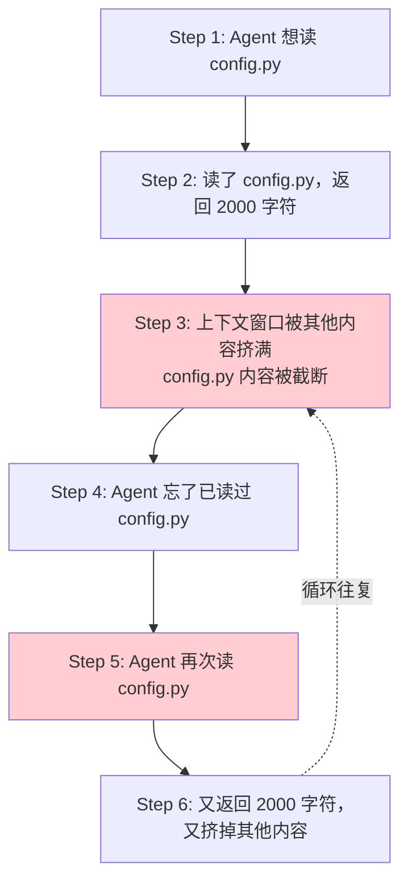
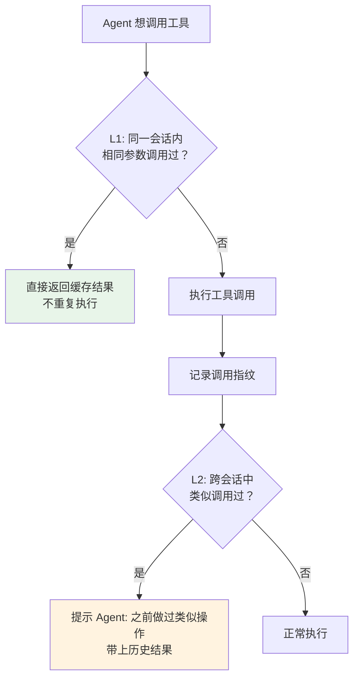

# 重复状态识别：避免 Agent 反复读同一文件或重复调用同一工具

> **一句话**：Agent 经常像金鱼一样---刚读完的文件忘了，再读一遍；刚调完的工具忘了，再调一遍。重复状态识别用「调用记录 + 哈希指纹」让 Agent 知道「这事我已经干过了，结果在这儿」。

---

## 一、问题本质：Agent 为什么容易「卡进循环」？

Agent 没有「刚才做了什么」的本能---LLM 的每一步推理在工程设计上是无状态的（stateless）。即便上次刚读了某个文件，如果没有显式地在上下文里记录，Agent 就「忘了」。



**常见的重复场景**：

| 场景 | 表现 | 浪费 |
|:----|:----|:----|
| 反复读同一文件 | `read_file("main.py")` 被调了 5 次 | 5x I/O + 5x token |
| 反复搜同一关键词 | `search_code("error_handler")` 调了 3 次 | 3x 检索 + 3x token |
| 反复分析同一模块 | `analyze_module("auth")` 在循环里被反复调用 | Nx LLM 推理 |
| 反复做同样的总结 | 每轮都重新总结用户偏好 | Nx LLM 推理 |

---

## 二、两层去重机制

| 层级 | 机制 | 解决什么 | 复杂度 |
|:----|:----|:----|:----|
| **L1：短期去重** | 哈希指纹 + 调用缓存 | 同一会话内，相同参数不重复执行 | 低 |
| **L2：长期去重** | visited-set + 持久化调用日志 | 跨会话识别「之前已经分析过这个模块」 | 中 |



---

## 三、L1：基于哈希的去重（Hash-Based Dedup）

为每次工具调用生成唯一指纹：`hash(tool_name + sorted_args)`。同一指纹 = 同一调用 = 不用再执行。

```python
import hashlib
import json
from typing import Any, Callable, Optional
from functools import wraps
from datetime import datetime

class ToolCallTracker:
    """工具调用追踪器：记录每次调用的指纹，避免重复"""
    
    def __init__(self):
        # fingerprint → result
        self._cache: dict[str, Any] = {}
        # fingerprint → metadata
        self._call_log: dict[str, dict] = {}
    
    @staticmethod
    def make_fingerprint(tool_name: str, args: dict, kwargs: dict = None) -> str:
        """
        生成调用指纹。
        
        关键：参数必须排序后序列化，确保 {a:1, b:2} 和 {b:2, a:1} 
        生成同一指纹。
        """
        payload = {
            "tool": tool_name,
            "args": args,
            "kwargs": kwargs or {},
        }
        raw = json.dumps(payload, sort_keys=True, ensure_ascii=False)
        return hashlib.sha256(raw.encode()).hexdigest()[:16]  # 前 16 位够用了
    
    def has_been_called(self, tool_name: str, args: dict, kwargs: dict = None) -> bool:
        """检查这个调用是否已经执行过"""
        fp = self.make_fingerprint(tool_name, args, kwargs)
        return fp in self._cache
    
    def get_cached_result(self, tool_name: str, args: dict, kwargs: dict = None) -> Optional[Any]:
        """获取缓存的结果"""
        fp = self.make_fingerprint(tool_name, args, kwargs)
        if fp in self._cache:
            return self._cache[fp]
        return None
    
    def record_call(
        self,
        tool_name: str,
        args: dict,
        kwargs: dict | None,
        result: Any,
        success: bool = True,
    ) -> str:
        """记录一次工具调用"""
        fp = self.make_fingerprint(tool_name, args, kwargs)
        self._cache[fp] = result
        self._call_log[fp] = {
            "tool": tool_name,
            "args": args,
            "kwargs": kwargs,
            "timestamp": datetime.now().isoformat(),
            "success": success,
        }
        return fp
    
    def get_call_count(self, tool_name: str) -> int:
        """统计某个工具的调用次数（含不同参数）"""
        return sum(
            1 for log in self._call_log.values()
            if log["tool"] == tool_name
        )
    
    def get_repeated_calls(self) -> list[dict]:
        """找出被重复调用过的工具（不同参数不算重复）"""
        seen: dict[str, list[dict]] = {}
        for fp, log in self._call_log.items():
            key = f"{log['tool']}:{json.dumps(log['args'], sort_keys=True)}"
            seen.setdefault(key, []).append(log)
        
        return [
            {"key": key, "count": len(logs), "calls": logs}
            for key, logs in seen.items()
            if len(logs) > 1
        ]
    
    def get_warning_for_context(self) -> str:
        """生成一段上下文字符串，提醒 LLM 哪些工具被重复调用了"""
        repeated = self.get_repeated_calls()
        if not repeated:
            return ""
        
        lines = ["## 重复调用警告"]
        for item in repeated:
            lines.append(
                f"- {item['key']} 被调用了 {item['count']} 次"
            )
        lines.append("请检查上述工具是否真的需要重复调用，优先使用已有结果。")
        return "\n".join(lines)


# ========== 去重装饰器 ==========

def deduplicate(tracker: ToolCallTracker):
    """装饰器：自动为工具函数加上去重逻辑"""
    def decorator(func: Callable) -> Callable:
        @wraps(func)
        def wrapper(*args, **kwargs):
            tool_name = func.__name__
            
            # 检查是否已调用过
            if tracker.has_been_called(tool_name, args, kwargs):
                print(f"[DEDUP] {tool_name} 参数相同，跳过执行 → 返回缓存结果")
                return tracker.get_cached_result(tool_name, args, kwargs)
            
            # 首次调用 → 正常执行
            result = func(*args, **kwargs)
            tracker.record_call(tool_name, args, kwargs, result)
            return result
        
        return wrapper
    return decorator


# ========== 使用示例 ==========
tracker = ToolCallTracker()

@deduplicate(tracker)
def read_file(path: str) -> str:
    print(f"  [I/O] 读取文件: {path}")
    with open(path, "r") as f:
        return f.read()

# 第一次：真读
content1 = read_file("/data/main.py")   # [I/O] 读取文件

# 第二次：去重拦截
content2 = read_file("/data/main.py")   # [DEDUP] 跳过执行

# 第三次：不同参数，正常执行
content3 = read_file("/data/utils.py")  # [I/O] 读取文件

# 检查重复调用
print(tracker.get_warning_for_context())
```

---

## 四、L2：Visited-Set 模式（跨文件/跨模块去重）

文件级别的去重是 Agent 最常见的需求---一次性分析项目中多个文件时，Agent 很容易重新分析已处理过的模块。

```python
class FileVisitedSet:
    """
    已访问文件集合：记录哪些文件已经读过了、什么时候读的、当时做了什么。
    不同于纯哈希去重，这里跟踪的是「文件是否已被分析」，
    参数不同（如每次读不同行号范围）也算已访问。
    """
    
    def __init__(self):
        self._visited: dict[str, dict] = {}
    
    def mark_visited(
        self,
        file_path: str,
        purpose: str,         # 当时为什么要读这个文件
        summary: str = "",    # 读取后做了什么/得出什么结论
    ):
        """标记一个文件已被访问"""
        self._visited[file_path] = {
            "accessed_at": datetime.now().isoformat(),
            "purpose": purpose,
            "summary": summary,
            "access_count": self._visited.get(file_path, {}).get("access_count", 0) + 1,
        }
    
    def is_visited(self, file_path: str) -> bool:
        """文件是否已访问过？"""
        return file_path in self._visited
    
    def get_file_context(self, file_path: str) -> Optional[str]:
        """获取文件的访问记录，可以注入给 LLM 提醒它不要重复读"""
        if file_path not in self._visited:
            return None
        
        record = self._visited[file_path]
        return (
            f"[已访问] {file_path}\n"
            f"  上次读取目的: {record['purpose']}\n"
            f"  当时结论: {record['summary']}\n"
            f"  累计访问次数: {record['access_count']}"
        )
    
    def get_all_visited_summary(self) -> str:
        """生成所有已访问文件的摘要列表"""
        if not self._visited:
            return ""
        
        lines = ["## 已分析文件清单（无需重复分析）"]
        for path, record in self._visited.items():
            lines.append(
                f"- `{path}` — {record['purpose']}"
                f"{' (已' + str(record['access_count']) + '次)' if record['access_count'] > 1 else ''}"
            )
        return "\n".join(lines)


# ========== 防循环看门狗 ==========

class LoopDetector:
    """
    循环检测器：当检测到相同模式的调用连续出现时，发出警告。
    不仅检测「完全相同」，还检测「高度相似」（编辑距离小或参数仅微量变化）。
    """
    
    def __init__(self, window_size: int = 10, similarity_threshold: int = 3):
        self.window_size = window_size
        self.similarity_threshold = similarity_threshold
        self.call_history: list[str] = []  # 最近 N 次调用的描述
    
    def record(self, call_description: str) -> Optional[str]:
        """
        记录一次调用，如果检测到循环模式则返回警告信息。
        
        call_description 示例: "read_file:/data/main.py"
        """
        self.call_history.append(call_description)
        
        # 只保留最近 window_size 条
        if len(self.call_history) > self.window_size:
            self.call_history = self.call_history[-self.window_size:]
        
        # 检测：最近 window 内是否出现了重复模式
        return self._detect_loop()
    
    def _detect_loop(self) -> Optional[str]:
        """检测重复循环模式"""
        if len(self.call_history) < 4:
            return None
        
        # 统计每个调用的出现次数
        from collections import Counter
        counts = Counter(self.call_history)
        
        for call_desc, count in counts.items():
            if count >= self.similarity_threshold:
                return (
                    f"[LOOP 警告] {call_desc} 在最近 "
                    f"{len(self.call_history)} 次调用中出现了 {count} 次，"
                    f"可能存在循环。请检查是否需要跳出。"
                )
        
        return None
    
    def inject_warning_to_context(self) -> str:
        """返回可注入 LLM 上下文的检测结果"""
        warning = self._detect_loop()
        return warning if warning else ""


# ========== 使用 ==========
loop_detector = LoopDetector()

# 模拟 Agent 反复读取同一文件
for i in range(5):
    description = "read_file:/data/config.py"
    warning = loop_detector.record(description)
    if warning:
        print(warning)
        # [LOOP 警告] read_file:/data/config.py 在最近 5 次调用中出现了 3 次...
```

---

## 五、去重对上下文的「元注入」

光做去重不够---Agent 需要**知道**去重发生了，否则它可能觉得「我调用了但没看到结果？再试一次」。

```python
class DedupContextInjector:
    """
    去重信息注入器：在每个推理轮次开始前，
    把「哪些工具被去重了」的信息注入到上下文中。
    """
    
    def __init__(self, tracker: ToolCallTracker, visited_set: FileVisitedSet):
        self.tracker = tracker
        self.visited_set = visited_set
    
    def build_injection(self) -> str:
        """构建注入上下文的去重提示"""
        parts = []
        
        # 1. 已访问文件清单
        file_summary = self.visited_set.get_all_visited_summary()
        if file_summary:
            parts.append(file_summary + "\n")
        
        # 2. 重复调用警告
        warning = self.tracker.get_warning_for_context()
        if warning:
            parts.append(warning + "\n")
        
        # 3. 调用统计
        total_calls = len(self.tracker._call_log)
        unique_calls = len(self.tracker._cache)
        if total_calls > 0:
            parts.append(
                f"## 调用统计\n总调用: {total_calls} 次 | "
                f"去重后实际执行: {unique_calls} 次 | "
                f"节省调用: {total_calls - unique_calls} 次"
            )
        
        return "\n".join(parts)


# ========== 每个推理轮次前注入 ==========
injector = DedupContextInjector(tracker, FileVisitedSet())

def build_agent_context(
    user_query: str,
    conversation_history: list[dict],
) -> list[dict]:
    """构建 Agent 上下文：把去重信息作为 system 消息注入"""
    
    dedup_hint = injector.build_injection()
    
    system_prompt = "你是代码分析助手..."
    if dedup_hint:
        system_prompt += f"\n\n## 去重提示（请务必遵守）\n{dedup_hint}"
    
    return [{"role": "system", "content": system_prompt}] + conversation_history
```

---

## 六、关联 cr-agent：Aggregator 去重

你项目中的 cr-agent 有 **Aggregator 节点**，它本质上也做了一类「去重」---当多个 Worker 对同一个文件提出相似修改建议时，Aggregator 把它们合并为一条。

```text
Worker A 说: src/auth.py:23 → 改用 bcrypt 替换 md5
Worker B 说: src/auth.py:23 → 密码哈希算法需要升级
Aggregator:   src/auth.py:23 → 改用 bcrypt 替换 md5（合并 A+B 的重复建议）
```

这是一种**语义级去重**，比参数哈希更高级---不是完全相同的调用，而是「说的是一回事」。


## 速记卡（面试闪卡）

**Q1：一句话讲清「重复状态识别：避免 Agent 反复读同一文件或重复调用同一工具」到底是什么？**
A：Agent 没有「刚才做了什么」的本能---LLM 的每一步推理在工程设计上是无状态的（stateless）。即便上次刚读了某个文件，如果没有显式地在上下文里记录，Agent 就「忘了」。
**常见的重复场景**：
| 场景 | 表现 | 浪费 |
|:----|:----|:----|
| 反复读同一文件 |  被调了 5 次 | 5x I/O + 5x token |

**Q2：一、问题本质：Agent 为什么容易「卡进循环」？ —— 怎么理解？**
A：Agent 没有「刚才做了什么」的本能---LLM 的每一步推理在工程设计上是无状态的（stateless）。即便上次刚读了某个文件，如果没有显式地在上下文里记录，Agent 就「忘了」。
**常见的重复场景**：
| 场景 | 表现 | 浪费 |
|:----|:----|:----|
| 反复读同一文件 |  被调了 5 次 | 5x I/O + 5x token |

**Q3：二、两层去重机制 —— 怎么理解？**
A：| 层级 | 机制 | 解决什么 | 复杂度 |
|:----|:----|:----|:----|
| **L1：短期去重** | 哈希指纹 + 调用缓存 | 同一会话内，相同参数不重复执行 | 低 |
| **L2：长期去重** | visited-set + 持久化调用日志 | 跨会话识别「之前已经分析过这个模块」 | 中 |
---

**Q4：三、L1：基于哈希的去重（Hash-Based Dedup） —— 怎么理解？**
A：为每次工具调用生成唯一指纹：。同一指纹 = 同一调用 = 不用再执行。
---

**Q5：四、L2：Visited-Set 模式（跨文件/跨模块去重） —— 怎么理解？**
A：文件级别的去重是 Agent 最常见的需求---一次性分析项目中多个文件时，Agent 很容易重新分析已处理过的模块。
---

**Q6：核心速记主线有哪些？**
A：抓住这几根：一、问题本质：Agent 为什么容易「卡进循环」？、二、两层去重机制、三、L1：基于哈希的去重（Hash-Based Dedup）、四、L2：Visited-Set 模式（跨文件/跨模块去重）、五、去重对上下文的「元注入」、六、关联 cr-agent：Aggregator 去重。


## 相关链接

- 目录：[[00-AI]]
- 上一篇：[[34-上下文压缩：任务摘要-文件摘要-过程笔记]]
- 下一篇：[[36-Reflexion：带自我反思的Agent]]
- 项目实践：[[项目实战/ai-resume笔记/01_技术研读/03_LangGraph状态机#Checkpoint 机制|ai-resume: LangGraph]]
- 项目实践：[[项目实战/cr-agent笔记/01-技术研读/01-Supervisor-Worker编排与StateGraph#🔴 记忆级：graph.py + state.py 逐行精读|cr-agent: StateGraph]]
- 理论基础：[[15-Agent架构与工具调用|Agent 四要素：LLM+工具+记忆+规划]]
- 关联：[[31-短期记忆：当前任务轨迹 + 工具结果缓存]] （工具结果缓存是去重的基础）

---
→ [[技术学习清单#记忆与上下文]]
