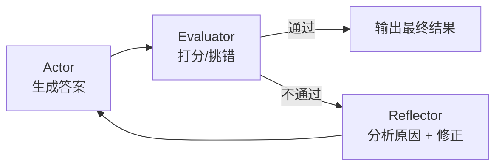
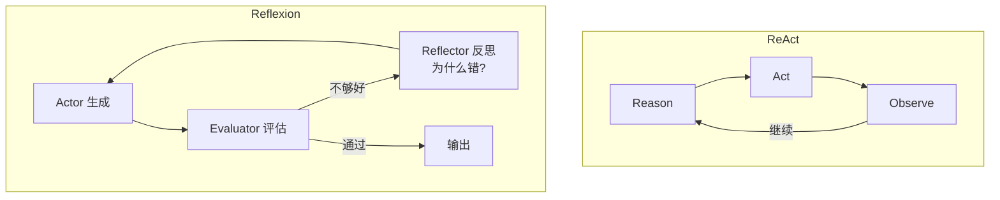

---

title: "Reflexion：带自我反思的Agent"

tags:

  - 技术学习

  - ai

  - agent

created: "2026-07-21"

---

# Reflexion：带自我反思的 Agent

> **一句话**：Reflexion 是一种让 Agent 在生成输出后、对自身结果做显式评估并自我修正的增强模式——相当于 Agent 多了个「回头看」的习惯，而不是写完就交卷。

---

## 一、什么是 Reflexion？

**Reflexion**（读「瑞-弗莱克-申」，直译「反射/反思」）= Actor 干活 + Evaluator 打分 + Reflector 修正，三步循环。

类比考试：普通 Agent 是「读完题直接写答案交卷」；Reflexion Agent 是「先写草稿 → 自己检查一遍 → 发现哪里不对 → 改一遍再交」。多了个**显式的自我评估步骤**。



---

## 二、Reflexion vs ReAct vs Self-RAG

三个概念都带「自我改进」的味道，但机制不同：

| 模式 | 核心机制 | 反思在哪一步 | 适用场景 |

|:----|:--------|:-----------|:--------|

| **ReAct** | Reason → Act → Observe，循环 | 没有显式反思，靠 Observe 结果自然调整 | 工具调用、多步推理 |

| **Self-RAG** | 检索后自检（hallucination 检测 + 相关性评分） | 在检索和生成之间插入判断节点 | RAG 场景的幻觉控制 |

| **Reflexion** | Actor → Evaluator → Reflector，三步循环 | **显式的独立评估步骤** + 失败原因分析 | 需要高质量输出的长任务 |

核心区别：ReAct 是在「行动-观察」中隐式调整；Reflexion 是**显式停下来、打分、分析为什么错、再改**。



---

## 三、三步循环详解
### Step 1: Actor（执行者）—— 生成

Actor 拿到任务描述和当前上下文，生成第一版输出。这一步和普通 LLM 调用没区别。

```python

def actor(task: str, context: str) -> str:

    """Actor: 生成初始答案"""

    prompt = f"""

    任务: {task}

    上下文: {context}

    请生成你的答案。

    """

    return call_llm(prompt)

```

### Step 2: Evaluator（评估者）—— 打分 / 挑错

Evaluator 拿到 Actor 的输出，按预设标准打分。**LLM-as-Judge 是 Evaluator 最常见的实现方式**——用另一个 LLM 调用来做评估。

```python

def evaluator(task: str, answer: str, criteria: list[str]) -> dict:

    """Evaluator: 用 LLM-as-Judge 打分"""

    criteria_text = "\n".join(f"- {c}" for c in criteria)

    prompt = f"""

    你是严格的质量评估员。请按以下标准给答案打分（1-10）：

    {criteria_text}

    任务: {task}

    答案: {answer}

    返回 JSON 格式:

    {{"score": <总分>, "passed": <true/false>, "feedback": "<哪里不好>"}}

    """

    result = call_llm(prompt)

    return json.loads(result)

```

常见的评估标准（criteria）：

| 维度 | 检查什么 | 例子 |

|:----|:------|:-----|

| 准确性 | 事实是否正确 | "Python 3.8 发布年份是 2019，答案写成了 2020" |

| 完整性 | 是否遗漏关键点 | "缺少对 GIL 的解释" |

| 相关性 | 是否答非所问 | "问的是时间复杂度，答案讲的是空间复杂度" |

| 一致性 | 内部逻辑是否自洽 | "前面说 O(n)，后面又说 O(1)" |

### Step 3: Reflector（反思者）—— 分析原因 + 修正

Reflector 接收 Evaluator 的反馈，**分析失败原因**，然后指导 Actor 重新生成。这不是简单地把 feedback 贴给 Actor——Reflector 要提炼出「根因」和「修正策略」。

```python

def reflector(task: str, failed_answer: str, feedback: str, attempt: int) -> str:

    """Reflector: 分析失败原因，生成修正策略"""

    prompt = f"""

    你是一位反思专家。上次答案没通过评估，请分析原因并给出修正策略。

    任务: {task}

    上次答案: {failed_answer}

    评估反馈: {feedback}

    当前尝试次数: {attempt}

    请返回:

    1. 失败根因: 一句话说清楚为什么出错

    2. 修正策略: 这次应该怎么改

    3. 修正后的答案: 直接输出

    """

    return call_llm(prompt)

```

---

## 四、完整 Reflexion 循环

```python

import json

from typing import Optional

class ReflexionAgent:

    """带自我反思的 Agent：Actor → Evaluator → Reflector 三步循环"""

    def __init__(self, max_iterations: int = 3, pass_threshold: int = 7):

        self.max_iterations = max_iterations  # 最多 2-3 轮，防死循环

        self.pass_threshold = pass_threshold   # 评分 ≥ 此值才算通过

        self.history: list[dict] = []          # 记录每轮的答案和反馈

    def run(self, task: str, context: str, criteria: list[str]) -> dict:

        """执行 Reflexion 循环，返回最终结果"""

        # Step 1: Actor 首次生成

        answer = self._actor(task, context)

        for attempt in range(self.max_iterations):

            self.history.append({"attempt": attempt, "answer": answer})

            # Step 2: Evaluator 评估

            eval_result = self._evaluator(task, answer, criteria)

            if eval_result["passed"]:

                return {

                    "answer": answer,

                    "attempts": attempt + 1,

                    "score": eval_result["score"],

                    "status": "passed",

                    "history": self.history,

                }

            # 最后一轮仍不通过 → 返回当前最佳答案 + 标注

            if attempt == self.max_iterations - 1:

                return {

                    "answer": answer,

                    "attempts": attempt + 1,

                    "score": eval_result["score"],

                    "status": "max_iterations_reached",

                    "history": self.history,

                }

            # Step 3: Reflector 反思 + 修正

            answer = self._reflector(task, answer, eval_result["feedback"], attempt + 1)

        return {"answer": answer, "status": "exhausted"}

    def _actor(self, task: str, context: str) -> str:

        prompt = f"任务: {task}\n上下文: {context}\n请生成你的最佳答案。"

        return call_llm(prompt)

    def _evaluator(self, task: str, answer: str, criteria: list[str]) -> dict:

        criteria_text = "\n".join(f"- {c}" for c in criteria)

        prompt = f"""

        你是严格的质量评估员。按以下标准打分（1-10）：

        {criteria_text}

        任务: {task}

        答案: {answer}

        返回 JSON: {{"score": int, "passed": bool, "feedback": "str"}}

        passed 为 true 当且仅当 score >= {self.pass_threshold}。

        """

        return json.loads(call_llm(prompt))

    def _reflector(self, task: str, failed_answer: str, feedback: str, attempt: int) -> str:

        prompt = f"""

        上次答案未通过评估。请反思并修正。

        任务: {task}

        上次答案: {failed_answer}

        评估反馈: {feedback}

        当前第 {attempt} 次修正

        直接输出修正后的答案，不要再犯上次的错误。

        """

        return call_llm(prompt)

```

---

## 五、为什么限制 2-3 轮？

**没有上限 = 死循环风险**。LLM 可能反复犯同样的错误，Reflector 也可能给出无效的修正建议，导致 Actor 在同一个坑里来回跳。

```python

# ❌ 危险: 无限循环

while not passed:

    answer = actor(task, answer)

    passed = evaluator(task, answer)

# ✅ 安全: 上限 3 轮

for i in range(3):

    answer = actor(task, answer)

    if evaluator(task, answer)["passed"]:

        break

```

经验数据：

- **第 1 轮**：通常质量已有 70-80%

- **第 2 轮**：修正明显错误，提升到 85-95%

- **第 3 轮**：边际收益递减，第 4 轮几乎无提升

- **超过 3 轮**：大概率是 Evaluator 标准太苛刻或任务本身超出模型能力

## 速记卡（面试闪卡）

**Q1：一句话讲清「Reflexion：带自我反思的 Agent」到底是什么？**

A：Reflexion 让 Agent 生成后自我评估并修正，多了个"回头看"。

**Q2：一、什么是 Reflexion —— 怎么理解？ —— 怎么理解？**

A：像考试写草稿再自查：普通 Agent 写完就交，Reflexion 先写→自己检查→发现错→改一遍再交，多了显式自评。英语：Actor-Evaluator-Reflector loop。

**Q3：二、和 ReAct/Self-RAG 差在哪 —— 怎么理解？ —— 怎么理解？**

A：像三种复盘法：ReAct 边做边看（隐式调），Self-RAG 检索时自检，Reflexion 显式停下打分、分析根因再改。英语：ReAct / Self-RAG。

**Q4：三、三步循环怎么跑 —— 怎么理解？ —— 怎么理解？**

A：像流水线质检：Actor 出初稿，Evaluator 用 LLM-as-Judge 按标准打分挑错，Reflector 提炼根因和修正策略再交回 Actor。英语：LLM-as-Judge。

**Q5：四、为何限 2-3 轮 —— 怎么理解？ —— 怎么理解？**

A：像改作文别改到天亮：没上限会死循环，同坑反复跳；第 2 轮通常 85-95%，第 4 轮几乎无收益。英语：max iterations（最大迭代）。

**Q6：核心速记主线有哪些？**

- Reflexion=Actor+Evaluator+Reflector 三步循环

- 与 ReAct/Self-RAG 区别在"显式自评"

- Evaluator 多用 LLM-as-Judge 打分

- 限 2-3 轮防死循环，边际收益递减

**口诀**

A：Reflexion 回头看，草稿写完先自检；

Actor 生成 Judge 判，Reflector 修正一遍。

显式评分找根因，莫与 ReAct 混一谈；

限轮三遍防死循环，高质量稳交卷。

## 相关链接

- 目录：[[00-AI]]

- 上一篇：[[35-重复状态识别：避免Agent反复读同一文件或重复调用同一工具]]

- 下一篇：[[37-Multi-Agent协作模式]]

- 前置知识：[[12-Self-RAG：自我反思+自纠正闭环]]（Self-RAG 中的自我评判机制是 Reflexion 的前置概念）

- 前置知识：[[15-Agent架构与工具调用]]（ReAct 循环是 Reflexion 的基础）

---

→ [[技术学习路线图#规划与高级模式]]

