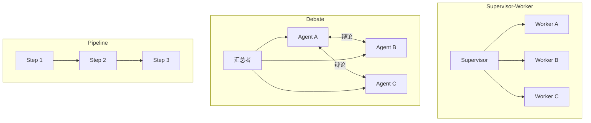
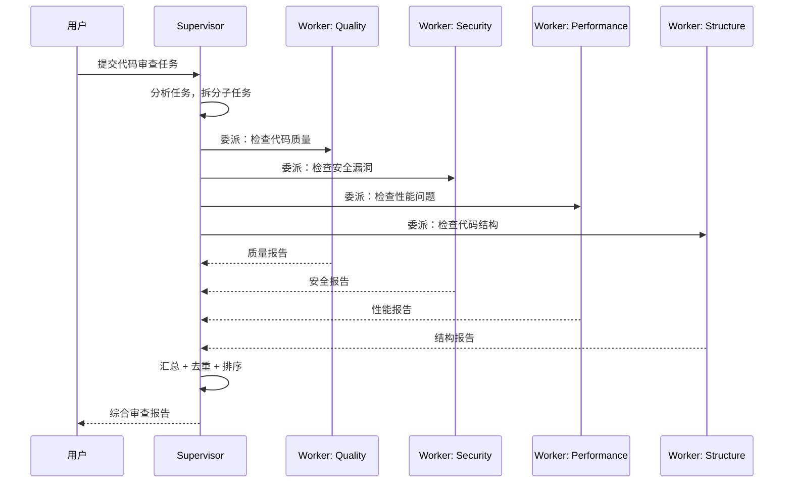

# Multi-Agent 协作模式

> **一句话**：Multi-Agent（多智能体）= 让多个各有所长的 Agent 像团队一样分工协作，而不是一个 Agent 包揽所有事。核心挑战不是「能不能对话」，而是「谁干什么、怎么交接、出错了谁兜底」。

---

## 一、为什么需要 Multi-Agent？

单个 Agent 的能力有天花板——上下文窗口有限、单一模型不可能样样精通、长链路任务中途断了全丢。Multi-Agent 的核心思路和人类团队一样：**把大任务拆成小任务，每人干自己最擅长的**。

对比单 Agent vs 多 Agent：

| 维度 | 单 Agent | Multi-Agent |
|:----|:--------|:-----------|
| 能力边界 | 受限于单模型 + 单上下文 | 各 Agent 用不同模型、不同工具 |
| 容错性 | 一处崩全崩 | 单 Agent 崩了其他继续 |
| 调试 | 一条线追踪 | 需要追踪 Agent 间交接 |
| 延迟 | 短 | 更长（多轮通信） |
| Token 开销 | 1x | Nx（每个 Agent 各自消耗） |

---

## 二、三种常见协作模式



### 模式对比表

| 模式 | 结构 | 控制流 | 适合场景 | 典型风险 |
|:----|:-----|:------|:--------|:--------|
| **Supervisor-Worker** | 一主多从，Supervisor 分配任务 | 集中式 | 任务可拆分为独立子任务 | Supervisor 单点瓶颈 |
| **Debate** | 平级 Agent 互相讨论 | 分散式 | 需要多视角达成共识 | 讨论跑偏、无限辩论 |
| **Pipeline** | 链式传递，每步一个 Agent | 顺序式 | 流程固定的多步任务 | 上游错误下游放大 |

---

## 三、Supervisor-Worker 深度解析（cr-agent 模式）

这是目前最成熟、最常用的多 Agent 模式。核心思想：**一个 Supervisor 当「工头」，几个 Worker 当「专家」，Supervisor 不干活只派活**。



### 代码骨架：Supervisor-Worker

```python
import asyncio
from dataclasses import dataclass, field
from enum import Enum

class TaskStatus(Enum):
    PENDING = "pending"
    WORKING = "working"
    COMPLETED = "completed"
    FAILED = "failed"

@dataclass
class SubTask:
    """Supervisor 下发的子任务"""
    id: str
    worker: str               # 指派给哪个 Worker
    description: str          # 任务描述
    status: TaskStatus = TaskStatus.PENDING
    result: str = ""

@dataclass
class WorkerAgent:
    """Worker: 各有所长的专家 Agent"""
    name: str
    expertise: str            # 专长描述（用于 Supervisor 分配任务）
    model: str                # 可独立选择模型
    tools: list[str] = field(default_factory=list)

    async def execute(self, task: SubTask) -> SubTask:
        """执行子任务，返回带结果的任务对象"""
        prompt = f"""
        你是 {self.name}，专长: {self.expertise}。
        请完成以下任务: {task.description}
        只做你专长范围内的事，不要越界。
        """
        task.status = TaskStatus.WORKING
        try:
            task.result = await call_llm(prompt)
            task.status = TaskStatus.COMPLETED
        except Exception as e:
            task.result = f"执行失败: {e}"
            task.status = TaskStatus.FAILED
        return task


class SupervisorAgent:
    """Supervisor: 只派活、汇总、不亲自干活"""

    def __init__(self, workers: list[WorkerAgent]):
        self.workers = {w.name: w for w in workers}

    async def run(self, user_request: str) -> str:
        # 1. 分析任务，拆分子任务
        subtasks = await self._plan(user_request)
        # 2. 分发给对应 Worker（可并行）
        completed = await self._dispatch(subtasks)
        # 3. 汇总、去重、排序
        return await self._aggregate(user_request, completed)

    async def _plan(self, user_request: str) -> list[SubTask]:
        """LLM 规划：把大任务拆成子任务，并匹配 Worker"""
        worker_list = "\n".join(
            f"- {w.name}: {w.expertise}" for w in self.workers.values()
        )
        prompt = f"""
        你是任务分配专家。根据用户需求和可用 Worker 拆分子任务。

        用户需求: {user_request}
        可用 Worker:
        {worker_list}

        返回 JSON 数组:
        [{{"worker": "Worker名", "description": "子任务描述"}}, ...]

        规则:
        - 每个子任务只分配给最匹配的 Worker
        - 能并行就拆开，不必串行
        - 不需要某类 Worker 就别分配
        """
        plan = json.loads(await call_llm(prompt))
        return [
            SubTask(id=f"task_{i}", worker=p["worker"], description=p["description"])
            for i, p in enumerate(plan)
        ]

    async def _dispatch(self, subtasks: list[SubTask]) -> list[SubTask]:
        """并行分发子任务给各 Worker"""
        async def run_one(task: SubTask) -> SubTask:
            worker = self.workers.get(task.worker)
            if not worker:
                task.status = TaskStatus.FAILED
                task.result = f"找不到 Worker: {task.worker}"
                return task
            return await worker.execute(task)

        return await asyncio.gather(*[run_one(t) for t in subtasks])

    async def _aggregate(self, request: str, completed: list[SubTask]) -> str:
        """汇总结果：去重、排序、生成最终报告"""
        results_text = "\n---\n".join(
            f"[{t.worker}] ({t.status.value}): {t.result}" for t in completed
        )
        prompt = f"""
        你是汇总专家。将以下 Worker 结果整合成一份连贯报告。

        用户原始需求: {request}
        Worker 结果:
        {results_text}

        要求: 去重、合并相似点、按重要性排序、标注冲突点。
        """
        return await call_llm(prompt)
```

---

## 四、幻觉放大风险（Hallucination Amplification）

这是 Multi-Agent 最容易被忽略的坑。Agent 链条每多一环，幻觉概率不是加法增长，而是**乘法放大**。

```text
单 Agent 幻觉率: 5%
Pipeline 3 个 Agent: 1 - (1-0.05)³ ≈ 14.3%（不是 5%×3=15%，但也很接近了）

更可怕的是: 上游 Agent 编了一个假事实，
下游 Agent 基于它继续推理 → 假事实被当成真前提 → 输出完全偏离。
```

**缓解手段**：

| 手段 | 做法 | 成本 |
|:----|:-----|:----|
| 交叉验证 | 关键事实让两个 Agent 独立查，对不上的标记 | 增加 1 次调用 |
| 溯源标注 | 每个 Agent 输出带上信息来源（哪个工具、哪次检索） | 提示词工程成本 |
| Supervisor 二审 | Supervisor 汇总时不只拼接，还要质疑各 Worker 的矛盾点 | Supervisor 的提示词设计 |
| 地面真相锚定 | 在关键节点注入确定性数据（数据库查询结果、API 返回值），不让 Agent 「猜」 | 工具调用成本 |

---

## 五、Pipeline 模式简述

Pipeline 是最简单的多 Agent 模式——像工厂流水线，每个 Agent 只做一个步骤，做完传给下一个。

```python
class PipelineAgent:
    """链式 Agent: 每个 Step 是一个独立 Agent"""

    def __init__(self, steps: list[callable]):
        self.steps = steps

    async def run(self, input_data: str) -> str:
        result = input_data
        for i, step in enumerate(self.steps):
            result = await step(result)  # 每步的输出是下一步的输入
        return result

# 例子: 简历处理流水线
pipeline = PipelineAgent([
    extract_text,      # Step 1: 提取纯文本
    parse_sections,    # Step 2: 解析段落结构
    extract_skills,    # Step 3: 提取技能关键词
    match_jobs,        # Step 4: 匹配职位
])
```

Pipeline 的风险：**上游一步错，下游全歪**。适用场景是流程固化、每步可独立验证的任务。

---

## 六、Debate 模式简述

Debate 模式让多个 Agent 从不同角度讨论一个议题，最终通过汇总者（Aggregator）合成结论。适合需要多视角验证的开放性问题。

核心机制：多轮讨论 → 每个 Agent 看到他人的观点后修正自己 → 汇总者找共识或标记分歧。

风险：可能陷入无限辩论（需设 max_rounds），且 Token 消耗极大（每轮 N 个 Agent 同时发言）。

---

## 七、A2A 协议：Multi-Agent 的通信底座

Multi-Agent 的「协作」需要标准化的通信协议。A2A（Agent2Agent Protocol）正是解决这个问题的开放标准——它定义了 Agent 如何发现彼此、委派任务、追踪状态。

详见：[[52-A2A协议核心概念|A2A 协议]]。关键概念速查：

| 概念 | 作用 | Multi-Agent 中的对应 |
|:----|:-----|:-------------------|
| Agent Card | 描述 Agent 身份和能力 | Worker 的「简历」 |
| Task | 有状态的任务生命周期 | Supervisor 下发的子任务 |
| Message / Part | 通信单元 | Agent 之间的对话内容 |
| Artifact | 最终产物 | Worker 交回的成果 |


## 
> ▶ 对应原理：[[29-多Agent协作基础与框架选型|29-多Agent协作基础与框架选型]]


> ▶ 对应原理：[[43-多Agent编排四种模式|43-多Agent编排四种模式]]


> ▶ 对应原理：[[52-A2A协议核心概念|52-A2A协议核心概念]]


> ▶ 对应原理：[[53-MCP-vs-A2A本质区别|53-MCP-vs-A2A本质区别]]

相关链接

- 目录：[[00-AI]]
- 上一篇：[[36-Reflexion：带自我反思的Agent]]
- 下一篇：[[38-Agent成本控制：Token用量分析+三级模型路由+语义缓存]]
- 通信协议：[[52-A2A协议核心概念|A2A 协议]]
- 前置知识：[[15-Agent架构与工具调用]]（单 Agent 架构是多 Agent 的基础）
- 项目实践：[[项目实战/cr-agent笔记/01-技术研读/01-Supervisor-Worker编排与StateGraph#🔴 记忆级：graph.py + state.py 逐行精读|cr-agent: Supervisor-Worker编排]]（4 个 Worker: Quality/Security/Performance/Structure）
- 项目实践：[[项目实战/ai-resume笔记/01_技术研读/03_LangGraph状态机#直接模式 vs MCP 模式|ai-resume: LangGraph状态机]]

---
→ [[技术学习清单#规划与高级模式]]

## 速记卡（面试闪卡）

**Q1：一句话讲清「Multi-Agent 协作模式」到底是什么？**
A：单个 Agent 的能力有天花板——上下文窗口有限、单一模型不可能样样精通、长链路任务中途断了全丢。Multi-Agent 的核心思路和人类团队一样：**把大任务拆成小任务，每人干自己最擅长的**。
对比单 Agent vs 多 Agent：
| 维度 | 单 Agent | Multi-Agent |
|:----|:--------|:-----------|

**Q2：一、为什么需要 Multi-Agent？ —— 怎么理解？**
A：单个 Agent 的能力有天花板——上下文窗口有限、单一模型不可能样样精通、长链路任务中途断了全丢。Multi-Agent 的核心思路和人类团队一样：**把大任务拆成小任务，每人干自己最擅长的**。
对比单 Agent vs 多 Agent：
| 维度 | 单 Agent | Multi-Agent |
|:----|:--------|:-----------|

**Q3：二、三种常见协作模式 —— 怎么理解？**
A：| 模式 | 结构 | 控制流 | 适合场景 | 典型风险 |
|:----|:-----|:------|:--------|:--------|
| **Supervisor-Worker** | 一主多从，Supervisor 分配任务 | 集中式 | 任务可拆分为独立子任务 | Supervisor 单点瓶颈 |

**Q4：三、Supervisor-Worker 深度解析（cr-agent 模式） —— 怎么理解？**
A：这是目前最成熟、最常用的多 Agent 模式。核心思想：**一个 Supervisor 当「工头」，几个 Worker 当「专家」，Supervisor 不干活只派活**。
---

**Q5：四、幻觉放大风险（Hallucination Amplification） —— 怎么理解？**
A：这是 Multi-Agent 最容易被忽略的坑。Agent 链条每多一环，幻觉概率不是加法增长，而是**乘法放大**。
**缓解手段**：
| 手段 | 做法 | 成本 |
|:----|:-----|:----|
| 交叉验证 | 关键事实让两个 Agent 独立查，对不上的标记 | 增加 1 次调用 |
| 溯源标注 | 每个 Agent 输出带上信息来源（哪个工具、哪次检索） | 提示词工程成本 |

**Q6：核心速记主线有哪些？**
A：抓住这几根：一、为什么需要 Multi-Agent？、二、三种常见协作模式、三、Supervisor-Worker 深度解析（cr-agent 模式）、四、幻觉放大风险（Hallucination Amplification）、五、Pipeline 模式简述、六、Debate 模式简述。

