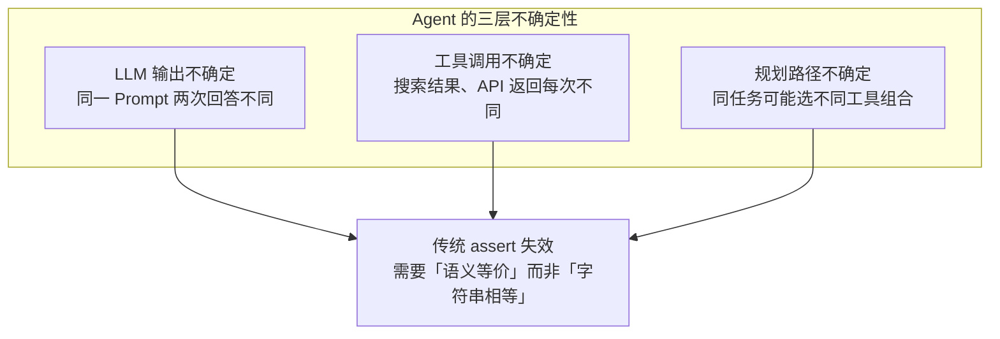
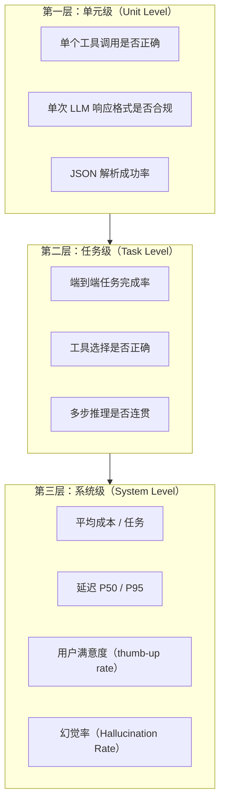
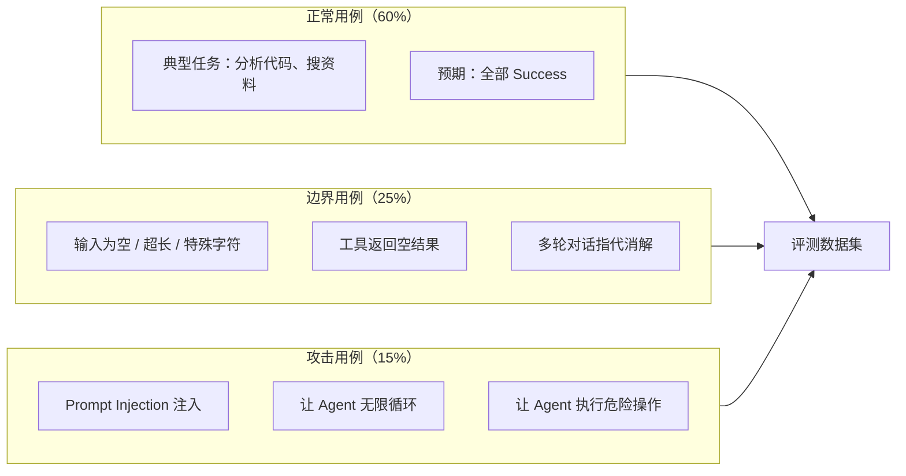
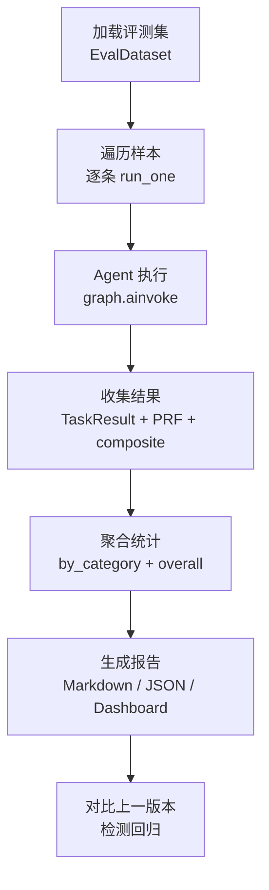

---

title: "Agent评测体系：benchmark / case / 指标设计"

tags:

  - 技术学习

  - ai

  - agent

  - 评测

created: "2026-07-21"

---

# Agent评测体系：benchmark / case / 指标设计

> **一句话**：Agent 评测比传统软件测试难一个维度——Agent 的输出是非确定性的（同一个输入每次回答不同）、多步骤的（一次任务涉及多次 LLM 调用 + 工具调用），传统「输入→断言输出」的单次测试模式直接失效。

---

## 一、为什么 Agent 评测比传统测试难？

传统软件测试是确定性的：`add(1, 2)` 永远返回 `3`，断言一次就够了。

Agent 有三个「不确定性来源」：



| 维度 | 传统软件测试 | Agent 评测 |

|:----|:----------|:---------|

| 输出确定性 | 确定（1+1=2） | 不确定（同一问题两次回答不同） |

| 断言方式 | `assert result == expected` | 语义等价判断（需要 LLM 辅助） |

| 测试粒度 | 函数级（单元测试） | 轨迹级（看整个执行过程） |

| 失败定位 | 哪行报错一目了然 | 是 LLM 决策错？工具返回错？还是规划错？ |

| 回归阈值 | 0 失败（全绿） | 允许浮动范围（如 composite > 0.8） |

---

## 二、三层评测体系

一份完整的 Agent 评测不是「跑完看对不对」，而是分三层逐级下钻：



### 三层分别回答什么问题

| 层级 | 回答的问题 | 谁来评 | 频率 |

|:----|:----------|:------|:----|

| **单元级** | 「Agent 的每一个子动作做对了吗？」 | 规则 + 断言 | 每次 commit |

| **任务级** | 「Agent 完成了一个完整任务吗？」 | LLM-as-Judge + 人工抽检 | 每次部署前 |

| **系统级** | 「Agent 上线后用户开心吗？烧钱吗？」 | 线上监控（Langfuse / Grafana） | 持续 |

---

## 三、核心指标一览
### 3.1 任务成功率（Success Rate）

```text

Success Rate = 成功完成任务数 / 总测试任务数

```

**「成功」怎么定义？** 这是 Agent 评测最难的问题。不能只看「最终答案对不对」，要看「过程对不对」：

```python

from dataclasses import dataclass, field

from enum import Enum

class TaskStatus(Enum):

    """任务执行状态枚举"""

    SUCCESS = "success"                         # 完成且结果正确 ✅

    PARTIAL_SUCCESS = "partial"                 # 步骤对了但结果有小错 ⚠️

    WRONG_APPROACH = "wrong_approach"           # 走了错误的工具/路径 ❌

    FAILED = "failed"                           # 完全失败 ❌❌

    TIMEOUT = "timeout"                         # 超时未完成 ⏱️

@dataclass

class TaskResult:

    """单条任务评测结果——记录 Agent 完成一个任务的完整轨迹"""

    task_id: str                                # 任务唯一标识

    status: TaskStatus                          # 执行状态

    steps_taken: int                            # 实际执行步数（Agent 走了几步）

    expected_steps: int                         # 预期最少步数（ground truth，可选）

    tool_calls: list[str]                       # 实际调用的工具序列（如 ["search","rerank","generate"]）

    expected_tool_sequence: list[str] = field(default_factory=list)  # 期望的工具序列（可选的 ground truth）

    @property

    def tool_sequence_match(self) -> float:

        """工具选择与预期的匹配度（0-1）

        衡量 Agent 是否选了正确的工具组合。

        1.0 = 完全符合预期；0.0 = 完全不同。

        """

        if not self.expected_tool_sequence:      # 无 ground truth → 跳过此项评估

            return 1.0

        matches = sum(

            1 for t in self.tool_calls           # 统计实际调用的工具中

            if t in self.expected_tool_sequence  # 有多少个在期望列表里

        )

        return matches / len(self.expected_tool_sequence)

    @property

    def step_efficiency(self) -> float:

        """步骤效率：最优步数 / 实际步数（越接近 1 越高效）

        如果 Agent 2 步能完成但花了 8 步，效率 = 2/8 = 0.25。

        """

        if self.steps_taken == 0 or self.expected_steps == 0:

            return 1.0                          # 无参考值 → 不扣分

        return min(self.expected_steps / self.steps_taken, 1.0)  # 上限 1.0

```

### 3.2 成本指标（Cost per Task）

```text

Cost per Task = 单次任务所有 LLM 调用的 Token 费用之和

```

**分模型统计**才有意义——不能把 deepseek-v4（0.3元/1M token）和 Claude Opus（50元/1M token）的成本混在一起算平均。

```python

@dataclass

class CostMetrics:

    """成本指标——分模型统计才有意义"""

    total_tokens: int = 0                        # 总 Token 消耗（prompt + completion）

    prompt_tokens: int = 0                       # 输入 Token

    completion_tokens: int = 0                   # 输出 Token

    total_cost_rmb: float = 0.0                  # 总成本（人民币）

    avg_cost_per_task_rmb: float = 0.0           # 平均每任务成本

    def estimate(self, prompt_price_per_1k: float, completion_price_per_1k: float):

        """按单价估算成本

        Args:

            prompt_price_per_1k: 输入每千 Token 价格（元）

            completion_price_per_1k: 输出每千 Token 价格（元）

        示例：DeepSeek-V4 约 0.3元/百万Token ≈ 0.0000003元/千Token

              Claude Opus 约 50元/百万Token → 成本差距可达百倍

        """

        self.total_cost_rmb = (

            self.prompt_tokens / 1000 * prompt_price_per_1k       # 输入成本

            + self.completion_tokens / 1000 * completion_price_per_1k  # 输出成本

        )

        return self.total_cost_rmb

```

### 3.3 延迟指标（Latency）

| 指标 | 含义 | 为什么重要 |

|:----|:----|:---------|

| **P50** | 50% 的请求在此时间内完成 | 大多数用户的体验 |

| **P95** | 95% 的请求在此时间内完成 | 长尾用户是否被拖死 |

| **P99** | 99% 的请求在此时间内完成 | 极端情况排查 |

| **TTFT** | Time To First Token | 用户看到第一个字的等待时间 |

```python

import time

import numpy as np

class LatencyTracker:

    """延迟追踪器——记录每次任务的端到端耗时"""

    def __init__(self):

        self.latencies: list[float] = []         # 每次任务的总耗时（秒）

    def record(self, start_time: float):

        """记录一次延迟"""

        self.latencies.append(time.time() - start_time)  # 当前时间 - 开始时间

    def stats(self) -> dict:

        """计算 P50 / P95 / P99 等百分位延迟

        P50 = 中位数延迟（50% 的请求在此时间内完成）

        P95 = 95% 的请求在此时间内完成（长尾用户体验）

        P99 = 99% 的极端情况（排查超长延迟用）

        """

        if not self.latencies:

            return {"p50": 0, "p95": 0, "p99": 0, "avg": 0, "count": 0}

        arr = np.array(self.latencies)

        return {

            "p50": float(np.percentile(arr, 50)),        # 中位数

            "p95": float(np.percentile(arr, 95)),        # 长尾

            "p99": float(np.percentile(arr, 99)),        # 极端

            "avg": float(np.mean(arr)),                  # 平均值

            "max": float(np.max(arr)),                   # 最大值

            "count": len(self.latencies),                # 样本数

        }

```

### 3.4 幻觉率（Hallucination Rate）

```text

Hallucination Rate = 包含幻觉的响应数 / 总响应数

```

幻觉分三类：

- **事实幻觉**：说「Python 3.14 支持模式匹配」→ 实际是 3.10

- **来源幻觉**：说「这篇论文发表于 2023 年 Nature」→ 实际是 2021 年 arXiv

- **能力幻觉**：说「我可以访问你的本地文件」→ 实际没有文件系统工具

---

## 四、Benchmark 设计：三层测试用例

一个靠谱的 Agent benchmark 必须覆盖三类场景：



### 评测集数据结构

```python

from dataclasses import dataclass, field

@dataclass

class EvalSample:

    """单条评测样本"""

    id: str                        # 唯一标识，如 "code-review-001"

    category: str                  # 分类：normal / edge / attack

    sub_category: str              # 子分类：security / quality / performance / structure

    input: dict                    # Agent 输入（code + language 等）

    expected_behavior: str         # 期望行为描述（自然语言，给 judge 参考）

    expected_tools: list[str]      # 期望调用的工具序列

    expected_findings: list[dict]  # 期望输出的 finding 列表

    max_steps: int = 20            # 最大允许步数

    difficulty: str = "medium"     # 难度：easy / medium / hard

@dataclass

class EvalDataset:

    """评测数据集"""

    name: str

    version: str

    samples: list[EvalSample]

    @property

    def by_category(self) -> dict[str, list[EvalSample]]:

        """按分类聚合"""

        result = {}

        for s in self.samples:

            result.setdefault(s.category, []).append(s)

        return result

    @property

    def stats(self) -> dict:

        """数据集统计"""

        by_cat = self.by_category

        return {

            "total": len(self.samples),

            "categories": {k: len(v) for k, v in by_cat.items()},

            "difficulty": {

                "easy": sum(1 for s in self.samples if s.difficulty == "easy"),

                "medium": sum(1 for s in self.samples if s.difficulty == "medium"),

                "hard": sum(1 for s in self.samples if s.difficulty == "hard"),

            },

        }

```

---

## 五、评测流水线：从 run 到 report



### 评分汇总逻辑

```python

def summarize_results(results: list[dict]) -> dict:

    """

    汇总一批评测结果 → 产出 summary 字典。

    results 中每条包含 composite_score, prf_f1, cost, latency, status 等字段.

    """

    n = len(results)

    if n == 0:

        return {"error": "empty results"}

    # 基础统计

    success_count = sum(1 for r in results if r["status"] == "success")  # 成功任务数

    total_cost = sum(r.get("cost_rmb", 0) for r in results)              # 总成本

    latencies = [r["latency_sec"] for r in results if "latency_sec" in r] # 延迟列表

    return {

        "total_samples": n,

        "success_rate": success_count / n,                               # 任务成功率

        "avg_composite": sum(r["composite_score"] for r in results) / n,  # 平均综合分

        "avg_f1": sum(r["prf_f1"] for r in results) / n,                 # 平均 PRF-F1

        "total_cost_rmb": total_cost,                                    # 总成本（元）

        "avg_cost_per_task": total_cost / n,                             # 每任务平均成本

        "p50_latency": float(np.percentile(latencies, 50)) if latencies else 0,  # P50 延迟

        "p95_latency": float(np.percentile(latencies, 95)) if latencies else 0,  # P95 延迟

        "by_category": _group_by_category(results),                      # 按分类聚合

    }

def _group_by_category(results: list[dict]) -> dict:

    """按分类聚合"""

    groups = {}

    for r in results:

        cat = r.get("category", "unknown")

        groups.setdefault(cat, []).append(r)

    return {

        cat: {

            "count": len(items),

            "avg_composite": sum(i["composite_score"] for i in items) / len(items),

            "success_rate": sum(1 for i in items if i["status"] == "success") / len(items),

        }

        for cat, items in groups.items()

    }

```

## 速记卡（面试闪卡）

**Q1：一句话讲清「Agent评测体系：benchmark / case / 指标设计」到底是什么？**

A：Agent评测体系：benchmark / case / 指标设计

**Q5：复杂度与实战考量 —— 怎么理解？**

A：复杂度与实战考量 一节以代码与图示为主，结合上下文与示例理解即可。

**Q6：核心速记主线有哪些？**

A：抓住核心概念与实战要点。

**口诀**

A：Agent评测体系：benchmark / case / 指标设计：核心思路解，

思路清晰不纠结；

复杂度要记牢，

一遍写对稳拿下。

## 相关链接

- 目录：[[00-AI]]

- 系列参考：[[38-Agent成本控制：Token用量分析+三级模型路由+语义缓存]]

---

→ [[技术学习路线图#Harness 与评测]]

