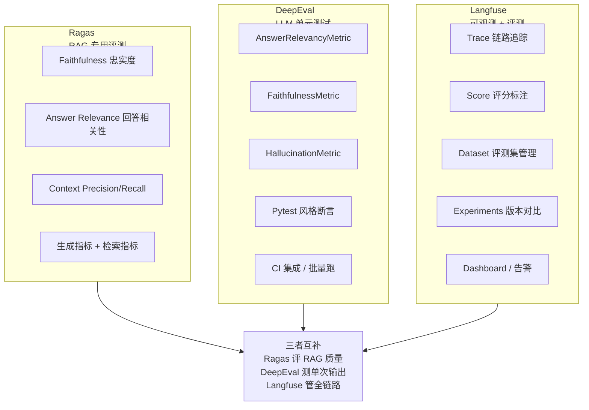
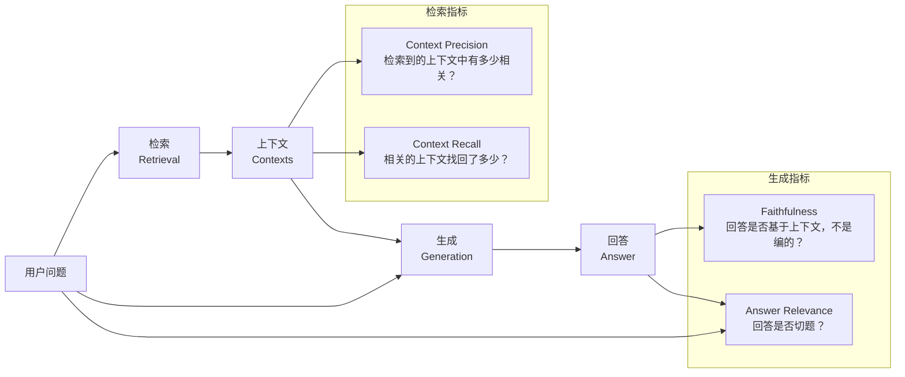
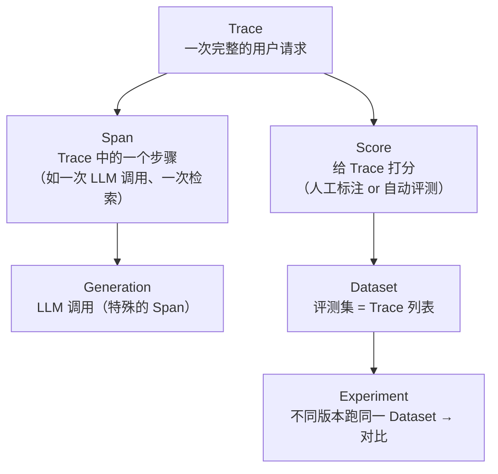

# LLM-as-Judge评测工具链：Ragas / DeepEval / Langfuse 配置与接入

> **一句话**：LLM-as-Judge 的核心思想是「用一个更聪明的 LLM 去评估另一个 LLM 的输出」——因为人类不可能给每一次 Agent 输出手工打分，而规则匹配又理解不了语义相似性。

---

## 一、什么是 LLM-as-Judge？

LLM-as-Judge 把评测本身变成一个 LLM 调用：

```text
传统评测流程：
  实际输出 vs 期望输出 → 字符串匹配 / 规则 → 得分

LLM-as-Judge 流程：
  实际输出 + 期望行为 + 评分标准 → Judge LLM → JSON {completeness: 0.9, accuracy: 0.8, ...}
```

**为什么不用传统方法？** 因为 Agent 的输出是自然语言，而自然语言的「对错」是语义层面的：

| 场景 | 期望回答 | 实际回答 | 规则匹配判 | LLM Judge 判 |
|:----|:--------|:--------|:---------|:-----------|
| 代码审查 | "第10行有SQL注入风险" | "发现SQL注入漏洞，位于line 10" | ❌ 0分（字符串不匹配） | ✅ 高分（语义等价） |
| 简历解析 | skills=["Python"] | skills=["Python语言"] | ❌ 字符串不等 | ✅ "Python语言"≈"Python" |
| 分类 | category="security" | category="安全" | ❌ 中英文不匹配 | ✅ 语义相同 |

---

## 二、三大工具概览



### 三者定位对比

| 工具 | 核心用途 | 适合场景 | 不适合 |
|:----|:--------|:--------|:------|
| **Ragas** | RAG 管道评测 | RAG 系统的检索+生成质量 | 非 RAG 场景（如纯对话） |
| **DeepEval** | LLM 输出的单元测试 | CI 流水线中的自动化评测 | 复杂的多步 Agent 评测 |
| **Langfuse** | 全链路可观测 + 评测管理 | 线上追踪 + 实验对比 + 人工标注 | 离线批量评测（用 Ragas/DeepEval 更专业） |

---

## 三、Ragas：RAG 评测框架

Ragas（**RAG** **A**ssessment）专为 RAG 管道设计，核心思想是把评测拆成「检索指标」和「生成指标」。



### 代码实操：用 Ragas 评测 RAG 管道

```python
"""
用 Ragas 评测一条 RAG 问答的质量。
安装：pip install ragas datasets langchain-openai
"""
from ragas import evaluate, EvaluationDataset
from ragas.metrics import (
    Faithfulness,          # 忠实度：回答是否基于检索到的上下文
    AnswerRelevancy,       # 回答相关性：回答是否切题
    ContextPrecision,      # 上下文精确率：检索到的文档有多少相关
    ContextRecall,         # 上下文召回率：相关文档找回了多少
)
from ragas.llms import LangchainLLMWrapper
from langchain_openai import ChatOpenAI

# 第1步：创建 Judge LLM（用来评分的模型，通常用更强的模型）
judge_llm = LangchainLLMWrapper(ChatOpenAI(
    model="gpt-4o",        # 用强模型做裁判
    temperature=0.0,       # 评分要确定性，温度设 0
))

# 第2步：构建评测数据集
dataset = EvaluationDataset.from_list([
    {
        "user_input": "Python 的 GIL 是什么？有什么影响？",
        "response": (
            "GIL（Global Interpreter Lock，全局解释器锁）是 CPython 中的互斥锁，"
            "确保同一时刻只有一个线程执行 Python 字节码。这意味着 CPU 密集型多线程"
            "程序无法利用多核优势，但 I/O 密集型程序仍可通过多线程获得性能提升。"
        ),
        "retrieved_contexts": [
            "GIL 是 CPython 中的全局解释器锁，同一时刻只允许一个线程执行 Python 代码。",
            "I/O 密集型任务可以绕过 GIL 限制，因为 I/O 操作会释放 GIL。",
            "Python 3.13 引入了实验性的 Free-Threaded 模式，允许禁用 GIL。",
        ],
        "reference": (
            "GIL 是 CPython 的全局解释器锁，限制同一时刻只有一个线程执行字节码，"
            "影响 CPU 密集型多线程程序的性能。"
        ),
    },
])

# 第3步：定义评测指标
metrics = [
    Faithfulness(llm=judge_llm),        # 回答是否忠实于检索内容
    AnswerRelevancy(llm=judge_llm),     # 回答是否切题
    ContextPrecision(llm=judge_llm),    # 检索到的内容有多相关
    ContextRecall(llm=judge_llm),       # 相关内容找回了多少
]

# 第4步：跑评测
result = evaluate(dataset, metrics=metrics)

#  'context_precision': 0.75, 'context_recall': 0.80}
print(result)
```

### Ragas 指标速查

| 指标 | 含义 | 高是好还是低是好 | 典型阈值 |
|:----|:----|:-------------|:-------|
| **Faithfulness** | 回答是否基于检索内容，不是编的 | 高好（> 0.85） | 0.85 |
| **Answer Relevancy** | 回答是否切题，没跑偏 | 高好（> 0.80） | 0.80 |
| **Context Precision** | 检索到的文档有多少相关（不冗余） | 高好（> 0.70） | 0.70 |
| **Context Recall** | 相关文档找回了多少（不遗漏） | 高好（> 0.75） | 0.75 |

> [!tip] Faithfulness 是最重要的指标——它直接回答「Agent 有没有在幻觉」。只要 faithfulness 低，其他指标再好也不能上线。

---

## 四、DeepEval：LLM 输出的单元测试框架

DeepEval 把评测变成**可 CI 执行的自动化测试**——Pytest 风格，直接用 `assert` 断言。

```python
"""
DeepEval 示例：用 Pytest 风格断言 LLM 输出质量。
安装：pip install deepeval
"""
from deepeval import assert_test
from deepeval.test_case import LLMTestCase
from deepeval.metrics import AnswerRelevancyMetric, FaithfulnessMetric, HallucinationMetric

def test_code_review_accuracy():
    """测试：代码审查 LLM 输出的准确性"""
    test_case = LLMTestCase(
        input="审查以下 Python 代码：\ndef divide(a, b):\n    return a / b",
        actual_output="""
        发现问题：
        1. 第1行：缺少除零检查，b=0 会抛出 ZeroDivisionError
        2. 建议添加参数类型注解以提高可读性
        """,
        # 期望行为描述（给 Judge LLM 参考，不是精确字符串匹配）
        expected_output="应指出除零风险和缺少类型注解",
        # 检索到的上下文（如果涉及 RAG 的话，这里为空）
        retrieval_context=[],
    )

    # 用三个指标分别断言
    answer_relevancy = AnswerRelevancyMetric(threshold=0.7)
    faithfulness = FaithfulnessMetric(threshold=0.8)
    hallucination = HallucinationMetric(threshold=0.8)

    # 每条断言是一个独立的评测——任何一条不通过则测试失败
    assert_test(test_case, [answer_relevancy, faithfulness, hallucination])

def test_no_hallucination():
    """测试：Agent 不应该生成幻觉内容"""
    test_case = LLMTestCase(
        input="Python 3.14 有什么新特性？",
        actual_output="Python 3.14 尚未发布，目前最新稳定版是 Python 3.13。",
        expected_output="应正确指出 Python 3.14 未发布",
    )
    hallucination = HallucinationMetric(threshold=0.9, minimum_score=0.85)
    assert_test(test_case, [hallucination])

# CI 里加一步 pytest tests/eval/ → 评测不通过 = pipeline 失败
```

### DeepEval 常用指标

| Metric | 测什么 | 需要 expected_output？ |
|:----|:----|:---:|
| `AnswerRelevancyMetric` | 回答是否切题 | 否 |
| `FaithfulnessMetric` | 回答是否基于给定上下文 | 否（需要 retrieval_context） |
| `HallucinationMetric` | 回答是否包含幻觉 | 是 |
| `ToxicityMetric` | 回答是否含有毒内容 | 否 |
| `BiasMetric` | 回答是否带有偏见 | 否 |
| `SummarizationMetric` | 摘要质量（覆盖度+对齐度） | 否 |

---

## 五、Langfuse：可观测 + 评测一体化平台

Langfuse 不是「纯粹的评测工具」——它是**可观测平台**，但内置了评分和实验对比功能。

### 核心概念



### 接入代码（FastAPI 示例）

```python
"""
Langfuse 接入 FastAPI：自动追踪 LLM 调用 + 记录评测分数。
安装：pip install langfuse
环境变量：LANGFUSE_PUBLIC_KEY, LANGFUSE_SECRET_KEY, LANGFUSE_HOST
"""
from langfuse import Langfuse
from langfuse.decorators import observe, langfuse_context

# 初始化客户端（自动读环境变量）
langfuse = Langfuse()

@observe()  # 装饰器自动创建 Trace
async def review_code(code: str, language: str) -> dict:
    """代码审查入口——每次调用自动生成一条 Trace"""
    # 1. 记录当前 Trace 的元数据
    langfuse_context.update_current_trace(
        name="code-review",
        metadata={"language": language, "code_length": len(code)},
        tags=["production", "code-review"],
    )

    # 2. 调用 LLM（Langfuse 自动记为 Generation Span）
    result = await call_llm_review(code, language)

    # 3. 记录评测分数
    langfuse_context.score_current_trace(
        name="latency_sec",
        value=result["latency_sec"],
    )
    langfuse_context.score_current_trace(
        name="composite_score",
        value=result["composite"],
        comment=f"completeness={result['completeness']}, accuracy={result['accuracy']}",
    )

    return result

@observe(as_type="generation")  # 明确标记为 LLM Generation
async def call_llm_review(code: str, language: str) -> dict:
    """实际的 LLM 调用"""
    # ... OpenAI API 调用
    pass

# 也可以手动创建 Trace（不用装饰器，适合非函数入口场景）
def manual_tracing_example():
    trace = langfuse.trace(name="batch-eval-run")
    for i, sample in enumerate(dataset):
        span = trace.span(name=f"eval-sample-{i}")
        # 跑评测...
        span.score(name="composite", value=0.85)
        span.end()
    trace.end()
```

---

## 六、LLM-as-Judge 的局限与应对

用 LLM 当裁判不是免费的午餐，有四个硬伤：

| 局限 | 说明 | 应对策略 |
|:----|:----|:--------|
| **裁判偏见** | Judge LLM 也有自己的偏好（偏好长回答、偏好某种风格） | 用多个 Judge 模型交叉验证 |
| **成本** | 每次评测都是 LLM 调用，数据集大了烧钱 | rule_based 做初筛，LLM Judge 只判边界 case |
| **不一致性** | 同一输出两次评测分数可能不同（temperature > 0） | `temperature=0.0` + 多次取平均 |
| **Prompt 敏感性** | Judge 的评分标准全靠 Prompt，改 Prompt 分数就变 | 固定 Judge Prompt，版本管理 |

```python
# 应对裁判偏见：多 Judge 交叉验证
JUDGE_MODELS = ["gpt-4o", "claude-sonnet-5", "deepseek-v4-pro"]

async def multi_judge_evaluate(sample: dict) -> dict:
    """用多个 Judge 模型分别打分，取平均降低单裁判偏差"""
    scores = {}
    for model in JUDGE_MODELS:
        judge = get_judge_client(model)
        score = await judge_with_llm(
            code=sample["code"],
            expected_findings=sample["expected"],
            actual_report=sample["report"],
            client=judge,
        )
        scores[model] = score

    # 取平均 + 计算标准差（衡量一致性）
    composites = [s.composite for s in scores.values()]
    return {
        "avg_composite": sum(composites) / len(composites),
        "std_composite": float(np.std(composites)),  # std 大 → 分数不可信
        "per_model": {m: s.composite for m, s in scores.items()},
    }
```

## 速记卡（面试闪卡）

**Q1：一句话讲清「LLM-as-Judge评测工具链：Ragas / DeepEval / Langfuse 配置与接入」到底是什么？**
A：LLM-as-Judge 的核心思想是「用一个更聪明的 LLM 去评估另一个 LLM 的输出」——因为人类不可能给每一次 Agent 输出手工打分，而规则匹配又理解不了语义相似性。

**Q2：一、什么是 LLM-as-Judge？ —— 怎么理解？**
A：LLM-as-Judge 把评测本身变成一个 LLM 调用： **为什么不用传统方法？** 因为 Agent 的输出是自然语言，而自然语言的「对错」是语义层面的： 代码审查："第10行有SQL注入风险"，"发现SQL注入漏洞，位于line 10"，❌ 0分（字符串不匹配），✅ 高分（语义等价）；

**Q3：二、三大工具概览 —— 怎么理解？**
A：**Ragas**：RAG 管道评测，RAG 系统的检索+生成质量，非 RAG 场景（如纯对话）；**DeepEval**：LLM 输出的单元测试，CI 流水线中的自动化评测，复杂的多步 Agent 评测；**Langfuse**：全链路可观测 + 评测管理，线上追踪 + 实验对比 + 人工标注，离线批量评测（用 Ragas/DeepEval 更专业）。

**Q4：三、Ragas：RAG 评测框架 —— 怎么理解？**
A：Ragas（**RAG** **A**ssessment）专为 RAG 管道设计，核心思想是把评测拆成「检索指标」和「生成指标」。 **Faithfulness**：回答是否基于检索内容，不是编的，高好（> 0.85），0.85；**Answer Relevancy**：回答是否切题，没跑偏，高好（> 0.80），0.80；

**Q5：四、DeepEval：LLM 输出的单元测试框架 —— 怎么理解？**
A：DeepEval 把评测变成**可 CI 执行的自动化测试**——Pytest 风格，直接用 `assert` 断言。 `AnswerRelevancyMetric`：回答是否切题，否；`FaithfulnessMetric`：回答是否基于给定上下文，否（需要 retrieval_context）；`HallucinationMetric`：回答是否包含幻觉，是；

**Q6：核心速记主线有哪些？**
A：抓住这几根：一、什么是 LLM-as-Judge？、二、三大工具概览、三、Ragas：RAG 评测框架、四、DeepEval：LLM 输出的单元测试框架、五、Langfuse：可观测 + 评测一体化平台、六、LLM-as-Judge 的局限与应对

**口诀**
A：LLM-as-Judge：什么是 LLM-as-Judge？先想；
三大工具概览配Ragas：RAG 评测框架，
DeepEval：LLM 输出的单元测试框架不能忘，
面试对答底气壮。

## 相关链接

- 目录：[[00-AI]]
- 上一篇：[[39-Agent评测体系：benchmark-case-指标设计]]
- 系列参考：[[10-RAG评估：检索指标+生成指标]]
- 系列参考：[[13-RAG参数调优：网格搜索实验框架]]

---

→ [[技术学习路线图#Harness 与评测]]
