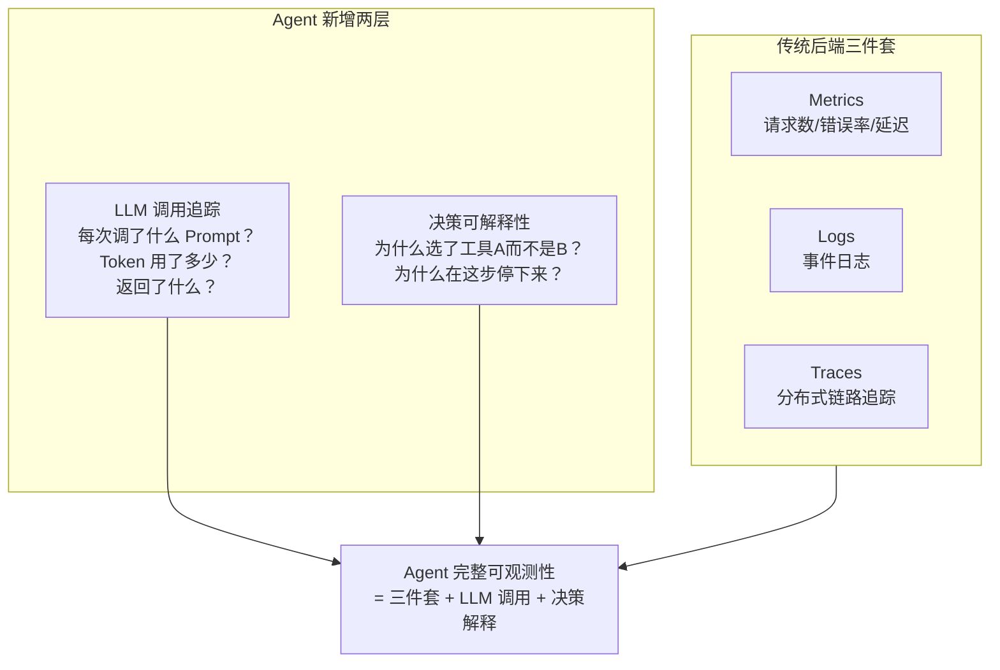
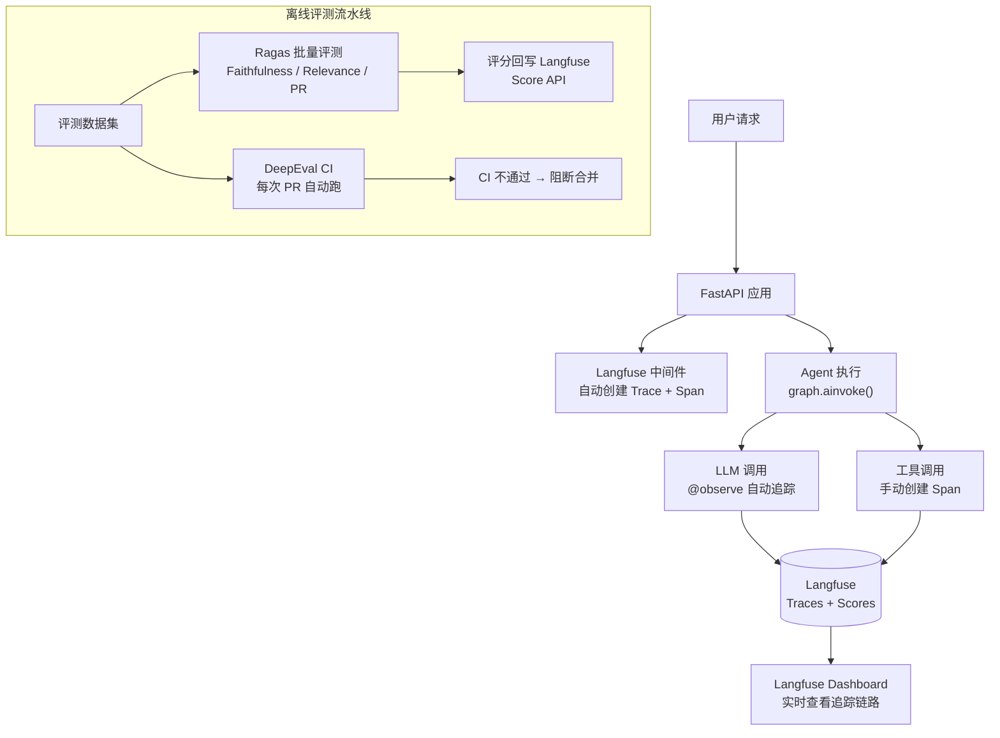
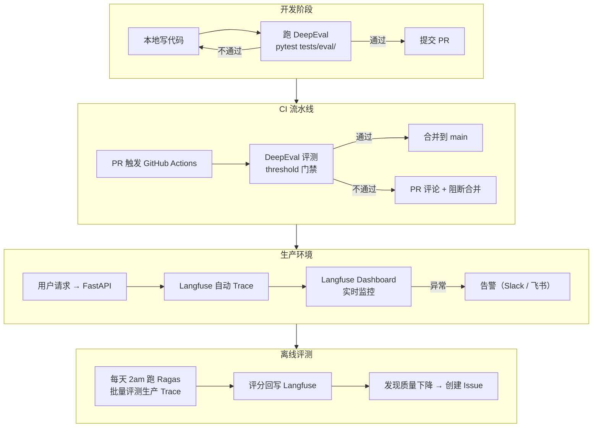

---

title: "可观测性工具链实操：Langfuse / Ragas / DeepEval 链路追踪与评测"

tags:

  - 技术学习

  - ai

  - agent

  - 可观测性

  - 评测

created: "2026-07-21"

---

# 可观测性工具链实操：Langfuse / Ragas / DeepEval 链路追踪与评测

> **一句话**：Agent 的可观测性不止是「打日志」——而是要追踪每一次 LLM 调用、每一次工具调用、每一次状态变更，让 Agent 的执行过程从「黑盒」变成「透明水管」——水流过每一步都看得见。

---

## 一、Agent 可观测性的三个层次

传统后端服务的可观测性只需要三件套：Metrics + Logs + Traces。Agent 多了一层——你得看见 LLM 的「思考过程」。



### 三层分别需要什么工具

| 层次 | 需要追踪什么 | 用什么工具 | 谁来看 |

|:----|:----------|:---------|:------|

| **基础设施层** | CPU / 内存 / 请求量 / 错误率 | Prometheus + Grafana | DevOps |

| **LLM 调用层** | Token 用量 / 延迟 / Prompt/Response 内容 | Langfuse | 开发者 + PM |

| **质量评测层** | Faithfulness / Relevance / 幻觉率 | Ragas + DeepEval | 开发者 + QA |

---

## 二、端到端集成架构

三工具在一个项目中不是竞争关系——各管一摊：



---

## 三、Langfuse：全链路追踪核心
### 3.1 部署 Langfuse（本地 / 自托管）

```bash

# 方式一：Docker Compose 自托管（开发环境推荐）

git clone https://github.com/langfuse/langfuse.git

cd langfuse

docker compose up -d

# 注册 https://cloud.langfuse.com → 获取 Public Key + Secret Key

```

### 3.2 FastAPI 集成：中间件自动创建 Trace

```python

"""

Langfuse + FastAPI 完整集成示例。

核心思路：用中间件为每个 HTTP 请求创建 Trace，

         Agent 内部的 LLM 调用和工具调用自动挂为子 Span。

安装：pip install langfuse fastapi

环境变量：

  LANGFUSE_PUBLIC_KEY=pk-...

  LANGFUSE_SECRET_KEY=sk-...

  LANGFUSE_HOST=http://localhost:3000  # 自托管地址

"""

import time

import uuid

from contextvars import ContextVar

from fastapi import FastAPI, Request

from langfuse import Langfuse

from langfuse.decorators import observe, langfuse_context

app = FastAPI()

langfuse = Langfuse()

# 用 contextvars 在请求生命周期内传递 trace_id

current_trace_id: ContextVar[str] = ContextVar("trace_id", default="")

@app.middleware("http")

async def langfuse_trace_middleware(request: Request, call_next):

    """

    中间件：每个 HTTP 请求创建一个 Langfuse Trace。

    Agent 内部的所有 LLM 调用都自动挂在这个 Trace 下。

    """

    trace_id = str(uuid.uuid4())[:8]

    current_trace_id.set(trace_id)

    # 创建 Trace

    trace = langfuse.trace(

        id=trace_id,

        name=f"{request.method} {request.url.path}",

        metadata={

            "method": request.method,

            "path": request.url.path,

            "user_agent": request.headers.get("user-agent", ""),

        },

    )

    start_time = time.time()

    try:

        response = await call_next(request)

        duration = time.time() - start_time

        # 记录成功

        trace.update(

            output={"status_code": response.status_code},

            metadata={"duration_sec": round(duration, 3)},

        )

        trace.score(name="latency_sec", value=duration)

        return response

    except Exception as e:

        duration = time.time() - start_time

        # 记录失败

        trace.update(

            output={"error": str(e)},

            metadata={"duration_sec": round(duration, 3)},

        )

        trace.score(name="error", value=1)

        raise

    finally:

        # 确保 Trace 被 flush

        langfuse.flush()

@observe()

async def run_agent_task(task_input: dict) -> dict:

    """

    Agent 主入口——@observe 装饰器自动创建 Span

    并挂到当前请求的 Trace 下。

    """

    # 1. 分解任务

    sub_tasks = await decompose_task(task_input)

    langfuse_context.update_current_observation(

        metadata={"sub_task_count": len(sub_tasks)}

    )

    # 2. 并行执行 Worker

    results = []

    for task in sub_tasks:

        result = await execute_worker(task)

        results.append(result)

    # 3. 聚合结果

    aggregated = aggregate_results(results)

    # 4. 打分

    langfuse_context.score_current_observation(

        name="task_success",

        value=1.0 if aggregated["status"] == "success" else 0.0,

    )

    return aggregated

@observe(as_type="generation")

async def call_llm(prompt: str, model: str = "deepseek-v4-pro") -> str:

    """

    LLM 调用——标注为 generation 类型，Langfuse 自动记录：

    - model name

    - token usage（prompt + completion）

    - latency

    - input / output 内容

    """

    from openai import AsyncOpenAI

    import os

    client = AsyncOpenAI(

        api_key=os.environ["DEEPSEEK_API_KEY"],

        base_url="https://api.deepseek.com",

    )

    response = await client.chat.completions.create(

        model=model,

        messages=[{"role": "user", "content": prompt}],

        temperature=0.0,

    )

    # Langfuse 自动记录 usage

    langfuse_context.update_current_observation(

        model=model,

        usage={

            "prompt_tokens": response.usage.prompt_tokens,

            "completion_tokens": response.usage.completion_tokens,

        },

    )

    return response.choices[0].message.content

async def execute_worker(task: dict) -> dict:

    """工具调用——手动创建 Span"""

    with langfuse.start_as_current_observation(

        name=f"worker-{task['type']}",

        as_type="span",

        input=task,

    ) as span:

        try:

            result = await call_tool(task)

            span.update(output=result)

            return result

        except Exception as e:

            span.update(level="ERROR", status_message=str(e))

            span.score(name="tool_error", value=1)

            raise

```

### 3.3 在 Langfuse Dashboard 看到什么

```text

Trace: POST /api/review

├── Span: run_agent_task .......................... 2.3s

│   ├── Generation: call_llm (decompose) .......... 0.8s, 450 tokens

│   ├── Span: worker-security ..................... 1.2s

│   │   └── Generation: call_llm (security check) . 1.0s, 820 tokens

│   ├── Span: worker-quality ...................... 0.9s

│   │   └── Generation: call_llm (quality check) .. 0.8s, 650 tokens

│   └── Span: worker-performance .................. 1.1s

│       └── Generation: call_llm (perf check) ..... 0.9s, 720 tokens

├── Score: task_success = 1.0

├── Score: latency_sec = 2.3

└── Total tokens: 2,640

```

---

## 四、Ragas：离线批量评测

生产环境不可能实时跑 Ragas——LLM Judge 本身要花钱花时间。Ragas 适合**离线批量评测**，定期（如每天/每次发布前）跑一次。

```python

"""

离线批量评测脚本：加载生产日志 → 用 Ragas 打分 → 回写 Langfuse Score。

可以设为 cron job 每天跑一次。

"""

from ragas import evaluate, EvaluationDataset

from ragas.metrics import Faithfulness, AnswerRelevancy

from ragas.llms import LangchainLLMWrapper

from langfuse import Langfuse

async def offline_batch_evaluation():

    """离线批量评测流水线"""

    langfuse = Langfuse()

    judge_llm = LangchainLLMWrapper(ChatOpenAI(model="gpt-4o", temperature=0.0))

    # 第1步：从 Langfuse 拉取最近的 Traces 作为评测数据集

    traces = langfuse.fetch_traces(limit=100, tags=["production"])

    # 第2步：构造 Ragas 评测样本

    samples = []

    for trace in traces:

        # 从 Trace 的结构化 output 中提取评测所需字段

        samples.append({

            "user_input": trace.input.get("question", ""),

            "response": trace.output.get("answer", ""),

            "retrieved_contexts": trace.output.get("contexts", []),

            "reference": trace.output.get("expected", ""),

        })

    dataset = EvaluationDataset.from_list(samples)

    # 第3步：跑 Ragas 评测

    metrics = [Faithfulness(llm=judge_llm), AnswerRelevancy(llm=judge_llm)]

    result = evaluate(dataset, metrics=metrics)

    # 第4步：将 Ragas 评分回写到 Langfuse

    for i, trace in enumerate(traces):

        langfuse.score(

            trace_id=trace.id,

            name="ragas_faithfulness",

            value=result["faithfulness"][i],

        )

        langfuse.score(

            trace_id=trace.id,

            name="ragas_answer_relevancy",

            value=result["answer_relevancy"][i],

        )

    print(f"Batch eval done: {len(samples)} samples")

    print(f"Avg Faithfulness: {result['faithfulness'].mean():.3f}")

    print(f"Avg Answer Relevancy: {result['answer_relevancy'].mean():.3f}")

```

---

## 五、DeepEval：CI 流水线中的质量门禁

DeepEval 的独特价值在于它是 **Pytest 原生风格**，可以无缝嵌入 CI：

```yaml

# .github/workflows/eval.yml

name: LLM Evaluation Pipeline

on:

  pull_request:

    branches: [main]

  push:

    branches: [main]

jobs:

  eval:

    runs-on: ubuntu-latest

    steps:

      - uses: actions/checkout@v4

      - uses: actions/setup-python@v5

        with:

          python-version: "3.12"

      - run: pip install -r requirements.txt

      - run: pip install deepeval

      # 关键步骤：跑 DeepEval 评测

      - name: Run LLM evaluation tests

        env:

          OPENAI_API_KEY: ${{ secrets.OPENAI_API_KEY }}

        run: pytest tests/eval/ --deepeval-max-samples 20

      # 如果不通过 → CI 失败 → 阻断 PR 合并

```

```python

# tests/eval/test_code_review_quality.py

"""DeepEval 评测文件——Pytest 风格，跑在 CI 上"""

from deepeval import assert_test

from deepeval.test_case import LLMTestCase

from deepeval.metrics import (

    AnswerRelevancyMetric,

    FaithfulnessMetric,

    HallucinationMetric,

)

# 基线测试用例（Golden Test Cases）

GOLDEN_CASES = [

    LLMTestCase(

        input="审查代码：\ndef unsafe_sql(user_input):\n    query = 'SELECT * FROM users WHERE name=' + user_input",

        actual_output="发现 SQL 注入风险：第2行使用字符串拼接构造查询，应使用参数化查询。",

        expected_output="应指出 SQL 注入风险",

    ),

    LLMTestCase(

        input="审查代码：\ndef read_file(path):\n    with open(path) as f: return f.read()",

        actual_output="发现路径遍历风险：未验证 path 参数，攻击者可读取任意文件。",

        expected_output="应指出路径遍历风险",

    ),

]

def test_security_review_quality():

    """测试：安全审查质量"""

    for case in GOLDEN_CASES:

        assert_test(case, [

            AnswerRelevancyMetric(threshold=0.7),

            HallucinationMetric(threshold=0.85),

        ])

def test_no_regression():

    """测试：与基线分数对比，检测回归"""

    # 跑新版本的 Agent 处理 Golden Cases

    # 比较新分数 vs 基线分数

    # 如果掉 5% 以上 → 测试失败

    baseline_scores = {"security": 0.88, "quality": 0.85, "performance": 0.82}

    new_scores = run_eval_on_current_version()  # 调用当前 Agent

    for category, baseline in baseline_scores.items():

        new_score = new_scores.get(category, 0)

        drop = baseline - new_score

        assert drop < 0.05, (

            f"回归检测失败：{category} 从 {baseline:.2f} 掉到 {new_score:.2f}（drop={drop:.2f}）"

        )

```

---

## 六、三工具完整集成工作流



### 工具选型速查

| 我想要... | 用什么 | 怎么接 |

|:---------|:------|:------|

| 看每次请求的执行链路 | Langfuse | FastAPI 中间件 + `@observe` 装饰器 |

| 看 Token 用量和成本 | Langfuse | `@observe(as_type="generation")` |

| CI 里自动跑 LLM 质量评测 | DeepEval | Pytest 文件 + GitHub Actions |

| 离线批量评测 RAG 质量 | Ragas | 定时脚本 + 从 Langfuse 拉数据 |

| 评测分数统一存储 | Langfuse | `langfuse.score()` API |

| 版本对比（改了 Prompt 后质量变化） | Langfuse | Experiments 功能 |

## 速记卡（面试闪卡）

**Q1：一句话讲清「可观测性工具链实操：Langfuse / Ragas / DeepEval 链路追踪与评测」到底是什么？**

A：Agent 可观测性三件套：Langfuse 全链路追踪、Ragas 离线批量评测、DeepEval 嵌入 CI 做质量门禁。

**Q2：一、Agent 可观测性的三个层次 —— 怎么理解？**

A：像给 Agent 做体检：传统后端只看 Metrics+Logs+Traces 三件套；Agent 多两层——LLM 调用追踪（每次调了什么 Prompt、花多少 Token）和决策可解释性（为什么选工具 A 不选 B）。基础设施层用 Prometheus，LLM 层用 Langfuse，质量层用 Ragas+DeepEval。

**Q3：二、端到端集成架构 —— 怎么理解？**

A：像一条流水线：FastAPI 中间件自动给每个请求建 Trace，Agent 内的 LLM 调用靠 @observe 自动挂 Span、工具调用手动建 Span，全进 Langfuse 库；离线时 Ragas 和 DeepEval 批量打分再回写 Langfuse 的 Score API——三工具各管一摊，不是竞争关系。

**Q4：三、Langfuse：全链路追踪核心 —— 怎么理解？**

A：像给每次对话装行车记录仪：中间件为每个 HTTP 请求建 Trace，@observe 把 LLM 调用标成 generation 自动记 model/token/latency/输入输出，工具调用手动 start_as_current_observation 建 Span。Dashboard 里能看到完整的 Trace→Span→Generation 树和 Score。

**Q5：四、Ragas：离线批量评测 —— 怎么理解？**

A：像定期抽检试卷：生产环境不能实时跑（LLM Judge 费钱费时），所以定时从 Langfuse 拉 Traces 当数据集，用 Faithfulness、AnswerRelevancy 等 LLM Judge 指标批量打分，再把结果回写 Langfuse（langfuse.score）。

**Q6：核心速记主线有哪些？**

- 三个层次：传统三件套 + LLM 调用追踪 + 决策可解释性

- 集成架构：FastAPI 中间件建 Trace，@observe 自动 Span，评分回写 Langfuse

- Langfuse：全链路追踪核心，generation 记 token/延迟，Dashboard 看调用树

- Ragas/DeepEval：离线批量评测 + CI 质量门禁，阻断坏 PR

**口诀**

A：Agent 要透明，三件套配齐；

Langfuse 追链路，调用全知悉；

Ragas 离线评，DeepEval 守CI；

评分回写库，质量看得见。

## 相关链接

- 目录：[[00-AI]]

- 上一篇：[[41-错误Patch回滚-验证-再尝试机制]]

- 系列参考：[[40-LLM-as-Judge评测工具链：Ragas-DeepEval-Langfuse配置与接入]]

- 系列参考：[[39-Agent评测体系：benchmark-case-指标设计]]

---

→ [[技术学习路线图#Harness 与评测]]

