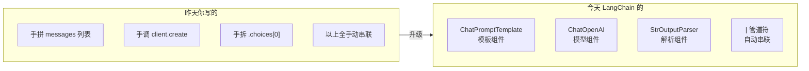
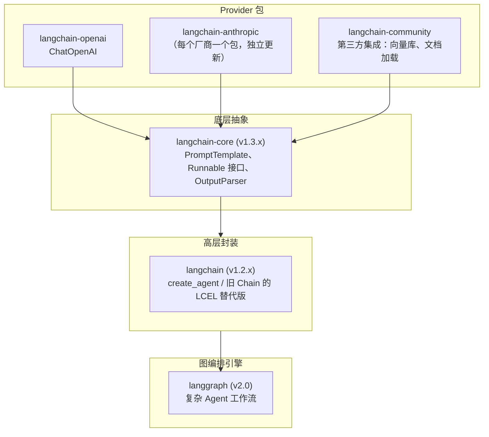
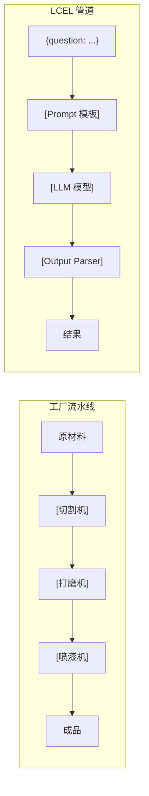

---

title: "LangChain框架入门"

created: "2026-07-21"

tags:

  - 技术学习

  - ai

  - langchain

---

> **一句话**：LangChain 是一个编排 LLM 工作流的框架，核心三件套：LCEL 管道、ChatPromptTemplate、Memory。

# LangChain框架入门

---

## 一、开篇：今天学的东西和昨天什么关系？

昨天你手写了 `call_llm()` 函数，自己拼 `messages` 列表、自己调 API、自己拆 `response.choices[0].message.content`。

**LangChain 不是说这些东西不对——是把这些动作标准化成了"组件"，用管道串起来。**



> [!note] LangChain 不是新魔法。底层还是 HTTP POST + JSON。它帮你省的是"拼字符串、拆响应、管状态"这些体力活。

---

## 二、LangChain 是什么
### 一个对比秒懂

昨天手写调 DeepSeek：

```python

# === 昨天的手写版 ===

from openai import OpenAI

client = OpenAI(api_key=os.environ["DEEPSEEK_API_KEY"], base_url="https://api.deepseek.com")

response = client.chat.completions.create(

    model="deepseek-v4-pro",

    messages=[

        {"role": "system", "content": "你是简历分析专家"},

        {"role": "user", "content": "提取这份简历的技能：\n" + resume_text},

    ],

    temperature=0.0,

)

result = response.choices[0].message.content

```

今天用 LangChain：

```python

# === 今天的 LangChain 版 ===

from langchain_openai import ChatOpenAI

from langchain_core.prompts import ChatPromptTemplate

from langchain_core.output_parsers import StrOutputParser

model = ChatOpenAI(

    api_key=os.environ["DEEPSEEK_API_KEY"],

    base_url="https://api.deepseek.com",

    model="deepseek-v4-pro",

    temperature=0.0,

)

prompt = ChatPromptTemplate.from_messages([

    ("system", "你是简历分析专家"),

    ("user", "提取这份简历的技能：\n{resume_text}"),

])

parser = StrOutputParser()

chain = prompt | model | parser  # ← 这就是 LCEL

result = chain.invoke({"resume_text": resume_text})

```

| | 昨天手写 | 今天 LangChain |
|------|----------|----------------|
| 拼 Prompt | `"提取技能：\n" + resume_text` | `{resume_text}` 占位符 |
| 调模型 | `client.chat.completions.create()` | `model` 组件，统一 `.invoke()` |
| 拆响应 | `.choices[0].message.content` | `parser` 自动处理 |
| 换模型 | 改 `api_key` + `base_url` | 只改 `model` 参数 |
| 加流式 | 手写 for 循环 | 链式 `.stream()` 一行搞定 |

### LangChain 帮不了你的

```text

LangChain 帮不了:

  ✗ 不知道你该用什么模型 — 你自己选

  ✗ 不知道你的数据长什么样 — 你自己看

  ✗ 不知道 Prompt 怎么写效果好 — 你自己试

LangChain 帮你省:

  ✓ 拼消息字符串的体力活

  ✓ 拆响应的体力活

  ✓ 管对话历史的体力活

  ✓ 换模型时改全项目代码的体力活

```

---

## 三、包拆分 — pip install 什么？
### 装错了会怎样

```bash

pip install langchain  # 默认装旧版 0.x！里面一堆已废弃的 LLMChain

```

2026 年 LangChain 1.x 把一个大包拆成了四个。

### 四层架构



### 你今天只需要装这些

```bash

pip install -U langchain-core langchain langchain-openai python-dotenv

```

| 包 | 干什么 | 今天用吗 |
|------|------|:---:|
| `langchain-core` | Prompt 模板、LCEL 管道、Output Parser | ✅ |
| `langchain` | 高层工具 | 🟡 |
| `langchain-openai` | `ChatOpenAI` 统一接口 | ✅ |
| `langchain-community` | 向量库、文档加载器（后续才用） | ❌ |
| `langgraph` | 复杂 Agent（后续才用） | ❌ |

> [!note] `langchain-core` 是"积木块"，`langchain-openai` 是"发动机"，`langgraph` 是"交通调度系统"。

### 导入路径速查

```python

# ✅ 正确

from langchain_openai import ChatOpenAI

from langchain_core.prompts import ChatPromptTemplate

from langchain_core.output_parsers import StrOutputParser

from langchain_core.runnables import RunnablePassthrough

# ❌ 错误：虽然部分能跑，但 1.x 在逐步切断

from langchain import ChatOpenAI

from langchain.prompts import PromptTemplate

```

---

## 四、ChatPromptTemplate — 别再用 f-string 拼 Prompt 了
### 昨天的手拼方式（有问题）

```python

# ❌ 手拼字符串

system = "你是简历分析专家"

user = f"提取这份简历的技能：\n{resume_text}"

messages = [

    {"role": "system", "content": system},

    {"role": "user", "content": user},

]

```

问题：变量嵌在字符串里，改模板 = 改代码。

### 今天用 ChatPromptTemplate

```python

from langchain_core.prompts import ChatPromptTemplate

prompt = ChatPromptTemplate.from_messages([

    ("system", "你是{role}专家，擅长{skill}"),

    ("user", "提取这份简历的技能：\n{resume_text}"),

])

messages = prompt.invoke({

    "role": "简历分析",

    "skill": "提取技术栈和项目经验",

    "resume_text": "张三，3年Python，熟悉FastAPI和MySQL...",

})

```

### 三种 Prompt 模板

```python

# ① PromptTemplate — 纯字符串模板（一条消息）

from langchain_core.prompts import PromptTemplate

simple = PromptTemplate.from_template("给下面这段文字写个50字总结：\n{text}")

# ② ChatPromptTemplate — 多角色消息

from langchain_core.prompts import ChatPromptTemplate

chat = ChatPromptTemplate.from_messages([

    ("system", "你是{role}"),

    ("user", "{question}"),

])

# ③ MessagesPlaceholder — 插入历史对话列表

from langchain_core.prompts import MessagesPlaceholder

chat_with_history = ChatPromptTemplate.from_messages([

    ("system", "你是{role}"),

    MessagesPlaceholder(variable_name="history"),

    ("user", "{question}"),

])

chat_with_history.invoke({

    "role": "客服助手",

    "history": [HumanMessage(content="你好"), AIMessage(content="你好！")],

    "question": "帮我查一下订单",

})

```

> [!tip] `PromptTemplate` = 一段文字模板；`ChatPromptTemplate` = 多角色对话模板（有 system/user/assistant 区分）。Chat 模型永远用后者。

### ❌/✅ 常见错误

```python

# ❌ 错误：变量名拼错

prompt = ChatPromptTemplate.from_messages([

    ("user", "我叫{user_name}"),

])

prompt.invoke({"username": "张三"})  # KeyError: 'user_name'

# ❌ 错误：把 PromptTemplate 当 ChatPromptTemplate 用

prompt = PromptTemplate.from_template("你是{role}专家，回答{question}")

# ❌ 错误：占位符里套 f-string（双重注入）

prompt = ChatPromptTemplate.from_messages([

    ("system", f"你是{role}专家"),  # ← f-string 在模板定义时就写死了！

])

# ✅ 正确：定义时用 {占位符}，调用时才注入值

prompt = ChatPromptTemplate.from_messages([

    ("system", "你是{role}专家"),

])

prompt.invoke({"role": "Python专家"})  # 随时换角色

```

---

## 五、LCEL 管道 — LangChain 的灵魂
### 什么是 LCEL

> LangChain Expression Language = 用 `|` 管道符把组件串成一条链。数据从左流到右，每个组件处理后传给下一个。

类比：



### 最简单的 LCEL 管

```python

from langchain_openai import ChatOpenAI

from langchain_core.prompts import ChatPromptTemplate

from langchain_core.output_parsers import StrOutputParser

model = ChatOpenAI(

    api_key=os.environ["DEEPSEEK_API_KEY"],

    base_url="https://api.deepseek.com",

    model="deepseek-v4-pro",

    temperature=0.0,

)

prompt = ChatPromptTemplate.from_messages([

    ("system", "你是{role}专家"),

    ("user", "{question}"),

])

parser = StrOutputParser()

chain = prompt | model | parser

# 同步调用

result = chain.invoke({"role": "Python", "question": "装饰器是什么？"})

# 异步调用（FastAPI 里用）

result = await chain.ainvoke({"role": "Python", "question": "装饰器是什么？"})

# 流式输出

async for chunk in chain.astream({"role": "Python", "question": "装饰器是什么？"}):

    print(chunk, end="", flush=True)

```

> [!note] 一套 `chain = prompt | model | parser`，`invoke / ainvoke / astream` 全支持，零额外代码。这就是 LCEL 最核心的价值。

### 管道的本质：Runnable 接口

每个组件都实现了 `Runnable` 协议——必须提供 `.invoke()` 方法。

```text

Runnable 像一个"插座标准"：

  所有电器(组件)都用同一个插头标准 → 你用 | 把它们接起来 → 电流(数据)畅通无阻

```

```python

# 每个组件都是 Runnable

prompt.invoke({"role": "老师", "question": "你好"})     # → ChatPromptValue

model.invoke(messages)                                  # → AIMessage

parser.invoke(ai_message)                               # → str

# | 做的事 = 自动把左边的输出传给右边的 .invoke()

chain = prompt | model | parser

#     return c

```

### 管道里插自己的函数：RunnableLambda

```python

from langchain_core.runnables import RunnableLambda

def to_upper(text: str) -> str:

    return text.upper()

chain = prompt | model | parser | RunnableLambda(to_upper)

# 更简洁：用装饰器

@RunnableLambda

def count_words(text: str) -> str:

    return f"答案字数: {len(text)}"

chain = prompt | model | parser | count_words

```

### 管道分叉：RunnablePassthrough

```python

from langchain_core.runnables import RunnablePassthrough

chain = (

    {"question": RunnablePassthrough(),          # ← 原样透传用户输入

     "answer": prompt | model | parser}          # ← 管道处理后的结果

)

result = chain.invoke("什么是闭包？")

# 返回: {"question": "什么是闭包？", "answer": "闭包是..."}

```

这个模式是 RAG 的基础——你会见到 `{"context": retriever, "question": RunnablePassthrough()}` 这种写法。

### ❌/✅ LCEL 常见错误

```python

# ❌ 错误：管道顺序反了

chain = model | prompt | parser  # TypeError

# ❌ 错误：invoke 传的参数不匹配模板占位符

chain.invoke({"name": "张三"})  # 没传 age → KeyError

# ❌ 错误：stream 没等完就 return

async for chunk in chain.astream({"question": "..."}):

    print(chunk)  # 没收集

# ✅ 正确：流式输出也要收集

full = ""

async for chunk in chain.astream({"question": "..."}):

    full += chunk

return full

```

---

## 六、Output Parser — 让 LLM 输出结构化数据
### 昨天的手拆方式

```python

# ❌ 手写 json.loads + 正则救火

text = response.choices[0].message.content

import json

try:

    data = json.loads(text)

except json.JSONDecodeError:

    import re

    match = re.search(r'\{.*\}', text, re.DOTALL)

    data = json.loads(match.group()) if match else None

```

### StrOutputParser — 最简单的

```python

from langchain_core.output_parsers import StrOutputParser

parser = StrOutputParser()

chain = prompt | model | parser

result = chain.invoke({"question": "你好"})

# result = "你好！有什么可以帮助你的吗？"

```

自动取 `AIMessage.content`，就是你昨天手写的 `.choices[0].message.content`。

### JsonOutputParser — 输出 dict

```python

from langchain_core.output_parsers import JsonOutputParser

chain = prompt | model | JsonOutputParser()

result = chain.invoke({"question": "用 JSON 格式返回：name、age、city"})

# result = {"name": "张三", "age": 25, "city": "北京"}

```

### PydanticOutputParser — 生产级

```python

from pydantic import BaseModel, Field

from langchain_core.output_parsers import PydanticOutputParser

class ResumeInfo(BaseModel):

    """简历信息 — 这就是你的数据 Schema"""

    name: str = Field(description="求职者姓名")

    skills: list[str] = Field(description="技术技能列表")

    years_of_experience: int = Field(description="工作年限")

    education: str = Field(description="最高学历")

parser = PydanticOutputParser(pydantic_object=ResumeInfo)

format_instructions = parser.get_format_instructions()

prompt = ChatPromptTemplate.from_messages([

    ("system", "你是简历解析专家。\n{format_instructions}"),

    ("user", "解析以下简历：\n{resume_text}"),

])

chain = prompt | model | parser

result = chain.invoke({

    "resume_text": "张三，本科，3年Python开发经验",

    "format_instructions": format_instructions,

})

print(result.name)                # "张三"  ← 类型安全

print(result.skills)              # ["Python"]

print(type(result))               # <class 'ResumeInfo'>

```

> [!note] `PydanticOutputParser` = 自动生成格式指令 + 自动校验 + 类型安全。你的简历分析系统的"提取"环节全靠它。

### 三种 Parser 对比

```text

StrOutputParser       → 输出 str      → "你好世界"

JsonOutputParser      → 输出 dict     → {"answer": "你好"}

PydanticOutputParser  → 输出 Pydantic 对象 → ResumeInfo(name="张三", ...)

                         ↑

                    有类型校验 + IDE 补全 + 自动生成 Schema

                    生产环境永远用这个

```

### ❌/✅ Parser 常见错误

```python

# ❌ 错误：不用 format_instructions，让 LLM 自己猜格式

prompt = ChatPromptTemplate.from_messages([

    ("user", "用JSON输出姓名和技能：{text}"),

])

# ✅ 正确：把 parser 的 format_instructions 注入 Prompt

prompt = ChatPromptTemplate.from_messages([

    ("system", "严格按照以下格式输出：\n{format_instructions}"),

    ("user", "{text}"),

])

# ❌ 错误：Pydantic schema 和实际 Prompt 描述不一致

class Person(BaseModel):

    skills: list[str] = Field(description="技能列表")

# ✅ 正确：description 要清晰明确

class Person(BaseModel):

    skills: list[str] = Field(description="求职者掌握的技术技能，如 Python、React")

```

---

## 七、Memory — 让对话有记忆
### 昨天的手动拼历史方式

```python

# ❌ 每次调用手动拼所有历史消息

messages = [

    {"role": "system", "content": "你是客服"},

    {"role": "user", "content": "你好"},

    {"role": "assistant", "content": "你好！有什么可以帮您？"},

    {"role": "user", "content": "帮我查订单"},

]

```

### LangChain 的做法

```python

from langchain_community.chat_message_histories import ChatMessageHistory

from langchain_core.prompts import MessagesPlaceholder

history = ChatMessageHistory()

prompt = ChatPromptTemplate.from_messages([

    ("system", "你是客服助手"),

    MessagesPlaceholder(variable_name="history"),

    ("user", "{question}"),

])

chain = prompt | model | parser

chain.invoke({

    "history": history.messages,

    "question": "帮我查一下订单",

})

history.add_user_message("你好")

history.add_ai_message("你好！有什么可以帮您？")

```

---

## 八、综合实战：简历技能提取器

```python

"""

用 LangChain LCEL 搭建简历技能提取器。

输入简历文本 → 输出结构化的技能列表 + 年限 + 学历。

"""

import os

from dotenv import load_dotenv

from pydantic import BaseModel, Field

from langchain_openai import ChatOpenAI

from langchain_core.prompts import ChatPromptTemplate

from langchain_core.output_parsers import PydanticOutputParser

load_dotenv()

# 第1步：定义输出结构

class ResumeInfo(BaseModel):

    name: str = Field(description="求职者姓名")

    skills: list[str] = Field(description="技术技能列表，只包含技术类")

    years: int = Field(description="工作年限，应届生填0")

    education: str = Field(description="最高学历")

    summary: str = Field(description="一句话总结技术背景，不超过30字")

# 第2步：创建 Parser

parser = PydanticOutputParser(pydantic_object=ResumeInfo)

format_instructions = parser.get_format_instructions()

# 第3步：组装 Prompt 模板

prompt = ChatPromptTemplate.from_messages([

    ("system", (

        "你是专业的简历解析 AI。你的任务是从简历文本中提取关键信息。\n"

        "规则：\n"

        "1. 只提取技术类技能，不提取软技能\n"

        "2. 工作年限根据工作经历推断\n"

        "3. 严格按照以下格式输出\n\n"

        "{format_instructions}"

    )),

    ("user", "请解析以下简历文本：\n{resume_text}"),

])

# 第4步：创建模型

model = ChatOpenAI(

    api_key=os.environ["DEEPSEEK_API_KEY"],

    base_url="https://api.deepseek.com",

    model="deepseek-v4-pro",

    temperature=0.0,

)

# 第5步：串成 LCEL 管道

chain = prompt | model | parser

# 第6步：测试

if __name__ == "__main__":

    sample_resume = """

    张三，2024年毕业于广东海洋大学计算机科学与技术专业，本科学历。

    精通 Python 和 JavaScript，熟悉 FastAPI、React、MySQL、Redis。

    曾在某互联网公司实习 6 个月，负责后端 API 开发。

    """

    result = chain.invoke({

        "resume_text": sample_resume,

        "format_instructions": format_instructions,

    })

    print(f"姓名: {result.name}")

    print(f"技能: {result.skills}")

    print(f"年限: {result.years}")

    print(f"学历: {result.education}")

    print(f"总结: {result.summary}")

```

运行输出：

```text

姓名: 张三

技能: ['Python', 'JavaScript', 'FastAPI', 'React', 'MySQL', 'Redis']

年限: 0

学历: 本科

总结: 具备全栈开发能力的计算机专业应届生

类型: <class 'ResumeInfo'>

```

> [!note] 对比手写 `messages` + `json.loads` + `try/except` + 正则救火，今天一行 `chain.invoke()` 搞定，输出直接是带类型的对象。这就是 LangChain 帮你省的东西。

---

## 九、速查表
### 三板斧组件

```python

from langchain_openai import ChatOpenAI                     # 模型

from langchain_core.prompts import ChatPromptTemplate       # 模板

from langchain_core.output_parsers import StrOutputParser   # 解析器

```

### LCEL 管道骨架

```python

chain = prompt | model | parser

result = chain.invoke({"var1": "值1", "var2": "值2"})

result = await chain.ainvoke({...})

async for chunk in chain.astream({...}):

    print(chunk, end="", flush=True)

```

### 三种 Parser

```python

StrOutputParser()              # → "纯文本字符串"

JsonOutputParser()             # → {"key": value} dict

PydanticOutputParser(pydantic_object=MyModel)  # → MyModel 对象（类型安全）

```

### 管道插入自定义逻辑

```python

from langchain_core.runnables import RunnableLambda, RunnablePassthrough

chain = prompt | model | parser | RunnableLambda(my_func)

chain = {"key": RunnablePassthrough()} | prompt | model

```

### 四个核心导入路径

```python

from langchain_openai import ChatOpenAI         # 模型

from langchain_core.prompts import ...           # 模板

from langchain_core.output_parsers import ...    # 解析

from langchain_core.runnables import ...         # 管道

```

##

> ▶ 对应原理：[[31-LangChain框架|31-LangChain框架]]

> ▶ 对应原理：[[32-LlamaIndex框架|32-LlamaIndex框架]]

相关链接

- 目录：[[00-AI]]

- 上一篇：[[15-Agent架构与工具调用]]

---

→ [[技术学习路线图#LangChain + LangGraph]]

## 速记卡（面试闪卡）

**Q1：一句话讲清「LangChain框架入门」到底是什么？**

A：LangChain 是一个编排 LLM 工作流的框架，核心三件套：LCEL 管道、ChatPromptTemplate、Memory。

**Q2：一、开篇：今天学的东西和昨天什么关系？ —— 怎么理解？**

A：昨天你手写了 `call_llm()` 函数，自己拼 `messages` 列表、自己调 API、自己拆 `response.choices[0].message.content`。 **LangChain 不是说这些东西不对——是把这些动作标准化成了"组件"，用管道串起来。** [!note] LangChain 不是新魔法。底层还是 HTTP POST + JSON。

**Q3：二、LangChain 是什么 —— 怎么理解？**

A：昨天手写调 DeepSeek： 今天用 LangChain： 拼 Prompt：`"提取技能：\n" + resume_text`，`{resume_text}` 占位符；调模型：`client.chat.completions.create()`，`model` 组件，统一 `.invoke()`；拆响应：`.choices[0].message.content`，`parser` 自动处理；

**Q4：三、包拆分 — pip install 什么？ —— 怎么理解？**

A：2026 年 LangChain 1.x 把一个大包拆成了四个。 `langchain-core`：Prompt 模板、LCEL 管道、Output Parser，✅；`langchain`：高层工具，🟡；`langchain-openai`：`ChatOpenAI` 统一接口，✅；`langchain-community`：向量库、文档加载器（后续才用），❌；

**Q5：四、ChatPromptTemplate — 别再用 f-string 拼 Prompt 了 —— 怎么理解？**

A：问题：变量嵌在字符串里，改模板 = 改代码。 [!tip] `PromptTemplate` = 一段文字模板；`ChatPromptTemplate` = 多角色对话模板（有 system/user/assistant 区分）。Chat 模型永远用后者。

**Q6：核心速记主线有哪些？**

A：抓住这几根：一、开篇：今天学的东西和昨天什么关系？、二、LangChain 是什么、三、包拆分 — pip install 什么？、四、ChatPromptTemplate — 别再用 f-string 拼 Prompt 了、五、LCEL 管道 — LangChain 的灵魂、六、Output Parser — 让 LLM 输出结构化数据、七、Memory — 让对话有记忆、八、综合实战：简历技能提取器、九、速查表

**口诀**

A：LangChain框架入：开篇：今天学的东西和昨天什么关系？先想；

LangChain 是什么配包拆分 — pip install 什么？，

ChatPromptTemplate — 别再用 f-string 拼 Prompt 了不能忘，

面试对答底气壮。

## 相关链接

- [[笔记/AI与Agent/知识/实战/45-LangGraph框架：StateGraph-Node-Edge-Checkpoint|LangGraph框架：StateGraph-Node-Edge-Checkpoint]]

- [[笔记/AI与Agent/知识/实战/03-多模型后端抽象|多模型后端抽象：统一请求格式、响应结构、错误码、重试/回退逻辑]]

- [[笔记/AI与Agent/知识/实战/15-Agent架构与工具调用|Agent架构与工具调用]]

- [[笔记/AI与Agent/知识/实战/05-Chroma向量数据库安装入库检索|Chroma 向量数据库：安装 / 入库 / 检索]]

- [[笔记/AI与Agent/知识/实战/46-LangGraphMemorySaverCheckpoint|LangGraph MemorySaver Checkpoint]]

