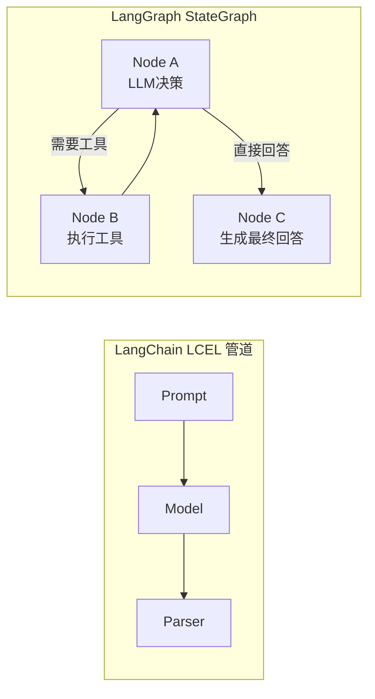
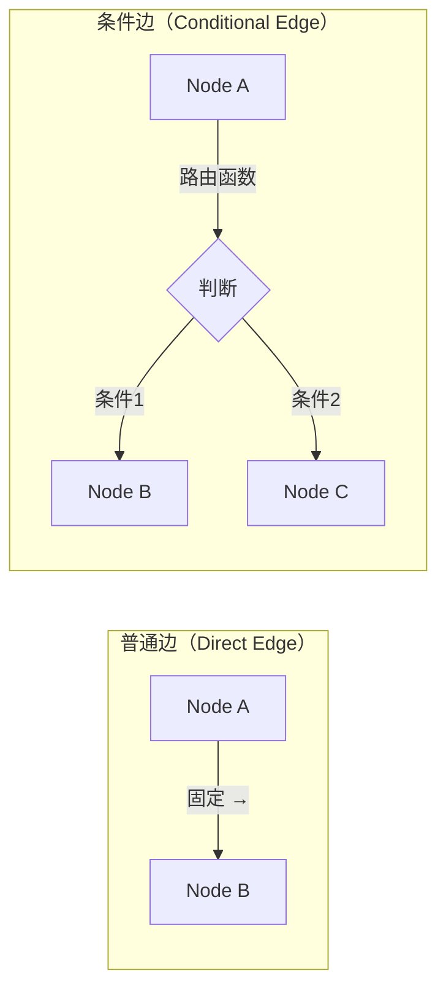
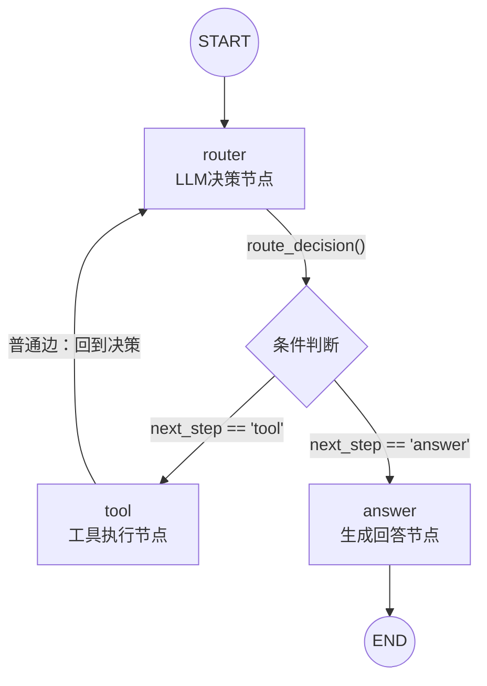

---

title: "LangGraph框架：StateGraph-Node-Edge-Checkpoint"

created: "2026-07-21"

tags:

  - 技术学习

  - ai

  - langgraph

  - agent

---

# LangGraph框架：StateGraph-Node-Edge-Checkpoint

---

> **一句话**：** LangGraph 是把 Agent 工作流建模成**有向图**的框架——StateGraph 定义图结构，Node 是处理步骤，Edge 是连接关系，Checkpoint 在每个节点后自动存档。底层是**图论**，上层是**Agent 编排**。

---

## 一、先搞清楚：为什么需要 LangGraph？

你已经用 LangChain 写出了 `prompt | model | parser` 的管道。管道是**线性的**——数据从左流到右，一条路走到底。

但 Agent 不是线性的：

```text

用户问"帮我查订单" →

  LLM 判断：需要先查数据库 →

    查到结果了 → 生成回答 →

    没查到 → 换一个查询方式重新查 →

      还是没查到 → 告诉用户"查不到"

```

这是一棵**决策树**，不是一条管道。LangGraph 用**图（Graph）**来建模这种分支和循环。



管道是**单向线**，图可以有**循环和分支**。这就是 LangGraph 存在的理由。

---

## 二、四个核心概念
### 2.1 State（状态）—— 所有节点共享的"黑板"

```python

from typing import TypedDict, Annotated

from langgraph.graph.message import add_messages

class AgentState(TypedDict):

    """

    State 是贯穿所有节点共享的 TypedDict。

    每个节点读取它、修改它，传给下一个节点。

    """

    messages: Annotated[list, add_messages]  # 对话历史（自动追加）

    next_action: str                          # 下一步做什么

    tool_results: list[dict]                  # 工具调用结果

    final_answer: str                         # 最终回答

```

**大白话：** State 就像手术室里挂在墙上的白板——每个医生（Node）进来看一眼、写上自己的发现、传给下一个医生。所有医生看的是同一块板。

### 2.2 Node（节点）—— 一个处理步骤

每个 Node 是一个 Python 函数，签名为：

```python

def my_node(state: AgentState) -> dict:

    """接收 State，返回要更新的字段（partial State）。"""

    # 处理逻辑

    return {"next_action": "call_tool"}  # 只更新 next_action 字段

```

Node 可以是：

| Node 类型 | 做什么 | 例子 |
|-----------|--------|------|
| LLM 调用 | 让模型做决策 | 判断用户意图、生成回答 |
| 工具执行 | 调外部 API / 数据库 | 查天气、查订单 |
| 条件判断 | 纯逻辑分支 | 检查结果是否为空 |
| 人工介入 | 暂停等审批 | 退款确认 |

### 2.3 Edge（边）—— 节点之间的连线

两种 Edge：



- **普通边**：A 执行完，一定去 B（固定路线）

- **条件边**：A 执行完，由**路由函数**决定去 B 还是 C（LLM 说了算）

### 2.4 Checkpoint（检查点）—— 每步存档

LangGraph 在每个 Node 执行后自动保存 State 快照。这就是 Checkpoint。

```text

Node A 执行前: State v1

Node A 执行后: State v2 → Checkpoint（自动保存）

Node B 执行前: State v2

Node B 执行后: State v3 → Checkpoint（自动保存）

```

**用途：** 调试（回溯每一步的状态）、断点续传（从某个 checkpoint 恢复）、人在回路（暂停→审查→继续）。

---

## 三、完整的 StateGraph 代码示例

一个带条件边的 3 节点 Agent：

```python

"""

用 LangGraph 搭建一个简单 Agent：

用户提问 → LLM 决定是否需要工具 → 需要则调工具 → 生成最终回答

"""

import os

from typing import TypedDict, Annotated, Literal

from langgraph.graph import StateGraph, END

from langgraph.graph.message import add_messages

from langchain_openai import ChatOpenAI

# ── 第1步：定义 State ──

class AgentState(TypedDict):

    """所有节点共享的状态对象。"""

    messages: Annotated[list, add_messages]  # add_messages = 自动追加而非覆盖

    next_step: str                            # 路由依据：LLM 的输出

# ── 第2步：定义三个 Node ──

def router_node(state: AgentState) -> dict:

    """

    Node 1：LLM 决策节点。

    让 LLM 判断下一步该做什么——调工具还是直接回答。

    """

    model = ChatOpenAI(

        api_key=os.environ["DEEPSEEK_API_KEY"],

        base_url="https://api.deepseek.com",

        model="deepseek-v4-pro",

        temperature=0.0,

    )

    # 这里的 prompt 是简化版，生产环境应包含工具描述

    response = model.invoke([

        {"role": "system", "content": (

            "你是 Agent 路由器。根据用户输入决定下一步：\n"

            "- 需要查外部信息 → 输出 'tool'\n"

            "- 可以直接回答 → 输出 'answer'"

        )},

        {"role": "user", "content": state["messages"][-1].content},

    ])

    decision = response.content.strip().lower()

    return {"next_step": decision}

def tool_node(state: AgentState) -> dict:

    """

    Node 2：工具执行节点。

    实际项目中这里会调 MCP tool / API / 数据库。

    这里用模拟数据演示。

    """

    user_query = state["messages"][-1].content

    # 模拟工具调用

    tool_result = f"[工具返回] 查询 '{user_query}' 的结果：北京今天晴天，25°C"

    return {"messages": [{"role": "system", "content": tool_result}]}

def answer_node(state: AgentState) -> dict:

    """

    Node 3：回答生成节点。

    基于所有上下文生成最终回答。

    """

    model = ChatOpenAI(

        api_key=os.environ["DEEPSEEK_API_KEY"],

        base_url="https://api.deepseek.com",

        model="deepseek-v4-pro",

        temperature=0.7,

    )

    response = model.invoke([

        {"role": "system", "content": "基于对话中的所有信息，给用户一个简洁的最终回答。"},

        *state["messages"],

    ])

    return {"messages": [response]}

# ── 第3步：定义条件边的路由函数 ──

def route_decision(state: AgentState) -> Literal["tool", "answer"]:

    """

    条件边路由函数：检查 State 中的 next_step 字段，

    返回下一个 Node 的名字。

    """

    if state["next_step"] == "tool":

        return "tool"

    return "answer"

# ── 第4步：组装 StateGraph ──

builder = StateGraph(AgentState)

# 注册节点

builder.add_node("router", router_node)    # Node 1: LLM 决策

builder.add_node("tool", tool_node)        # Node 2: 工具执行

builder.add_node("answer", answer_node)    # Node 3: 生成回答

# 设置入口

builder.set_entry_point("router")

# 添加条件边：router 节点执行后，根据 route_decision 的结果走不同分支

builder.add_conditional_edges(

    "router",           # 从哪个节点出发

    route_decision,     # 路由函数（返回目标节点名）

    {

        "tool": "tool",     # 返回 "tool" → 去 tool 节点

        "answer": "answer", # 返回 "answer" → 去 answer 节点

    },

)

# 添加普通边：tool 执行完 → 回到 router 重新决策（实现循环）

builder.add_edge("tool", "router")

# 添加普通边：answer 执行完 → 结束

builder.add_edge("answer", END)

# 编译图

graph = builder.compile()

# ── 第5步：运行 ──

if __name__ == "__main__":

    from langchain_core.messages import HumanMessage

    result = graph.invoke({

        "messages": [HumanMessage(content="北京今天天气怎么样？")],

        "next_step": "",

    })

    # 打印最终回答

    print(result["messages"][-1].content)

```

---

## 四、图结构可视化

上面代码构建出的 Graph 长这样：



关键点：

- **循环**：`tool → router` 形成了 Agent 的核心循环（ReAct 模式）

- **条件边**：`router` 后的分支完全由 LLM 输出决定

- **终止**：`answer → END` 是唯一的出口

---

## 五、StateGraph vs 手写循环

| 对比维度 | 手写 `while` 循环 | LangGraph StateGraph |
|----------|-------------------|----------------------|
| 流程可视化 | 要在脑子里推演 | 图结构一目了然 |
| 状态追踪 | 手动 print 调试 | Checkpoint 自动存档每步 |
| 人在回路 | 要自己写暂停/恢复 | `interrupt()` 一行搞定 |
| 并行节点 | 要自己管理 asyncio | `Send()` API 原生支持 |
| 流式输出 | 要自己管理 yield | `graph.astream()` 内置 |
| 进阶亮点 | 基础能力 | **工程化能力** |

> [!note] LangGraph 不是"封装了 while 循环"，而是在 while 循环之上加了**可观测性、可恢复性、可编排性**——这些都是生产级 Agent 必须的。

---

## 六、Checkpoint 机制预览

（详见 [[46-LangGraphMemorySaverCheckpoint|下一篇]]）

```python

# 开启 Checkpoint 只需一行

from langgraph.checkpoint.memory import MemorySaver

graph = builder.compile(checkpointer=MemorySaver())

# 每次调用带上 thread_id，自动隔离会话

result = graph.invoke(

    {"messages": [HumanMessage(content="你好")]},

    config={"configurable": {"thread_id": "user-123"}},

)

# ↑ 执行过程中每个节点执行后，State 自动保存到 MemorySaver

```

---

## 速记卡（面试闪卡）

**Q1：一句话讲清「LangGraph框架：StateGraph-Node-Edge-Checkpoint」到底是什么？**

A：LangGraph 把 Agent 工作流建模成有向图：StateGraph 定结构、Node 是步骤、Edge 连线、Checkpoint 每步存档。

**Q2：为什么不用管道 —— 怎么理解？**

A：像 LangChain 管道是单行道，数据从左到右一条路走到底；但 Agent 是决策树（查到→生成，查不到→换方式重查）。图才有循环和分支，这正是 LangGraph 存在的理由。

**Q3：四个核心概念 —— 怎么理解？**

A：State 像手术室白板，所有 Node 共享同一块板读取改写；Node 是处理步骤（LLM / 工具 / 判断 / 人工）；Edge 分普通边（固定）和条件边（路由函数决定）；Checkpoint 每步后自动存档。

**Q4：循环与终止 —— 怎么理解？**

A：像地铁环线：tool→router 形成 ReAct 核心循环，条件边分支由 LLM 输出决定，answer→END 是唯一出口。Checkpoint 让调试能回溯、断点能续传、人能中途审查。

**Q5：比手写循环强在哪 —— 怎么理解？**

A：像给裸 while 循环加了仪表盘。LangGraph 之上多了可观测性（Checkpoint 自动存档）、可恢复性（interrupt 一行暂停）、可编排性（Send 并行、astream 流式）。

**Q6：核心速记主线有哪些？**

- 图 vs 管道：支持循环与分支

- State 共享白板，Node 步骤，Edge 连线

- 条件边路由 + tool→router 循环

- Checkpoint 自动存档：调试 / 续传 / 人审

**口诀**

A：LangGraph 建模图，状态白板节点步

普通条件两条边，循环回 router 转

Checkpoint 每步存，调试续传人审看

胜过裸 while，可观测可恢复

## 相关链接

- 目录：[[00-AI]]

- 上一篇：[[44-LangChain框架入门]]

---

→ [[技术学习路线图#LangChain + LangGraph]]

