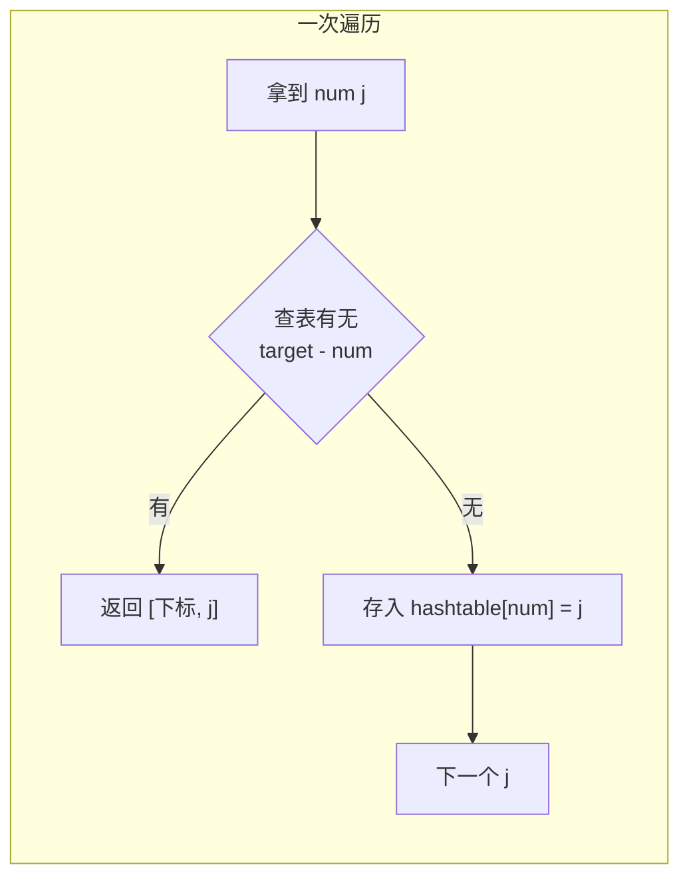

# 1. 两数之和（Two Sum）

> 难度：简单 | 主题：数组、哈希表

## 题目

给定一个整数数组 nums 和一个目标值 target，请在该数组中找出和为目标值的两个整数，并返回它们的数组下标。你可以假设每种输入只会对应一个答案，且不能使用同一个元素两次。

**示例**
输入：nums = [2,7,11,15], target = 9
输出：[0,1]
解释：因为 nums[0] + nums[1] == 9，返回 [0, 1]

---

## 思路

### 先讲个故事：找零钱

你在便利店买了东西，手里有一把零钱硬币。收银员说："你再给我凑 x 元，我找你一张整钞让你钱包变轻。"

你盯着手里的硬币想：有没有两枚硬币加起来正好 x 元？

最笨的办法：两两组合都试一遍（暴力枚举）。聪明点的办法：每拿起一枚硬币，心里记着"差 x - this 的那枚硬币在哪"，等会碰到就直接配对（哈希表）。

这就是 Two Sum——LeetCode 第一题，也是哈希表思想的经典入门。

---

### 引导式推导：从暴力到一次哈希

**第 1 层：暴力枚举 O(n²)**

看到"两个数"最直接的想法——两重循环枚举所有数对。

```python
for i in range(len(nums)):
    for j in range(i + 1, len(nums)):
        if nums[i] + nums[j] == target:
            return [i, j]
```

n=10⁴ 时约 5000 万次比较，还行。n=10⁵ 时 50 亿次，没法忍。

**发现规律**

对于当前数 nums[i]，我们要找的是 target - nums[i]。如果能 O(1) 知道这个"补数"之前出现过，就不用内层循环了。

什么数据结构能 O(1) 查找？哈希表。

**第 2 层：两次遍历哈希**

先遍历一次，把每个数及其下标存入哈希表；再遍历一次，对每个数查补数是否在表里。

但有个坑：`target=6, nums=[3,3]` 时，如果查到自己会返回 `[0,0]`，题目禁止同一个元素用两次。

**第 3 层：一次遍历哈希（最优）**

核心 trick：**先查后存**。



遍历到 nums[j] 时，只查当前已入表的元素（下标 < j 的），查完再把 nums[j] 入表。这样当前元素不会和自己匹配。

---

## 代码

```python
def twoSum(self, nums, target):
    hashtable = {}
    for j, num in enumerate(nums):
        complement = target - num
        if complement in hashtable:         # 补数之前出现过
            return [hashtable[complement], j]
        hashtable[num] = j                  # 先查后存，避免自匹配
```

---

## 复杂度

| 指标 | 值 | 解释 |
|------|----|------|
| 时间 | O(n) | 一次线性遍历 |
| 空间 | O(n) | 哈希表最多存 n 个键值对 |
| 暴力枚举 | O(n²) | 两重循环，n=10⁵ 就爆了 |

---

## 实战考量

### 频率分析

> **出现在**：LeetCode 第一题，几乎所有都会作为热身。但不是考你记不记得代码——关键在于**能不能说清"为什么先查后存"和"为什么从暴力到哈希的优化是合理的"**。

### 延伸思考

**Q：先查后存和先存后查有什么区别？**
A：先存后查在 target=6, nums=[3,3] 时会返回 [0,0]（同一个元素用了两次）。先查后存保证当前元素尚未入表，不可能自匹配。

**Q：如果数组已排序怎么办？**
A：双指针，左右夹逼找两数之和，空间 O(1)。详见 167两数之和II-输入有序数组。

**Q：如果要求返回所有不重复的数对（不唯一解）呢？**
A：排序 + 双指针，或用哈希表存所有下标，找到后配对并跳过重复值。

**Q：改成"差为 k 的两个数"怎么做？**
A：同款哈希表思路，查 `num + k` 或 `num - k`。

### 易错点

- 哈希表存的是**值 → 下标**，不是值 → 布尔
- 先查后存，顺序不能反
- 题目保证有唯一解，不需要处理无解情况

---

## 生活类比

> **两数之和 → 哈希表 → 先查后存**
>
> 像你在排队买奶茶，每个人手里拿着一个号码牌。
> 你心想："谁手里有 target - 我的号码？"
> 你每遇到一个人先问"你号码是多少？"，匹配上就组队买一送一；
> 没匹配上就把自己的号码写在便签上贴墙上，后面的人能看到。
> 
> **关键洞察**：问完再贴——如果先贴自己的，回头看到自己的号码以为匹配到了自己，那就尴尬了。

---

## 相关题目

| 题目 | 关系 |
|------|------|
| 167两数之和II-输入有序数组 | 同族双指针版，有序数组用双指针 O(1) 空间 |
| [[560和为K的子数组]] | 前缀和变体，两数之差扩展到连续子数组 |
| 15三数之和 | 从两数扩展到三数（双指针夹逼） |
| 01两数之和 | 本题，哈希表入门 |

---

→ 返回题单：[[LeetCode学习清单#一、数组与哈希（含双指针、矩阵）]]
