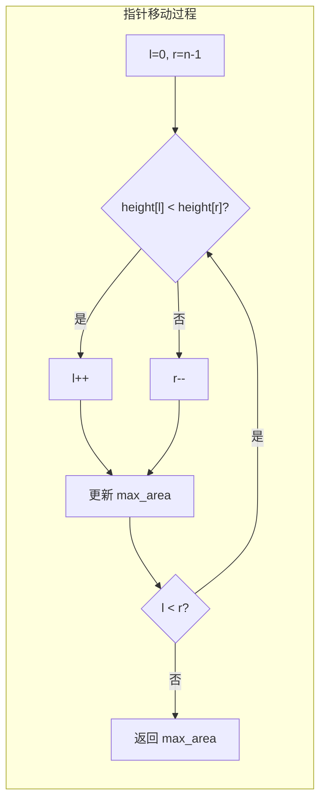

---

title: "盛最多水的容器"

difficulty: 中等

category: 数组与哈希

tags:

  - leetcode

  - 数组与哈希

created: "2026-07-21"

---

# 11. 盛最多水的容器（Container With Most Water）

> 难度：中等 | 主题：对撞双指针

## 题目

给定一个长度为 n 的整数数组 height。有 n 条垂线，第 i 条线的两个端点是 (i, 0) 和 (i, height[i])。找出其中的两条线，使得它们与 x 轴共同构成的容器可以容纳最多的水。返回容器可以储存的最大水量。

**示例**

输入：[1,8,6,2,5,4,8,3,7]

输出：49

解释：垂直线 i=1(高度8) 和 j=8(高度7) 之间距离 7，min(8,7)×7=49

---

## 思路
### 先讲个故事：选木桶装水

你面前有一排高矮不一的木桶，你只能选两个桶，用它们之间的矩形区域装水。

装水量取决于两件事：**两个桶中较矮的那个的高度** × **两个桶的距离**。

你站在最左和最右两个桶前，犯了难："我要往中间挪一挪吗？挪哪个？"

如果移动较**高**的那个桶——宽度变小了，但高度不会超过较矮的那个（被矮桶限制），面积只减不增，白费力气。

如果移动较**矮**的那个桶——宽度虽然变小了，但万一遇到更高的桶，高度可能变大，面积有可能变大。

这个直觉就是双指针解法的核心：**每次淘汰不可能成为最优解的边界**。

---

### 引导式推导：从暴力到对撞双指针

**暴力法 O(n²)**

两两枚举所有柱子对，算面积取最大值。n=10⁵ 时没法用。

**寻找规律**

面积公式：`area = min(height[l], height[r]) * (r - l)`

假设 `height[l] < height[r]`（左边矮），面积 = height[l] × (r-l)。

如果移动右指针（高的那边），新面积 = min(height[l], height[r-1]) × (r-1-l)。

由于 min 最多不超过 height[l]（矮的没变），而宽度变小了 → 新面积 ≤ 旧面积。

结论：**移动较矮的一边才可能让面积变大**。

**反证法证明正确性**

假设最优解是柱子对 (i, j)。当左指针 < i 或右指针 > j 时，总有一个指针会先到达最优边界。因为每次都移动较矮的指针，较矮的那侧会被"淘汰"——如果这个位置不可能是最优解的一部分，移走它是安全的。



---

## 代码

```python

def maxArea(self, height):

    l, r = 0, len(height) - 1

    ans = 0

    while l < r:

        area = min(height[l], height[r]) * (r - l)

        ans = max(ans, area)

        if height[l] <= height[r]:  # 左边更矮 → 移动左指针，赌右边有更高的

            l += 1

        else:                       # 右边更矮 → 移动右指针

            r -= 1

    return ans

```

---

## 复杂度

| 指标 | 值 | 解释 |

|------|----|------|

| 时间 | O(n) | 每个元素被访问一次 |

| 空间 | O(1) | 两个指针 |

| 暴力枚举 | O(n²) | 两两枚举所有柱子对 |

---

## 实战考量
### 频率分析

> **出现在**：字节/美团/阿里 高频，双指针的经典"试金石"。关键在于**能不能证出'为什么移动矮的而不是高的'**。

### 延伸思考

**Q：为什么移动高的不会得到更大面积？**

A：面积受限于矮的。移动高的那边，宽度缩小，高度 ≤ 原来的矮的高度，面积只减不增。

**Q：证明这个算法不会错过最优解？**

A：每次淘汰一个"不可能作为边界"的位置——如果当前位置是较矮的，它不可能和任何更靠内的柱子组成更优解（因为宽度变小，高度被它限制）。问题规模每次减一，保证最终收敛到最优解。

**Q：和 42 接雨水的区别？**

A：11 求**最大矩形面积**（选两个柱子围水），42 求**累计凹槽水量**（所有凹坑积水和）。但都用对撞双指针 + 移动矮的。详见 [[42接雨水]]。

**Q：如果柱子不是等距的呢？**

A：排序后贪心或动态规划，但已经不是这道题的范围了。

### 易错点

- 面积公式是 `min(h[l], h[r]) * (r-l)`，不是 `(r-l+1)`

- 用 `<=` 还是 `<` 移动指针都可以，但要一致

- `r - l` 在移动指针前计算（移动后宽度变了）

---

## 生活类比

> **最大容器 → 对撞双指针 → 淘汰不可能**

>

> 像一群朋友在一条河边选位置扎营。

> 最左和最右的人先商量："咱们之间能搭多大的帐篷？"

> 左边的人比较矮，看不到河对岸——右边的人说："你往前走走吧，你那边可能有更好的视野。"

> 矮的那个往前走了，留下高的那个在原地等待——因为高的那个看到的风景不会比矮的好多少。

>

> 每次淘汰一个"不可能成为最优"的位置，问题规模就小一点。

---

## 相关题目

| 题目 | 关系 |

|------|------|

| [[42接雨水]] | 姐妹题，同为对撞双指针 + 移动矮的，11 求最大面积，42 求累计水量 |

| 167两数之和II-输入有序数组 | 同族双指针，有序数组左右夹逼 |

| 11盛最多水的容器 | 本题，对撞双指针入门 |

---

→ 返回题单：[[LeetCode学习路线图#一、数组与哈希（含双指针、矩阵）]]

## 速记卡（面试闪卡）

**Q1：一句话讲清「11. 盛最多水的容器（Container With Most Water）」到底是什么？**

A：用对撞双指针在数组里选两条线，使围成的矩形面积最大，每次淘汰矮边。

**Q2：一、题目与面积本质 —— 怎么理解？**

A：像一排高矮木桶，选两个用中间矩形装水，水量=矮桶高×间距。本质是求 min(高)×宽 的最大矩形（Container Area）。

**Q3：二、对撞双指针思路 —— 怎么理解？**

A：像两人从河两岸往中间走，每次让矮的那个挪一步，因为移高的只会更矮。每次淘汰不可能最优的边界，O(n) 收拢（Two Pointers）。

**Q4：三、代码实现要点 —— 怎么理解？**

A：像左右手夹住水桶，循环里算 min(h[l],h[r])×(r-l) 并更新最大值，谁矮谁动。用 <= 移动指针，宽度在动之前算（Pointer Update）。

**Q5：四、复杂度与易错点 —— 怎么理解？**

A：像一次散步遍历完数组，时间 O(n) 空间 O(1)。易错在面积用 min 而非求和、r-l 要在移动前算（Time/Space Complexity）。

**Q6：核心速记主线有哪些？**

- 面积=min(两线高)×间距，受矮边限制

- 对撞双指针：每次移动较矮的一边

- 时间 O(n) 空间 O(1)，优于暴力 O(n²)

- 易错：用 min 不是求和，宽度移动前算

**口诀**

A：盛水看矮边，

移矮不移动高；

双指针收拢，

最大面积找。

## 相关链接

- [[笔记/Leetcode笔记/01_数组与哈希/680验证回文串II|验证回文串II]]

- [[笔记/Leetcode笔记/01_数组与哈希/217存在重复元素|存在重复元素]]

- [[笔记/Leetcode笔记/01_数组与哈希/448找到所有数组中消失的数字|找到所有数组中消失的数字]]

- [[笔记/Leetcode笔记/01_数组与哈希/01两数之和|两数之和]]

- [[笔记/Leetcode笔记/01_数组与哈希/15三数之和|三数之和]]

