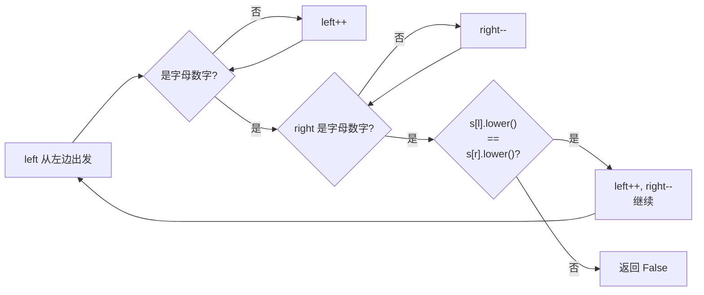

# 125. 验证回文串

> 难度：简单 | 主题：字符串 + 双指针

## 题目

如果在将所有大写字符转换为小写字符、并移除所有非数字字母字符之后，短语正着读和反着读都一样，则可以认为该短语是一个回文串。给定一个字符串 s，如果是回文串返回 true，否则返回 false。

**示例**
```text
输入："A man, a plan, a canal: Panama"
输出：true
解释：忽略大小写和非字母数字后，"amanaplanacanalpanama" 是回文串
```

---

## 思路

### 先讲个故事：两面镜子

走廊两端各放一面镜子，左边和右边各站一个人。两个人同时向中间走，每走一步就对着喊一声。

如果左边的人说的单词去掉标点后和右边的人说的一样，就继续走下一步。全程都对得上——回文；中间对不上——不是回文。

**Python 里可以用 `s == s[::-1]` 一行判断**，但更值得掌握的是**双指针**——不用额外空间。

---

### 引导式推导：从两端向中间收缩

**最简单的版本（不看题目要求）：**

```python
s == s[::-1]    # 判断整个字符串反转后是否等于原串
```

**但题目要求忽略非字母数字和大小写：**

先过滤再判断：
```python
s = ''.join(ch for ch in s if ch.isalnum()).lower()
return s == s[::-1]
```

这也能通过，但**空间 O(n)**——创建了一个新字符串。一个延伸问题是："如果字符串很长，内存有限怎么办？"

**双指针版本——边走边跳过非字母数字：**

```text
"A man, a plan, a canal: Panama"
  ^                             ^
  l                             r
```

- `s[l]` 不是字母数字 → l 右移
- `s[r]` 不是字母数字 → r 左移
- 都是字母数字 → 忽略大小写后比较
  - 相同 → l 右移, r 左移
  - 不同 → 返回 False

```text
跳过标点后：
实际比较的是 'a' vs 'a' → 继续
                'm' vs 'm' → 继续
                ...
```



---

## 代码

```python
def isPalindrome(self, s: str) -> bool:
    left, right = 0, len(s) - 1           # 左右指针
    while left < right:                    # 指针相遇前
        if not s[left].isalnum():          # 跳过非字母数字
            left += 1
        elif not s[right].isalnum():       # 跳过非字母数字
            right -= 1
        elif s[left].lower() == s[right].lower():  # 有效字符相等
            left += 1
            right -= 1
        else:                              # 有效字符不等 → 不是回文
            return False
    return True                            # 全部通过 → 是回文
```

**为什么这里的条件控制用 `elif` 而不是 `if`？**

如果用三个独立的 `if`，可能在一个循环内同时跳过左边和右边的非字母数字，然后直接比较——逻辑上没问题。但用 `elif` 可以**每一轮只做一个操作**，这样做的好处是代码清晰、易于证明正确性（不会在一轮中跳过多个字符）。

两种写法都可以，但 `elif` 形式更容易和厘清边界条件。

---

## 复杂度

| 指标 | 值 | 解释 |
|------|----|------|
| 时间 | O(n) | 每个字符最多访问一次 |
| 空间 | O(1) | 只用了两个指针 |

**对比**：过滤法（`''.join() + lower()`）空间 O(n)，适合生产环境（代码简洁），但实践中 O(1) 方案更优。

---

## 实战考量

### 频率分析

> **出现在**：约 50% 作为热身题或字符串基础题。通常不是最终题，而是**后续难题的垫脚石**。

### 延伸思考

**Q：那能不能一行写完？**
A：可以——`lambda s: (t := ''.join(ch for ch in s if ch.isalnum()).lower()) == t[::-1]`。但实践中写这个会被追问空间复杂度，所以双指针还是得会。

**Q：如果只能用 O(1) 额外空间，且字符串不能修改呢？**
A：双指针跳过非字母数字的方案本身已经是 O(1) 空间、不修改原串。

**Q：如果是单链表判断回文呢？**
A：快慢指针找中点 + 反转后半部分 + 逐位比较。看 234回文链表。因为链表不能随机访问，不能用双指针从两端逼近。

**Q：如果字符串很长（比如 10GB），没法全部读到内存呢？**
A：不能两边往中间读（不知道末尾在哪）。一种思路：先找到字符串长度（遍历一次），然后从两端用文件指针或流式读取配合位比较。更实际的做法是外部排序 + 逐块比较。

**Q：数字字符也算回文吗？**
A：是的，`isalnum()` 包含数字。比如 `"a1a"` 是回文，`"a12a"` 也是，`"a1b"` 不是。

**Q：空字符串呢？**
A：空字符串被认为是回文。代码中 `left=0, right=-1`，循环条件 `while 0 < -1` 不成立，直接返回 True。

### 易错点

- `isalnum()` 是**跳过条件**，不是终止条件——跳过左右两边的非字母数字再比较
- 比较前要 `.lower()`（大写和小写视为相等）
- 循环用 `elif` 而非 `if` 控制结构更清晰
- 进阶题 [[680验证回文串II]]：允许删除一个字符——需要额外处理不等时的 skip 逻辑

---

## 生活类比

> **双指针验证回文 → 真假硬币**
>
> 左右两堆硬币，各自去掉外面的包装纸（非字母数字），看颜色（忽略大小写）是否一致。
> 两边一步一比向中间走——全程对得上就是真，中间有一处不对就是假。
> **两端的对称性，从头走到尾验证。**

---

## 相关题目

| 题目 | 关系 |
|------|------|
| [[680验证回文串II]] | 同族进阶，允许删除一个字符 |
| 234回文链表 | 链表版判断回文，快慢指针+反转 |
| 9回文数 | 不转字符串，用数学方法反转数字 |
| 125验证回文串 | 本题 |

---

→ 返回题单：[[LeetCode学习清单#一、数组与哈希（含双指针、矩阵）]]
