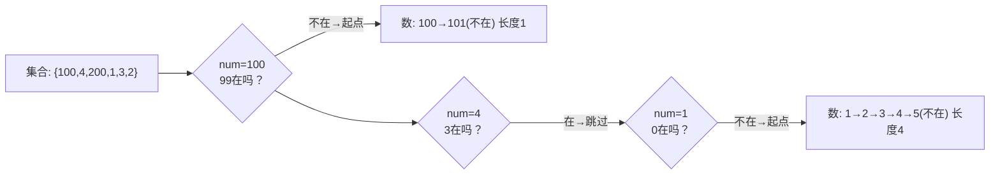

---

title: "最长连续序列"

difficulty: 中等

category: 数组与哈希

tags:

  - leetcode

  - 数组与哈希

created: "2026-07-21"

---

# 128. 最长连续序列（Longest Consecutive Sequence）

> 难度：中等 | 主题：哈希表 / 集合 / 数组

## 题目

给定一个未排序的整数数组 nums，找出数字连续的最长序列（不要求序列元素在原数组中连续）的长度。要求时间复杂度 O(n)。

**示例**

输入：nums = [100,4,200,1,3,2]

输出：4

解释：最长连续序列为 [1,2,3,4]，长度 4

---

## 思路
### 先讲个故事：电影院找座位

你走进电影院，票上没写座位号。你从入口开始看——但是电影院的座位号是打乱的。

你想知道：**最长的连续空座排有多长？**

最笨的办法：找到最左边座位号，然后一个个往后数连续的座位，数完一个排再找下一个起点。

但有个问题——你可能会把同一排数好几遍。

聪明办法：**只从每排的最左边座位开始数**。如果一个座位的左手边没人（没有前驱），它就是排头。从排头往后数，保证每排只数一次。

---

### 引导式推导：从排序到集合

**第 1 层（暴力）**：排序后遍历，相邻差 1 就累加。O(n log n) —— 但题目要求 O(n)。

**第 2 层（哈希集 + 起点优化）**：

把所有数丢进哈希集合。遍历每个数，**只有 `num - 1` 不在集合中**（说明是连续段的开头）才启动内循环往后数。



关键洞察：**只有起点触发的内循环才真正干活，非起点直接跳过。** 看似两层循环，但每个元素最多被内层访问一次，总 O(n)。

**为什么不是 O(n²)？** 内层 while 只有序列起点才触发，而每个元素一旦被 while 消费就标记为已访问（不会再次进入），均摊到每个元素 O(1)。

| 做法 | 时间 | 空间 | 满足 O(n) |

|------|------|------|-----------|

| **集合 + 起点优化** | **O(n)** | **O(n)** | ✅ |

| 排序 + 扫描 | O(n log n) | O(log n) | ❌ |

---

## 代码

```python

def longestConsecutive(self, nums):

    num_set = set(nums)                    # 哈希集合：O(1) 查找 + 自动去重

    max_count = 0                          # 全局最长连续序列

    for num in num_set:                    # 遍历集合（去重后，减少无谓检查）

        if num - 1 not in num_set:         # 核心判断：无前驱 → 序列起点

            current = num

            count = 1

            while current + 1 in num_set:  # 向后扩展连续序列

                current += 1

                count += 1

            max_count = max(max_count, count)

    return max_count

```

---

## 复杂度

| 指标 | 值 | 解释 |

|------|----|------|

| 时间 | O(n) | 建集合 O(n)，内层 while 均摊 O(1) |

| 空间 | O(n) | 哈希集合存全部元素 |

| 排序法 | O(n log n) | 不满足题目要求 |

---

## 实战考量
### 频率分析

> **出现在**：字节/美团/阿里 常考，约 40% 的会拿这道题测试你能不能突破"排序惯性"想到哈希优化。

### 延伸思考

**Q：为什么排序不行？**

A：排序 O(n log n) 不满足题目明确的 O(n) 要求。关键就是能否跳出排序思维定势。

**Q：内层 while 真的是 O(n) 吗？**

A：是。每个元素最多被 while 吃一次——只有起点才触发内循环，非起点直接跳过。均摊下来每个元素 O(1)。

**Q：如果要求返回连续序列本身，而不仅是长度呢？**

A：同时记录起点和终点，while 结束时用 `nums[start:end]` 切片保存，更新最大序列时一并更新结果数组。

**Q：如果数据是数据流（streaming），不能一次性建集合呢？**

A：可以用并查集（Union-Find）维护每个数的连续区间边界，`union(x, x+1)` 动态合并，根节点维护区间长度。

**Q：重复元素会影响结果吗？**

A：不影响。集合自动去重，连续序列计数只看值不看出现次数。

### 易错点

- 遍历 `num_set` 而非原数组——减少重复检查，但遍历原数组也可以

- 忘记 `max_count` 初始为 0，空数组时返回 0

- 内层 while 结束后才更新 `max_count`，不是每步都更新

---

## 生活类比

> **找连续座位 → 找序列起点**

>

> 想象你在一排排打乱的座位中找最长连续空座。你会从每排最左边开始数，而不是每个座位都从头数一遍。

> 哈希集合就是让你 O(1) 知道"左边有没有人"的座位表。

> 用两个字概括：**排头只数一次。**

---

## 相关题目

| 题目 | 关系 |

|------|------|

| [[560和为K的子数组]] | 同为哈希表加速查找的变体 |

| 219存在重复元素II | 哈希表 + 索引约束 |

| [[349两个数组的交集]] | 集合的另一应用 |

---

→ 返回题单：[[LeetCode学习路线图#一、数组与哈希（含双指针、矩阵）]]

## 速记卡（面试闪卡）

**Q1：一句话讲清「128. 最长连续序列（Longest Consecutive Sequence）」到底是什么？**

A：把数组丢进哈希集，只从没前驱的序列起点往后数，均摊 O(n) 求最长连续段。

**Q2：一、题目：找最长连续数字段 —— 怎么理解？**

A：像在一堆打乱的座位号里，找最长连续空座排的长度。给未排序数组，求数字连续的最长序列长度，要求 O(n)（Longest Consecutive Sequence）。

**Q3：二、思路：排头只数一次 —— 怎么理解？**

A：像电影院找最长连续空座：只从每排最左边（没有前驱的座位）开始数，保证每排只数一遍（Start-point optimization）。哈希集 O(1) 判断"左边有人吗"，非起点直接跳过。

**Q4：三、代码：起点触发内循环 —— 怎么理解？**

A：像查座位表：遍历集合，若 num-1 不在就当排头，while 往后数到断；每个元素最多被数一次，均摊 O(1)（Hash set scan）。

**Q5：四、复杂度与实战：跳出排序惯性 —— 怎么理解？**

A：时间 O(n)、空间 O(n)，排序法 O(n log n) 不达标。字节/美团/阿里常考，约 40% 用来测你能否跳出"先排序"的思维定势（Sorting bias）。

**Q6：核心速记主线有哪些？**

- 思路：哈希集去重，只从序列起点（num-1 不在）往后数

- 复杂度：时间 O(n) 空间 O(n)，排序法不达标

- 为什么非 O(n²)：内层 while 均摊 O(1)，每元素消费一次

- 实战：大厂常考，考的是跳出排序惯性想哈希优化

- 延伸：返回序列本身记起止点；流式用并查集

**口诀**

A：连续序列求最长，

排序惯性先扔光；

集合查左无前驱，

排头只数一遍香。

## 相关链接

- [[笔记/Leetcode笔记/01_数组与哈希/217存在重复元素|存在重复元素]]

- [[笔记/Leetcode笔记/01_数组与哈希/15三数之和|三数之和]]

- [[笔记/Leetcode笔记/01_数组与哈希/88合并两个有序数组|合并两个有序数组]]

- [[笔记/Leetcode笔记/01_数组与哈希/169多数元素|多数元素]]

- [[笔记/Leetcode笔记/01_数组与哈希/345反转字符串中的元音字母|反转字符串中的元音字母]]

