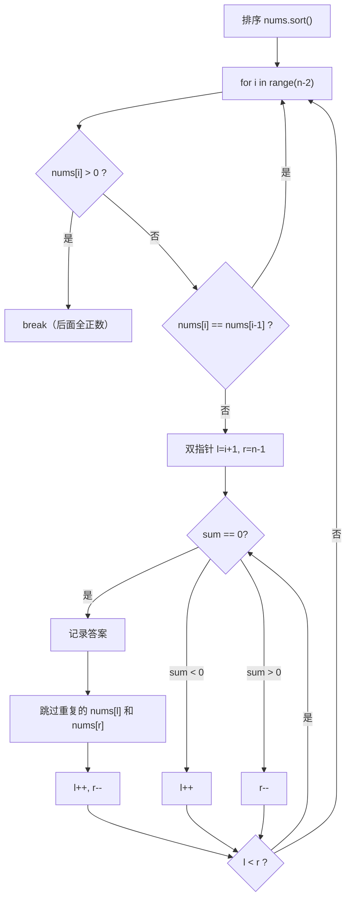

---

title: "三数之和"

difficulty: 中等

category: 数组与哈希

tags:

  - leetcode

  - 数组与哈希

created: "2026-07-21"

---

# 15. 三数之和

> 难度：中等 | 主题：数组 + 排序 + 双指针

## 题目

给你一个整数数组 nums，判断是否存在三元组 [nums[i], nums[j], nums[k]] 满足 i != j、i != k 且 j != k，同时还满足 nums[i] + nums[j] + nums[k] == 0。请你返回所有和为 0 且不重复的三元组。

**示例**

```python

输入：nums = [-1,0,1,2,-1,-4]

输出：[[-1,-1,2],[-1,0,1]]

解释：三个互不重复的三元组，和为 0

```

---

## 思路
### 先讲个故事：三人拼单

你和两个同事一起点外卖。店里搞活动："三份餐加起来正好 100 元的，免配送费。"

你们仨各自有喜欢的餐品（不同的价格），想找有没有三个菜加起来刚好 100 元。

最笨：三个人各选一遍所有菜单，三重循环。

聪明点：你先固定一个人选的菜（比如 30 元的），剩下两个人各自从菜单里挑——但"两个加起来 = 70 元"就是 01两数之和 的问题了，用双指针就能搞定。

这就是三数之和的核心思想：**固定一个，在剩下的数组中做两数之和（双指针版）**。

---

### 引导式推导：排序 + 双指针 + 去重

**核心框架**

1. **排序**（升序）—— 双指针和去重的前提

2. **固定第一个数 nums[i]** —— 剩下找两个数，和为 -nums[i]

3. **双指针 l=i+1, r=n-1 夹逼** —— 在 i 右侧找两数之和

4. **去重** —— 三处都要去重，避免重复三元组

**去重是最大难点**



**为什么排序后去重更方便？**

排序后相同元素必然相邻——去重只需和上一个比较，不用哈希表记录"已经见过哪些三元组"。

**三处去重：**

| 位置 | 代码 | 为什么 |

|------|------|--------|

| 固定数 i | `if i > 0 and nums[i] == nums[i-1]: continue` | 固定数相同，后面对应的两数解肯定也相同 |

| 左指针 l | `while l<r and nums[l] == nums[l+1]: l += 1` | 找到解后跳过相邻相同值 |

| 右指针 r | `while l<r and nums[r] == nums[r-1]: r -= 1` | 同理，对称处理 |

**剪枝优化**

排序后如果 `nums[i] > 0`，后续所有数都 > 0，三数之和不可能为 0 → 直接 break。

---

## 代码

```python

def threeSum(self, nums):

    nums.sort()

    result = []

    n = len(nums)

    for i in range(n - 2):

        if nums[i] > 0:           # 剪枝：后面全正数，不可能和为 0

            break

        if i > 0 and nums[i] == nums[i - 1]:

            continue               # 去重：固定数跳过相同值

        left, right = i + 1, n - 1

        while left < right:

            total = nums[i] + nums[left] + nums[right]

            if total == 0:

                result.append([nums[i], nums[left], nums[right]])

                while left < right and nums[left] == nums[left + 1]:

                    left += 1      # 去重：跳过相邻相同的 left

                while left < right and nums[right] == nums[right - 1]:

                    right -= 1     # 去重：跳过相邻相同的 right

                left += 1

                right -= 1

            elif total < 0:

                left += 1

            else:

                right -= 1

    return result

```

---

## 复杂度

| 指标 | 值 | 解释 |

|------|----|------|

| 时间 | O(n²) | 排序 O(n log n) + 每轮双指针 O(n) |

| 空间 | O(1) | 不计输出数组（排序栈空间 O(log n)） |

| 暴力枚举 | O(n³) | 三重循环，n=3000 就爆了 |

---

## 实战考量
### 频率分析

> **出现在**：字节/美团/阿里 高频，这道题用来考察**排序 + 双指针 + 去重的综合能力**。难点不在算法本身，而在你能不能把所有去重逻辑说清楚。

### 延伸思考

**Q：四数之和怎么做？**

A：固定两个数（两层循环），剩下两个双指针夹逼，O(n³)。去重更复杂——三层去重（固定数 i、固定数 j、左右指针）。详见 18 题。

**Q：如果数组不能排序呢？**

A：固定一个数后用哈希表找两数之和，但去重更麻烦——需要给每个三元组排序后去重，或用集合记录已出现的组合。

**Q：最接近的三数之和怎么做？**

A：同款框架，找 |sum - target| 最小的。不用去重（只要一个最优解），但要在循环中实时更新最小差值。详见 16 题。

**Q：`nums[i] > 0` 剪枝为什么安全？**

A：排序后如果第一个数 > 0，后面的全 > 0，三个正数相加不可能等于 0。

### 易错点

- 去重条件 `nums[i] == nums[i-1]` 跟**前面**比，不是 `nums[i+1]`（那会漏掉解）

- `range(n-2)`：i 最远到 n-3，后面留 left 和 right 的位置

- 找到答案后 left 和 right **都要动**（只动一个下次 total 一定 ≠ 0）

- 去重循环要加 `l < r` 条件防越界

---

## 生活类比

> **三数之和 → 固定一个 + 双指针 → 三处去重**

>

> 像三个人玩拼图：一个人先固定住自己那块拼图（固定数），剩下两个人各自拼过来（双指针）。

> 如果固定块放的位置和别人重复了，就不用再试了（去重 i）。

> 拼好一组后，左右两个人同时往前/后找新的拼法——但记得跳过一样的拼图块（去重 l/r）。

>

> **每去重一处，就少算一次重复劳动。**

---

## 相关题目

| 题目 | 关系 |

|------|------|

| 01两数之和 | 基础版，两数之和哈希表解法 |

| 167两数之和II-输入有序数组 | 两数之和双指针版，三数之和的内部核心 |

| 16. 最接近的三数之和 | 同族变体，找最接近 target 的三数之和 |

| 15三数之和 | 本题，排序 + 双指针 + 去重 |

---

→ 返回题单：[[LeetCode学习路线图#一、数组与哈希（含双指针、矩阵）]]

## 速记卡（面试闪卡）

**Q1：一句话讲清「15. 三数之和」到底是什么？**

A：三数之和：排序后固定一个数，在剩下列表用双指针找两数之和为零的组合。

**Q2：一、题目与故事 —— 怎么理解？**

A：像三人拼单免配送费：三人各选菜，找三个菜价加起来正好 100 元。最笨是三重循环各点一遍；聪明是固定一人(如 30 元)，剩下两人凑 70 元——这变成两数之和，用双指针搞定。核心：固定一个+双指针。

**Q3：二、排序+双指针+去重 —— 怎么理解？**

A：像拼图先对齐再夹逼：排序(升序)是双指针和去重前提；固定 nums[i]，左 l=i+1、右 r=n-1 夹逼找 -nums[i]；三处去重——固定数 i、左 l、右 r 各自跳过相邻相同值，避免重复三元组。

**Q4：三、剪枝与复杂度 —— 怎么理解？**

A：像正数剪枝快进：排序后 nums[i]>0 则后面全正、和不可能为 0→直接 break。时间 O(n²)(排序 nlogn+每轮双指针 n)，空间 O(1)；暴力三重循环 O(n³)，n=3000 就爆。

**Q5：四、易错点与延伸 —— 怎么理解？**

A：像易踩的坑：去重跟"前面"比(nums[i]==nums[i-1])而非后面，否则漏解；range(n-2) 给左右留位；找到解后左右都要动。延伸：四数之和固定两个再双指针 O(n³)；不能排序则用哈希找两数但去重更烦。

**Q6：核心速记主线有哪些？**

- 核心框架：排序 → 固定 nums[i] → 双指针 l/r 夹逼找 -nums[i]

- 三处去重：固定数 i、左 l、右 r 各跳过相邻相同值

- 剪枝：nums[i]>0 直接 break；时间 O(n²) 空间 O(1)

- 易错：去重比前面、左右都要动、range(n-2) 留位

**口诀**

A：三数之和先排序，固定一个双指针；

左右夹逼找零和，三处去重莫相侵。

i 比前邻跳重复，l r 同跳避重临；

nums[i] 正便剪枝，O(n²) 稳且深。

## 相关链接

- [[笔记/Leetcode笔记/01_数组与哈希/01两数之和|两数之和]]

- [[笔记/Leetcode笔记/01_数组与哈希/167两数之和II-输入有序数组|两数之和II-输入有序数组]]

- [[笔记/Leetcode笔记/01_数组与哈希/680验证回文串II|验证回文串II]]

- [[笔记/Leetcode笔记/01_数组与哈希/26删除有序数组中的重复项|删除有序数组中的重复项]]

- [[笔记/Leetcode笔记/01_数组与哈希/88合并两个有序数组|合并两个有序数组]]

