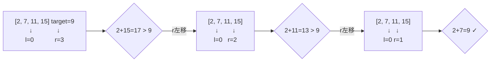

# 167. 两数之和 II - 输入有序数组

> 难度：中等 | 主题：数组 + 双指针

## 题目

给你一个下标从 1 开始的整数数组 numbers，该数组已按非递减顺序排列。请你找出两个数满足相加之和等于目标数 target。返回这两个数的下标。你可以假设每个输入只对应唯一的答案。

**示例**
输入：numbers = [2,7,11,15], target = 9
输出：[1,2]
解释：下标从 1 开始，numbers[1]+numbers[2]=9

---

## 思路

### 先讲个故事：两个人在数轴上找朋友

你和朋友站在一根有序的数轴上，想找一个位置组合能让你们俩的坐标加起来等于 100。

朋友站在最左边（最小数），你站在最右边（最大数）。

- 如果和太大 → 你往左走（减小）
- 如果和太小 → 朋友往右走（增大）

你们相向而行，总能在某个点碰头。

---

### 引导式推导：从无序到有序

**第 1 题（两数之和）** 用哈希表是因为数组无序，不得不存下所有数的位置。

**本题** 数组已排序——有序就是信息，双指针利用这个信息把空间降到 O(1)。



**为什么一定能找到？** 单调性保证搜索空间不断缩小——l 右移和增大，r 左移和减小。每次比较排除一个元素，类似于在二维有序矩阵中搜索。

| 场景 | 解法 | 空间 | 理由 |
|------|------|------|------|
| **有序数组** | **双指针** | **O(1)** | 利用有序性缩小搜索范围 |
| 无序数组 | 哈希表 | O(n) | 需要记录已遍历元素的位置 |

---

## 代码

```python
def twoSum(self, numbers, target):
    left, right = 0, len(numbers) - 1   # 双指针指向数组两端
    while left < right:                 # 不能等号，一个数不能跟自己相加
        total = numbers[left] + numbers[right]
        if total == target:             # 找到目标，题目保证唯一解
            return [left + 1, right + 1]  # 下标从 1 开始
        elif total < target:            # 和太小 → 左指针右移
            left += 1
        else:                           # 和太大 → 右指针左移
            right -= 1
    return []                           # 理论上不会执行（题目保证有解）
```

---

## 复杂度

| 指标 | 值 | 解释 |
|------|----|------|
| 时间 | O(n) | 每个元素最多访问一次 |
| 空间 | O(1) | 就两个指针 |
| 哈希表法 | O(n) 空间 | 无序数组才用 |

---

## 实战考量

### 频率分析

> **出现在**：一面基础题，常和 01两数之和 对比出题。约 35% 的会用这道题考察"场景选择能力"——有序用双指针，无序用哈希。

### 延伸思考

**Q：为什么有序数组不用哈希表？**
A：哈希表 O(n) 空间，双指针 O(1) 空间。有序数组的双指针信息来自排序本身，哈希表既浪费空间又没利用有序这个已知条件。

**Q：如果数组可能有重复元素，答案不唯一呢？**
A：双指针找到一个后，左右都跳过重复值继续搜索，类似 15三数之和 的去重逻辑。

**Q：如果要求返回所有不重复的组合？**
A：找到一对后，left 和 right 各自跳过重复值再继续。核心是 `while left < right and nums[left] == nums[left-1]: left += 1`。

**Q：while 条件为什么是 `<` 不是 `<=`？**
A：一个数不能和自己相加形成两个数。l == r 时指向同一个元素，不合法。

**Q：下标为什么要 +1？**
A：题目要求下标从 1 开始（1-indexed），而代码里用的是 0-indexed。

### 易错点

- 下标从 1 开始返回，忘记 `left + 1` 和 `right + 1`
- `while left < right` 写成 `while left <= right`
- 答案唯一 → 直接 return，不需要继续搜索

---

## 生活类比

> **找两数之和 → 相向双指针**
>
> 就像两个人在一个递增的山坡上从两头往中间走，一个从山脚往上，一个从山顶往下。
> 和太小说明山脚的人走快点，和太大说明山顶的人走慢点。
> 双指针就是——**每次只走一步，但一步缩小一行可能性。**

---

## 相关题目

| 题目 | 关系 |
|------|------|
| 01两数之和 | 同族无序版，用哈希表 |
| 15三数之和 | 三数版，固定一个后内部就是本题 |
| 125验证回文串 | 双指针相向遍历，经典场景 |

---

→ 返回题单：[[LeetCode学习清单#一、数组与哈希（含双指针、矩阵）]]

## 速记卡（面试闪卡）

**Q1：一句话讲清「167. 两数之和 II - 输入有序数组」到底是什么？**
A：给你一个下标从 1 开始的整数数组 numbers，该数组已按非递减顺序排列。请你找出两个数满足相加之和等于目标数 target。返回这两个数的下标。你可以假设每个输入只对应唯一的答案。
**示例**
输入：numbers = [2,7,11,15], target = 9
输出：[1,2]
解释：下标从 1 开始，numbers[1]+numbers[2]=9
---

**Q2：题目 —— 怎么理解？**
A：给你一个下标从 1 开始的整数数组 numbers，该数组已按非递减顺序排列。请你找出两个数满足相加之和等于目标数 target。返回这两个数的下标。你可以假设每个输入只对应唯一的答案。
**示例**
输入：numbers = [2,7,11,15], target = 9
输出：[1,2]
解释：下标从 1 开始，numbers[1]+numbers[2]=9
---

**Q3：思路 —— 怎么理解？**
A：你和朋友站在一根有序的数轴上，想找一个位置组合能让你们俩的坐标加起来等于 100。
朋友站在最左边（最小数），你站在最右边（最大数）。
如果和太大 → 你往左走（减小）
如果和太小 → 朋友往右走（增大）
你们相向而行，总能在某个点碰头。
---
**第 1 题（两数之和）** 用哈希表是因为数组无序，不得不存下所有数的位置。
**本题** 数组已排序——有序就是信息，双指针利用这个信息把空间降到 O(1)。

**Q4：代码 —— 怎么理解？**
A：---

**Q5：复杂度 —— 怎么理解？**
A：| 指标 | 值 | 解释 |
|------|----|------|
| 时间 | O(n) | 每个元素最多访问一次 |
| 空间 | O(1) | 就两个指针 |
| 哈希表法 | O(n) 空间 | 无序数组才用 |
---

**Q6：核心速记主线有哪些？**
A：抓住这几根：题目、思路、代码、复杂度、实战考量、生活类比。

