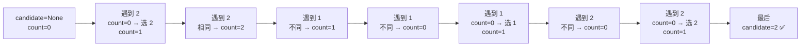

---

title: "多数元素"

difficulty: 简单

category: 数组与哈希

tags:

  - leetcode

  - 数组与哈希

created: "2026-07-21"

---

# 169. 多数元素（Majority Element）

> 难度：简单 | 主题：数组、分治、位运算

## 题目

给定一个大小为 n 的数组 nums，返回其中的多数元素。多数元素是指在数组中出现次数大于 n/2 的元素。你可以假设数组是非空的，并且给定的数组总是存在多数元素。

**示例**

输入：nums = [2,2,1,1,1,2,2]

输出：2

---

## 思路
### 先讲个故事：总统大选

一个村投票选村长。总共有 n 张票，某位候选人获得了超过一半的票。

你是计票员，要找出谁是赢家。但你不能用纸笔记录每个人的票数（没用额外空间）。

一个聪明的老计票员告诉你一个办法：

- 拿一张纸写上第一个候选人的名字，在旁边画一横（计 1 票）

- 继续唱票：是这个人就加一横，不是就划掉一横

- 当横线数归零时，把纸上的名字换成当前唱票的人

- 最后纸上的人就是赢家

为什么？因为赢家的票 > 其他人的票总和，**互相抵消后，赢家一定有剩余**。

---

### 引导式推导：从统计到抵消

**第 1 层（哈希表）**：遍历计数，找到出现次数 > n/2 的。O(n) 时间 O(n) 空间，直观但浪费空间。

**第 2 层（排序）**：排序后取中位数。因为多数元素超过一半，排序后中间位置一定是它。O(n log n) 时间。

**第 3 层（Boyer-Moore 投票）**：



核心洞察：**异见者互相抵消，多数者必然留到最后。** 不同元素两两抵消，因为多数元素出现次数 > 一半，最坏情况所有其他元素都和它抵消，它仍有剩余。

| 算法 | 时间 | 空间 | 思想 |
|------|------|------|------|
| **Boyer-Moore 投票** | **O(n)** | **O(1)** | 不同则抵消 |
| Counter 哈希 | O(n) | O(n) | 计数统计 |
| 排序取中 | O(n log n) | O(1) | 中位数性质 |
| 分治 | O(n log n) | O(log n) | 左右分别找 |

---

## 代码

```python

def majorityElement(self, nums):

    count = 0                              # 当前候选人票数余额

    candidate = None                       # 当前候选人

    for num in nums:                       # 遍历唱票

        if count == 0:                     # 票数归零 → 换人

            candidate = num

        count += 1 if num == candidate else -1  # 同票 +1，异票抵消 -1

    return candidate                       # 超过半数，最后必然胜出

```

---

## 复杂度

| 指标 | 值 | 解释 |
|------|----|------|
| 时间 | O(n) | 一次遍历 |
| 空间 | O(1) | 两个变量 |
| 哈希表 | O(n) 空间 | 简单但费内存 |

---

## 实战考量
### 频率分析

> **出现在**：常考"有没有比哈希更好的办法"。约 30% 的会追问 Boyer-Moore 投票算法的原理和证明。

### 延伸思考

**Q：为什么 Boyer-Moore 能保证找到多数元素？**

A：多数元素出现次数 > 其他所有元素之和。每次抵消（count 减 1）相当于消灭一对不同元素。多数元素总能在抵消中活到最后。

**Q：如果不保证一定存在多数元素呢？**

A：第一遍跑投票找 candidate，第二遍遍历验证其出现次数是否 > n/2。

**Q：用分治怎么做？**

A：左右分段各自找多数元素。如果左右多数相同就返回，不同就比两边各自的出现次数。

**Q：找出现次数 > n/3 的元素呢？**

A：需要维护两个 candidate，三三抵消（摩尔投票扩展版）。因为超过 1/3 的元素最多有两个。

**Q：数组中调 `nums.count()` 有什么问题？**

A：`count()` 本身是 O(n)，放循环里调就是 O(n²)，大忌。

### 易错点

- `count == 0` 时才换 candidate，不是 `num != candidate` 就换

- 题目保证存在多数元素，所以不需要第二遍验证

- 随机化不推荐用（最坏 O(∞)）

---

## 生活类比

> **找多数元素 → 总统大选抵消法**

>

> 想象一片战场上，多数派士兵 > 一半。散兵游勇两两相遇就同归于尽，

> 最后站着的必然是多数派的人。

> 用两个字概括 Boyer-Moore：**抵消留剩。**

---

## 相关题目

| 题目 | 关系 |
|------|------|
| 136只出现一次的数字 | 异或抵消，异曲同工 |
| 229. 求众数 II（> n/3） | 扩展版：两个候选人的摩尔投票 |

---

→ 返回题单：[[LeetCode学习路线图#一、数组与哈希（含双指针、矩阵）]]

## 速记卡（面试闪卡）

**Q1：一句话讲清「169. 多数元素（Majority Element）」到底是什么？**

A：找数组里出现次数超过一半的元素，用摩尔投票两两抵消，不开额外空间就能锁定赢家。

**Q2：题目理解 —— 面试官到底要你干嘛？ —— 怎么理解？**

A：像村长选举，你没法记票数却要找出得票过半的人。题目只保证存在多数元素，所以不用验证。英文：Majority Element。

**Q3：核心思路 —— 抵消法为什么稳？ —— 怎么理解？**

A：像战场两军相遇同归于尽，多数派人数过半，怎么消都留得下最后一人。异见抵消、胜者留存。英文：Boyer-Moore Voting。

**Q4：代码实现 —— 两行循环怎么写？ —— 怎么理解？**

A：像记账员手拿一张候选条：票数为零就换人，遇到同人就加一票，异人就划掉一票。全程只两个变量。英文：Candidate Tracking。

**Q5：复杂度与实战 —— 面试官会怎么追问？ —— 怎么理解？**

A：像验票：一遍投票 O(n) 时间、O(1) 空间；若不敢保证存在多数，就再扫一遍验证。追问 n/3 众数要两个候选。英文：Validation Pass。

**Q6：核心速记主线有哪些？**

- 多数元素：出现次数严格大于 n/2，题目保证一定存在

- 摩尔投票：不同元素两两抵消，多数者必留到最后

- 代码只需 candidate + count 两个变量，空间 O(1)

- 不保证存在时需第二遍验证；n/3 众数需两个候选

- 别在循环里调 count()，否则退化成 O(n²)

**口诀**

A：多数元素过半强，

相互抵消露真王；

计数候选只占一，

一遍扫过定谁王。

## 相关链接

- [[笔记/Leetcode笔记/01_数组与哈希/217存在重复元素|存在重复元素]]

- [[笔记/Leetcode笔记/01_数组与哈希/15三数之和|三数之和]]

- [[笔记/Leetcode笔记/01_数组与哈希/88合并两个有序数组|合并两个有序数组]]

- [[笔记/Leetcode笔记/01_数组与哈希/345反转字符串中的元音字母|反转字符串中的元音字母]]

- [[笔记/Leetcode笔记/01_数组与哈希/448找到所有数组中消失的数字|找到所有数组中消失的数字]]

