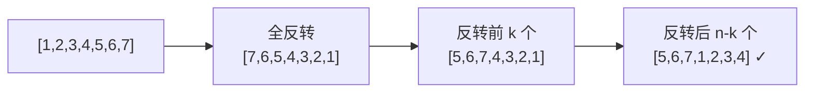

---

title: "旋转数组"

difficulty: 中等

category: 数组与哈希

tags:

  - leetcode

  - 数组与哈希

created: "2026-07-21"

---

# 189. 旋转数组（Rotate Array）

> 难度：中等 | 主题：数组、双指针、翻转

## 题目

给定一个整数数组，将数组中的元素向右轮转 `k` 个位置，其中 `k` 是非负数。

**示例**

输入：nums = [1,2,3,4,5,6,7], k = 3

输出：[5,6,7,1,2,3,4]

---

## 思路
### 先讲个故事：旋转木马的魔法

游乐场的旋转木马，你坐在其中一匹马上。管理员说："所有人向右移动 3 个位置"。

一个小朋友说："我们全都站起来走到新位置太挤了。"

另一个说："不如先把整个队列反过来，再调整局部顺序。"

你一开始觉得离谱，试了一下——居然真的排好了。

---

### 引导式推导：从暴力到翻转

**第 1 层（额外数组）**：新开数组 `new[(i + k) % n] = nums[i]`。O(n) 时间 O(n) 空间，最直观。

**第 2 层（三次反转）**：O(1) 空间，数学上等价于 `(A^R B^R)^R = BA`。



**为什么三次翻转 = 向右旋转？**

向右旋转 k 位 = 把末尾 k 个元素搬到前面，前 n-k 个整体移到后面。

如果你把数组分成 A（前 n-k 个）和 B（后 k 个）两段：

- 目标 = BA

- 全反转 = (A^R B^R)

- 反转 A 段 = (A B^R)

- 再反转 B 段 = (A B) = BA ✓

核心洞察：**翻转的逆序操作可以精确控制元素的相对位置，数学上等于 `(A^R B^R)^R = BA`。**

| 方法 | 时间 | 空间 | 适合场景 |

|------|------|------|---------|

| **三次反转** | **O(n)** | **O(1)** | 最优解 |

| 额外数组 | O(n) | O(n) | 可读性优先 |

| Python 切片 `nums[-k:] + nums[:-k]` | O(n) | O(n) | 一行但非原地 |

---

## 代码

```python

def rotate(self, nums, k):

    n = len(nums)

    k = k % n                       # 处理 k > n 的情况

    if k == 0:

        return

    def reverse(start, end):        # 双指针原地翻转区间

        while start < end:

            nums[start], nums[end] = nums[end], nums[start]

            start += 1

            end -= 1

    reverse(0, n - 1)               # 全反转

    reverse(0, k - 1)               # 反转前 k 个

    reverse(k, n - 1)               # 反转后 n-k 个

```

---

## 复杂度

| 指标 | 值 | 解释 |

|------|----|------|

| 时间 | O(n) | 每个元素被翻转两次 |

| 空间 | O(1) | 原地操作 |

| 额外数组法 | O(n) 空间 | 直观但不符合要求 |

---

## 实战考量
### 频率分析

> **出现在**：常考"不用额外空间"的追问点。约 30% 常会从这题开始，看你能不能从额外数组想到翻转法。

### 延伸思考

**Q：为什么 `k = k % n` 是必须的？**

A：k 可能大于 n（比如 k=100, n=7），旋转 100 次等价于旋转 100%7=2 次。不取模会导致数组越界或做大量无用功。

**Q：向左旋转怎么做？**

A：调整三次翻转的顺序：先反转前 k 个，再反转后 n-k 个，最后全反转。或者直接 `reverse(0, k-1); reverse(k, n-1); reverse(0, n-1)`。

**Q：Python 的一行切片法 `nums[:] = nums[-k:] + nums[:-k]` 有什么问题？**

A：看似一行但创建了新列表，空间 O(n)。实践中可能会进一步追问"这算 O(1) 吗？"——不是。

**Q：翻转法的边界容易错在哪里？**

A：前 k 个是 `[0, k-1]` 不是 `[0, k]`；后 n-k 个是 `[k, n-1]`。

### 易错点

- 忘记 `k = k % n`，k 很大时出错

- 翻转区间边界算错：前 k 个是 `[0, k-1]`

- k = 0 或 k = n 时不做任何操作

---

## 生活类比

> **旋转数组 → 三次翻牌**

>

> 想象一叠扑克牌，你要把最后几张移到最上面。

> 先整叠倒过来，再分别整理前后两段——结果就对了。

> 用两个字概括：**翻两次成序。**

---

## 相关题目

| 题目 | 关系 |

|------|------|

| [[61旋转链表]] | 链表版旋转，思路类似 |

| [[31下一个排列]] | 同属数组变换操作 |

| 151反转字符串中的单词 | 局部反转 + 整体反转的变体 |

---

→ 返回题单：[[LeetCode学习路线图#一、数组与哈希（含双指针、矩阵）]]

## 速记卡（面试闪卡）

**Q1：一句话讲清「189. 旋转数组（Rotate Array）」到底是什么？**

A：旋转数组把末尾k个元素移到前面，最优解是三次反转O(1)空间。

**Q2：一、题目要求 —— 怎么理解？ —— 怎么理解？**

A：像转圈报数：把数组向右轮转 k 位，末尾 k 个搬到最前，前 n-k 个整体后移；等价于 (A^R B^R)^R = BA。英语：Rotate Array / cyclic shift。

**Q3：二、三次反转法 —— 怎么理解？ —— 怎么理解？**

A：像翻扑克牌：先整叠倒过来，再分别整理前后两段，结果就对了。数学上翻转能精确控制相对位置，原地 O(1) 空间。英语：reverse（反转）/ three-pass reverse。

**Q4：三、代码要点 —— 怎么理解？ —— 怎么理解？**

A：像三段式翻牌：reverse(0,n-1) 全反转，reverse(0,k-1) 翻前段，reverse(k,n-1) 翻后段；先 k%=n 防越界。英语：in-place reverse。

**Q5：四、复杂度与易错点 —— 怎么理解？ —— 怎么理解？**

A：像算账：时间 O(n) 每个元素翻两次，空间 O(1) 原地；易错在忘 k%=n、区间写成 [0,k] 而非 [0,k-1]。英语：O(n) time / O(1) space。

**Q6：核心速记主线有哪些？**

- 旋转=末尾k个移到前面，等价于(A^R B^R)^R

- 三次反转：全反→反前k→反后n-k，O(1)空间

- 代码先 k%=n，区间[0,k-1]别写错

- 时间O(n)空间O(1)，最优解

**口诀**

A：旋转数组三次翻，全反前段后段还；

k 取模防越界，区间半开莫写宽。

时间 O(n) 空间一，原地操心最省烦；

翻两次成序，一遍写对稳过关。

## 相关链接

- [[笔记/Leetcode笔记/01_数组与哈希/448找到所有数组中消失的数字|找到所有数组中消失的数字]]

- [[笔记/Leetcode笔记/01_数组与哈希/525连续数组|连续数组]]

- [[笔记/Leetcode笔记/01_数组与哈希/349两个数组的交集|两个数组的交集]]

- [[笔记/Leetcode笔记/01_数组与哈希/217存在重复元素|存在重复元素]]

- [[笔记/Leetcode笔记/01_数组与哈希/88合并两个有序数组|合并两个有序数组]]

