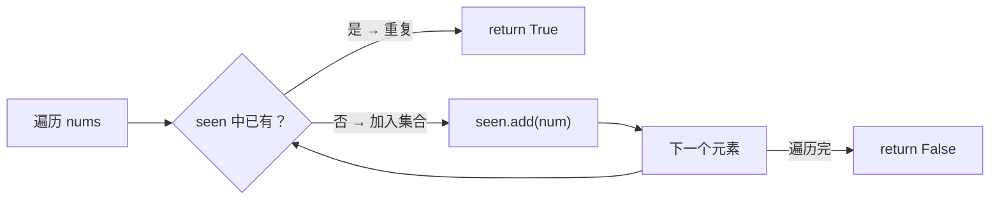

---

title: "存在重复元素"

difficulty: 简单

category: 数组与哈希

tags:

  - leetcode

  - 数组与哈希

created: "2026-07-21"

---

# 217. 存在重复元素（Contains Duplicate）

> 难度：简单 | 主题：哈希表 / 数组 / 排序

## 题目

给你一个整数数组 nums。如果任一值在数组中出现至少两次，返回 true；如果数组中每个元素互不相同，返回 false。

**示例**

输入：nums = [1,2,3,1]

输出：true

---

## 思路
### 先讲个故事：教室点名

老师走进教室点名："张三、李四、王五、张三……"

你在旁边记名单。每听到一个名字，你就在本子上找有没有记过。

如果本子上已经有了——举手说："重复了！"

最自然的方法就是拿纸笔（哈希集合）记下所有已经点到的人名。

---

### 引导式推导：从暴力到集合

**第 1 层（暴力嵌套）**：两层循环，每对元素比较。O(n²) —— 不要提，除非你先说"我们知道这很差"。

**第 2 层（排序 + 相邻比较）**：排序后重复元素必然相邻，扫一遍检查相邻。O(n log n) 时间 O(1) 空间（排序栈除外）。

**第 3 层（哈希集合）**：



**Python 一行版的花哨写法**：`return len(nums) != len(set(nums))`。简洁但不能提前终止——如果第一个元素就重复了，它仍然要遍历完整个数组。

| 算法 | 时间 | 空间 | 优点 |

|------|------|------|------|

| **哈希集合** | **O(n)** | **O(n)** | 最快，可提前终止 |

| 一行版 set | O(n) | O(n) | 简洁 |

| 排序 + 相邻比较 | O(n log n) | O(log n) | 省空间 |

---

## 代码

```python

def containsDuplicate(self, nums):

    seen = set()                          # 哈希集合：记录已遍历元素

    for num in nums:                      # 挨个检查每个元素

        if num in seen:                   # 已存在 → 发现重复

            return True

        seen.add(num)                    # 新元素 → 加入集合

    return False                          # 全部不重复

```

---

## 复杂度

| 指标 | 值 | 解释 |

|------|----|------|

| 时间 | O(n) | 一次遍历，集合 in/add 均摊 O(1) |

| 空间 | O(n) | 集合最多存 n 个元素 |

| 排序法 | O(n log n) | 省空间但费时 |

---

## 实战考量
### 频率分析

> **出现在**：热身题，几乎 100% 的基础都会从哈希表用法开始。但注意——可以从这里开始深入系列问题。

### 延伸思考

**Q：如果数组很大，内存放不下集合怎么办？**

A：排序后检查相邻元素，O(1) 额外空间（不考虑排序栈）。或者分批处理，使用 Bloom Filter 概率性判断。

**Q：数据流场景（元素逐个到来）呢？**

A：只能用哈希集合（或 Bloom Filter），无法排序。

**Q：数组中有且仅有一个数出现奇数次，其他都出现偶数次？**

A：全体异或，O(1) 空间 → 136只出现一次的数字。

**Q：如果重复元素有距离限制（两个相同元素距离不超过 k）？**

A：哈希表记录每个数的最新下标，检查 `i - last_index[num] <= k` → 219存在重复元素II。

**Q：一行版 `len(nums) != len(set(nums))` 有什么缺点？**

A：不能提前终止。如果第一个元素就重复，仍然要遍历整个数组建集合。

### 易错点

- `return True` 要放在循环内提前终止，不是在循环外

- 一行版看似简洁，但实践中体现不出你对提前终止的理解

- 集合 `add` 不是 `append`

---

## 生活类比

> **查重复 → 教室点名**

>

> 就像老师点名时你在旁边记名单——记过的人名再出现，就是重复了。

> 哈希集合就是那张纸，O(1) 查人名。

> 用两个字概括哈希的魅力：**记过即知。**

---

## 相关题目

| 题目 | 关系 |

|------|------|

| 219存在重复元素II | 同族进阶，加索引距离约束 |

| [[349两个数组的交集]] | 集合的另一应用场景 |

| 136只出现一次的数字 | 异或抵消，只有唯一次数 |

---

→ 返回题单：[[LeetCode学习路线图#一、数组与哈希（含双指针、矩阵）]]

## 速记卡（面试闪卡）

**Q1：一句话讲清「217. 存在重复元素（Contains Duplicate）」到底是什么？**

A：《存在重复元素》是判断整数数组是否包含重复值的哈希表入门题，能提前终止最优。

**Q2：题目 —— 怎么理解？**

A：像老师点名查重：给你一个数组，任一值出现两次就返回 true，全不同返回 false；题目（Problem）要的就是这个布尔判定。

**Q3：思路 —— 怎么理解？**

A：像旁边记名单：每听到名字先翻本子，记过就是重复——拿哈希集合（HashSet）记已见元素，O(1) 查重、可提前终止。

**Q4：代码 —— 怎么理解？**

A：哈希集合遍历一遍：seen 里已有就 return True，否则 add 进去；遍历完 return False。代码（Code）核心是 `if num in seen` 提前终止。

**Q5：复杂度 —— 怎么理解？**

A：像记名单只走一趟：时间 O(n) 一次遍历，空间 O(n) 存集合；排序加相邻比较可省空间但 O(n log n)。复杂度（Complexity）权衡时空。

**Q6：核心速记主线有哪些？**

- 题目：数组有重复值返回 true，否则 false

- 思路：哈希集合记已见元素，O(1) 查重

- 代码：遍历中 in 判断提前终止，否则 add

- 复杂度：时间 O(n) 空间 O(n)，排序法省空间

**口诀**

A：查重如点名，

集合记人名；

一遍扫过去，

见重立刻停。

## 相关链接

- [[笔记/Leetcode笔记/01_数组与哈希/219存在重复元素II|存在重复元素II]]

- [[笔记/Leetcode笔记/01_数组与哈希/448找到所有数组中消失的数字|找到所有数组中消失的数字]]

- [[笔记/Leetcode笔记/01_数组与哈希/169多数元素|多数元素]]

- [[笔记/Leetcode笔记/01_数组与哈希/01两数之和|两数之和]]

- [[笔记/Leetcode笔记/01_数组与哈希/680验证回文串II|验证回文串II]]

