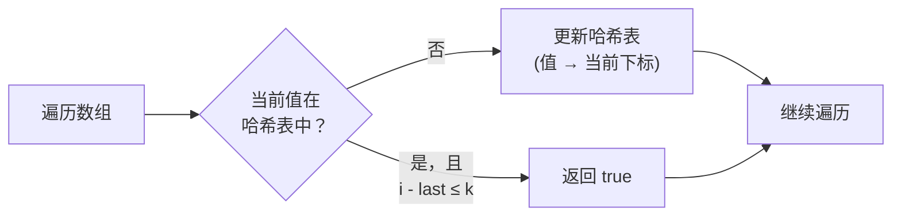

# 219. 存在重复元素 II

> 难度：简单 | 主题：哈希表 / 滑动窗口

## 题目

给你一个整数数组 nums 和一个整数 k，判断数组中是否存在两个不同的索引 i 和 j，满足 `nums[i] == nums[j]` 且 `|i-j| <= k`。

**示例**
```text
输入：nums = [1,2,3,1], k = 3 → true
解释：两个 1 的下标差 3（3-0=3）≤ k
```

---

## 思路

### 先讲个故事：教室里的同名同学

班主任点名发现两个"王芳"，但她们在不同座位上。班主任想知道：有没有同名同学坐得 **足够近**（间隔不超过 k 个座位）？

你的任务：在教室里扫一遍，同时记住最近见过的每个名字出现在哪个座位。看到重名时查一下座位差。

---

### 引导式推导：从暴力到哈希

**暴力法**：双层循环检查所有数对 `(i, j)`，看是否 `nums[i] == nums[j]` 且 `j - i <= k`。O(n²)，n 大了直接挂。

**优化观察**：遍历时，你只关心 **最近一次** 见到这个值的位置。更早的位置没有意义——因为新位置和最近位置的距离一定比和更早位置的距离小。

所以只需要一个哈希表：值 → 最近下标。边走边查。



---

### 两种解法对比

| 方法 | 空间 | 场景 |
|------|------|------|
| **哈希表** | O(n) | 通吃，k 接近 n 时唯一选择 |
| **滑动窗口 + 集合** | O(k) | k 很小时更省空间 |

**滑动窗口思路**：维护一个大小为 k 的集合窗口。窗口内如果有重复 → 距离一定 ≤ k。但需要每次从集合中移除左端元素，多了一步维护操作。

---

## 代码

```python
def containsNearbyDuplicate(self, nums, k):
    s = {}                             # 哈希表：值 → 最近下标
    for i in range(len(nums)):
        if nums[i] in s and i - s[nums[i]] <= k:  # 重复且距离 ≤ k
            return True
        s[nums[i]] = i                 # 更新为最新下标（覆盖旧的）
    return False
```

---

## 复杂度

| 指标 | 值 | 解释 |
|------|----|------|
| 时间 | O(n) | 一次遍历 |
| 空间 | O(n) | 哈希表最坏存全部元素 |

---

## 实战考量

### 延伸思考

**Q：为什么哈希表存值→下标，而不是值→下标列表？**
A：只需要最近的下标——距离计算只取决于最新位置和当前位置。更早的位置必然更远，不需要保留。

**Q：滑动窗口 + 集合怎么做？什么时候用？**
A：维持一个大小为 k 的集合，每步 add 当前元素，当集合大小 > k 时 remove `nums[i-k]`。如果当前元素已在集合中 → 找到。适合 k 很小的情况（空间 O(k)）。

**Q：如果找所有满足条件的数对呢？**
A：哈希表存值→下标列表，遍历每个值对应的下标列表，两两检查是否 ≤ k。

### 易错点

- 哈希表的 key 是 **元素值**，不是索引
- 距离公式 `i - s[nums[i]]`，不是 `s[nums[i]] - i`
- 必须 **不断更新** 为最新下标，不能看到重复就停
- 滑动窗口法记得在 i ≥ k 时移除 `nums[i-k]`

---

## 生活类比

> **哈希表 → 最近一个证人的座位号**
>
> 教室里你只关心"最近一次见到王芳坐在哪"——更靠前的座位毫无意义，因为距离只会更大。
> 更新哈希表就像班主任发现同名同学后，把记录本上的座位号改成最近的那个。

---

## 相关题目

| 题目 | 关系 |
|------|------|
| 217存在重复元素 | 同族基础版，去掉下标约束 |
| 220. 存在重复元素 III（困难） | 值差和下标差都限制，需桶排序 |

---

→ 返回题单：[[LeetCode学习清单#一、数组与哈希（含双指针、矩阵）]]
