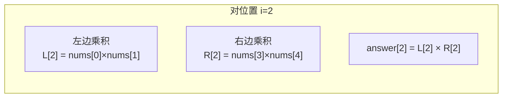

---

title: "除自身以外数组的乘积"

difficulty: 中等

category: 数组与哈希

tags:

  - leetcode

  - 数组与哈希

created: "2026-07-21"

---

# 238. 除自身以外数组的乘积

> 难度：中等 | 主题：数组 / 前缀积 / 后缀积

## 题目

给你一个整数数组 nums，返回数组 answer，其中 `answer[i]` 等于 nums 中除 `nums[i]` 之外其余各元素的乘积。**请不要使用除法**，且在 O(n) 时间复杂度内完成。

**示例**

```text

nums = [1, 2, 3, 4]

输出：[24, 12, 8, 6]

```

---

## 思路
### 先讲个故事：自助餐计价

你去自助餐厅拿菜，每道菜的价格写在盘子下面。结账时，每道菜的价格 = **除这道菜以外所有菜的总价**。

但你手边没有计算器（不能用除法）。怎么办？

正着走一遍算"左边菜的累计价格"，反着走一遍算"右边菜的累计价格"，每个位置把左右一乘就行。

---

### 引导式推导：从朴素到 O(1) 空间

**朴素想法**：对每个位置 i，把左右两边的数乘起来。



但这是 O(n²) 的——每个位置都要重新算。

**前缀积优化**：先一趟从左到右，算每个位置左边的累积乘积。再一趟从右到左，用一个变量动态维护右边乘积，边乘边更新答案。

```text

原始数组:   [1,  2,  3,  4]

前缀积:     [1, 1,  2,  6]   ← 每个位置 = 左边所有数的积

                                        (从左往右，answer 先充当前缀积数组)

后缀积遍历:

  i=3: answer[3] = 6 × 1  → 6,   R = 1 × 4 = 4

  i=2: answer[2] = 2 × 4  → 8,   R = 4 × 3 = 12

  i=1: answer[1] = 1 × 12 → 12,  R = 12 × 2 = 24

  i=0: answer[0] = 1 × 24 → 24,  R = 24 × 1 = 24

```

最终 answer 就是答案。

---

### 为什么不让用除法？

```python

total_product = 1 * 2 * 3 * 4 = 24

answer[i] = 24 // nums[i]

```

听起来更简单？但遇到 **0** 就炸了：

- 数组 `[0, 1, 2, 3]`：总积 = 0，每个位置 `0 / nums[i]` 要么 NaN 要么 0，全错

- 多个 0：更没法处理

实践中可以提"如果没 0 可以用除法"，然后立刻说"但题目禁止且除法有 0 陷阱"。

---

### 复杂度对比

| 方法 | 时间 | 额外空间 | 除法 |

|------|------|---------|------|

| **前缀积 + 后缀积** | O(n) | **O(1)** | 无 |

| 左右数组 | O(n) | O(n) | 无 |

| 分类讨论除法 | O(n) | O(1) | 用了（扣分） |

---

## 代码

```python

def productExceptSelf(self, nums):

    n = len(nums)

    answer = [1] * n                # 先充当前缀积数组

    for i in range(1, n):           # 从左往右：answer[i] = 左边所有数的积

        answer[i] = nums[i - 1] * answer[i - 1]

    R = 1                           # R 动态维护右边乘积

    for i in range(n - 1, -1, -1): # 从右往左：answer[i] *= 右边所有数的积

        answer[i] *= R

        R *= nums[i]

    return answer

```

---

## 复杂度

| 指标 | 值 | 解释 |

|------|----|------|

| 时间 | O(n) | 两遍遍历，每步 O(1) |

| 空间 | O(1) | 不计输出数组，只有一个变量 R |

---

## 实战考量
### 延伸思考

**Q：为什么第二遍遍历要倒着走？**

A：因为需要动态维护"右边所有数的乘积"。从左往右时当前位置右边的元素还没处理，不知道右边积。从右往左时右边的已经扫过了，可以边乘边累积。

**Q：如果不限制除法，你会怎么做？这有什么问题？**

A：算总乘积，每个位置 `total // nums[i]`。但遇到 0 就失效——至少分三类讨论：没有 0、一个 0、多个 0。可以提但必须指出局限性。

**Q：如果要求额外空间 O(1) 且输出数组也不算呢？**

A：这题无解——必须有个地方存结果。

**Q：如果改成"除自身以外数组的累加和"呢？**

A：同样前缀和 + 后缀和思路，乘法变加法。

### 易错点

- 第二遍循环范围 `range(n - 1, -1, -1)` 不是 `range(n, -1, -1)`（会越界）

- `answer` 先充当前缀积数组，不要创建额外数组

- `R` 初始为 1（乘 1 不变），不是 0

- 题目禁止用除法，不要上来就写分类讨论

---

## 生活类比

> **前缀积 × 后缀积 → 左右手算账**

>

> 左手记"左边已经花了多少钱"，右手记"右边还要花多少钱"。

> 每到一个位置，左手账单 × 右手账单 = 这个位置的最终价格。

> 走完全程，两手空空（O(1) 空间）。

---

## 相关题目

| 题目 | 关系 |

|------|------|

| [[53最大子数组和]] | 同属数组累积，前缀和（加法版） |

| 525连续数组 | 前缀和 + 哈希表 |

---

→ 返回题单：[[LeetCode学习路线图#一、数组与哈希（含双指针、矩阵）]]

## 速记卡（面试闪卡）

**Q1：一句话讲清「238. 除自身以外数组的乘积」到底是什么？**

A：求每个位置除自身外所有数的乘积，禁用除法、O(n) 时间、O(1) 空间。

**Q2：思路 —— 怎么理解？**

A：像自助餐结账——每道菜价格=除它外所有菜总价，但手边没计算器（不能除法）。正走一遍算左边累计、反走一遍算右边累计，左右一乘即得。前缀积+后缀积，O(n) 时间 O(1) 空间。

**Q3：代码 —— 怎么理解？**

A：先用 answer 数组充当前缀积（从左往右累乘），再用变量 R 从右往左动态维护右边乘积、边乘边更新；R 初始为 1。不建额外数组，空间 O(1)。

**Q4：复杂度 —— 怎么理解？**

A：时间 O(n) 两遍遍历每步 O(1)；空间 O(1)（不计输出数组，只用一个变量 R）。比"左右两个数组"的 O(n) 空间更省。

**Q5：实战考量 —— 怎么理解？**

A：第二遍必须倒着走才能动态维护右边积；别用除法（遇 0 直接失效）；R 初值 1 不是 0；常考延伸如"除自身以外数组的累加和"把乘法变加法。

**Q6：核心速记主线有哪些？**

- 核心：每个位置 = 左边积 × 右边积，且禁用除法

- 前缀积从左扫、后缀积用变量 R 从右扫，一趟遍历搞定

- 时间 O(n)、空间 O(1)（输出数组不算）

- 易错：第二遍倒序、R 初值 1、禁止分类讨论除法

**口诀**

A：除自身乘积不除法，左右两半各自乘

前缀左扫后缀右，变量 R 把右边存

一遍遍历 O(n)，空间 O(1) 不折腾

遇零别慌分类论，面试稳拿不出错

## 相关链接

- [[笔记/Leetcode笔记/01_数组与哈希/283移动零|移动零]]

- [[笔记/Leetcode笔记/01_数组与哈希/349两个数组的交集|两个数组的交集]]

- [[笔记/Leetcode笔记/01_数组与哈希/88合并两个有序数组|合并两个有序数组]]

- [[笔记/Leetcode笔记/01_数组与哈希/189旋转数组|旋转数组]]

- [[笔记/Leetcode笔记/01_数组与哈希/448找到所有数组中消失的数字|找到所有数组中消失的数字]]

