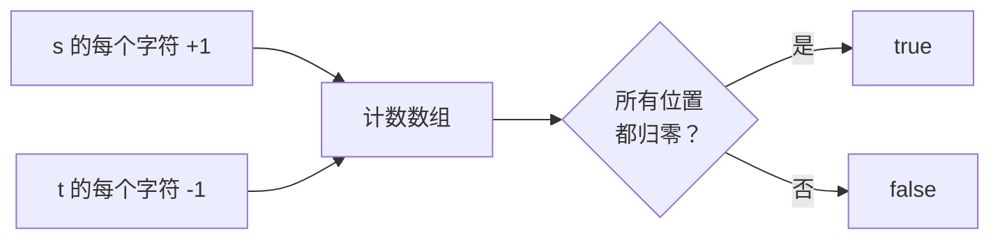

# 242. 有效的字母异位词

> 难度：简单 | 主题：哈希表 / 字符串 / 排序

## 题目

给定两个字符串 s 和 t，判断 t 是否是 s 的字母异位词（每个字符出现次数相同，顺序可以不同）。

**示例**
```text
s = "anagram", t = "nagaram" → true
s = "rat", t = "car" → false
```

---

## 思路

### 先讲个故事：药房的药材盘点

药房有两张药方，都写着"当归、甘草、人参"——但顺序不一样。药童需要判断：这两张方子是不是 **同样的药材，同样份量**？

把药材倒进 26 个抽屉（对应 a-z），每味药出现一次就放一颗豆子。两张方子都走完，每个抽屉的豆子数一样 → 同一张方子。

---

### 引导式推导：从排序到计数

**思路一：排序法**

异位词排序后字符串一样：

```python
sorted("anagram") → "aaagmnr"
sorted("nagaram") → "aaagmnr"
# 相等 → 异位词
```

一行搞定，但排序 O(n log n)。

**思路二：计数法（本质更优）**

统计每个字符出现次数，一加一减，最后全零 → 异位词。



计数数组大小固定为 26（仅限小写字母），O(1) 额外空间。

---

### 两种解法对比

| 做法 | 时间 | 空间 | 场景 |
|------|------|------|------|
| **Counter 比较** | **O(n)** | **O(n)** | 通用，Unicode 也支持 |
| 数组计数 | O(n) | O(1) | 字符集有限（如 a-z） |
| 排序比较 | O(n log n) | O(n) | 代码最短，备选 |

---

## 代码

```python
from collections import Counter

def isAnagram(self, s, t):
    return Counter(s) == Counter(t)   # Counter 逐项比较频率分布
```

---

## 复杂度

| 指标 | 值 | 解释 |
|------|----|------|
| 时间 | O(n) | 遍历两个字符串各一次 |
| 空间 | O(n) | Counter 字典存字符频率 |

---

## 实战考量

### 延伸思考

**Q：你能写一个不用 Counter 的版本吗？**
A：用长度为 26 的数组（仅限小写字母）：`counter[ord(c) - ord('a')] += 1`。空间 O(1) 因为大小固定。建议先写这个版本，再提 Counter 一行版。

**Q：如果字符集是 Unicode，有上百万个字符呢？**
A：数组法不可行——需要用哈希表 Counter。Unicode 范围太大，固定数组会浪费巨量空间。

**Q：如果要求 O(1) 空间呢？**
A：排序法。原地排序（如快排）理论上 O(log n) 栈空间，实践中可以接受作为"近乎 O(1)"的方案。

**Q：能否只用一次遍历？**
A：可以——先用 Counter 统计 s，遍历 t 时逐字符减，一旦发现负数直接返回 false。最后再检查是否所有计数归零。

### 易错点

- `Counter(s) == Counter(t)` 是逐元素比较频率，不是比较长度
- 数组计数先检查 `len(s) != len(t)` 快速返回 false
- `ord(c) - ord('a')` 偏移计算，下标范围 0-25
- 进阶字符集（Unicode）时不要用固定数组

---

## 生活类比

> **字符计数 → 药房抽屉**
>
> 26 个抽屉对应 26 个字母。第一张方子的每味药往对应抽屉放一颗豆子，第二张方子每味药取出一颗。最后所有抽屉都空了 → 两张方子一模一样。
> 注意小写字母场景下这 26 个抽屉本身不占额外空间（固定大小）。

---

## 相关题目

| 题目 | 关系 |
|------|------|
| [[49字母异位词分组]] | 同族扩展，从判断一对到分组全部 |

---

→ 返回题单：[[LeetCode学习清单#一、数组与哈希（含双指针、矩阵）]]
