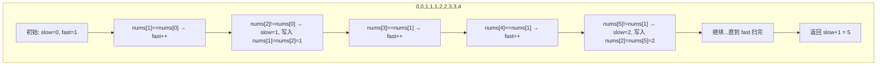

# 26. 删除有序数组中的重复项

> 难度：简单 | 主题：数组 + 双指针（快慢指针）

## 题目

给你一个非严格递增排列的数组 nums，请原地删除重复出现的元素，使每个元素只出现一次，返回删除后数组的新长度。元素的相对顺序应保持一致。不要使用额外的数组空间，必须原地修改输入数组。

**示例**
输入：nums = [0,0,1,1,1,2,2,3,3,4]
输出：5, nums = [0,1,2,3,4,...]
解释：函数返回新长度 5，前 5 个元素为 0,1,2,3,4

---

## 思路

### 先讲个故事：整理书架

你有一排书架，上面插着按顺序排列的书。有些书名重复了——同一本书有好几本。

你想把重复的书抽走，只保留一本，然后把剩下的书往左推紧，让书架前半段变得紧凑有序。

你的做法：左手放在第一本书上（慢指针），右手从第二本开始一本一本往后扫（快指针）。

- 右手发现一本新书（和左手的不同）→ 左手往前移一位，把新书插过来
- 右手发现一本重复书（和左手的相同）→ 跳过不看

整理完，左手指到哪，哪就是最后一本不重复的书。

这就是**快慢指针**——数组版"有序去重"的完美模型。

---

### 引导式推导：快慢指针的发明

**前提：数组已排序**

排序意味着重复元素必然**相邻**出现。这是 O(n) 快慢指针能工作的前提。

**如果数组未排序呢？** 必须用哈希表记录已出现的数，空间 O(n)。

**慢指针 slow**：指向已去重区域的最后一个位置（初始为 0）

**快指针 fast**：探路，从 1 开始扫描



**核心规则**

```text
nums[fast] == nums[slow] → 重复，跳过
nums[fast] != nums[slow] → 新元素，slow++ 后写入
```

---

## 代码

```python
def removeDuplicates(self, nums):
    if not nums:
        return 0
    slow = 0
    for fast in range(1, len(nums)):
        if nums[fast] != nums[slow]:   # 发现新元素
            slow += 1                   # 去重区域扩展一位
            nums[slow] = nums[fast]     # 写入新元素
    return slow + 1                     # slow 是下标，长度 = slow + 1
```

---

## 复杂度

| 指标 | 值 | 解释 |
|------|----|------|
| 时间 | O(n) | 一次线性遍历 |
| 空间 | O(1) | 原地修改，无额外空间 |
| 哈希表法 | O(n) | 空间 O(n)，未排序时使用 |

---

## 实战考量

### 频率分析

> **出现在**：字节/阿里 一面，快慢指针入门题。这道题用来考察**原地修改数组的基本功**——能不能在 O(1) 空间内完成去重。

### 延伸思考

**Q：如果最多允许重复两次呢？**
A：比较 `nums[fast]` 与 `nums[slow-1]`（而不是 nums[slow]）。因为最多保留两个，新元素只要和倒数第二个不同就可以写入。详见 80 题"删除有序数组中的重复项 II"。

**Q：如果数组未排序呢？**
A：必须用哈希表记录已出现的数，空间 O(n)，时间 O(n)。

**Q：删除所有值为 val 的元素呢？**
A：同款快慢指针，`if nums[fast] != val` 才写入。详见 283移动零（把 0 移到末尾本质相同）。

**Q：返回 slow 还是 slow+1？**
A：slow 是**下标**，去重区域长度 = 最后一个下标 + 1 = slow + 1。fast=1 时 slow=0，如果只有一个元素，循环不执行但返回 1，正确。

### 易错点

- 返回 `slow + 1` 不是 `slow`
- fast 从 1 开始（第一个元素天然在去重区域）
- 别忘了判空
- 前提是数组已排序，否则快慢指针不成立

---

## 生活类比

> **有序去重 → 快慢指针 → 原地修改**
>
> 像你在超市清点货架。你从第一个商品开始往后扫（快指针），手里拿着"当前商品"的样本（慢指针）。
> 
> 看到一样的→跳过（没必要多放一瓶）。
> 看到不一样的→把样本往前推一位，把新商品放过来。
> 
> 扫完整个货架，前几个位置就是**每种商品各一个**的完美陈列。
> 
> **多用"慢指针标记位置"，少用"额外空间存数据"。**

---

## 相关题目

| 题目 | 关系 |
|------|------|
| 283移动零 | 同族原地操作，快慢指针模式，把 0 移到末尾 |
| 80. 删除有序数组中的重复项 II | 进阶版，最多保留两个重复元素（wikilink 待建） |
| 26删除有序数组中的重复项 | 本题，快慢指针入门 |

---

→ 返回题单：[[LeetCode学习清单#一、数组与哈希（含双指针、矩阵）]]
