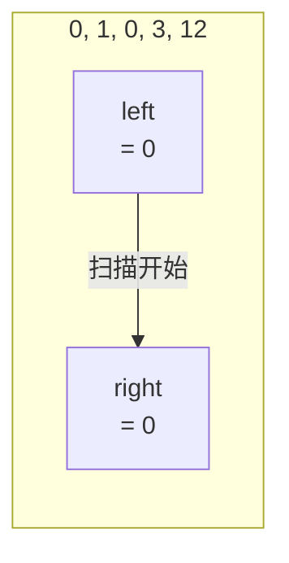

---

title: "移动零"

difficulty: 简单

category: 数组与哈希

tags:

  - leetcode

  - 数组与哈希

created: "2026-07-21"

---

# 283. 移动零

> 难度：简单 | 主题：数组 / 双指针

## 题目

给定一个数组 nums，将所有 0 移动到数组末尾，同时保持非零元素的相对顺序。必须 **原地** 操作。

**示例**

```text

nums = [0, 1, 0, 3, 12]

输出：[1, 3, 12, 0, 0]

```

---

## 思路
### 先讲个故事：排队买奶茶

奶茶店排队，队伍里混了几个"0 号客人"（不想喝奶茶，站在队伍里发呆）。店长说：**所有 0 号客人到队尾去，其他人保持原有顺序。**

店长策略：左手（left）指向"下一个非零客人该站的位置"，右手（right）挨个扫人。遇到非零的 → 和左手位置的人交换，左手右移一格。

---

### 引导式推导：从朴素到指针

**朴素想法**：遍历数组，遇到 0 就删掉，然后在末尾追加一个 0。

但 `pop(i)` 之后所有元素左移，索引偏移 → 噩梦。而且 `pop` + `append` 是 O(n²)。

**双指针思路**：不让 0"移动"，而是让非零元素"挤到前面"。



```text

初始：      [0, 1, 0, 3, 12]

            L,R

right=0 → nums[0]=0 → 不交换，R 右移

           [0, 1, 0, 3, 12]

           L  R

right=1 → nums[1]=1 → 交换(L,R)，L++，R++

           [1, 0, 0, 3, 12]

              L     R

right=3 → nums[3]=3 → 交换(L,R)，L++，R++

           [1, 3, 0, 0, 12]

                 L     R

right=4 → nums[4]=12 → 交换(L,R)

           [1, 3, 12, 0, 0]

                    L   R    ← 完成

```

这里的**关键洞察**：left 和 right 之间**全是 0**，所以交换相当于把非零元素往前放，0 自动被换到后面。

---

### 为什么交换而不是覆盖？

```python

# 覆盖法：先移非零，再补零

pos = 0

for num in nums:

    if num != 0:

        nums[pos] = num

        pos += 1

while pos < len(nums):

    nums[pos] = 0

    pos += 1

```

覆盖法也需要两次遍历。交换法一次遍历搞定，且更优雅。两者本质一样。

---

## 代码

```python

def moveZeroes(self, nums):

    left = 0                           # left 指向下一个非零元素的位置

    for right in range(len(nums)):     # right 扫描整个数组

        if nums[right] != 0:           # 找到非零 → 交换到 left 位置

            nums[left], nums[right] = nums[right], nums[left]

            left += 1                  # left 右移

```

---

## 复杂度

| 指标 | 值 | 解释 |

|------|----|------|

| 时间 | O(n) | 一次遍历，每步 O(1) |

| 空间 | O(1) | 原地交换 |

---

## 实战考量
### 延伸思考

**Q：为什么交换能保持非零元素的相对顺序？**

A：left 指向"下一个非零元素应该放的位置"，right 扫描时按原始顺序遇到非零元素。把非零元素换到 left 位置时，left 位置原来的元素（一定是 0）被换到 right 位置。因为 left ≤ right，且 left 到 right 之间全是 0，所以不会打乱非零顺序。

**Q：覆盖法比交换法差在哪？**

A：覆盖法需要两次遍历（先移非零，再补零）。交换法一次遍历到位，且代码更简洁。

**Q：如果要求把负数也移到前面（三分区）呢？**

A：荷兰国旗问题——三指针分区，分负数、零、正数三区。

**Q：如果要求移动零到开头呢？**

A：从右往左扫描，或者同样逻辑但把条件改成"遇到非零就往后换"。

### 易错点

- 用交换不是覆盖——覆盖会丢失数据（除非显式补零）

- left 和 right 同向移动，不是相向

- 不要用 `pop` + `append`——O(n²) 且索引偏移

- `nums[-1] = nums.pop(i)` 是覆盖末尾元素，不是追加

---

## 生活类比

> **双指针 → 奶茶店排队**

>

> left = "下一个非零客人的站位"，right = "正在检查的客人"。

> 遇到非零客人 → 请他站到 left 位置（跟那个位置的 0 号客人换位置）。

> 所有非零客人排好了，零号客人自然被挤到队尾。

---

## 相关题目

| 题目 | 关系 |

|------|------|

| 26删除有序数组中的重复项 | 同族原地操作，快慢指针模式 |

---

→ 返回题单：[[LeetCode学习路线图#一、数组与哈希（含双指针、矩阵）]]

## 速记卡（面试闪卡）

**Q1：一句话讲清「283. 移动零」到底是什么？**

A：把数组里所有 0 移到末尾、非零保持原顺序，且必须原地操作——双指针一次扫描搞定。

**Q2：一、题目与约束 —— 怎么理解？**

A：奶茶店排队类比：队伍里混了几个「0 号客人」发呆，店长让他们去队尾，其他人保持顺序。这就是题面——把 0 挪到末尾、非零顺序不变，且不能开新数组，必须原地（in-place，不占额外空间）改。

**Q3：二、双指针思路 —— 怎么理解？**

A：不用 pop+append（O(n²) 还索引偏移）。双指针（Two Pointers，一快一慢同向扫）：left 指「下一个非零该站的位置」，right 挨个扫，遇非零就和 left 交换、left 右移。因 left~right 之间全是 0，交换天然把非零前挤、0 后挪。

**Q4：三、为什么交换保序 —— 怎么理解？**

A：left 永远 ≤ right，且 left 到 right 之间全是 0。把非零换到 left 时，left 原位（定是 0）被换到 right——不碰任何已有非零，故相对顺序不乱。覆盖法也行（先移非零再补零）但需两次遍历，交换法一次到位更优雅。

**Q5：四、复杂度与易错点 —— 怎么理解？**

A：时间 O(n) 一次遍历每步 O(1)，空间 O(1) 原地交换。易错：用 pop+append 变 O(n²)；left/right 同向非相向；nums[-1]=nums.pop(i) 是覆盖末尾非追加；忘补零会丢数据。

**Q6：核心速记主线有哪些？**

- 双指针：left 指非零落位，right 扫描，遇非零就交换

- 交换法一次遍历 O(n)，比覆盖/ pop 更优雅

- left≤right 且区间内全 0，故交换保非零顺序

- 原地 O(1)，易错点是 pop+append 与相向误用

**口诀**

A：移动零，双指针；

左定位右扫，非零就交换。

一遍 O(n)，原地 O(1)；

顺序不乱，零到尾端。

## 相关链接

- [[笔记/Leetcode笔记/01_数组与哈希/238除自身以外数组的乘积|除自身以外数组的乘积]]

- [[笔记/Leetcode笔记/01_数组与哈希/15三数之和|三数之和]]

- [[笔记/Leetcode笔记/01_数组与哈希/88合并两个有序数组|合并两个有序数组]]

- [[笔记/Leetcode笔记/01_数组与哈希/26删除有序数组中的重复项|删除有序数组中的重复项]]

- [[笔记/Leetcode笔记/01_数组与哈希/680验证回文串II|验证回文串II]]

