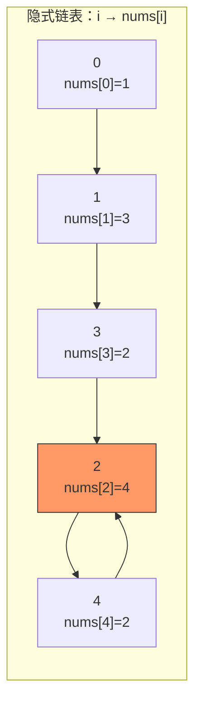

# 287. 寻找重复数（Find the Duplicate Number）

> 难度：中等 | 主题：值域二分 + 快慢指针（Floyd 判圈）

## 题目

给定一个包含 n+1 个整数的数组 nums，其数字都在 [1, n] 范围内（包括 1 和 n）。假设 nums 只有**重复的整数**，找出这个重复的数。要求**不修改数组**且只用**常量级额外空间**。

**示例**
```text
输入：nums = [1,3,4,2,2]
输出：2
```

---

## 思路

### 先讲个故事：机场行李转盘

想象一下机场的行李转盘——每个行李袋上贴着一个标签（值），但有几个袋子标签相同（重复数）。这些袋子在传送带上排成一列（数组），每个袋子上还写着"下一个袋子的位置"。

你发现有个诡异的规律：无论怎么走，总会绕回某几个袋子之间。

这正是 Floyd 判圈算法的直觉——数组里藏着一条"隐式链表"，重复值就是环的入口。

---

### 引导式推导：两条路通向同一个答案

#### 入口：鸽巢原理

n+1 个数放进 n 个数字 [1, n] 的桶里，**至少有一个桶有两个数**。这是解决这道题的底层原理。

#### 第 1 条路：值域二分（O(n log n)）

在 [1, n] 值域上二分猜答案。每次都统计数组中有多少个数 ≤ mid：
- `count > mid` → 重复数在左边（左半边 [1, mid] 只能装 mid 个数，却占了 >mid 个位置）
- `count ≤ mid` → 重复数在右边

> 这就像查账：先猜中间值，如果小于等于这个数的发票张数超过了编号范围，说明有假编号混在里面。

| 方法 | 时间 | 空间 | 权重 |
|------|------|------|---------|
| **快慢指针** | **O(n)** | **O(1)** | 参考答案 |
| 值域二分 | O(n log n) | O(1) | 展示思维广度 |

#### 第 2 条路：快慢指针（O(n)，最优）

把数组看成隐式链表：`i → nums[i]`。因为存在重复数（一个值被多个位置指向），这个链表一定有环。环的入口就是重复数。



红色节点 2 被两个节点（3 和 4）指向，形成了环。

Floyd 判圈算法分两步：
1. **找相遇点**：slow 走 1 步，fast 走 2 步，在环内相遇
2. **找环入口**：slow 重置到起点，两指针同速走，相遇即入口

这本质是 142环形链表II 的数组版——指针从 `node.next` 变成了 `nums[i]`。

```mermaid
graph LR
    subgraph 阶段1：找相遇点
        S1["slow<br/>+1 步"] --> S2["..." ]
        F1["fast<br/>+2 步"] --> F2["..." ]
    end
    S2 --> Meet["相遇"]
    F2 --> Meet
    Meet -->|阶段2| Reset["slow 放回 0"]
    Reset --> Walk["同速走 1 步"]
    Walk --> Entry["再次相遇 = 环入口<br/>= 重复数"]
```

---

## 代码

```python
def findDuplicate(self, nums):
    # 阶段1：快慢指针找相遇点（在环内）
    slow = fast = 0
    while True:
        slow = nums[slow]           # 慢指针走 1 步
        fast = nums[nums[fast]]     # 快指针走 2 步
        if slow == fast:            # 相遇 → 存在环
            break

    # 阶段2：找环入口（即重复数）
    slow = 0                        # 慢指针重置到起点
    while slow != fast:
        slow = nums[slow]           # 同速，每次 1 步
        fast = nums[fast]
    return slow                     # 环入口即为重复数
```

---

## 复杂度

| 指标 | 值 | 解释 |
|------|----|------|
| 时间 | O(n) | 阶段一 O(n)，阶段二 O(n) |
| 空间 | O(1) | 只用两个指针 |
| 值域二分 | O(n log n) | 二分 log n 轮，每轮统计 O(n) |

---

## 实战考量

### 频率分析

> **出现在**：字节/美团/阿里 常考，约 40% 常会从这道题考察"多解法"能力。关键在于你能否**两种方法都想到**，并能流畅比较优劣。

### 延伸思考

**Q：为什么 Floyd 判圈能用在数组上？**
A：把 `i → nums[i]` 看作链表指针。数组下标是节点，值是 next 指针。重复数意味着一个值被多个下标指向 → 多个入度 → 有环。

**Q：值域二分的原理是什么？**
A：鸽巢原理——[1, mid] 区间只有 mid 个数字，但数组中有 >mid 个元素落在这个区间，说明重复数在左半。

**Q：题目说"不修改数组"，值域二分改了吗？**
A：没改。只读地统计 count，不碰数组。所以两种方法都满足不修改的要求。

**Q：如果有两个重复数呢？**
A：问题变复杂了，快慢指针无法区分两个环。需要修改数组做标记（用正负号标记已访问）或用数学方法。

**Q：为什么第一步不能用 `while slow != fast`？**
A：初始时 slow == fast == 0，根本不会进入循环。所以必须用 `while True` 先走再判断。

### 易错点

- 阶段 1 必须用 `while True`（先走一步再判断，否则初始相等不会进入）
- 阶段 2 的 `slow` 必须放回 0
- 值域二分：`cnt > mid` 而不是 `cnt >= mid`（等号情况在右半）

---

## 生活类比

> **隐式链表 → Floyd 判圈 → 数组版找环入口**
>
> 就像在操场上跑步，两个人从同一起点出发，一个快一个慢。快的追上慢的时，说明他们进入了环形跑道。然后让一个人回到起点，再同速跑，相遇点就是环的入口。
>
> 这道题的聪明之处在于：把看起来毫无关联的"找重复数"，转化成了"找链表环入口"——**换个角度看问题，O(n²) 变 O(n)**。

---

## 相关题目

| 题目 | 关系 |
|------|------|
| 142环形链表II | 同族，链表版 Floyd 判圈（本题就是它换了个壳） |
| 287寻找重复数 | 本题，数组版快慢指针 |

---

→ 返回题单：[[LeetCode学习清单#一、数组与哈希（含双指针、矩阵）]]
