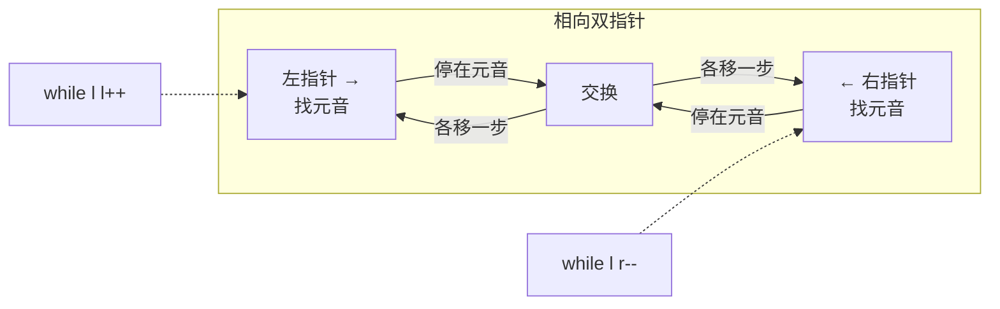

# 345. 反转字符串中的元音字母

> 难度：简单 | 主题：字符串 + 双指针

## 题目

给你一个字符串 s，仅反转字符串中的所有元音字母，并返回结果字符串。元音字母包括 'a'、'e'、'i'、'o'、'u'，且可能以大小写两种形式出现。

**示例**
```text
输入：s = "hello"
输出："holle"

输入：s = "leetcode"
输出："leotcede"
```

---

## 思路

### 先讲个故事：双人校对

想象你和同事从一份文档的两端向中间逐字校对。你们约定只交换大写元音（A/E/I/O/U）位置。

你从左边走，同事从右边走。各找到一个元音时，**交换它们**，然后继续向中间移动。

当你们在中间碰头时，所有元音都已经被反转了。

---

### 引导式推导：从具体到模板

**问题分解**：反转元音字母，辅音位置不动。

**核心操作**：
1. 从左往右找下一个元音
2. 从右往左找上一个元音
3. 交换

**两指针在中间回合** → 完成。



**技巧要点**：
- Python 字符串不可变 → `list(s)` 转列表 → 修改 → `"".join()` 转回
- 内层 while 要加 `left < right` 边界保护，防止指针飞出去
- 交换后两指针各移一步，避免死循环

**模板对比**：这道题和 167两数之和II-输入有序数组 是同一个双指针模板——差别只在"停下条件"：元音判断 vs 和等于 target。

---

## 代码

```python
def reverseVowels(self, s):
    vowels = set("aeiouAEIOU")          # 元音集合（含大小写），O(1) 查找
    chars = list(s)                    # 字符串不可变，转 list 允许原地修改
    l, r = 0, len(s) - 1              # 左指针 →，右指针 ←

    while l < r:
        while l < r and chars[l] not in vowels:   # 左指针跳过非元音
            l += 1
        while l < r and chars[r] not in vowels:   # 右指针跳过非元音
            r -= 1
        chars[l], chars[r] = chars[r], chars[l]   # 交换左右元音
        l += 1                                    # 交换后左移
        r -= 1                                    # 交换后右移

    return "".join(chars)                # list 转回字符串
```

---

## 复杂度

| 指标 | 值 | 解释 |
|------|----|------|
| 时间 | O(n) | 每个字符最多被访问一次 |
| 空间 | O(n) | 字符串转 list 需要 O(n) 空间 |

---

## 实战考量

### 频率分析

> **出现在**：热身题，约 20% 的会用来考双指针基础。重点看你**边界处理是否干净**。

### 延伸思考

**Q：如果要求原地修改不转 list 呢？**
A：Python 字符串不可变，必须转 list；C++ 可以直接修改 `string`。

**Q：元音定义扩展（加上 y/Y）呢？**
A：集合里加上 `'yY'` 即可，框架不变。

**Q：反转辅音，元音不动？**
A：同样框架，条件取反——找辅音而不是元音。

**Q：字符串长度为 1 或 0？**
A：`while l < r` 不进入，直接返回原串，边界安全。

### 易错点

- 别忘了大写元音 `AEIOU`
- 内层 while 必须加 `l < r` 保护，否则可能飞越
- 字符串不可变，必须先转 list
- 交换后要 l++, r--，否则死循环

---

## 生活类比

> **双指针 → 对撞交换 → 元音反转**
>
> 就像两人从书架两端往中间走，各抽出一本想要的书，然后互相交换。交换完继续走，直到在中间碰头。
>
> 核心技巧只有一句话：**找到想要的，交换，然后继续走**。剩下的都是边界检查。

---

## 相关题目

| 题目 | 关系 |
|------|------|
| 125验证回文串 | 同族，同为字符串 + 对撞双指针（验证 vs 反转） |
| 167两数之和II-输入有序数组 | 同一双指针模板（停止条件不同） |
| [[345反转字符串中的元音字母]] | 本题 |

---

→ 返回题单：[[LeetCode学习清单#一、数组与哈希（含双指针、矩阵）]]

## 速记卡（面试闪卡）

**Q1：一句话讲清「345. 反转字符串中的元音字母」到底是什么？**
A：给你一个字符串 s，仅反转字符串中的所有元音字母，并返回结果字符串。元音字母包括 'a'、'e'、'i'、'o'、'u'，且可能以大小写两种形式出现。
**示例**
---

**Q2：题目 —— 怎么理解？**
A：给你一个字符串 s，仅反转字符串中的所有元音字母，并返回结果字符串。元音字母包括 'a'、'e'、'i'、'o'、'u'，且可能以大小写两种形式出现。
**示例**
---

**Q3：思路 —— 怎么理解？**
A：想象你和同事从一份文档的两端向中间逐字校对。你们约定只交换大写元音（A/E/I/O/U）位置。
你从左边走，同事从右边走。各找到一个元音时，**交换它们**，然后继续向中间移动。
当你们在中间碰头时，所有元音都已经被反转了。
---
**问题分解**：反转元音字母，辅音位置不动。
**核心操作**：
从左往右找下一个元音
从右往左找上一个元音
交换
**两指针在中间回合** → 完成。

**Q4：代码 —— 怎么理解？**
A：---

**Q5：复杂度 —— 怎么理解？**
A：| 指标 | 值 | 解释 |
|------|----|------|
| 时间 | O(n) | 每个字符最多被访问一次 |
| 空间 | O(n) | 字符串转 list 需要 O(n) 空间 |
---

**Q6：核心速记主线有哪些？**
A：抓住这几根：题目、思路、代码、复杂度、实战考量、生活类比。

