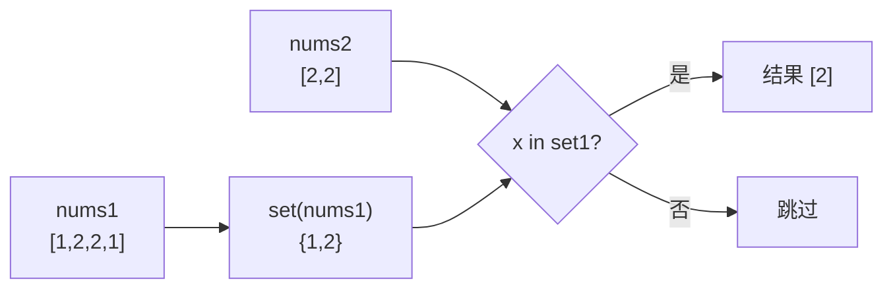

# 349. 两个数组的交集（Intersection of Two Arrays）

> 难度：简单 | 主题：哈希表 / 集合 / 双指针

## 题目

给定两个数组 nums1 和 nums2，返回它们的交集。输出结果中的每个元素**一定是唯一的**。可以不考虑输出结果的顺序。

**示例**
```text
输入：nums1 = [1,2,2,1], nums2 = [2,2]
输出：[2]
```

---

## 思路

### 先讲个故事：两个歌单找共同歌曲

你和朋友各自有一个歌单（可能有重复歌曲）。你想找出**两个歌单里都有的歌**，并且每首歌只算一次。

你把自己的歌单抄在一张白纸上（**集合**——曲目不重复）。然后你拿着朋友歌单的每首歌去白纸上核对：在白纸上就加入结果。

这就是集合求交集的全部过程。

---

### 引导式推导：从暴力到标准

**暴力法**：两层循环，每对比较。O(n×m)。

**优化 ① —— 集合去重 + 哈希查找**：把其中一个数组转成集合，遍历另一个数组时用 O(1) 的集合查找代替 O(n) 的列表查找。



**优化 ② —— 遍历小集合**：先比较两个集合长度，遍历较小的那个。这样总查找开销是 O(min(m, n))。

| 做法 | 时间 | 空间 | 说明 |
|------|------|------|------|
| **集合** | **O(m + n)** | **O(m + n)** | 去重 + O(1) 查找 |
| 排序 + 双指针 | O(m log m + n log n) | O(log m + log n) | 排序后同步扫描 |

**另一种思路：排序 + 双指针**

两数组排序后，各一个指针同步扫描：
- 相等 → 加入结果，跳过重复，两指针同时移动
- 不相等 → 移动指向较小值的指针

集合法更直观，双指针法空间更优（不计排序栈空间）。

---

## 代码

```python
def intersection(self, nums1, nums2):
    set1 = set(nums1)                     # 去重 + O(1) 查找表
    set2 = set(nums2)                     # 同理

    if len(set1) > len(set2):             # 遍历较小的集合
        return [x for x in set2 if x in set1]  # 小 set2 的元素在大 set1 中？
    return [x for x in set1 if x in set2] # 否则遍历 set1
```

---

## 复杂度

| 指标 | 值 | 解释 |
|------|----|------|
| 时间 | O(m + n) | 建集合 + 遍历小集合 O(min(m, n)) |
| 空间 | O(m + n) | 两个集合 |

---

## 实战考量

### 频率分析

> **出现在**：一面简单题，考察基础集合运用。重点在于**你能否说清楚为什么集合比列表快**。

### 延伸思考

**Q：为什么列表的 `in` 是 O(n)，集合的 `in` 是 O(1)？**
A：列表存储是无序的线性结构，必须从头遍历；集合基于哈希表，通过哈希值直接定位桶，平均 O(1)。

**Q：如果两个数组都已排序呢？**
A：双指针同步扫描，O(m + n) 时间，O(1) 额外空间（不计排序栈）。

**Q：如果一个数组很大无法全部放进内存呢？**
A：小数组建集合放内存，大数组分批从磁盘读入，逐个查集合。这叫**外部哈希连接**。

**Q：如果要求结果的输出顺序和输入中出现的顺序一致？**
A：用 `LinkedHashSet`（Java）或 `dict` 保持插入顺序（Python 3.7+ dict 有序）。

### 易错点

- 结果必须去重（集合天生去重，但如果是列表推导要注意）
- 遍历小集合 + 查大集合，比反过来更优
- 列表 `in` 是 O(n)，集合 `in` 是 O(1)——这个差距决定大输入能不能过

---

## 生活类比

> **集合 → O(1) 查找 → 交集**
>
> 想象你在一个大型图书馆找书。如果书是按编号排序的索引（哈希表），你查到一本书需要 1 秒。如果书是随机堆在地上的（列表），找一本书需要从第一本翻到最后一本。
>
> 集合就是把"随机堆在地上"变成了"按索书号整齐排列"。**数据结构的选择决定了你的算法是 O(n) 还是 O(1)**。

---

## 相关题目

| 题目 | 关系 |
|------|------|
| [[350两个数组的交集II]] | 同族进阶，需考虑出现次数（Counter） |
| 217存在重复元素 | 集合的另一经典应用 |
| [[349两个数组的交集]] | 本题 |

---

→ 返回题单：[[LeetCode学习清单#一、数组与哈希（含双指针、矩阵）]]

## 速记卡（面试闪卡）

**Q1：一句话讲清「349. 两个数组的交集（Intersection of Two Arrays）」到底是什么？**
A：给定两个数组 nums1 和 nums2，返回它们的交集。输出结果中的每个元素**一定是唯一的**。可以不考虑输出结果的顺序。
**示例**
---

**Q2：题目 —— 怎么理解？**
A：给定两个数组 nums1 和 nums2，返回它们的交集。输出结果中的每个元素**一定是唯一的**。可以不考虑输出结果的顺序。
**示例**
---

**Q3：思路 —— 怎么理解？**
A：你和朋友各自有一个歌单（可能有重复歌曲）。你想找出**两个歌单里都有的歌**，并且每首歌只算一次。
你把自己的歌单抄在一张白纸上（**集合**——曲目不重复）。然后你拿着朋友歌单的每首歌去白纸上核对：在白纸上就加入结果。
这就是集合求交集的全部过程。
---
**暴力法**：两层循环，每对比较。O(n×m)。

**Q4：代码 —— 怎么理解？**
A：---

**Q5：复杂度 —— 怎么理解？**
A：| 指标 | 值 | 解释 |
|------|----|------|
| 时间 | O(m + n) | 建集合 + 遍历小集合 O(min(m, n)) |
| 空间 | O(m + n) | 两个集合 |
---

**Q6：核心速记主线有哪些？**
A：抓住这几根：题目、思路、代码、复杂度、实战考量、生活类比。

