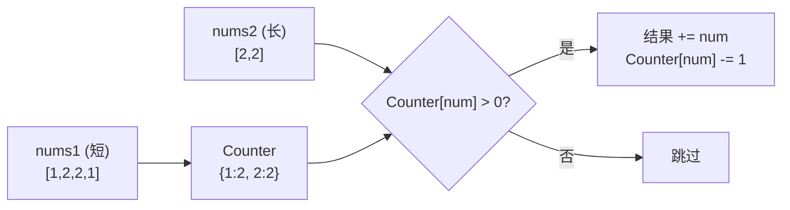

# 350. 两个数组的交集 II

> 难度：简单 | 主题：数组 + 哈希表

## 题目

给你两个整数数组 nums1 和 nums2，请你以数组形式返回两数组的交集。

返回结果中**每个元素出现的次数**，应与元素在两个数组中都出现的次数一致（如果出现次数不一致，则取**较小值**）。可以不考虑输出结果的顺序。

**示例**
```text
输入：nums1 = [1,2,2,1], nums2 = [2,2]
输出：[2,2]
```

---

## 思路

### 先讲个故事：仓库库存核销

你的仓库里有一份"库存清单"：苹果 3 箱，香蕉 2 箱……

客户下了一张订单，你需要按订单数量**消耗库存**：
- 订单要 2 箱苹果 → 库存减 2，给客户 2 箱
- 订单要 5 箱香蕉 → 库存只有 2 箱 → 给客户 2 箱（取较小值）
- 订单要草莓 → 库存没有 → 跳过

这就是哈希计数法的全部逻辑——**库存表** + **消耗计数**。

---

### 引导式推导：从交集 I 到交集 II

[[349两个数组的交集]] 只关心"有没有"（唯一性），这道题关心"有几个"（次数）。

#### 哈希计数法（推荐）

把短数组做成"库存表"（值 → 出现次数），遍历长数组：
1. 查库存 > 0？→ 加入结果，库存减一
2. 库存 = 0？→ 跳过



**为什么短的建库存表？** 空间复杂度从 O(m + n) 降到 O(min(m, n))。

| 方法 | 时间 | 空间 |
|------|------|------|
| **哈希计数** | **O(m + n)** | **O(min(m, n))** |
| 排序 + 双指针 | O(m log m + n log n) | O(1) |

#### 排序 + 双指针法

当数组已排序（或允许排序），双指针空间 O(1)：
- 相等 → 加入结果，两指针同移
- 不等 → 较小值的指针前移

---

## 代码

```python
def intersect(self, nums1, nums2):
    # 让短数组建计数表，节省空间
    if len(nums1) > len(nums2):
        return self.intersect(nums2, nums1)    # 交换确保 nums1 是短数组

    m = Counter()                              # 初始化计数器
    for num in nums1:                          # 遍历短数组，建库存表
        m[num] += 1

    intersection = []
    for num in nums2:                          # 遍历长数组
        if (count := m.get(num, 0)) > 0:       # 海象运算符：查库存 > 0
            intersection.append(num)           # 消耗一个，加入结果
            m[num] -= 1
            if m[num] == 0:                    # 库存为 0 时删除键
                m.pop(num)
    return intersection
```

---

## 复杂度

| 指标 | 值 | 解释 |
|------|----|------|
| 时间 | O(m + n) | 建表 O(m) + 遍历长数组 O(n) |
| 空间 | O(min(m, n)) | 短数组的计数表 |

---

## 实战考量

### 频率分析

> **出现在**：一面简单题，和 349 成对出现。常作为 349 的追问——"如果要求保留次数呢？"

### 延伸思考

**Q：为什么要用短数组建计数表？**
A：空间从 O(m + n) 降到 O(min(m, n))。体现空间优化的意识。

**Q：如果两个数组都很大，内存放不下 Counter 呢？**
A：外部排序后双指针，额外空间 O(1)。或者把大数组分块，逐块读入查小数组的 Counter。

**Q：如果数组已排序且要求 O(1) 空间？**
A：双指针法，不用排序额外开销。相等时加入结果，同时移动；不相等时移动较小值的指针。

**Q：如果要求交集次数取最大值（不是最小值）？**
A：取 `max(count1, count2)` 而不是 `min`。但题目要求的是最小值。

**Q：海象运算符不加括号会怎样？**
A：`if count := m.get(num, 0) > 0` 会解析为 `if count := (m.get(num, 0) > 0)`，count 变成布尔值。所以必须加括号 `(count := m.get(num, 0)) > 0`。

### 易错点

- 交换长度后必须 `return`（递归调用），不能只调不返
- 海象运算符必须加括号：`(count := m.get(num, 0)) > 0`
- 库存为 0 时建议删除键（不是必须，但能减少字典大小）
- 与 349 的区别：用 Counter 而不是 Set

---

## 生活类比

> **哈希计数 → 库存核销 → 频率交集**
>
> 就像餐厅盘点食材——你有一张"食材库存表"（番茄 5 个，鸡蛋 3 个），厨师按订单消耗：
> - 番茄炒蛋需要番茄 2 个 → 库存减 2，出菜
> - 如果只剩 1 个番茄 → 取较小值，做少一点
>
> **一次遍历建库存，一次遍历消耗**。简单来说就是"记好账，一笔笔核销"。

---

## 相关题目

| 题目 | 关系 |
|------|------|
| [[349两个数组的交集]] | 同族基础版（不考虑次数，用集合） |
| 217存在重复元素 | 哈希表的另一应用 |
| [[350两个数组的交集II]] | 本题，计数版交集 |

---

→ 返回题单：[[LeetCode学习清单#一、数组与哈希（含双指针、矩阵）]]
