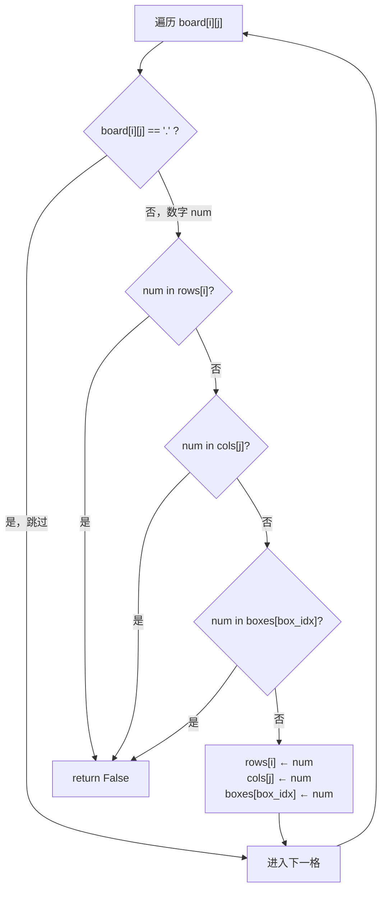
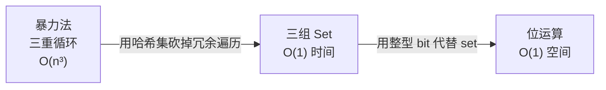

# 36. 有效的数独（Valid Sudoku）

> 难度：中等 | 主题：哈希表

## 题目

请你判断一个 9×9 的数独是否有效。只需要根据以下规则验证已经填入的数字是否有效：1）数字 1-9 在每一行只能出现一次；2）数字 1-9 在每一列只能出现一次；3）数字 1-9 在每一个 3×3 宫内只能出现一次。

**示例**
```text
输入：board = 
[["5","3",".",".","7",".",".",".","."],
 ["6",".",".","1","9","5",".",".","."],
 [".","9","8",".",".",".",".","6","."],
 ["8",".",".",".","6",".",".",".","3"],
 ["4",".",".","8",".","3",".",".","1"],
 ["7",".",".",".","2",".",".",".","6"],
 [".","6",".",".",".",".","2","8","."],
 [".",".",".","4","1","9",".",".","5"],
 [".",".",".",".","8",".",".","7","9"]]
输出：true
```

---

## 思路

### 先讲个故事：班主任的座位表

你是班主任，教室 9×9 个座位，排成 9 行 9 列，每 3×3 个座位划为一个小组。

每个学生举着一个数字牌（1-9）。你的任务：确认**没有**两个学生举着相同数字出现在：
- 同一行
- 同一列
- 同一个 3×3 小组

你拿三叠便签纸，每叠 9 张，分别标记「行 1」到「行 9」、「列 1」到「列 9」、「组 1」到「组 9」。每看到一个数字，就在对应的行/列/组便签上记一笔。如果某张便签已记过这个数字——有人违规。

---

### 引导式推导：从手工到公式

**第 1 步：需要什么？**

检查数字 `num` 是否已出现在第 i 行、第 j 列、以及 (i,j) 所属的 3×3 宫格。需要**三种集合**，每种 9 个。

**第 2 步：宫格编号怎么算？**

```text
行 0-2, 列 0-2 → 宫格 0
行 0-2, 列 3-5 → 宫格 1
行 0-2, 列 6-8 → 宫格 2
行 3-5, 列 0-2 → 宫格 3
```

规律：`box_idx = (i // 3) * 3 + (j // 3)`

```text
i//3：第几行宫格（0,1,2）
j//3：第几列宫格（0,1,2）
*3 + ：把二维展平为一维
```

**第 3 步：一次遍历**



三组集合同时查，任一重复即判无效。

---

### 三层递进



**暴力法**：对每个数字，检查同行/同列/同宫格是否有重复。每次检查 O(n)，整体 O(n³)。

**三组 Set（最优写法）**：一次遍历，三组集合查重。81 格固定 → O(1)。

**位运算（进阶）**：用 9 位整数的 bit 标记数字 1-9。查重用 `(bit >> num) & 1`，标记用 `bit | (1 << num)`。写 set 更清晰，位运算作为进阶亮点提。

---

## 代码

```python
def isValidSudoku(self, board):
    rows = [set() for _ in range(9)]      # 9 个行集合
    cols = [set() for _ in range(9)]      # 9 个列集合
    boxes = [set() for _ in range(9)]     # 9 个宫格集合

    for i in range(9):
        for j in range(9):
            num = board[i][j]
            if num == '.':                # 空格跳过
                continue
            box_idx = (i // 3) * 3 + (j // 3)  # 宫格索引，展平公式
            if num in rows[i] or num in cols[j] or num in boxes[box_idx]:
                return False              # 任一重复 → 无效
            rows[i].add(num)
            cols[j].add(num)
            boxes[box_idx].add(num)
    return True                           # 全部通过 → 有效
```

---

## 复杂度

| 指标 | 值 | 解释 |
|------|----|------|
| 时间 | O(1) | 固定 81 格，每格 O(1) |
| 空间 | O(1) | 27 个集合，最多各存 9 个数字 |

---

## 实战考量

### 频率分析

> **出现在**：字节/阿里约 20% 出现。说是中等，其实不考算法，考**代码严谨性**和**基础数据结构的控制力**。

### 延伸思考

**Q：宫格编号公式 `(i//3)*3 + (j//3)` 为什么乘 3？**
A：不乘 3 的话，第 0 行宫格和第 3 行宫格编号会冲突。乘 3 是把「宫格行号」映射到全局宫格编号的正确偏移。

**Q：如果数独是 16×16 呢？**
A：逻辑完全一样。循环范围变 16，宫格公式调整为 `(i//4)*4 + (j//4)`（4×4 子宫格）。

**Q：能不能用位运算代替 set？**
A：可以。用 9 位整数，每位对应数字 1-9。查重 `(bit >> (int(num)-1)) & 1`，标记 `bit |= 1 << (int(num)-1)`。写 set 足够可读，进阶时提位运算。

**Q：「解数独」有什么区别？**
A：这题是**验证**——检查已填数字是否合法。解数独是**求解**——用回溯法填充空格，每次填完也要验证。验证是求解的子步骤。

### 易错点

- `box_idx = (i//3)*3 + (j//3)` 中 `*3` 不能省
- `//` 不能用 `/`（浮点数不能做下标）
- `boxes` 不能用 `[[set()]*3]*3`（浅拷贝陷阱，所有元素指向同一个 set）
- 别忘了跳过 `'.'`

---

## 生活类比

> **有效的数独 → 三叠便签 → 一次收工**
>
> 就像班主任拿三叠便签纸，同时查行、查列、查小组。
> 看到一个学生就同时在三个地方做记号——一次巡堂全搞定。
> 核心就是：**查重三连，一个都不能多。**

---

## 相关题目

| 题目 | 关系 |
|------|------|
| 36有效的数独 | 本题，三组 Set 验证 |

---

→ 返回题单：[[LeetCode学习清单#一、数组与哈希（含双指针、矩阵）]]
