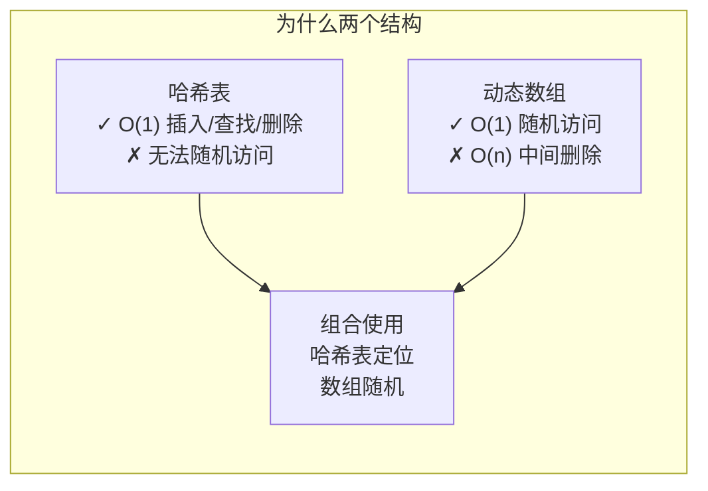
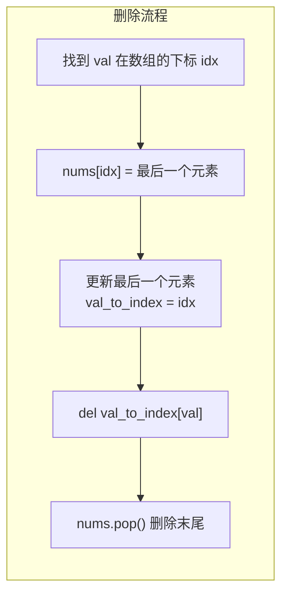

# 380. O(1) 时间插入、删除和获取随机元素（Insert Delete GetRandom O(1)）

> 难度：中等 | 主题：数组、哈希表、设计

## 题目

设计一个数据结构，支持在平均 **O(1)** 时间内完成以下操作：
- `insert(val)`：当元素不存在时插入并返回 `True`；已存在返回 `False`
- `remove(val)`：当元素存在时删除并返回 `True`；不存在返回 `False`
- `getRandom()`：随机返回现有集合中的一个元素，每个元素被返回的概率必须相同

**示例**
```text
输入：
["RandomizedSet","insert","remove","insert","getRandom","remove","insert","getRandom"]
[[],[1],[2],[2],[],[1],[2],[]]
输出：
[null,true,false,true,2,true,false,2]
```

---

## 思路

### 先讲个故事：电影院换座

电影院坐满了人，每个人都有自己的座位号。突然有个人要离开（删除），工作人员不想让整排人都挪位置（O(n)），于是想了个聪明办法：

> 让最后一排的人**搬到空出来的座位上**，然后最后一排座位空着，直接撤掉。

这样只有两个人挪了屁股，其他人动都没动。这就是 O(1) 删除的奥秘——**交换 + pop**。

---

### 引导式推导：为什么需要两个数据结构？

#### 需求拆解

| 操作 | 需要的特性 | 选什么数据结构 |
|------|-----------|--------------|
| 插入/查找 | O(1) 判断是否存在、O(1) 定位 | **哈希表**（值 → 下标） |
| 随机获取 | 等概率随机选一个 | **数组**（random.choice） |
| 删除 | O(1) 删除任意元素 | 都不能单独做到 |

**关键洞察**：哈希表和数组单独看都不完美，但**组合起来**就能补全彼此的短板。



#### 删除的魔术：交换 + pop

直接删除数组中间元素 → 后面所有元素要前移 → O(n)。

**解决方案**：
1. 把待删除元素和**数组最后一个元素**交换（或覆盖）
2. pop 掉最后一个元素（O(1)）
3. 更新最后一个元素在哈希表中的下标



---

## 代码

```python
import random

class RandomizedSet:
    def __init__(self):
        self.nums = []                    # 动态数组：支持 O(1) 随机访问
        self.val_to_index = {}            # 哈希表：值 → 数组下标

    def insert(self, val):
        if val in self.val_to_index:      # 已存在，不重复插入
            return False
        self.val_to_index[val] = len(self.nums)  # 记录下标
        self.nums.append(val)             # 数组末尾追加
        return True

    def remove(self, val):
        if val not in self.val_to_index:  # 不存在，无法删除
            return False

        idx = self.val_to_index[val]      # 待删除元素的下标
        last_val = self.nums[-1]          # 数组末尾元素

        self.nums[idx] = last_val         # 末尾元素覆盖到删除位置
        self.val_to_index[last_val] = idx # 更新末尾元素的新下标

        del self.val_to_index[val]        # 删除 val 的记录
        self.nums.pop()                   # 弹出末尾（已被复制到 idx）
        return True

    def getRandom(self):
        return random.choice(self.nums)   # 等概率随机返回
```

---

## 复杂度

| 指标 | 值 | 解释 |
|------|----|------|
| 时间 | O(1) 平均 | 插入/删除/随机获取均为常数时间 |
| 空间 | O(n) | 存储 n 个元素，哈希表和数组各一份 |

---

## 实战考量

### 频率分析

> **出现在**：字节/美团/阿里 常考，约 35% 的设计题常会从这个角度切入。考察你**组合基本数据结构解决复杂需求**的能力。

### 延伸思考

**Q：为什么不用单链表？**
A：链表无法 O(1) 随机访问（`getRandom` 需要遍历），与题目要求冲突。

**Q：删除时先 `pop()` 再 `del` 哈希表行不行？**
A：不行。如果删除的是末尾元素，`pop()` 后 `nums[-1]` 已经变了，`last_val` 取错。所以必须先 `del` 再 `pop()`。

**Q：如果允许重复元素呢？（381 题）**
A：哈希表的值改成"下标集合"（`Set[Int]`），删除时从一个集合中移除一个下标，集合为空时删除键。

**Q：`getRandom` 的概率真的均等吗？**
A：`random.choice` 基于 `randint(0, len-1)`，只要随机源均匀，每个元素被选中的概率就是 1/n。

**Q：如果要求在 `getRandom` 后删除该元素？**
A：先随机拿一个下标，然后用同样的"交换 + pop"逻辑删除。

### 易错点

- 删除时必须**更新被交换元素在哈希表中的下标**，否则后续查找会出错
- `del self.val_to_index[val]` 要在 `pop()` 之前执行
- 插入时先检查 `val in self.val_to_index`，避免覆盖已有数据
- 如果删除的是末尾元素，`idx == len(nums)-1`，交换逻辑仍然正确（自己覆盖自己，然后 pop）

---

## 生活类比

> **哈希表 + 数组 → 双数据结构组合 → O(1) 全部操作**
>
> 就像图书馆的管理系统：**借阅索引卡（哈希表）**告诉你在哪个书架，但你不能随机从索引卡里抽一张（不能随机获取）。**书架上的书（数组）**可以随手抽一本，但你要在中间插一本或抽走一本时，所有书都要移位。
>
> 聪明管理员的做法：把索引卡和书架配合使用——用索引卡找到位置，用书架抽随机书。当有人还书（删除），让最后一排的书挪到空位，只需改一张索引卡。
>
> **两个不完美的结构，组合起来就是完美的。**

---

## 相关题目

| 题目 | 关系 |
|------|------|
| 146LRU缓存 | 更复杂版本，加容量限制和淘汰策略（同属"双数据结构组合"题型） |
| [[380O(1)时间插入删除和获取随机元素]] | 本题 |

---

→ 返回题单：[[LeetCode学习清单#一、数组与哈希（含双指针、矩阵）]]

## 速记卡（面试闪卡）

**Q1：一句话讲清「380. O(1) 时间插入、删除和获取随机元素（Insert Delete GetRandom O(1)）」到底是什么？**
A：设计一个数据结构，支持在平均 **O(1)** 时间内完成以下操作：
：当元素不存在时插入并返回 ；已存在返回 
：当元素存在时删除并返回 ；不存在返回 
：随机返回现有集合中的一个元素，每个元素被返回的概率必须相同
**示例**
---

**Q2：题目 —— 怎么理解？**
A：设计一个数据结构，支持在平均 **O(1)** 时间内完成以下操作：
：当元素不存在时插入并返回 ；已存在返回 
：当元素存在时删除并返回 ；不存在返回 
：随机返回现有集合中的一个元素，每个元素被返回的概率必须相同
**示例**
---

**Q3：思路 —— 怎么理解？**
A：电影院坐满了人，每个人都有自己的座位号。突然有个人要离开（删除），工作人员不想让整排人都挪位置（O(n)），于是想了个聪明办法：
让最后一排的人**搬到空出来的座位上**，然后最后一排座位空着，直接撤掉。
这样只有两个人挪了屁股，其他人动都没动。这就是 O(1) 删除的奥秘——**交换 + pop**。

**Q4：代码 —— 怎么理解？**
A：---

**Q5：复杂度 —— 怎么理解？**
A：| 指标 | 值 | 解释 |
|------|----|------|
| 时间 | O(1) 平均 | 插入/删除/随机获取均为常数时间 |
| 空间 | O(n) | 存储 n 个元素，哈希表和数组各一份 |
---

**Q6：核心速记主线有哪些？**
A：抓住这几根：题目、思路、代码、复杂度、实战考量、生活类比。

