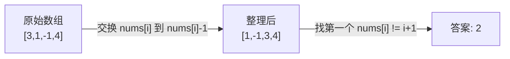
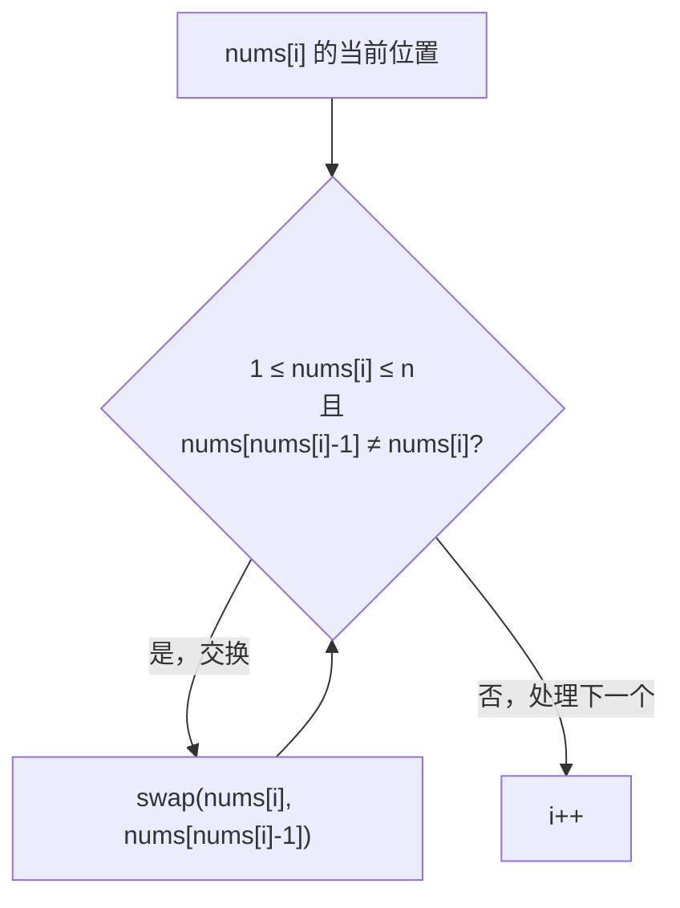
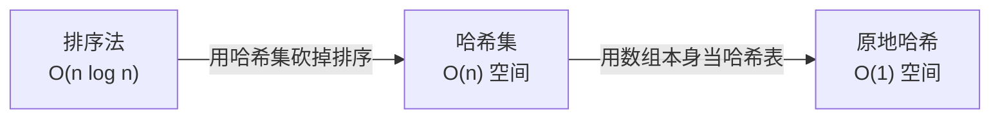

# 41. 缺失的第一个正数（First Missing Positive）

> 难度：困难 | 主题：数组、原地哈希、置换

---

## 题目

给定一个未排序的整数数组，找出其中没有出现的最小正整数。要求算法的时间复杂度为 O(n)，且只使用常数级别的额外空间。

**示例**
```text
输入：nums = [1,2,0]
输出：3

输入：nums = [3,4,-1,1]
输出：2

输入：nums = [7,8,9,11,12]
输出：1
```

---

## 思路

### 先讲个故事：乱码的信箱

你是一栋公寓的快递员。公寓有 n 个信箱，编号 1 到 n。你收到一批快递，每个包裹上写着一个收件人编号。你需要找出**最小的缺失编号**。

规则很坑爹：
- 包裹上的编号可以是负数、0、或者远大于 n（有人乱写）
- 你手上只有这 n 个信箱本身来排序——没有额外空间放纸笔

聪明的方法：**把写有数字 x 的包裹直接塞进第 x 号信箱**。整理完后，第一个空着的信箱编号，就是最小的缺失编号。

如果在 1~n 里全都塞满了，那缺失的就是 n+1。

---

### 引导式推导：从直觉到算法

**第 1 步：锁定答案范围**

数组长度是 n，只有 n 个位置。所以答案**一定**在 `[1, n+1]` 之间：
- 如果 1~n 全在数组中 → 答案是 n+1
- 否则 → 答案是 1~n 中第一个缺失的数

**第 2 步：借数组本身做哈希**

目标是让每个数 x 待在下标 x-1 的位置。怎么实现？



**第 3 步：while 不是 if**

交换后，新换过来的数也可能需要归位。所以用 `while` 持续交换，直到当前位置的数是「废数」（不在 1~n 范围）或「已在正确位置」。

核心边界：`nums[nums[i] - 1] != nums[i]` 这个条件**必须加**，否则遇到 `[1,1]` 会无限循环——因为 1 要跟 nums[0]（也是 1）交换，死循环了。



---

### 三层递进



**排序法**：排序后遍历找第一个缺失的正数。O(n log n)，不符合 O(n) 要求。

**哈希集**：把所有数丢进 set，从 1 开始递增检查。O(n) 时间，O(n) 空间——不符合常数空间要求。

**原地哈希（最优）**：利用数组索引本身做哈希键。O(n) 时间，O(1) 空间。核心洞察：**数组长度为 n，答案范围锁定在 [1, n+1]，用「索引作为哈希键」原地重排**。

---

## 代码

```python
def firstMissingPositive(self, nums):
    n = len(nums)

    # 原地哈希：让每个数回到它应该在的位置
    # 数字 x 的正确位置是下标 x-1
    for i in range(n):
        # while 循环一直换到当前数不需要再动为止
        while 1 <= nums[i] <= n and nums[nums[i] - 1] != nums[i]:
            # 把 nums[i] 换到正确位置
            correct_idx = nums[i] - 1
            nums[i], nums[correct_idx] = nums[correct_idx], nums[i]

    # 找第一个不在正确位置的数
    for i in range(n):
        if nums[i] != i + 1:
            return i + 1

    # 1~n 都在正确位置 → 缺失 n+1
    return n + 1
```

---

## 复杂度

| 指标 | 值 | 解释 |
|------|----|------|
| 时间 | O(n) | 每个元素最多被交换两次 |
| 空间 | O(1) | 原地操作 |
| 排序法 | O(n log n) | 不符合要求 |

---

## 实战考量

### 频率分析

> **出现在**：字节/百度/快手二面。经典的「O(n) 时间 + O(1) 空间」难题，关键就在于能不能想到**原地哈希**。

### 延伸思考

**Q：为什么 while 不会导致 O(n²)？**
A：每个元素最多被交换两次（第一次从错误位置换到正确位置，第二次是别人把它换走然后又被换回来）。所以总交换次数 ≤ 2n，摊下来 O(n)。

**Q：为什么不直接 if 一次交换就完了？**
A：if 只换一次。如果换过来的新数也需要归位，if 不会处理。比如 `[3,4,-1,1]`，i=0 时 nums[0]=3 换到正确位置后 nums[0] 变成 -1——废数，不用再管。但如果换过来的是 2（也在 1~n 范围内），if 就漏了。

**Q：重复元素怎么处理？**
A：`nums[nums[i] - 1] != nums[i]` 这个条件保证了：如果目标位置已经有一个相同的数，就不交换。否则 `[1,1]` 会无限循环。

**Q：负数、0、大于 n 的数为什么不管？**
A：答案范围在 [1, n+1]。大于 n 的数不可能影响 1~n 范围内的缺失判断，负数/0 不在考虑范围内。把它们留在原地当「占位符」即可。

**Q：和「[[448找到所有数组中消失的数字]]」有什么区别？**
A：448 是简化版——只找缺失的数，不要求最小，范围固定 1~n。41 要最小缺失正数，且数组有负数/0 干扰。但都用「索引作为哈希键」的思想。

### 易错点

- 交换条件 `nums[nums[i] - 1] != nums[i]` 必须加，否则死循环
- 答案范围 `[1, n+1]`——不是无限大
- 负数、0、大于 n 的数都是「废数」，不需要安置
- `while` 不是 `if`

---

## 生活类比

> **缺失的第一个正数 → 乱码信箱 → 对号入座**
>
> 就像快递员把所有包裹按编号塞进对应的信箱。
> 整理完后，找到第一个空信箱就行。
> 核心就是：**数组当哈希，索引即键值。**

---

## 相关题目

| 题目 | 关系 |
|------|------|
| [[448找到所有数组中消失的数字]] | 同族简化版，索引哈希标记 |
| 287寻找重复数 | 同族，负数标记法/环形链表 |

---

→ 返回题单：[[LeetCode学习清单#一、数组与哈希（含双指针、矩阵）]]
