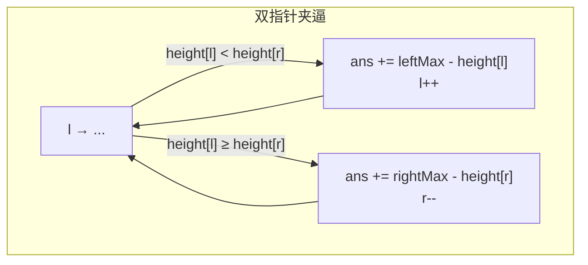
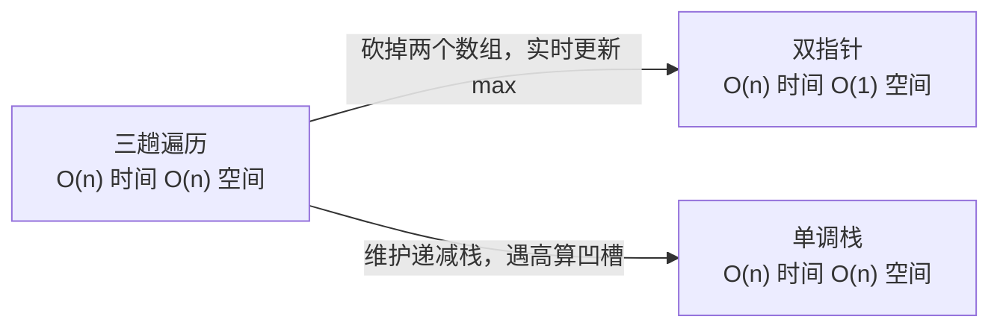

# 42. 接雨水（Trapping Rain Water）

> 难度：困难 | 主题：对撞双指针 / DP

## 题目

给定 n 个非负整数表示每个宽度为 1 的柱子的高度图，计算按此排列的柱子，下雨之后能接多少雨水。

**示例**
```text
输入：height = [0,1,0,2,1,0,1,3,2,1,2,1]
输出：6

解释：柱子高度 [0,1,0,2,1,0,1,3,2,1,2,1]，凹坑积了 6 单位雨水
```

---

## 思路

### 先讲个故事：操场的排水沟

操场有一段高低不平的围墙（柱子），下雨后凹槽里会积水。

你站在墙壁两端。你只关心一个事：**每个凹坑能积多少水？**

直觉告诉你：一个位置能不能积水，取决于它**左右两边谁更高**——准确说，取决于左右最高墙中**较矮的那一面**。水往低处流，高过两边墙的水会溢出去。

```text
位置 i 的积水量 = min(左边最高墙, 右边最高墙) - height[i]
```

---

### 引导式推导：从三趟遍历到一趟

**第 1 步：最朴素的方法——三趟遍历**

对每个位置 i，分别往左和往右找最高墙。

```text
leftMax[i] = max(height[0..i])      # 从左往右
rightMax[i] = max(height[i..n-1])   # 从右往左
ans[i] = min(leftMax[i], rightMax[i]) - height[i]
```

三趟遍历，O(n) 时间 + O(n) 空间。

**第 2 步：双指针——为何能砍空间？**

能不能一次遍历，不存数组？

关键在于：当 `height[l] < height[r]` 时，当前左指针位置的左边最高（leftMax）一定小于等于右边最高（rightMax）。

为什么？因为 rightMax ≥ height[r] > height[l]，而 leftMax 最多等于 height[l]（或者更大一点），所以 leftMax ≤ rightMax 成立。

```text
height[l] < height[r]  ⇒  leftMax ≤ rightMax
```

这不就够了吗？**左指针位置的积水量 = leftMax - height[l]**，不需要精确知道右边的最大值。同理，当 `height[l] ≥ height[r]` 时，用 **rightMax - height[r]** 算右指针位置。



**第 3 步：为什么移动矮的那边？**

因为矮的那边水量**已经确定**了，不需要等对面的最高值更新。移动高的那边也改变不了矮边的结果。所以谁矮就动谁——这叫**短板决定论**。

---

### 三层递进



**双指针**是最优解法——时间 O(n)、空间 O(1)。直接从双指针开始讲，不要先写三趟再优化，显得你没想清楚。

**单调栈**是另一种思路：维护递减栈，遇到更高的柱子就弹出栈顶计算凹槽水量。按行计算，适合理解积水形成的「分层」过程。实践中作为对比方案提即可。

---

## 代码

```python
def trap(self, height):
    l, r = 0, len(height) - 1         # 左右指针，从两端夹逼
    left_max = right_max = 0           # 当前左右两侧最大高度
    ans = 0

    while l < r:
        # 先更新当前边界最高值
        left_max = max(left_max, height[l])
        right_max = max(right_max, height[r])

        if height[l] < height[r]:
            # 左边矮 → 左边水量确定，用 left_max 算
            ans += left_max - height[l]
            l += 1
        else:
            # 右边矮（或相等）→ 右边水量确定
            ans += right_max - height[r]
            r -= 1

    return ans
```

---

## 复杂度

| 方法 | 时间 | 空间 |
|------|------|------|
| **双指针** | **O(n)** | **O(1)** |
| DP（左右数组） | O(n) | O(n) |
| 单调栈 | O(n) | O(n) |

---

## 实战考量

### 频率分析

> **出现在**：字节/阿里/腾讯高频困难题。这道题考察对双指针的理解深度——**为什么移动矮的，以及为什么不需要精确知道两边最高**。

### 延伸思考

**Q：为什么 `while l < r` 不是 `<=`？**
A：l == r 时只剩一根柱子，两边没有空间围水，积水量为 0。所以到 l == r 就结束。

**Q：为什么先更新 left_max/right_max 再算积水？**
A：当前柱子的高度需要参与计算。如果不先更新，当 height[l] 本身就是当前最大值时，left_max - height[l] = 0（柱子本身不积水），正确。如果先算再更新，那 left_max 还是旧的，可能少算或多算。

**Q：用 DP 怎么做？**
A：先从左到右扫一遍得到 leftMax 数组（`leftMax[i] = max(leftMax[i-1], height[i])`），再从右到左扫得到 rightMax，然后遍历算 `min(leftMax[i], rightMax[i]) - height[i]`。代码更直白，但多两个数组。

**Q：用单调栈怎么做？**
A：维护一个递减栈。遍历高度，当 `height[i] > height[stack[-1]]` 时，弹出栈顶（凹槽底部），用当前高度和栈内下一个高度算凹槽宽度和高度，累计水量。按行计算，更符合「积水是一层一层」的直观理解。

**Q：「11盛最多水的容器」和这题什么关系？**
A：姐妹题。都是对撞双指针 + 移动矮的。但 11 题是**求最大面积**（找两个柱子围的最大矩形），这题是**求累计水量**（所有凹槽的总和）。11 题的水不会溢出，这题每个位置都要算。

### 易错点

- `while l < r` 不是 `<=`
- 先更新 left_max/right_max，再算积水，最后移动指针
- 双指针的核心不完全是「移动矮的」，而是**移动水量已确定的那个**

---

## 生活类比

> **接雨水 → 操场的排水沟 → 短板决定论**
>
> 想象两边各有一块挡板。水能积多少，取决于矮的那个挡板。
> 你不需要知道远处多高，只需要知道眼前这个坑的矮边在哪。
> 移动矮边，水量确定，从不犹豫。
> 核心就是：**谁矮动谁，短板即答案。**

---

## 相关题目

| 题目 | 关系 |
|------|------|
| 11盛最多水的容器 | 姐妹题，对撞双指针 + 移动矮的，本题累计水量，11 求最大面积 |

---

→ 返回题单：[[LeetCode学习清单#一、数组与哈希（含双指针、矩阵）]]

## 速记卡（面试闪卡）

**Q1：一句话讲清「42. 接雨水（Trapping Rain Water）」到底是什么？**
A：给定 n 个非负整数表示每个宽度为 1 的柱子的高度图，计算按此排列的柱子，下雨之后能接多少雨水。
**示例**
---

**Q2：题目 —— 怎么理解？**
A：给定 n 个非负整数表示每个宽度为 1 的柱子的高度图，计算按此排列的柱子，下雨之后能接多少雨水。
**示例**
---

**Q3：思路 —— 怎么理解？**
A：操场有一段高低不平的围墙（柱子），下雨后凹槽里会积水。
你站在墙壁两端。你只关心一个事：**每个凹坑能积多少水？**
直觉告诉你：一个位置能不能积水，取决于它**左右两边谁更高**——准确说，取决于左右最高墙中**较矮的那一面**。水往低处流，高过两边墙的水会溢出去。
---
**第 1 步：最朴素的方法——三趟遍历**
对每个位置 i，分别往左和往右找最高墙。
三趟遍历，O(n) 时间 + O(n) 空间。

**Q4：代码 —— 怎么理解？**
A：---

**Q5：复杂度 —— 怎么理解？**
A：| 方法 | 时间 | 空间 |
|------|------|------|
| **双指针** | **O(n)** | **O(1)** |
| DP（左右数组） | O(n) | O(n) |
| 单调栈 | O(n) | O(n) |
---

**Q6：核心速记主线有哪些？**
A：抓住这几根：题目、思路、代码、复杂度、实战考量、生活类比。

