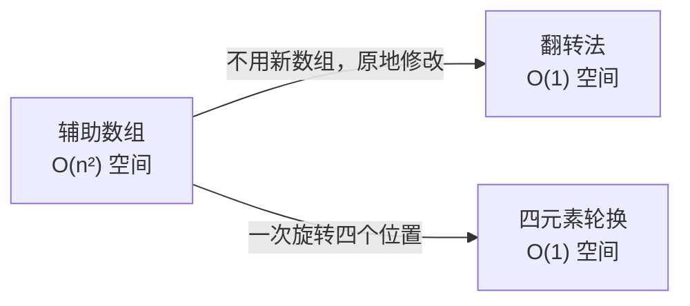

---

title: "旋转图像"

difficulty: 中等

category: 数组与哈希

tags:

  - leetcode

  - 数组与哈希

created: "2026-07-21"

---

# 48. 旋转图像

> 难度：中等 | 主题：矩阵旋转

## 题目

给定一个 n × n 的二维矩阵 matrix 表示一个图像。请将图像顺时针旋转 90 度。必须在原地修改矩阵，不能使用另一个矩阵来旋转图像。

**示例**

```text

输入：matrix = [[1,2,3],[4,5,6],[7,8,9]]

输出：[[7,4,1],[8,5,2],[9,6,3]]

解释：将 n×n 矩阵顺时针旋转 90 度

```

---

## 思路
### 先讲个故事：翻照片

你有一张叠起来的正方形照片，想顺时针转 90° 挂上墙。

有两个办法：

1. 一张张抠出来重新摆（辅助数组）——但会弄坏照片

2. **翻两次**——先上下翻转，再沿对角线翻转

不信你试试：拿一张写着字的纸，先上下颠倒，再沿着左上-右下对角线翻折。纸上的字刚好转了 90°。

---

### 引导式推导：为什么翻两次等于转 90°？

**第 1 步：旋转公式**

顺时针旋转 90°，坐标变换是：

```text

(i, j) → (j, n-1-i)

```

**第 2 步：拆成两步**

```text

上下翻转：   (i, j) → (n-1-i, j)

对角线翻转： (i, j) → (j, i)

```

两步串联：

```text

(i, j) → 上下翻转 → (n-1-i, j) → 对角线翻转 → (j, n-1-i)

```

恰好是顺时针 90° 公式。两步变换串联分拆写比四元素轮换更直观、不易出错。


**第 3 步：边界细节**

上下翻转时，**i 只走上半部分（n // 2）**，因为上下对称交换一次就够了，走满 n 会翻回原状。

对角线翻转时，**j < i**，只交换对角线左下和右上部分。对角线上的元素（i == j）不动，每对只交换一次。

---

### 三层递进



| 方法 | 空间 | 推荐 |

|------|------|------|

| **翻转法** | O(1) | ⭐ 最直观 |

| 四元素轮换 | O(1) | 代码长，易下标越界 |

| 辅助数组 | O(n²) | 不满足原地要求 |

---

## 代码

```python

def rotate(self, matrix: List[List[int]]) -> None:

    n = len(matrix)

    # 1. 上下翻转：i 只走上半部分

    for i in range(n // 2):

        for j in range(n):

            matrix[i][j], matrix[n-1-i][j] = matrix[n-1-i][j], matrix[i][j]

    # 2. 主对角线翻转：j < i，避免重复交换

    for i in range(n):

        for j in range(i):

            matrix[i][j], matrix[j][i] = matrix[j][i], matrix[i][j]

```

---

## 复杂度

| 指标 | 值 | 解释 |

|------|----|------|

| 时间 | O(n²) | 遍历矩阵每个元素常数次 |

| 空间 | O(1) | 原地修改 |

---

## 实战考量
### 频率分析

> **出现在**：字节/腾讯/美团一面，矩阵操作的经典题。这道题考察**能否把「旋转」拆解成「翻转」**——翻转法比直接算旋转公式直观得多。

### 延伸思考

**Q：上下翻转为什么 i 只走 n//2？**

A：上下是对称交换，走 n//2 就已经把每一对都换了一次。走满 n 的话，前半部分换到后半部分，后半部分又被换回来——回到原状。

**Q：对角线翻转为什么 j < i？**

A：对角线元素（i == j）不需要交换。如果 j 走满 n，每对元素会被交换两次（(i,j) 换一次，(j,i) 又换一次），翻回原状。

**Q：逆时针旋转 90° 怎么做？**

A：上下翻转 + 副对角线翻转。或者等价地：主对角线翻转 + 左右翻转。

**Q：旋转 180° 呢？**

A：上下翻转后再左右翻转（或者直接对角翻转两次）。

**Q：四元素轮换法是什么？**

A：从外圈到内圈，每次旋转四个对应位置的元素。公式：`temp = matrix[i][j]; matrix[i][j] = matrix[n-1-j][i]; matrix[n-1-j][i] = matrix[n-1-i][n-1-j]; matrix[n-1-i][n-1-j] = matrix[j][n-1-i]; matrix[j][n-1-i] = temp`。代码长且易错，翻转法胜出。

### 易错点

- 上下翻转 `i` 只走 `n//2`，走 `n` 会翻回原状

- 对角线翻转 `j < i`，对角线元素不动，每对只交换一次

- 逆时针 90° = 上下翻转 + 副对角线翻转（不是主对角线）

---

## 生活类比

> **旋转图像 → 翻照片 → 翻两次等于转一次**

>

> 就像叠一张纸：先上下倒过来，再沿着对角线折。

> 两次简单操作叠加，刚好转了 90°。

> 核心就是：**复杂变换拆成简单步骤叠加。**

---

## 相关题目

| 题目 | 关系 |

|------|------|

| [[54螺旋矩阵]] | 同属矩阵遍历/操作 |

| 73矩阵置零 | 同属矩阵原地操作 |

---

→ 返回题单：[[LeetCode学习路线图#一、数组与哈希（含双指针、矩阵）]]

## 速记卡（面试闪卡）

**Q1：一句话讲清「48. 旋转图像」到底是什么？**

A：旋转图像把n×n矩阵顺时针转90°，原地翻转法最直观。

**Q2：一、题目要求 —— 怎么理解？ —— 怎么理解？**

A：像转照片：把 n×n 矩阵顺时针转 90°，且不能另开一张纸（必须原地）。坐标变换 (i,j)→(j,n-1-i)。英语：rotate matrix in-place。

**Q3：二、翻两次=转90° —— 怎么理解？ —— 怎么理解？**

A：像折纸：先上下颠倒，再沿主对角线折，两步串联恰好是顺时针 90°；比直接套旋转公式直观不易错。英语：flip + transpose。

**Q4：三、代码要点 —— 怎么理解？ —— 怎么理解？**

A：像两段对称换：上下翻转 i 只走 n//2（走满会翻回原状），对角线翻转 j<i（对角元素不动，每对只换一次）。英语：matrix transpose（矩阵转置）。

**Q5：四、复杂度与易错点 —— 怎么理解？ —— 怎么理解？**

A：像算面积：时间 O(n²) 遍历每格常数次，空间 O(1) 原地；易错在 i 走满 n、j 走满 n 把矩阵翻回。逆时针=上下+副对角线。英语：O(n²) time。

**Q6：核心速记主线有哪些？**

- 顺时针90°=上下翻转+主对角线翻转

- 原地：i走n//2、j<i，每对只换一次

- 时间O(n²)空间O(1)，翻转法最直观

- 逆时针=上下+副对角线（别用主对角）

**口诀**

A：旋转图像折纸奇，上下翻完对角移；

i 走半程 j 小于，每对一次莫迟疑。

时间平方空间一，原地翻转最相宜；

逆时针换副对角，方向千万别偏歧。

## 相关链接

- [[笔记/Leetcode笔记/01_数组与哈希/189旋转数组|旋转数组]]

- [[笔记/Leetcode笔记/01_数组与哈希/41缺失的第一个正数|缺失的第一个正数]]

- [[笔记/Leetcode笔记/01_数组与哈希/36有效的数独|有效的数独]]

- [[笔记/Leetcode笔记/01_数组与哈希/56合并区间|合并区间]]

- [[笔记/Leetcode笔记/01_数组与哈希/15三数之和|三数之和]]

