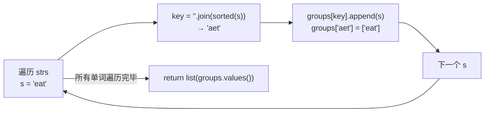
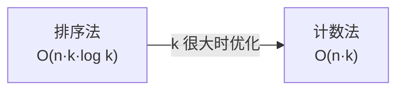

---

title: "字母异位词分组"

difficulty: 中等

category: 数组与哈希

tags:

  - leetcode

  - 数组与哈希

created: "2026-07-21"

---

# 49. 字母异位词分组（Group Anagrams）

> 难度：中等 | 主题：哈希表

## 题目

给你一个字符串数组，请你将字母异位词（由重新排列源单词的所有字母得到的一个新单词）组合在一起。可以按任意顺序返回结果列表。

**示例**

```text

输入：strs = ["eat","tea","tan","ate","nat","bat"]

输出：[["bat"],["nat","tan"],["ate","eat","tea"]]

```

---

## 思路
### 先讲个故事：快递分拣站

你是快递分拣站的工人。传送带上有许多包裹，每个包裹上写着一个单词。

你的任务：把**由相同字母组成的**单词分到同一个筐里——不管字母顺序怎么打乱。

比如 "eat"、"tea"、"ate"——都是 e、a、t 三个字母——放同一个筐。"tan" 和 "nat"——t、a、n——另一个筐。"bat" 独自一筐。

你怎么快速判断哪些单词是同一类？把每个单词的字母**按字母表排好序**。排完序后一样的就是同一类：

```text

eat → 排序 → aet

tea → 排序 → aet  ✓ 同类

tan → 排序 → ant

nat → 排序 → ant  ✓ 同类

bat → 排序 → abt  ✗ 不同类

```

对每个单词，排序后的结果就是它的**识别码**。识别码相同的放一个筐。

---

### 引导式推导：从识别码到哈希

**第 1 步：什么是异位词？**

两个单词包含完全相同的字符，只是顺序不同。比如 "ate" 和 "eat"。

**第 2 步：找统一标志**

要给每组异位词找一个**唯一标志**。两个候选：

| 方法 | 标志 | 举例 |

|------|------|------|

| **排序法** | 排序后字符串 | "ate","eat","tea" → "aet" |

| 计数法 | 26 位频次编码 | "ate" → "1#0#0#0#1#0#..." |

**第 3 步：用哈希表分组**



核心逻辑：**同一个 key 的所有单词 → 同一组**。

---

### 两层递进



**排序法（推荐先写）**：`''.join(sorted(s))` 做 key。简洁明了，k ≤ 100 时足够快。

**计数法（追问优化时提）**：用 26 位计数数组拼成字符串做 key。如 `[1,0,0,0,1,0,...]` 转 `"1#0#0#0#1#..."`。O(n·k)，当单词长度 k 很大时更快。但代码更啰嗦，先写排序法。

---

## 代码

```python

from collections import defaultdict

def groupAnagrams(self, strs):

    groups = defaultdict(list)        # key 不存在时自动创建空列表

    for s in strs:

        key = ''.join(sorted(s))     # 排序后做 key，异位词 key 相同

        groups[key].append(s)        # 加入对应分组

    return list(groups.values())     # 返回所有分组的列表

```

---

## 复杂度

| 方法 | 时间 | 空间 |

|------|------|------|

| **排序法** | O(n·k·log k) | O(n·k) |

| 计数法 | O(n·k) | O(n·k) |

n = 单词数量，k = 单词最大长度

---

## 实战考量
### 频率分析

> **出现在**：字节/阿里/美团一面，哈希表应用的经典题。考察你为复杂对象（字符串）设计 key 的能力。

### 延伸思考

**Q：为什么用 `defaultdict(list)` 不用普通 dict？**

A：少写三行 `if key not in groups: groups[key] = []`。群面时一眼看起来更干净。

**Q：如果字符串很长，排序太慢怎么办？**

A：用计数法。26 位计数数组 `[0]*26`，遍历字符串统计每个字母出现次数，转成 `"#".join(map(str, count))` 做 key。时间降到 O(n·k)。

**Q：「242有效的字母异位词」和这题什么关系？**

A：242 是基础版——只判断两个字符串是否异位词，用一个 26 位计数器就行。这题是进阶版——需要把大量字符串分组，用哈希表维护多组。

**Q：能不能不用排序也不计数？**

A：可以用质数映射——给每个字母分配一个质数，单词的乘积作为 key。异位词的质数乘积相同。但乘积可能溢出大整数，不推荐。

### 易错点

- `sorted(s)` 返回列表，必须用 `''.join()` 转字符串才能做 key

- 字符串没有 `.sort()` 方法，只能用 `sorted(s)`

- `defaultdict(list)` 比普通 dict 省代码

---

## 生活类比

> **字母异位词分组 → 快递分拣站 → 看排序后的样子**

>

> 就像传送带上的包裹，不看表面标签，而是看里面的东西排好序后长什么样。

> 一样的放一起。不用纠结每个单词的字母顺序——排完序都一样。

> 核心就是：**找到每个对象的「规范形」，相同的归一类。**

---

## 相关题目

| 题目 | 关系 |

|------|------|

| 242有效的字母异位词 | 同族基础版，判断两个字符串是否异位词 |

---

→ 返回题单：[[LeetCode学习路线图#一、数组与哈希（含双指针、矩阵）]]

## 速记卡（面试闪卡）

**Q1：一句话讲清「49. 字母异位词分组（Group Anagrams）」到底是什么？**

A：《字母异位词分组》是按字母组成把字符串分组，靠设计 key 用哈希表归类。

**Q2：题目 —— 怎么理解？**

A：像把同款包裹归筐：给你字符串数组，把字母异位词（字母相同顺序不同）组合在一起；题目（Problem）要的是分组结果。

**Q3：思路 —— 怎么理解？**

A：像快递分拣站：把每个单词字母按字母表排好序，排序结果相同的就是同一类；识别码（Key）相同即同筐，典型 key 设计题。

**Q4：代码 —— 怎么理解？**

A：哈希表 defaultdict(list)：对每词 `sorted(s)` 排序做 key，append 进对应组；代码（Code）一行 key 即可，计数法在 k 大时更优。

**Q5：复杂度 —— 怎么理解？**

A：排序法时间 O(n·k·log k)、空间 O(n·k)；计数法 O(n·k) 更快但啰嗦。复杂度（Complexity）随单词数 n 与长度 k 变化。

**Q6：核心速记主线有哪些？**

- 题目：异位词（同字母不同序）归为一组

- 思路：排序或计数生成 key，哈希分组

- 代码：defaultdict(list) 加 sorted(s) 做 key

- 复杂度：排序法 O(n·k·log k)，计数法 O(n·k)

**口诀**

A：异位词怎么分，

排序做key同筐进；

快递分拣看规范，

相同字母归一群。

## 相关链接

- [[笔记/Leetcode笔记/01_数组与哈希/242有效的字母异位词|有效的字母异位词]]

- [[笔记/Leetcode笔记/01_数组与哈希/345反转字符串中的元音字母|反转字符串中的元音字母]]

- [[笔记/Leetcode笔记/01_数组与哈希/01两数之和|两数之和]]

- [[笔记/Leetcode笔记/01_数组与哈希/41缺失的第一个正数|缺失的第一个正数]]

- [[笔记/Leetcode笔记/01_数组与哈希/15三数之和|三数之和]]

