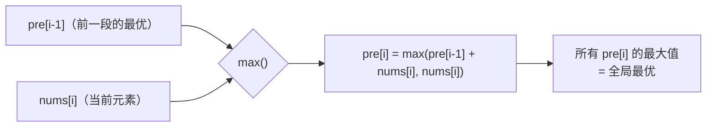
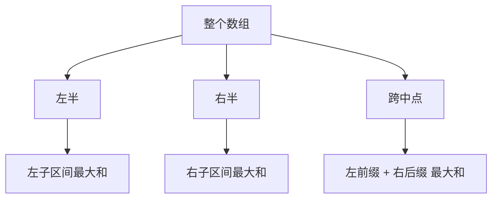

---

title: "最大子数组和"

difficulty: 中等

category: 数组与哈希

tags:

  - leetcode

  - 数组与哈希

created: "2026-07-21"

---

# 53. 最大子数组和（Maximum Subarray）

> 难度：中等 | 主题：动态规划 / 分治 / Kadane

## 题目

给你一个整数数组 nums，请你找出一个具有最大和的连续子数组（子数组最少包含一个元素），返回其最大和。

**示例**

```text

输入：nums = [-2,1,-3,4,-1,2,1,-5,4]

输出：6

解释：连续子数组 [4,-1,2,1] 的和最大，为 6

```

---

## 思路
### 先讲个故事：算账

你开了一家小面馆，每天的流水（利润/亏损）用一个数组记着。现在你想知道：**连续一段时间内，最多能赚多少钱？**

比如你记了这么几天的账：`[-2, +1, -3, +4, -1, +2, +1, -5, +4]`

你的直觉是：如果某段时间一直亏，不如从下一天重新开始算——**止损，换新账本**。

这个直觉就是 Kadane 算法的核心。

---

### 引导式推导：从局部最优到全局最优

**第 1 天**：账本上只有 `-2`。最大子数组和就是 `-2`。

**第 2 天**：账本上有了 `-2, 1`。你是要延续前一天的账本（`-2 + 1 = -1`），还是重开一本新账本（`1`）？显然是后者。

> **关键决策：** `max(延续前一天的和 + 今天, 今天)`

**第 3 天**：延续前一天最优（`1`）→ `1 + (-3) = -2`，或者自己开始 → `-3`。选 -2。

**第 4 天**：延续 → `-2 + 4 = 2`，或者自己开始 → `4`。选 4。

**第 5 天**：延续 → `4 + (-1) = 3`，或者自己开始 → `-1`。选 3。

一直算到最后，全局最大在 `4 + (-1) + 2 + 1 = 6` 的时候达到。

**发现规律了吗？**

我们定义 `pre[i]` = "以第 i 个元素结尾的最大子数组和"，递推关系是：

- 要么接在前一段后面（`pre[i-1] + nums[i]`）

- 要么自己另起一段（`nums[i]`）

这两者取最大。



**为什么非要用「以 i 结尾」来定义状态？**

因为子数组必须**连续**。如果不限定结尾，就无法建立起相邻元素之间的递推关系——前一段的最优不一定是接在当前元素前的子数组。

---

### 另一个视角：分治



分治思路用线段树的思想，每个区间维护 4 个信息：

- `sum`：区间总和

- `pre_max`：区间前缀最大和

- `suf_max`：区间后缀最大和

- `max_sum`：区间内最大子数组和（答案）

然后可以支持**任意子区间查询**和**单点修改**。不过首选还是 Kadane。

---

## 代码

```python

def maxSubArray(self, nums) -> int:   # Kadane 算法

    pre = 0                               # 以当前位置结尾的最大子数组和

    ans = nums[0]                         # 全局最优，初始化为首元素

    for x in nums:                        # 遍历每个元素

        pre = max(pre + x, x)             # 延续前一段 / 自己重开

        ans = max(ans, pre)               # 更新全局最优

    return ans

```

**为什么 `ans` 初始为 `nums[0]` 而不是 0？**

因为数组可能全是负数。如果初始化为 0，全负数时会错误返回 0（空子数组，但题目要求至少包含一个元素）。

---

## 复杂度

| 指标 | Kadane | 分治 |

|------|--------|------|

| 时间 | O(n) | O(n) |

| 空间 | O(1) | O(log n) 递归栈 |

| 适用场景 | **首选** | 需要查询任意子区间 / 支持修改 |

---

## 实战考量
### 频率分析

> **出现在**：字节/阿里 一面必考 DP 入门，约 70% 的算法常会考到这个题或它的变形。Kadane 是判断你**能不能定义出 DP 状态**的试金石。

### 延伸思考

**Q：为什么状态必须定义成「以 i 结尾」？**

A：子数组要求连续，相邻元素之间才有递推关系。如果不限定结尾，DAG 没有顺序，无法做 DP。这是子数组问题的**通解模板**——子序列问题则不同（不要求连续，可以跳着选）。

**Q：输出最大子数组本身，而不只是和？**

A：记录 `pre` 更新时的左端点（`pre = x` 时就是新起点），以及全局最大时的起终点。额外 O(1) 空间，O(n) 时间。

**Q：环形数组的最大子数组和呢？**

A：两种情况取最大——不跨边界（普通 Kadane）和跨边界（总和 - 最小子数组和）。最小子数组和就是 Kadane 算负数最大值，或者把数组取反再用 Kadane。

**Q：如果改成「乘积最大子数组」？**

A：需要同时维护最大和最小值——因为负数 × 负数 = 正数。看 152乘积最大子数组。

**Q：Kadane 和股票问题的关系？**

A：股票问题（121买卖股票的最佳时机）本质是 Kadane 的特例——把每日利润做成差分数组，求最大子数组和。Kadane 是 DP，股票问题只是它的一个应用。

### 易错点

- `ans` 初始化为 `nums[0]` 而非 0（全负数场景）

- `pre` 初始为 0 是 OK 的——在第一个元素时 `max(0 + nums[0], nums[0])` 永远取 `nums[0]`

- 第 2-4 行代码的顺序：先 `pre = max(pre + x, x)` 再 `ans = max(ans, pre)`

---

## 生活类比

> **Kadane 算法 → 做生意**

>

> 预算是 `pre`，总账本是 `ans`。如果当前生意是亏的，不如关掉重开一家新店。

> 你不会一直坚持一个亏损的业务，因为你清楚：**沉没成本不参与决策**。

>

> 用三个字概括 Kadane 的核心：**敢止损。**

---

## 相关题目

| 题目 | 关系 |

|------|------|

| 152乘积最大子数组 | 乘积版 Kadane，需维护最大+最小 |

| 238除自身以外数组的乘积 | 同属数组累积问题，前缀技巧 |

| 121买卖股票的最佳时机 | Kadane 的股票特例 |

| [[53最大子数组和]] | 本题 |

---

→ 返回题单：[[LeetCode学习路线图#一、数组与哈希（含双指针、矩阵）]]

## 速记卡（面试闪卡）

**Q1：一句话讲清「53. 最大子数组和（Maximum Subarray）」到底是什么？**

A：求连续子数组的最大和，Kadane 算法 O(n) 时间 O(1) 空间。

**Q2：思路 —— 怎么理解？**

A：开面馆记账——某段一直亏不如关店重开（止损）。Kadane：pre=以 i 结尾最大和，pre=max(pre+x, x)，ans 取全局最大。"敢止损"三字概括核心。

**Q3：代码 —— 怎么理解？**

A：pre=0，ans=nums[0]（防全负场景），遍历 pre=max(pre+x, x)，ans=max(ans, pre)。注意顺序：先更新 pre 再更新 ans。

**Q4：复杂度 —— 怎么理解？**

A：Kadane 时间 O(n) 空间 O(1)；分治时间 O(n) 空间 O(log n) 递归栈，仅在需支持任意子区间查询/修改时才用分治。

**Q5：实战考量 —— 怎么理解？**

A：字节阿里一面必考 DP 入门，约 70% 会考变形；状态必须定义成"以 i 结尾"（子数组连续才有递推）；ans 初值 nums[0] 非 0；延伸：环形数组、乘积最大子数组、股票问题本质同 Kadane。

**Q6：核心速记主线有哪些？**

- Kadane：pre=max(pre+x, x)，全局 ans 取最大，核心是"敢止损"

- pre 初始 0、ans 初始 nums[0]（防全负返回 0）

- 时间 O(n) 空间 O(1) 首选；分治 O(log n) 空间供区间查询

- 状态必定义"以 i 结尾"，子数组要求连续才有递推

**口诀**

A：最大子数组 Kadane，pre 接前或重开

亏了就止损换新，ans 全球取最大

时间 O(n) 空间一，全负初值首元素

以 i 结尾建递推，面试 DP 试金石

## 相关链接

- [[笔记/Leetcode笔记/01_数组与哈希/560和为K的子数组|和为K的子数组]]

- [[笔记/Leetcode笔记/01_数组与哈希/88合并两个有序数组|合并两个有序数组]]

- [[笔记/Leetcode笔记/01_数组与哈希/189旋转数组|旋转数组]]

- [[笔记/Leetcode笔记/01_数组与哈希/448找到所有数组中消失的数字|找到所有数组中消失的数字]]

- [[笔记/Leetcode笔记/01_数组与哈希/26删除有序数组中的重复项|删除有序数组中的重复项]]

