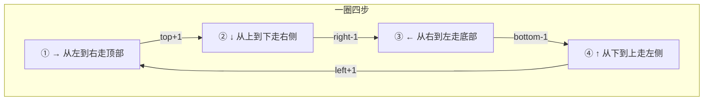
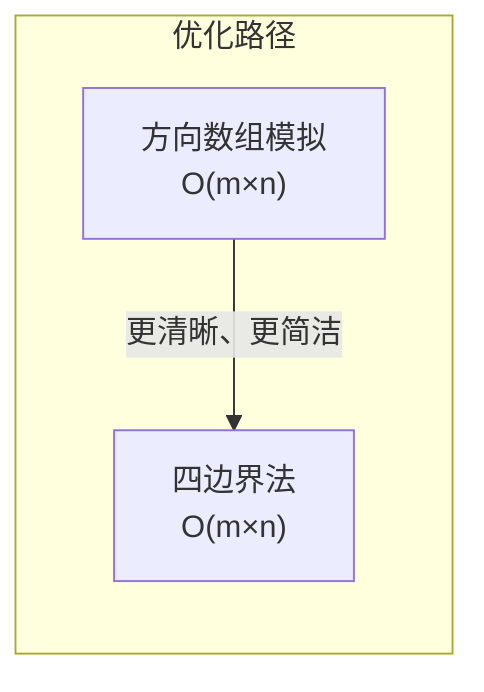

---

title: "螺旋矩阵"

difficulty: 中等

category: 矩阵

tags:

  - leetcode

  - 矩阵

  - matrix

created: "2026-07-21"

---

# 54. 螺旋矩阵

> 难度：中等 | 主题：数组、矩阵、模拟

## 题目

给定一个 `m x n` 的矩阵，请按照顺时针螺旋的顺序返回矩阵中的所有元素。

**示例**

```text

matrix = [[1,2,3],[4,5,6],[7,8,9]]

输出：[1,2,3,6,9,8,7,4,5]

```

---

## 思路
### 先讲个故事：剥洋葱

你有一颗洋葱，从外到内一层一层剥：

1. 从顶部从左往右刮一刀

2. 从右侧从上往下刮一刀

3. 从底部从右往左刮一刀

4. 从左侧从下往上刮一刀

每剥完一层，洋葱小了一圈——四个边界各往里缩一格。直到洋葱被剥完（边界交叉）。

这就是螺旋矩阵的本质：**按层遍历，每层四条边，边界收缩。**

---

### 引导式推导：四边界法

用四个变量圈定当前层：

- `top`：上边界行号

- `bottom`：下边界行号

- `left`：左边界列号

- `right`：右边界列号

每一圈分四步：



**关键问题**：第三步和第四步什么时候需要跳过？

当矩阵只剩**一行**时（top == bottom），第一步走完顶部行后，第三步走底部行会重复同一行。

当矩阵只剩**一列**时（left == right），第二步走完右侧列后，第四步走左侧列会重复同一列。

所以第三步前检查 `top <= bottom`，第四步前检查 `left <= right`。

---

### 逐层递进



**方向数组法**：定义右→下→左→上四个方向，遇到边界或已访问就转向。需要 visited 矩阵或额外标记。

**四边界法**：直接操作边界变量，不需要 visited 矩阵，常数空间。更简洁，更推荐。

---

## 代码

```python

def spiralOrder(self, matrix):

    if not matrix or not matrix[0]:

        return []

    top, bottom = 0, len(matrix) - 1

    left, right = 0, len(matrix[0]) - 1

    res = []

    while top <= bottom and left <= right:

        # 第一步：从左到右走顶部

        for col in range(left, right + 1):

            res.append(matrix[top][col])

        top += 1

        # 第二步：从上到下走右侧

        for row in range(top, bottom + 1):

            res.append(matrix[row][right])

        right -= 1

        # 第三步：从右到左走底部（需检查行未用完）

        if top <= bottom:

            for col in range(right, left - 1, -1):

                res.append(matrix[bottom][col])

            bottom -= 1

        # 第四步：从下到上走左侧（需检查列未用完）

        if left <= right:

            for row in range(bottom, top - 1, -1):

                res.append(matrix[row][left])

            left += 1

    return res

```

---

## 复杂度

| 指标 | 值 | 解释 |

|------|----|------|

| 时间 | O(m×n) | 每个元素恰好访问一次 |

| 空间 | O(1) | 仅四个边界变量（不计输出） |

---

## 实战考量
### 频率分析

> **出现在**：字节/美团约 25% 的矩阵题会考螺旋遍历。重点是**边界条件的处理**和**代码的整洁性**。

### 延伸思考

**Q：第三步和第四步的判断条件能不能省？**

A：不能。单行矩阵（如 1,2,3）或单列矩阵（如 [[1],[2],[3]]）时，不加判断会导致元素重复收集。

**Q：如果要求逆时针螺旋呢？**

A：调整四条边的遍历顺序即可：①从上到下走左侧 ②从左到右走底部 ③从下到上走右侧 ④从右到左走顶部。

**Q：如果要求螺旋填充矩阵（生成 n×n 螺旋矩阵）呢？**

A：思路完全一样，把"读元素"改成"写元素"即可。是这道题最常见的变形。

**Q：方向数组法什么时候更合适？**

A：当矩阵不规则（比如螺旋遍历不规则多边形区域）时，方向数组法更灵活。但标准矩形矩阵，四边界法更简洁。

### 易错点

- 第三步和第四步的条件判断不能忘

- 边界更新顺序别搞混：top++ / bottom-- / left++ / right--

- while 条件 `top <= bottom and left <= right` 是边界未交叉

---

## 生活类比

> **剥洋葱 → 四边界法**

>

> 你有一颗矩形洋葱，从外到内一层一层剥。

> 每层剥四条边——上边右刮、右边下刮、下边左刮、左边上刮。

> 剥完一层，四个边界往里缩一格。

> 直到洋葱芯被剥完。

>

> 单行或单列的洋葱——你只要剥一边或两边就够了。

---

## 相关题目

| 题目 | 关系 |

|------|------|

| [[48旋转图像]] | 矩阵遍历技巧，用翻转代替模拟 |

| 73矩阵置零 | 原地标记技巧 |

---

→ 返回题单：[[LeetCode学习路线图#一、数组与哈希（含双指针、矩阵）]]

## 速记卡（面试闪卡）

**Q1：一句话讲清「54. 螺旋矩阵」到底是什么？**

A：按顺时针螺旋顺序遍历矩阵，逐层剥四条边、边界不断向内收缩。

**Q2：思路 —— 怎么理解？**

A：像剥洋葱：从外到内一层层剥，每圈走顶→右→底→左四条边（Layer-by-layer Traversal，逐层遍历）。

**Q3：代码 —— 怎么理解？**

A：用 top/bottom/left/right 四边界变量循环剥圈，单行单列要补判断（Boundary Shrinking，边界收缩）。

**Q4：复杂度 —— 怎么理解？**

A：时间 O(m×n) 每元素访问一次，空间 O(1) 仅四个边界变量（Time/Space Complexity，时空复杂度）。

**Q5：实战考量 —— 怎么理解？**

A：约 25% 矩阵题考边界处理；变形如逆时针、螺旋填充（Spiral Order，螺旋顺序）。

**Q6：核心速记主线有哪些？**

- 本质：按层遍历，每层四条边，边界收缩

- 四边界法 O(m×n) 且 O(1) 空间，无需 visited

- 单行/单列时第三、四步要加判断防重复

- 变形：逆时针、螺旋填充（读改写）

**口诀**

A：螺旋矩阵像剥葱

四边顺序顶右底左

边界收缩别越界

单行单列要防重

## 相关链接

- [[笔记/Leetcode笔记/01_数组与哈希/73矩阵置零|矩阵置零]]

- [[笔记/Leetcode笔记/01_数组与哈希/611有效三角形的个数|有效三角形的个数]]

- [[笔记/Leetcode笔记/01_数组与哈希/15三数之和|三数之和]]

- [[笔记/Leetcode笔记/01_数组与哈希/88合并两个有序数组|合并两个有序数组]]

- [[笔记/Leetcode笔记/01_数组与哈希/41缺失的第一个正数|缺失的第一个正数]]

