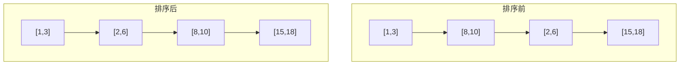
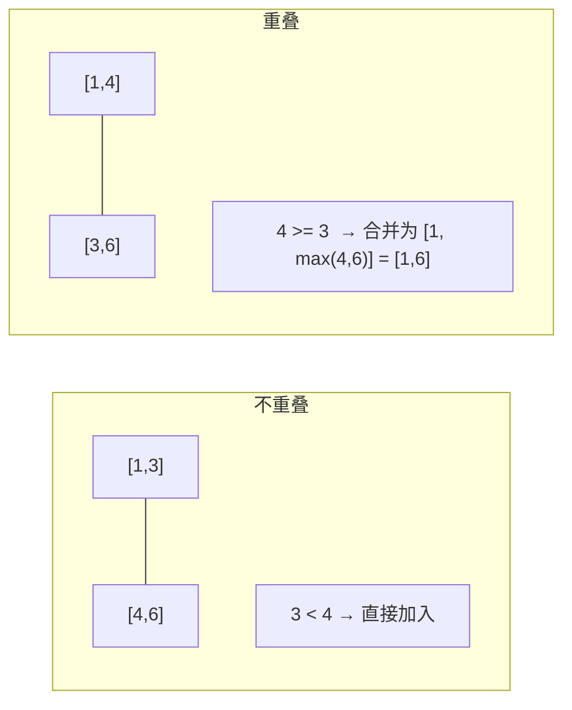
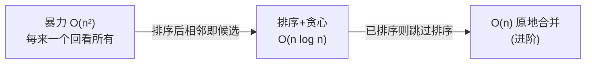

# 56. 合并区间（Merge Intervals）

> 难度：中等 | 主题：数组 / 排序 / 贪心

## 题目

以数组 intervals 表示若干个区间的集合，其中单个区间为 intervals[i] = [start_i, end_i]。请你合并所有重叠的区间，并返回一个不重叠的区间数组。

**示例**
```text
输入：intervals = [[1,3],[2,6],[8,10],[15,18]]
输出：[[1,6],[8,10],[15,18]]
解释：区间 [1,3] 和 [2,6] 重叠，合并为 [1,6]
```

---

## 思路

### 先讲个故事：拼乐高

你有一堆积木，每块积木从位置 start 铺到位置 end。你想知道这些积木铺完后，桌面被覆盖成了几段。

有的积木叠在一起——比如 `[1,3]` 和 `[2,6]`——它们就合成一块更大的 `[1,6]`。有的积木离得很远——`[8,10]` 和 `[15,18]`——各自独立。

怎么拼？**先把积木按左端点排好**，然后从头往后一块一块看：新积木的起点比上一块积木的终点靠左（或相接），就合并；否则新开一段。

---

### 引导式推导：排序为什么能贪心

**不排序会怎样？**

```text
[1,3], [8,10], [2,6], [15,18]
```

遍历到 `[2,6]` 时需要回看前面有没有重叠。每来一个新区间，都要和之前所有已合并的区间比较——O(n²)。

**排序后呢？**

按左端点升序排列：
```text
[1,3], [2,6], [8,10], [15,18]
```

相邻的一定是候选——因为左端点递增，新区间 `x` 只可能和紧挨着的上一个区间 `y` 重叠。

> 证明：如果 x 的左端点 > y 的右端点，那 x 不可能和 y 之前的任何区间重叠（那些区间的右端点 ≤ y 的右端点 < x 的左端点）。这就是贪心可以成立的**关键性质**。



**合并的两种情况：**



---

### 四层递进：从暴力到最优



---

## 代码

```python
def merge(self, intervals):                 # 排序+贪心：合并重叠区间
    intervals.sort(key=lambda x: x[0])          # 按左端点排序，使可合并的区间相邻
    merged = []                                 # 结果列表
    for interval in intervals:                  # 遍历每个区间
        if not merged or merged[-1][1] < interval[0]:  # 不重叠
            merged.append(interval)                      # 直接加入
        else:                                   # 重叠
            merged[-1][1] = max(merged[-1][1], interval[1])  # 扩展右端点
    return merged
```

**为什么判断不重叠用 `<` 而不是 `<=`？**

因为 `[1,3]` 和 `[3,6]` 虽然端点相接，但题目里这类情况**也需要合并**（结果应该是 `[1,6]`）。所以重叠条件是 `interval[0] <= merged[-1][1]`，反推不重叠就是 `<`。

---

## 复杂度

| 指标 | 值 | 解释 |
|------|----|------|
| 时间 | O(n log n) | 排序是瓶颈 |
| 空间 | O(log n) | 排序的递归栈（Python Timsort） |
| 免排序 | O(n) | 如果输入已按左端点排序 |

---

## 实战考量

### 频率分析

> **出现在**：频率极高的**区间问题入门题**。约 60% 的同类题会考区间类问题（合并、插入、覆盖、交集），本题目是这整个系列的基础。

### 延伸思考

**Q：为什么排序后贪心不会漏解？**
A：反证法。假设最优解中相邻两个合并块 `A` 和 `B` 在排序后的列表里不连续 → 中间夹着一个不重叠的区间 `C` → 那 A 的右 < C 的左，C 的右 < B 的左 → A 和 B 不可能重叠。所以可合并的区间在排序后一定是连续的。

**Q：「插入一个新区间到已有的合并列表中」怎么做？**
A：找到插入位置后向左向右合并前后可能的区间。具体看 57插入区间。这题是 56 的直接变体。

**Q：区间调度问题（最多能安排多少个不重叠区间）？**
A：按右端点排序 + 贪心选择最早结束的。这就是 [[435无重叠区间]]。

**Q：给定若干线段，求它们被覆盖的总长度？**
A：排序 + 合并后对每个合并块 `(l, r)` 累加 `r - l`。或者用扫描线 + 差分数组。

**Q：间隔重复的日程安排系统怎么实现？**
A：会议室预定（252会议室）就是合并区间的直接应用——合并后看密度。

### 易错点

- 判断不重叠用 `<` 而非 `<=`（端点相接要合并）
- 排序后 `merged[-1][1]` 是当前合并块的右端点，需要不断取 max 扩展
- `intervals.sort(key=lambda x: x[0])` 是原地排序，`sorted()` 返回新列表但实践中 `sort()` 就够

---

## 生活类比

> **合并区间 → 拼乐高**
>
> 先把积木按起点排好，然后从头拼到尾。新积木和上一块连上了就融进去（取最大终点），没连上就另起一堆。
> 排好队了就不需要回头看——**排好序的集合，相邻即全部。**

---

## 相关题目

| 题目 | 关系 |
|------|------|
| 57插入区间 | 直接变体，插入一个新区间到已合并列表 |
| [[435无重叠区间]] | 区间调度，按右端点排序 + 贪心 |
| 252会议室 | 合并区间的应用，判断能否参加所有会议 |
| [[56合并区间]] | 本题 |

---

→ 返回题单：[[LeetCode学习清单#一、数组与哈希（含双指针、矩阵）]]

## 速记卡（面试闪卡）

**Q1：一句话讲清「56. 合并区间（Merge Intervals）」到底是什么？**
A：以数组 intervals 表示若干个区间的集合，其中单个区间为 intervals[i] = [start_i, end_i]。请你合并所有重叠的区间，并返回一个不重叠的区间数组。
**示例**
---

**Q2：题目 —— 怎么理解？**
A：以数组 intervals 表示若干个区间的集合，其中单个区间为 intervals[i] = [start_i, end_i]。请你合并所有重叠的区间，并返回一个不重叠的区间数组。
**示例**
---

**Q3：思路 —— 怎么理解？**
A：你有一堆积木，每块积木从位置 start 铺到位置 end。你想知道这些积木铺完后，桌面被覆盖成了几段。
有的积木叠在一起——比如  和 ——它们就合成一块更大的 。有的积木离得很远—— 和 ——各自独立。
怎么拼？**先把积木按左端点排好**，然后从头往后一块一块看：新积木的起点比上一块积木的终点靠左（或相接），就合并；否则新开一段。
---
**不排序会怎样？**
遍历到  时需要回看前面有没有重叠。

**Q4：代码 —— 怎么理解？**
A：**为什么判断不重叠用  而不是 ？**
因为  和  虽然端点相接，但题目里这类情况**也需要合并**（结果应该是 ）。所以重叠条件是 ，反推不重叠就是 。
---

**Q5：复杂度 —— 怎么理解？**
A：| 指标 | 值 | 解释 |
|------|----|------|
| 时间 | O(n log n) | 排序是瓶颈 |
| 空间 | O(log n) | 排序的递归栈（Python Timsort） |
| 免排序 | O(n) | 如果输入已按左端点排序 |
---

**Q6：核心速记主线有哪些？**
A：抓住这几根：题目、思路、代码、复杂度、实战考量、生活类比。

