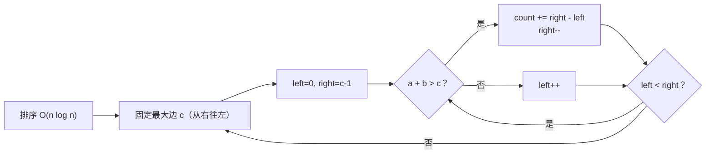
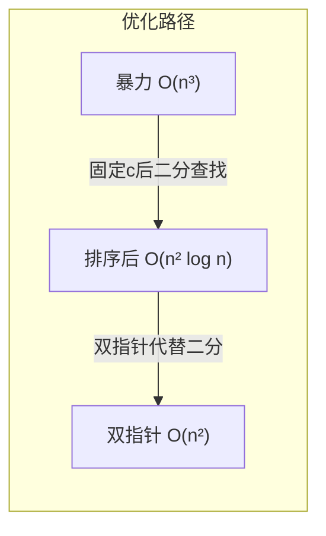

---

title: "有效三角形的个数"

difficulty: 中等

category: 数组与哈希

tags:

  - leetcode

  - 数组与哈希

created: "2026-07-21"

---

# 611. 有效三角形的个数

> 难度：中等 | 主题：数组、双指针、排序

## 题目

给定一个包含非负整数的数组，统计其中可以组成三角形三条边的三元组个数。

**三角形条件**：任意两边之和大于第三边。对于 a ≤ b ≤ c，只需满足 `a + b > c`。

**示例**

```text

nums = [2,2,3,4]  → 输出 3

解释：(2,3,4), (2,3,4), (2,2,3)

```

---

## 思路
### 先讲个故事：裁木条

你有一堆长短不一的木条，想挑三根拼成三角形。你发现：

1. 把木条按长短排好队，最长的当底边

2. 在比它短的木条里，找两根加起来比它长的

3. 因为木条已经排好序了，如果短的里最短 + 最长 > 底边，那从最短到第二长之间的每一根和最长搭配都行

用一个比喻：**排序后，固定最长边，用双指针扫一遍剩下的——把 O(n³) 变成 O(n²)。**

---

### 引导式推导：从三重循环到双指针

**暴力法**：三重循环枚举所有三元组，检查三角形条件。O(n³) 太慢。

**第一步优化：排序降维**

排序后，对于 a ≤ b ≤ c，最长边 c 确定后，三角形条件简化为 `a + b > c`（另外两条不等式自动满足，因为 c 最大）。

**第二步优化：固定 c，双指针找 (a, b)**



**为什么 count += right - left？**

数组有序，如果 `nums[left] + nums[right] > c`，那么对于固定的 right，`nums[left+1]` 到 `nums[right-1]` 都比 `nums[left]` 大，它们加 `nums[right]` 一定也大于 c。所以直接累加 `right - left` 个数，不用一个一个试。

---

### 逐层递进



**暴力** → **排序 + 二分**：固定 c 和 a，二分查找 b 使 a + b > c。O(n² log n)。

**排序 + 双指针**：固定 c，left 和 right 相向移动。O(n²)。right 从右往左扫描，left 从左往右，每对 (left, right) 至多被检查一次。

---

## 代码

```python

def triangleNumber(self, nums):

    nums.sort()                # 排序，双指针的前提

    n = len(nums)

    count = 0

    # 固定最大边 c，从后往前（至少要有 3 个元素）

    for k in range(n - 1, 1, -1):

        c = nums[k]            # 当前最长边

        left = 0               # 左指针，指向最短边

        right = k - 1          # 右指针，指向次长边

        while left < right:

            if nums[left] + nums[right] > c:

                # 对当前 right，所有 left..right-1 都满足

                count += right - left

                right -= 1      # 试试更短的次长边

            else:

                left += 1       # 和不够大，换更长的最短边

    return count

```

---

## 复杂度

| 指标 | 值 | 解释 |
|------|----|------|
| 时间 | O(n²) | 排序 O(n log n) + 双指针 O(n²) |
| 空间 | O(log n) | 排序栈空间（不计输出） |

---

## 实战考量
### 频率分析

> **出现在**：美团/字节约 20% 的双指针题会考察这种「固定一端，双指针扫另一端」的模式。

### 延伸思考

**Q：为什么排序后只需要检查 `a + b > c`？**

A：排序保证 a ≤ b ≤ c，所以 a + c > b 和 b + c > a 自动成立（c 是最大边，c + 任何正数肯定大于另一个）。只需判断最弱的条件。

**Q：`count += right - left` 为什么一次加这么多？**

A：数组有序，left 到 right-1 之间的每个数加 nums[right] 都大于 c（因为最小那个 left 已经满足了，更大的更满足）。这是双指针的经典优化——一次性统计一段。

**Q：如果问「判断能否组成三角形」（存在性）？**

A：更简单。排序后检查相邻三个最大数即可——如果最大的三个都不行，那更小的更不行。

**Q：和 15三数之和 的区别？**

A：15 题是找 a + b + c = 0，这题是 a + b > c。但都用了排序 + 双指针的框架。

### 易错点

- 忘记排序直接双指针（双指针依赖有序）

- `count += right - left` 写成 `count += 1`（丢了好多答案）

- 循环从 n-1 到 2（至少需要 3 个元素）

- 值为 0 的边不影响结果——0 不能做边长，但排在最前面，双指针自然跳过

---

## 生活类比

> **裁木条 → 排序 + 双指针**

>

> 你把木条从短到长摆一排，挑最长的当底边。

> 从两头往中间试：最短 + 次长 > 底边？如果是，那最短到次长之间每根和次长搭配都行。

> 如果不是，最短太短了，换一根稍长的最短边试试。

>

> 每次固定底边，两头往中间夹——**排序让一切有迹可循，双指针让一切一次扫完。**

---

## 相关题目

| 题目 | 关系 |
|------|------|
| 15三数之和 | 同框架：排序 + 双指针找三元组 |

---

→ 返回题单：[[LeetCode学习路线图#一、数组与哈希（含双指针、矩阵）]]

## 速记卡（面试闪卡）

**Q1：一句话讲清「611. 有效三角形的个数」到底是什么？**

A：排序后固定最长边 c，用双指针在剩下边里找 a+b>c 的对数，O(n²) 统计三角形个数。

**Q2：一、题目与三角形条件 —— 怎么理解？**

A：裁木条类比：木条从短到长摆一排，挑最长的当底边，从两头往中间试——最短+次长>底边，那之间每根搭配都行。数学上 a≤b≤c 时只需 a+b>c（另两不等式自动成立），统计满足的三元组个数。

**Q3：二、双指针推导 —— 怎么理解？**

A：暴力 O(n³) 太慢。排序降维：固定 c 后条件简化为 a+b>c。二分查找 b 是 O(n²log n)；双指针（Two Pointers，left 从最短、right 从次长相向）进一步降到 O(n²)。right 从右往左扫，每对至多查一次。

**Q4：三、count += right-left 的妙处 —— 怎么理解？**

A：数组有序，若 nums[left]+nums[right]>c，则 left+1 到 right-1 都比 left 大，加 right 也必 >c——一次性累加 right-left 个，不用逐个试。这是双指针经典优化：一段区间整体计数。

**Q5：四、复杂度与易错点 —— 怎么理解？**

A：时间 O(n²)（排序 O(n log n)+双指针），空间 O(log n) 排序栈。易错：忘排序直接双指针；count+=right-left 写成 +1 丢答案；循环从 n-1 到 2（至少 3 元素）；0 边长排最前被自然跳过。

**Q6：核心速记主线有哪些？**

- 排序为前提，固定最长边 c 再双指针

- a+b>c 足够（c 最大时另两不等式自动成立）

- count += right-left 一次性统计一段区间

- 易错：忘排序、+1 漏数、循环边界 n-1→2

**口诀**

A：三角数，先排序；

固定最长边，双指针夹击。

a+b>c 即够，一段全计入；

O(n²) 收工，忘排是大忌。

## 相关链接

- [[笔记/Leetcode笔记/01_数组与哈希/680验证回文串II|验证回文串II]]

- [[笔记/Leetcode笔记/01_数组与哈希/15三数之和|三数之和]]

- [[笔记/Leetcode笔记/01_数组与哈希/36有效的数独|有效的数独]]

- [[笔记/Leetcode笔记/01_数组与哈希/26删除有序数组中的重复项|删除有序数组中的重复项]]

- [[笔记/Leetcode笔记/01_数组与哈希/11盛最多水的容器|盛最多水的容器]]

