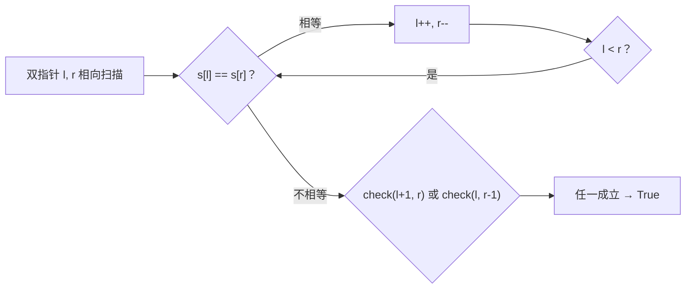

# 680. 验证回文串 II

> 难度：简单 | 主题：字符串 + 双指针

## 题目

给你一个字符串 s，最多可以从中删除一个字符。请判断能否成为回文字符串。

**示例**
```text
s = "abca"  → 输出 true
解释：删除 'c' 得到 "aba"，是回文串
```

---

## 思路

### 先讲个故事：镜中照妖

你在照镜子，镜子里的人应该是你的镜像。你发现镜子里和你不完全一样——最多有一处不同。

你可以原谅一次：要么删掉你这边不匹配的字符，要么删掉镜子里不匹配的字符。删完之后，剩余部分必须完美对称。

这就是这道题：**双指针相向扫描，遇到第一处不等，只有两种挽救方案。都试一遍，一个行就过关。**

---

### 引导式推导：从暴力到双指针

**暴力法**：枚举删除每个位置，判断剩下的是否回文。O(n²)。

**优化**：遇到不等时，你只有两种选择：
1. 删左边的字符 → 检查 [left+1, right] 是否回文
2. 删右边的字符 → 检查 [left, right-1] 是否回文



因为只允许删一次，**删除后剩余部分必须完美对称**。这比暴力枚举每个位置聪明得多——复杂度从 O(n²) 降到 O(n)。

**为什么只试两种就够了？** 因为第一处不等的位置决定了矛盾所在，删除任何其他位置的字符都无法解决这对矛盾。只有删左或删右两种方案可能奏效。

---

## 代码

```python
def validPalindrome(self, s):
    # 内层函数：严格判断子串是否为回文（不可再删）
    def is_palindrome(l, r):
        while l < r:
            if s[l] != s[r]:
                return False
            l += 1
            r -= 1
        return True

    l, r = 0, len(s) - 1

    while l < r:
        if s[l] == s[r]:
            l += 1
            r -= 1
        else:
            # 遇到第一处不等，尝试两种删除方案
            return is_palindrome(l + 1, r) or is_palindrome(l, r - 1)

    return True  # 本来就地回文
```

---

## 复杂度

| 指标 | 值 | 解释 |
|------|----|------|
| 时间 | O(n) | 最多两趟扫描 |
| 空间 | O(1) | 只用了几个指针变量 |

---

## 实战考量

### 频率分析

> **出现在**：字节/美团热身题，约 15% 的字符串类常会考到。重点考察你能不能想到「遇到不等只试两种方案」。

### 延伸思考

**Q：为什么用 `or` 不是 `and`？**
A：删除左边或删除右边，只要**一种**能成功就行。`or` 短路求值——左边成立就不算右边了。

**Q：如果允许删除最多 k 个字符呢？**
A：动态规划。定义 `dp[i][j][k]` 表示子串 [i, j] 删 k 个能否成回文。当 k 变大，问题从贪心变成 DP。

**Q：最少删除多少个字符能成为回文？**
A：求原串和反转串的最长公共子序列（LCS），n - LCS 就是最少删除数。

**Q：内层函数为什么不能再允许删除？**
A：外层已经消耗了唯一一次删除机会。只剩一次机会，用完为止。

### 易错点

- `return is_palindrome(l+1, r) or is_palindrome(l, r-1)` 不是 and
- 内层函数是严格回文检查（不能再删）
- 外层 while 正常结束，说明本来就地回文，直接 True
- 不要用暴力删除每个位置——这里正是优化的切入点

---

## 生活类比

> **镜中照妖 → 双指针 + 一次原谅**
>
> 你照镜子发现左右不对称，只能原谅一次错位。
> 要么把你这边不协调的拿走，要么把镜子里不协调的拿走。
> 剩下如果完美对称，就算过关。
>
> 双指针从两边往中间看，找到第一个对不上的地方——**就两个选项，试完就完。**

---

## 相关题目

| 题目 | 关系 |
|------|------|
| 125验证回文串 | 基础版，不允删除，本题的严格回文子函数来源 |
| 72编辑距离 | 动态规划版，允许多次编辑 |

---

→ 返回题单：[[LeetCode学习清单#一、数组与哈希（含双指针、矩阵）]]
