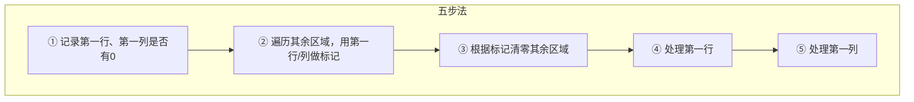

---

title: "矩阵置零"

difficulty: 中等

category: 矩阵

tags:

  - leetcode

  - 矩阵

  - matrix

created: "2026-07-21"

---

# 73. 矩阵置零

> 难度：中等 | 主题：数组、矩阵、原地修改

## 题目

给定一个 `m x n` 的矩阵，如果一个元素为 0，则将其所在行和列的所有元素都设为 0。请使用**原地**算法。

**示例**

```text

matrix = [[1,1,1],[1,0,1],[1,1,1]]

输出：[[1,0,1],[0,0,0],[1,0,1]]

```

---

## 思路
### 先讲个故事：教室里的告示板

教室里有一块告示板（矩阵），有人不小心在某个格子洒了墨水。值日生需要把这一整行和这一整列的格子都擦掉。

但值日生手头没有多余的白板来记录哪些行和列需要擦——**只能用告示板本身来记**。

他想到一个办法：用**第一行**和**第一列**当备忘录。如果第 i 行第 j 列的格子有墨水，就在第一行第 j 列画个圈，在第一列第 i 行画个圈。最后根据这些圈来擦。

但问题是——第一行和第一列本身也可能有墨水！所以要先记下它们原本有没有墨水，再开始做标记。

---

### 引导式推导：从 O(m+n) 到 O(1)

**第 1 层：用集合存行列号**

遍历一遍，遇到 0 就把行列号记下来。再遍历一遍，把记录的行列清零。

- 时间 O(m×n)

- 空间 O(m+n)


**第 2 层：用矩阵自身当哈希表**

能不能把 O(m+n) 空间省掉？**用第一行和第一列充当标记数组！**



**为什么必须先记录第一行/列的原始状态？**

因为第二步要用第一行/列来存标记，这会覆盖它们原本的值。如果不提前备份，第三步清零后我们就不知道第一行/列本身是否需要清零了。

---

## 代码

```python

def setZeroes(self, matrix):

    if not matrix or not matrix[0]:

        return

    m, n = len(matrix), len(matrix[0])

    # 第一步：记录第一行和第一列本身是否有0

    first_row_has_zero = any(matrix[0][j] == 0 for j in range(n))

    first_col_has_zero = any(matrix[i][0] == 0 for i in range(m))

    # 第二步：用第一行和第一列做标记

    for i in range(1, m):

        for j in range(1, n):

            if matrix[i][j] == 0:

                matrix[i][0] = 0   # 第 i 行需要清零

                matrix[0][j] = 0   # 第 j 列需要清零

    # 第三步：根据标记清零（除第一行/列）

    for i in range(1, m):

        for j in range(1, n):

            if matrix[i][0] == 0 or matrix[0][j] == 0:

                matrix[i][j] = 0

    # 第四步：处理第一行

    if first_row_has_zero:

        for j in range(n):

            matrix[0][j] = 0

    # 第五步：处理第一列

    if first_col_has_zero:

        for i in range(m):

            matrix[i][0] = 0

```

---

## 复杂度

| 指标 | 值 | 解释 |

|------|----|------|

| 时间 | O(m×n) | 若干次线性扫描 |

| 空间 | O(1) | 仅两个布尔变量 |

---

## 实战考量
### 频率分析

> **出现在**：字节/美团常考，核心考点不是算法本身（太简单），而是**你能不能优化到 O(1) 空间**。

### 延伸思考

**Q：为什么不能边遍历边清零？**

A：如果你遇到一个 0 就立即把整行整列清零，后面的遍历会误以为那些被清零的位置原本就是 0，导致不该清零的也被清零了。比如矩阵 0,1，边遍历边清零会把 [0,1] 变成 [0,0]。

**Q：除了用第一行/列做标记，还有什么方法？**

A：可以用两个布尔变量替代集合，思路一样。或者用常数个额外变量的位运算技巧，但第一行/列法最直观。

**Q：如果遇到稀疏矩阵（0 很少）呢？**

A：可以用两个集合存行和列，空间 O(m+n) 但常数小。可以先讲集合法（直观），再优化到 O(1)。

**Q：变形题：把每个 0 的上下左右相邻元素也置零（扩散）？**

A：BFS/DFS 扩散，或者两遍扫描——先找到所有 0，再逐层扩散。

### 易错点

- 必须先备份第一行/列的原始状态，再做标记

- 标记和清零的顺序：先标记（除第一行/列）→ 再清零（除第一行/列）→ 最后处理第一行/列

- 不要用 `if matrix[0][j] == 0` 替代 `first_row_has_zero`——标记过程会改变第一行

---

## 生活类比

> **告示板备忘录 → 原地标记**

>

> 你把第一行和第一列当便利贴用——先看这俩便利贴本身脏不脏，记在心里。

> 然后用它们记录其他地方哪里需要擦。

> 擦完其他地方，再看心里记的那两处要不要擦。

>

> **把矩阵本身当纸用，省下额外的一张纸。**

---

## 相关题目

| 题目 | 关系 |

|------|------|

| [[54螺旋矩阵]] | 矩阵遍历 |

| [[48旋转图像]] | 矩阵原地操作 |

---

→ 返回题单：[[LeetCode学习路线图#一、数组与哈希（含双指针、矩阵）]]

## 速记卡（面试闪卡）

**Q1：一句话讲清「73. 矩阵置零」到底是什么？**

A：矩阵里一旦发现某个格子是0，就把它所在的整行整列全部清零，而且必须原地修改、不占额外数组。

**Q2：为什么不能边扫边清零？ —— 怎么理解？**

A：像在白板上擦字，你一擦后面就分不清哪些格子本来就是0、哪些是被你误擦的，会把无辜格子也清零。这考的是原地修改（in-place modification，不借助额外数组、直接在原矩阵上改）。

**Q3：第一行/列怎么当备忘录？ —— 怎么理解？**

A：把第一行和第一列当便利贴：先看它们本身脏不脏（有没有0）记在心里，再用它们去标记别处哪里要擦。这是用矩阵自身当哈希表的空间优化（space optimization via matrix-as-hashmap）。

**Q4：五步法的顺序怎么记？ —— 怎么理解？**

A：像三明治层层来：①先拍照备份首行首列 → ②用首行首列做标记 → ③清零其余 → ④处理首行 → ⑤处理首列。顺序乱了就会误清。这是典型的两遍扫描（two-pass marking）。

**Q5：复杂度和实战怎么理解？ —— 怎么理解？**

A：字节/美团常考，考点根本不是算法本身，而是你能不能把空间从 O(m+n) 压到 O(1)。时间 O(m×n)，空间 O(1)（只两个布尔变量）。这就是常量级空间（constant space）的胜利。

**Q6：核心速记主线有哪些？**

- 题目：0 所在的整行整列全清零，必须原地

- 核心：用第一行/列当标记位，省掉额外数组

- 顺序：先备份首行首列 → 标记 → 清零 → 最后处理首行首列

- 实战：字节/美团爱问，考点在 O(1) 空间优化

**口诀**

A：矩阵遇零就归零，

首行首列当便签；

先存原本脏不脏，

原地清空最稳妥。

## 相关链接

- [[笔记/Leetcode笔记/01_数组与哈希/54螺旋矩阵|螺旋矩阵]]

- [[笔记/Leetcode笔记/01_数组与哈希/217存在重复元素|存在重复元素]]

- [[笔记/Leetcode笔记/01_数组与哈希/448找到所有数组中消失的数字|找到所有数组中消失的数字]]

- [[笔记/Leetcode笔记/01_数组与哈希/15三数之和|三数之和]]

- [[笔记/Leetcode笔记/01_数组与哈希/88合并两个有序数组|合并两个有序数组]]

