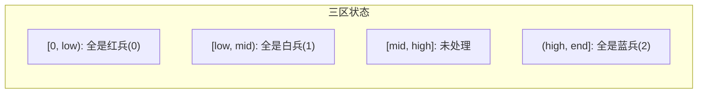
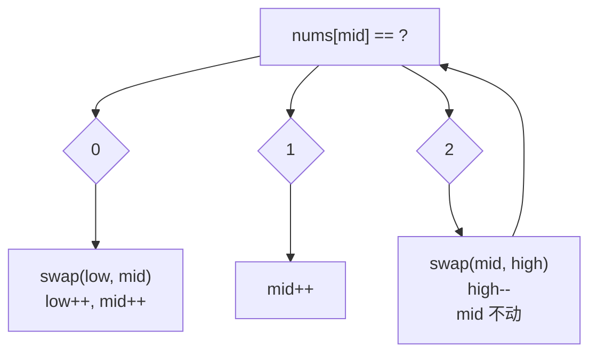

---

title: "颜色分类"

difficulty: 中等

category: 数组与哈希

tags:

  - leetcode

  - 数组与哈希

created: "2026-07-21"

---

# 75. 颜色分类

> 难度：中等 | 主题：数组 + 三指针（荷兰国旗问题）

## 题目

给定一个包含红色、白色和蓝色、共 n 个元素的数组 nums，原地对它们进行排序，使得相同颜色的元素相邻，并按照红色、白色、蓝色顺序排列。我们使用整数 0、1、2 分别表示红色、白色和蓝色。

**示例**

```text

输入：nums = [2,0,2,1,1,0]

输出：[0,0,1,1,2,2]

```

要求：原地排序，不能调库 sort，一趟遍历。

---

## 思路
### 先讲个故事：军营分队列

军营里有三种兵：红兵（0）、白兵（1）、蓝兵（2）。现在要按红→白→蓝的顺序站成一排。

司令想了个办法：三个军官站在队伍里。

- **low** 站在红区的右端——low 左边全是红兵

- **mid** 站在白区和未处理区之间——low 到 mid 之间全是白兵

- **high** 站在蓝区的左端——high 右边全是蓝兵

mid 探路往前走，看到的兵有三种情况：

1. **看到红兵**（0）→ 和 low 位置的兵交换 → low 右移 → mid 右移

2. **看到白兵**（1）→ 正好在白区 → mid 直接右移

3. **看到蓝兵**（2）→ 和 high 位置的兵交换 → high 左移 → **mid 不动！**

为什么第 3 种情况 mid 不动？因为从右边换过来的兵还没检查过——可能是红、白、蓝中的任何一种。

---

### 引导式推导：哨兵怎么动

假设队列是 `[2, 0, 2, 1, 1, 0]`

```text

初始：low=0, mid=0, high=5

数组：2  0  2  1  1  0

      ^

    low,mid           high

```

**第 1 步：mid=0, nums[0]=2（蓝兵）**

```text

交换 mid 和 high → [0, 0, 2, 1, 1, 2]

high 左移 → high=4，mid 不动

                    ^

                 mid      high

```

**第 2 步：mid=0, nums[0]=0（红兵）**

```text

交换 mid 和 low → 没区别，都是 0

low++ → low=1, mid++ → mid=1

数组：0  0  2  1  1  2

       ^

       low

       mid      high

```

**第 3 步：mid=1, nums[1]=0（红兵）**

```text

交换 mid 和 low → 没区别

low++ → low=2, mid++ → mid=2

数组：0  0  2  1  1  2

          ^

          low

          mid   high

```

**第 4 步：mid=2, nums[2]=2（蓝兵）**

```text

交换 mid 和 high → [0, 0, 1, 1, 2, 2]

high-- → high=3, mid=2 不变

数组：0  0  1  1  2  2

          ^         ^

          mid      high

```

**第 5 步：mid=2, nums[2]=1（白兵）**

```text

mid++ → mid=3

数组：0  0  1  1  2  2

             ^

            mid,high

```

**第 6 步：mid=3 ≤ high=3，nums[3]=1（白兵）**

```text

mid++ → mid=4，循环结束！

```



---

### 为什么要理解这个"mid 不动"？

这是最容易混淆的地方，也是最核心的考察点：

**交换 0 时 mid 可以 +1**：low~mid 之间的数一定是 1（因为 mid 跳过 1 时只做了 ++），所以从 low 换过来的肯定是 1，安全。

**交换 2 时 mid 不能 +1**：从 high 换过来的是未处理的数（可能是 0/1/2），必须停在原地重新检查。



---

## 代码

```python

def sortColors(self, nums):             # 荷兰国旗问题：三指针原地分区

    low, mid, high = 0, 0, len(nums) - 1   # [0,low)=0, [low,mid)=1, (high,end]=2

    while mid <= high:                     # mid > high 时所有元素已处理

        if nums[mid] == 0:                 # 红兵 → 交换到 low 区

            nums[low], nums[mid] = nums[mid], nums[low]

            low += 1                       # low 区右扩

            mid += 1                       # mid 右移（换过来的是 1，安全）

        elif nums[mid] == 1:               # 白兵 → 已在正确位置

            mid += 1                       # 直接跳过

        else:                              # 蓝兵 → 交换到 high 区

            nums[mid], nums[high] = nums[high], nums[mid]

            high -= 1                      # high 区左扩

            # mid 不动！换过来的还没检查

```

---

## 复杂度

| 指标 | 值 | 解释 |

|------|----|------|

| 时间 | O(n) | 一趟遍历，每个元素最多操作一次 |

| 空间 | O(1) | 原地修改，只有三个指针 |

---

## 实战考量
### 频率分析

> **出现在**：微软、字节高频，约 40% 会考。三指针是分区算法的鼻祖，这道题考察对**指针移动条件**的理解。

### 延伸思考

**Q：为什么交换 0 时 mid 和 low 都 +1，但交换 2 时只 high-1 而 mid 不动？**

A：因为 low~mid 之间一定是 1（mid 只会在看到 1 时右移），所以从 low 换过来的是 1，不用再检查。但从 high 换过来的是未处理的、可能是 0/1/2，必须原地检查。

**Q：如果数组有 0~k 共 k+1 种颜色，怎么排？**

A：计数排序是首选——因为颜色种类有限，三趟遍历：第一趟数每种颜色个数，第二趟填回去。但如果要求一趟遍历，可以用多个指针分区（扩展到 k+2 个指针），但更通用的做法是用快速排序的三向切分（快排 Dijkstra 版）。

**Q：这个算法和快速排序的 partition 有什么关系？**

A：快排的单向/双向分区都是荷兰国旗的简化版——快排只需要分 < pivot 和 ≥ pivot 两段。Dijkstra 的三向切分就是用本算法把数组分成 < pivot、= pivot、> pivot 三段，用来优化重复元素很多时的快排。

**Q：如果数组成分是正数、负数、零，按负数→零→正数排序？**

A：同一个三指针思路。判断条件改成符号判断即可。

**Q：如果要求稳定排序呢？**

A：三指针分区不稳定（交换会打乱相同元素的相对顺序）。要稳定的话，用计数排序或额外数组。

### 易错点

- 交换 2 后 **mid 不能 +1**——这是最常出错的地方

- 循环条件 `mid <= high`（`mid > high` 时结束）

- 为什么 low~mid 之间一定是 1：因为 mid 走到当前位置时，会把 0 换到 low 区、把 2 换到 high 区，1 自然留在中间

---

## 生活类比

> **荷兰国旗 → 分类垃圾桶**

>

> 三个工人站在传送带前，低哥管左边、中哥管中间、高哥管右边。物体会经过中哥的手到相应位置。

> 关键规则：从右边换来的东西中哥必须再看一眼——**信任左边交换，怀疑右边交换。**

---

## 相关题目

| 题目 | 关系 |

|------|------|

| 912排序数组 | 多种排序算法对比 |

| 215数组中的第K个最大元素 | 快排 partition 的应用 |

本题目较为独立（三指针分区是独特模式），无可直接推荐的同类题。

---

→ 返回题单：[[LeetCode学习路线图#一、数组与哈希（含双指针、矩阵）]]

## 速记卡（面试闪卡）

**Q1：一句话讲清「75. 颜色分类」到底是什么？**

A：用 low/mid/high 三指针一趟原地分区，把 0、1、2 按红白蓝顺序排好（荷兰国旗问题）。

**Q2：军营三区分类（Dutch National Flag） —— 怎么理解？**

A：类比：三种兵红白蓝要站成红→白→蓝。司令派 low、mid、high 三军官：low 左边全红、mid 管白区、high 右边全蓝。mid 探路，遇红换到 low 区、遇蓝换到 high 区——关键：换蓝时 mid 不动，因为从右边换来的兵还没查过。（Three-way partition）

**Q3：三指针原地分区（in-place partition） —— 怎么理解？**

A：类比：while mid<=high：nums[mid]==0 就 swap 到 low 并 low++、mid++；==1 直接 mid++；==2 就 swap 到 high 并 high--、mid 不动。CPU 寄存器只留三个指针，像三个工人守着传送带分拣垃圾。（In-place）

**Q4：复杂度与稳定性（O(n) time, O(1) space） —— 怎么理解？**

A：类比：一趟遍历人人最多被摸一次，时间 O(n)；只多三个指针，空间 O(1)。但它不稳定——交换会打乱同色顺序，要稳定得用计数排序。它其实就是快速排序的三向切分（3-way partition）。（Stable? No）

**Q5：为何换 2 时 mid 不动（boundary care） —— 怎么理解？**

A：类比：low~mid 之间一定是 1（mid 只在见 1 时右移），所以从左换来的必是 1，安全可 +1；但从 high 换来的是未处理数，可能是 0/1/2，必须原地再查。面试最爱揪这个指针移动条件的细节。（Trust left, doubt right）

**Q6：核心速记主线有哪些？**

- 题目：0/1/2 原地一趟排序成红白蓝（荷兰国旗）

- 思路：low/mid/high 三指针分区（three pointers）

- 代码：换 0 时 low++mid++，换 2 时 high-- 而 mid 不动

- 复杂度：时间 O(n)、空间 O(1)，但不稳定

- 实战：是快排三向切分基础，常考指针移动条件

**口诀**

A：三种颜色排一列，

low mid high 分工切；

换蓝 mid 先别急，

红白蓝顺一趟结。

## 相关链接

- [[笔记/Leetcode笔记/01_数组与哈希/15三数之和|三数之和]]

- [[笔记/Leetcode笔记/01_数组与哈希/88合并两个有序数组|合并两个有序数组]]

- [[笔记/Leetcode笔记/01_数组与哈希/48旋转图像|旋转图像]]

- [[笔记/Leetcode笔记/01_数组与哈希/169多数元素|多数元素]]

- [[笔记/Leetcode笔记/01_数组与哈希/217存在重复元素|存在重复元素]]

