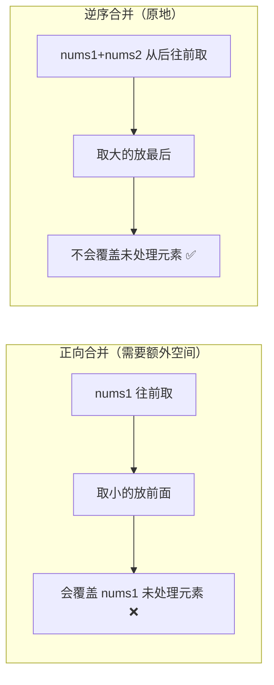

---

title: "合并两个有序数组"

difficulty: 简单

category: 数组与哈希

tags:

  - leetcode

  - 数组与哈希

created: "2026-07-21"

---

# 88. 合并两个有序数组

> 难度：简单 | 主题：数组 + 双指针

## 题目

给你两个按非递减顺序排列的整数数组 nums1 和 nums2，另有两个整数 m 和 n，分别表示 nums1 和 nums2 中的元素数目。请合并 nums2 到 nums1 中，使合并后的数组同样按非递减顺序排列。注意：最终合并后数组不应由函数返回，而是存储在数组 nums1 中。

**示例**

```text

输入：nums1 = [1,2,3,0,0,0], m = 3, nums2 = [2,5,6], n = 3

输出：[1,2,2,3,5,6]

解释：合并到 nums1（长度 m+n，后 n 位是空位 0）

```

---

## 思路
### 先讲个故事：拼团排队

有两支已经排好队的队伍——一队高个子在前、矮个子在后，另一队也是。要把第二队**合并**进第一队，**且只能使用第一队的位置**（第一队末尾有足够的空位）。

正向合并：从头比较，每次取小的放前面。但这样会覆盖第一队还没处理的元素——需要一个额外空间暂存。

反向合并：从末尾开始比较，每次取**大的放最后**。第一队的空位在末尾，从后往前填永远不会覆盖未处理元素——因为处理过的位置都是"已安顿好"的，不会再被访问。

就像两个扑克牌堆从大到小往外抽牌，从牌桌的末尾往开头摆。

---

### 引导式推导：从后往前填

**初始化**

```text

nums1 = [1, 2, 3, 0, 0, 0]    p1 → 2 (index 2)

nums2 = [2, 5, 6]             p2 → 2 (index 2)

                               p  → 5 (index 5, 最后一个空位)

```

**第 1 步：nums1[p1]=3 vs nums2[p2]=6**

```text

6 更大 → nums1[p] = 6

p2-- → p2=1, p-- → p=4

nums1 = [1, 2, 3, 0, 0, 6]

```

**第 2 步：nums1[p1]=3 vs nums2[p2]=5**

```text

5 更大 → nums1[p] = 5

p2-- → p2=0, p-- → p=3

nums1 = [1, 2, 3, 0, 5, 6]

```

**第 3 步：nums1[p1]=3 vs nums2[p2]=2**

```text

3 更大 → nums1[p] = 3

p1-- → p1=1, p-- → p=2

nums1 = [1, 2, 3, 3, 5, 6]

```

**第 4 步：nums1[p1]=2 vs nums2[p2]=2**

```text

相等 → 取 nums2 的 2（也可以取 nums1 的）

nums1[p] = 2

p2-- → p2=-1, p-- → p=1

nums1 = [1, 2, 2, 3, 5, 6]

```

**p2=-1 循环结束！**

nums1 剩余的都是排好的 `[1, 2]`，已经在正确位置。



---

## 代码

```python

def merge(self, nums1, m, nums2, n):    # 逆序双指针：原地合并

    p1, p2, p = m - 1, n - 1, m + n - 1    # p1: nums1 有效末尾, p2: nums2 末尾, p: 填充位置

    while p2 >= 0:                          # nums2 填完即结束

        if p1 >= 0 and nums1[p1] > nums2[p2]:  # nums1 更大

            nums1[p] = nums1[p1]               # 把 nums1 的大数放末尾

            p1 -= 1

        else:                                  # nums2 更大 或 nums1 已耗尽

            nums1[p] = nums2[p2]               # 把 nums2 的大数放末尾

            p2 -= 1

        p -= 1

```

**为什么循环条件只检查 p2 ≥ 0？**

因为当 p2 < 0 时，nums2 已经全部放入 nums1。nums1 剩余的元素（p1 还没处理的部分）本来就在正确的位置上——它们比已经放好的都小，且不需要再移动。

---

## 复杂度

| 指标 | 值 | 解释 |

|------|----|------|

| 时间 | O(m+n) | 每个元素比较一次、放置一次 |

| 空间 | O(1) | 原地合并，只用三个指针 |

| 正向+临时数组 | O(m+n) 时间 O(m) 空间 | 兜底方案，不是最优 |

---

## 实战考量
### 频率分析

> **出现在**：简单题中的高频考点，约 30% 的会用这个题考察**空间意识**——你是不假思索用额外空间，还是能想到从后往前填。

### 延伸思考

**Q：为什么非要逆序？正序不行吗？**

A：正序需要从前往后填，会覆盖 nums1 还没处理的元素，需要额外 O(m) 临时数组。逆序利用末尾的空位作为缓冲区，完全不覆盖。

**Q：如果 nums1 没有多余空间，只有 m 个位置呢？**

A：没法原地合并。必须新开数组，或者把 nums1 复制出去再合并。

**Q：合并 k 个有序数组呢？**

A：用小根堆（优先队列），每次取各数组当前的最小值。复杂度 O(N log k)。具体看 23合并K个升序链表（链表版）或直接实现数组合并版。

**Q：找两个有序数组的中位数？**

A：经典二分题——每次排除一个数组中的 k/2 个元素。O(log(m+n))。具体看 [[4寻找两个正序数组的中位数]]。

**Q：链表版怎么实现？**

A：同样的思路，但用指针操作节点。因为链表没有随机访问，不能从后往前——但链表的好处是插入本来就是 O(1)。看 21合并两个有序链表。

**Q：如果数组里有重复元素呢？**

A：这题本身允许重复（非递减顺序），代码不需要改。相等时取哪个都可以。

### 易错点

- 循环条件只判断 `p2 >= 0`，**不是** `p1 >= 0`（nums1 剩余的自然在正确位置）

- `p` 从 `m + n - 1` 开始，不是 `m`（nums1 的物理长度是 m+n）

- `if p1 >= 0` 需要先判断，防止 nums1 已耗尽时越界（此时只能取 nums2）

- 不能写 `nums1.sort()` 糊弄——虽然能过判题，但会进一步追问

---

## 生活类比

> **逆序合并 → 整理书架**

>

> 两堆书已经按高度排好了，要把第二堆插进第一堆里，第一堆末尾有空的格子。

> 从前往后插会不停挪动已有的书，但从后往前——最高的先放最右边——完全不挤到还没放好的书。

> **空间留给最大的，自然就对了。**

---

## 相关题目

| 题目 | 关系 |

|------|------|

| 21合并两个有序链表 | 链表版合并，思路相同但指针操作 |

| [[4寻找两个正序数组的中位数]] | 升级版，二分法 O(log(m+n)) |

| 23合并K个升序链表 | k 路合并，用优先队列 |

| [[88合并两个有序数组]] | 本题 |

---

→ 返回题单：[[LeetCode学习路线图#一、数组与哈希（含双指针、矩阵）]]

## 速记卡（面试闪卡）

**Q1：一句话讲清「88. 合并两个有序数组」到底是什么？**

A：合并两有序数组从末尾逆序填，用尾部空位当缓冲，原地 O(1) 空间搞定。

**Q2：题目与本质 —— 怎么理解？**

A：把 nums2 合并进 nums1 且仍有序，结果存 nums1；本质是双指针归并，但要求原地不返新数组（Merge 归并）。

**Q3：思路：正向与逆序 —— 怎么理解？**

A：像两堆书从大到小往牌桌末尾摆；正序会覆盖未处理元素需额外空间，逆序用末尾空位当缓冲不覆盖（Two Pointers 双指针）。

**Q4：代码核心 trick —— 怎么理解？**

A：三指针 p1/p2 从尾、p 从物理末尾，循环只判 p2≥0——nums1 剩余本就在位，取大放最后（In-place Merge 原地合并）。

**Q5：复杂度与实战 —— 怎么理解？**

A：时间 O(m+n)、空间 O(1)；nums1 无多余位则只能新开数组，k 路合并换小根堆（Min-heap 优先队列）。

**Q6：核心速记主线有哪些？**

- 逆序利用末尾空位，避免覆盖

- 循环只判 p2≥0，nums1 剩余自然就位

- p 从 m+n-1 开始，不是 m

- 不能写 sort() 糊弄，会追问

**口诀**

A：两堆书排好要合并，末尾空位当依托；

正序覆盖要加锁，逆序填空不哆嗦；

三指针从尾边走，取大放后最利落；

O(1) 空间原地妥，p2 归零就收活。

## 相关链接

- [[笔记/Leetcode笔记/01_数组与哈希/26删除有序数组中的重复项|删除有序数组中的重复项]]

- [[笔记/Leetcode笔记/01_数组与哈希/167两数之和II-输入有序数组|两数之和II-输入有序数组]]

- [[笔记/Leetcode笔记/01_数组与哈希/349两个数组的交集|两个数组的交集]]

- [[笔记/Leetcode笔记/01_数组与哈希/448找到所有数组中消失的数字|找到所有数组中消失的数字]]

- [[笔记/Leetcode笔记/01_数组与哈希/189旋转数组|旋转数组]]

