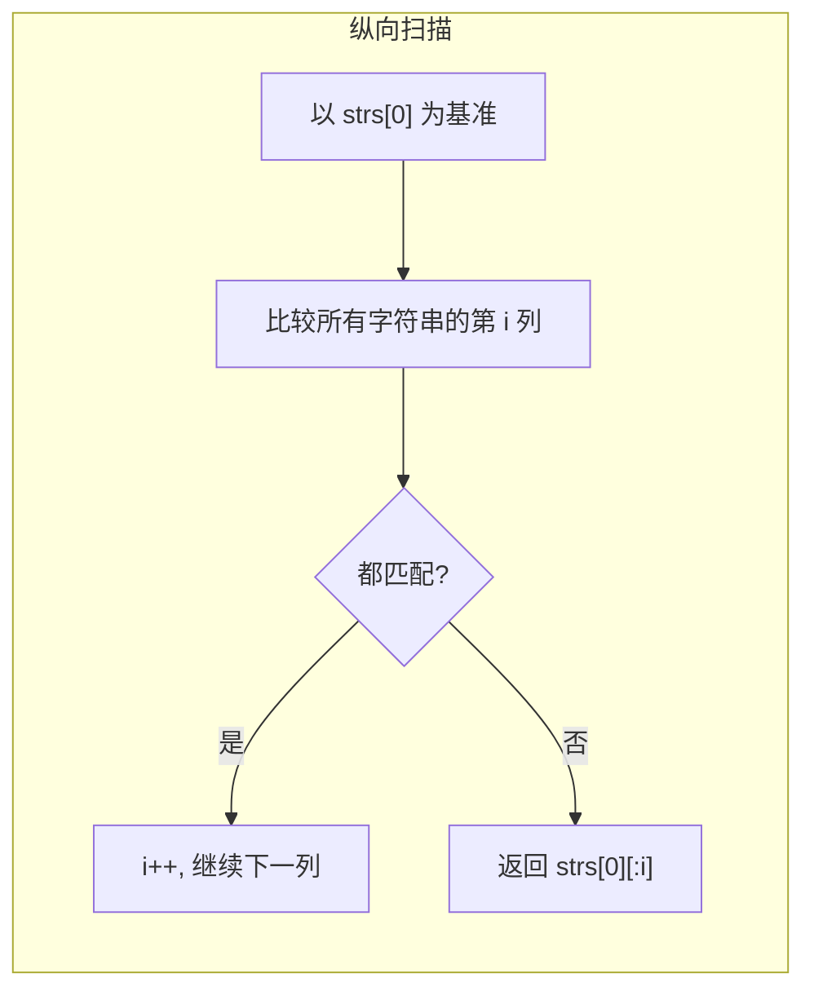

# 14. 最长公共前缀（Longest Common Prefix）

> 难度：简单 | 主题：字符串——纵向扫描

## 题目

编写一个函数来查找字符串数组中的最长公共前缀。如果不存在公共前缀，返回空字符串 `""`。

**示例：**
```text
strs = ["flower","flow","flight"] → "fl"
strs = ["dog","racecar","car"] → ""
```

---

## 思路

### 先讲个故事：翻译官的共同词汇

你是一群翻译官的词汇顾问。每个翻译官手头有一本自己的词汇表（字符串），你需要找出**所有人词汇表开头都一样的最长部分**。

最笨的办法：把所有词汇表两两对比。聪明的办法：**以第一个词汇表为基准，一列一列地检查**。如果某个人在第 3 个词就对不上了，公共前缀就是前 3 个词。

---

### 引导式推导：从暴力到纵向扫描

**第 1 层：两两比较**

拿 strs[0] 和 strs[1] 求公共前缀，结果再和 strs[2] 求，依次类推。

**第 2 层：纵向扫描（推荐）**

以第一个字符串为基准，逐列比较所有字符串的第 i 个字符。遇到不匹配或长度不足时返回前缀。



**为什么纵向扫描更好？** 不需要额外空间存储中间结果，时间 O(S)（S 是所有字符总数），空间 O(1)。

---

## 代码

```python
def longestCommonPrefix(self, strs):
    if not strs:
        return ""

    for i in range(len(strs[0])):
        char = strs[0][i]

        for j in range(1, len(strs)):
            if i == len(strs[j]) or strs[j][i] != char:
                return strs[0][:i]

    return strs[0]
```

---

## 复杂度

| 指标 | 值 | 解释 |
|------|----|------|
| 时间 | O(S) | S 是所有字符总数，最坏比较所有字符 |
| 空间 | O(1) | 只用了常数额外变量 |

---

## 实战考量

### 频率分析

> **简单题但考细节**，约 15% 常会考到，可能融入其他题中（如 URL 路由匹配）。

### 延伸思考

**Q：如果字符串数组很大，内存放不下呢？**
A：分块读取，或者排序后只比较相邻的。

**Q：最长公共后缀怎么做？**
A：翻转所有字符串，然后求最长公共前缀。

**Q：多个字符串的最长公共子序列？**
A：动态规划，二维扩展（1143最长公共子序列）。

### 易错点

- 空数组返回 `""`
- 忘记 `i == len(strs[j])` 的长度检查
- 返回 `strs[0][:i]` 不是 `[:i+1]`，因为第 i 个字符已经不匹配了

---

## 生活类比

> **翻译官的共同词汇 → 纵向扫描**
>
> 你不需要把每个人的词汇表从头到尾比一遍。
> 只需要一列一列地对齐看——第 1 列都一样，第 2 列都一样……
> 直到某一列有人对不上，公共前缀就是前面那些列。
>
> **对齐比较，逐列排除——这就是字符串处理的基本功。**

---

## 相关题目

| 题目 | 关系 |
|------|------|
| 28找出字符串中第一个匹配项的下标 | 字符串匹配 |
| 242有效的字母异位词 | 字符串比较 |
| [[415字符串相加]] | 字符串处理基本功 |

---

→ 返回题单：[[LeetCode学习清单#二、字符串]]

## 速记卡（面试闪卡）

**Q1：一句话讲清「14. 最长公共前缀（Longest Common Prefix）」到底是什么？**
A：编写一个函数来查找字符串数组中的最长公共前缀。如果不存在公共前缀，返回空字符串 。
**示例：**
---

**Q2：题目 —— 怎么理解？**
A：编写一个函数来查找字符串数组中的最长公共前缀。如果不存在公共前缀，返回空字符串 。
**示例：**
---

**Q3：思路 —— 怎么理解？**
A：你是一群翻译官的词汇顾问。每个翻译官手头有一本自己的词汇表（字符串），你需要找出**所有人词汇表开头都一样的最长部分**。
最笨的办法：把所有词汇表两两对比。聪明的办法：**以第一个词汇表为基准，一列一列地检查**。如果某个人在第 3 个词就对不上了，公共前缀就是前 3 个词。
---
**第 1 层：两两比较**
拿 strs[0] 和 strs[1] 求公共前缀，结果再和 strs[2] 求，依次类推。

**Q4：代码 —— 怎么理解？**
A：---

**Q5：复杂度 —— 怎么理解？**
A：| 指标 | 值 | 解释 |
|------|----|------|
| 时间 | O(S) | S 是所有字符总数，最坏比较所有字符 |
| 空间 | O(1) | 只用了常数额外变量 |
---

**Q6：核心速记主线有哪些？**
A：抓住这几根：题目、思路、代码、复杂度、实战考量、生活类比。

