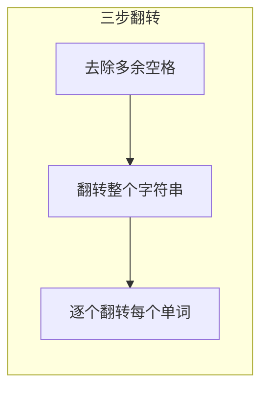

---

title: "反转字符串中的单词"

difficulty: 中等

category: 字符串

tags:

  - leetcode

  - 字符串

created: "2026-07-21"

---

# 151. 反转字符串中的单词（Reverse Words in a String）

> 难度：中等 | 主题：字符串——三步翻转

## 题目

给定一个字符串，逐个反转字符串中的每个单词，同时去除多余空格。单词是由非空格字符组成的序列。

**示例：**

```text

s = "  the sky is  blue  " → "blue is sky the"

```

---

## 思路
### 先讲个故事：洗牌的逆操作

你刚打完一局牌，牌的顺序是反的。你想把每张牌翻回来，但不是整副翻，而是**每张牌单独翻回正面，同时把整副牌的顺序也反过来**。

你会发现一个巧妙的等价操作：**先整副翻转，再逐张翻转**——效果和"逐张翻转再整副翻转"一样。

---

### 引导式推导：从 split 到三步翻转

**方法一：Python 一行（简洁但不推荐）**

```python

return ' '.join(s.split()[::-1])

```

`split()` 自动处理多余空格，`[::-1]` 反转列表。

**方法二：三步翻转（推荐，O(1) 额外空间概念）**



**为什么三步翻转等价？** 原字符串 `"the sky is blue"` → 整体翻转 `"eulb si yks eht"` → 单词翻转 `"blue is sky the"`。整体翻转把单词顺序反过来，单词翻转把每个单词修正。

---

## 代码

```python

def reverseWords(self, s):

    chars = list(s)

    n = len(chars)

    def reverse(left, right):

        while left < right:

            chars[left], chars[right] = chars[right], chars[left]

            left += 1

            right -= 1

    # 第一步：去除多余空格（双指针压缩）

    i = 0

    j = 0

    while j < n and chars[j] == ' ':

        j += 1

    while j < n:

        while j < n and chars[j] != ' ':

            chars[i] = chars[j]

            i += 1

            j += 1

        if j < n:

            chars[i] = ' '

            i += 1

        while j < n and chars[j] == ' ':

            j += 1

    if i > 0 and chars[i - 1] == ' ':

        i -= 1

    chars = chars[:i]

    # 第二步：翻转整个字符数组

    reverse(0, len(chars) - 1)

    # 第三步：逐个翻转每个单词

    start = 0

    for end in range(len(chars) + 1):

        if end == len(chars) or chars[end] == ' ':

            reverse(start, end - 1)

            start = end + 1

    return ''.join(chars)

```

---

## 复杂度

| 指标 | 值 | 解释 |
|------|----|------|
| 时间 | O(n) | 遍历字符串若干次，每次线性 |
| 空间 | O(n) | Python 字符串不可变，需要 list。C++ 可以 O(1) |

---

## 实战考量
### 频率分析

> **编码基本功题**，约 20% 考察字符串操作，尤其是空格处理和翻转。

### 延伸思考

**Q：能不能不用额外空间（O(1)）？**

A：C++/Java 可以原地修改；Python 字符串不可变，需要转 list。实践中解释语言限制即可。

**Q：左旋字符串的单词怎么做？**

A：类似的翻转思路，先整体翻转再分段翻转。

**Q：如果标点符号跟着单词一起反转呢？**

A：定义"单词"时包含标点，翻转逻辑不变。

### 易错点

- 连续空格的处理

- 末尾空格的处理

- 翻转边界 `end - 1`

- 三步顺序不能乱：先去空格 → 整体翻转 → 单词翻转

---

## 生活类比

> **洗牌逆操作 → 三步翻转**

>

> 整体翻转把单词顺序打乱，单词翻转把每个单词修正。

> 两次翻转，效果等价于"逐个反转再整体反转"。

>

> **翻转的对称性：整体和局部可以分开处理，顺序无所谓。**

---

## 相关题目

| 题目 | 关系 |
|------|------|
| [[344反转字符串]] | 基础版反转 |
| 189旋转数组 | 分段反转技巧 |
| [[58最后一个单词的长度]] | 简单字符串遍历 |

---

→ 返回题单：[[LeetCode学习路线图#二、字符串]]

## 速记卡（面试闪卡）

**Q1：一句话讲清「151. 反转字符串中的单词（Reverse Words in a String）」到底是什么？**

A：反转每个单词并去多余空格；三步翻转（去空格→整体翻→单词翻）O(n) 搞定。

**Q2：题目与直觉 —— 怎么理解？**

A：给定串逐个反转单词并去多余空格。直觉像洗牌逆操作：先整副翻转再逐张翻，等价于逐张翻再整副翻。整体翻转把单词顺序反过来，单词翻转把每个词修正。

**Q3：三步翻转思路 —— 怎么理解？**

A：原串 "the sky is blue"→整体翻 "eulb si yks eht"→单词翻 "blue is sky the"。Python 一行 `' '.join(s.split()[::-1])` 简洁但空间 O(n)；三步翻转概念上 O(1) 额外空间。

**Q4：代码要点 —— 怎么理解？**

A：双指针压缩空格（i 写 j 读，遇词间补一空格），再 reverse(0,end) 整体翻，最后遍历遇空格 reverse(start,end-1) 翻每个词。顺序不能乱：去空格→整体翻→单词翻。

**Q5：复杂度与易错点 —— 怎么理解？**

A：时间 O(n) 多次线性遍历，空间 Python 需 list 故 O(n)、C++ 可 O(1)。易错：连续/末尾空格、翻转边界 end-1、三步顺序。延伸：左旋字符串同样翻转思路。

**Q6：核心速记主线有哪些？**

- 目标：反转单词 + 去多余空格

- 三步翻转：去空格→整体翻→单词翻

- 双指针压缩空格，reverse 复用

- O(n) 时间；顺序不能乱，边界 end-1

**口诀**

A：反转单词去空格，三步翻转记心间；

先压空白整串翻，再翻每词归位前。

整体局部两翻转，效果等价不绕弯；

连续末尾空格净，一遍写对稳过关。

## 相关链接

- [[笔记/Leetcode笔记/02_字符串/344反转字符串|反转字符串]]

- [[笔记/Leetcode笔记/02_字符串/43字符串相乘|字符串相乘]]

- [[笔记/Leetcode笔记/02_字符串/415字符串相加|字符串相加]]

- [[笔记/Leetcode笔记/02_字符串/8字符串转换整数atoi|字符串转换整数atoi]]

- [[笔记/Leetcode笔记/02_字符串/28找出字符串中第一个匹配项的下标|找出字符串中第一个匹配项的下标]]

