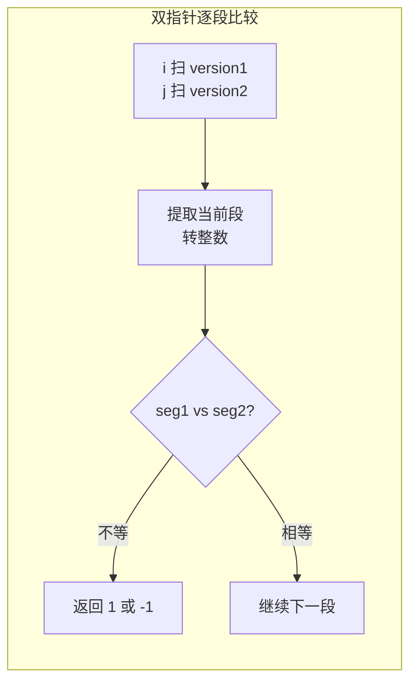

# 165. 比较版本号（Compare Version Numbers）

> 难度：中等 | 主题：字符串——逐段比较

## 题目

比较两个版本号 `version1` 和 `version2`。版本号由点 `.` 分隔的修订号组成。从左到右逐个比较修订号，忽略前导零。

- 如果 `version1 > version2`，返回 `1`
- 如果 `version1 < version2`，返回 `-1`
- 如果相等，返回 `0`

**示例：**
```text
version1 = "1.01", version2 = "1.001" → 0（忽略前导零）
version1 = "1.0", version2 = "1.0.0" → 0（短版本补 0）
version1 = "1.0.1", version2 = "1" → 1
```

---

## 思路

### 先讲个故事：软件版本号的江湖规矩

你是个运维工程师，要比较两个软件版本号哪个更新。版本号像 `1.2.3` 这样用点分隔。

你发现两个坑：
1. **前导零**：`1.01` 和 `1.001` 其实是一样的——`int("01") == int("001") == 1`
2. **长度不等**：`1.0` 和 `1.0.0` 也是一样的——短的后面补 0

所以不能直接字符串比较，要**逐段转成数字比较**。

---

### 引导式推导：从 split 到双指针

**方法一：split 后逐段比较（推荐）**

1. 用 `split('.')` 分割两个版本号
2. 遍历到较长的版本号长度，逐段比较
3. 短版本越界的段补 0
4. `int()` 自动忽略前导零

**方法二：双指针扫描（O(1) 空间）**

不用 split，用两个指针逐个字符扫描，遇到 `.` 就取一段转整数比较。



---

## 代码

```python
def compareVersion(self, version1: str, version2: str) -> int:
    v1 = version1.split('.')
    v2 = version2.split('.')
    n1, n2 = len(v1), len(v2)

    for i in range(max(n1, n2)):
        seg1 = int(v1[i]) if i < n1 else 0
        seg2 = int(v2[i]) if i < n2 else 0

        if seg1 != seg2:
            return 1 if seg1 > seg2 else -1

    return 0
```

---

## 复杂度

| 指标 | 值 | 解释 |
|------|----|------|
| 时间 | O(max(m,n)) | m、n 是两个版本号的段数 |
| 空间 | O(m+n) | split 创建数组。双指针版可 O(1) |

---

## 实战考量

### 频率分析

> **字符串处理中等题**，约 15% 考察，重点是 `int()` 忽略前导零和短版本补 0。

### 延伸思考

**Q：为什么用 int 而不是直接比较字符串？**
A：`int()` 忽略前导零：`int("001") = 1`，而字符串比较 `"001" < "01"` 会出错。

**Q：如果不用 split 怎么做？**
A：双指针法，空间 O(1)，是更优解。

**Q：int 对大数会不会溢出？**
A：Python 中 int 无上限，不会溢出。C++/Java 需要用 long 或手动处理。

**Q：如果版本号包含字母（如 "1.0a"）？**
A：需要扩展比较逻辑，数字部分和字母部分分别比较。实际场景如 semver 的 pre-release 标签。

### 易错点

- 短版本不补 0 导致比较错误
- 返回类型是 int 不是 bool
- 双指针法中 `i += 1` 跳过 `.` 很关键，忘记会死循环

---

## 生活类比

> **版本号比较 → 逐段对齐**
>
> 就像比较两本书的目录：第一章、第二章、第三章……
> 如果一本书只有两章，第三章视为"空"（= 0）。
> 如果章节编号有前导零（第 01 章 vs 第 001 章），转成数字再比。
>
> **对齐 + 类型转换，就是版本号比较的全部。**

---

## 相关题目

| 题目 | 关系 |
|------|------|
| 93复原IP地址 | 字符串分割为多段 |
| [[415字符串相加]] | 字符串处理基本功 |
| [[58最后一个单词的长度]] | 简单字符串遍历 |

---

→ 返回题单：[[LeetCode学习清单#二、字符串]]

## 速记卡（面试闪卡）

**Q1：一句话讲清「165. 比较版本号（Compare Version Numbers）」到底是什么？**
A：比较两个版本号  和 。版本号由点  分隔的修订号组成。从左到右逐个比较修订号，忽略前导零。
如果 ，返回 
如果 ，返回 
如果相等，返回 
**示例：**
---

**Q2：题目 —— 怎么理解？**
A：比较两个版本号  和 。版本号由点  分隔的修订号组成。从左到右逐个比较修订号，忽略前导零。
如果 ，返回 
如果 ，返回 
如果相等，返回 
**示例：**
---

**Q3：思路 —— 怎么理解？**
A：你是个运维工程师，要比较两个软件版本号哪个更新。版本号像  这样用点分隔。
你发现两个坑：
**前导零**： 和  其实是一样的——
**长度不等**： 和  也是一样的——短的后面补 0
所以不能直接字符串比较，要**逐段转成数字比较**。

**Q4：代码 —— 怎么理解？**
A：---

**Q5：复杂度 —— 怎么理解？**
A：| 指标 | 值 | 解释 |
|------|----|------|
| 时间 | O(max(m,n)) | m、n 是两个版本号的段数 |
| 空间 | O(m+n) | split 创建数组。双指针版可 O(1) |
---

**Q6：核心速记主线有哪些？**
A：抓住这几根：题目、思路、代码、复杂度、实战考量、生活类比。

